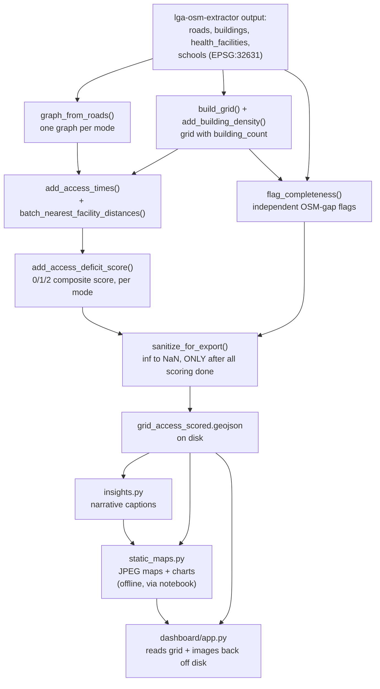

# Data Flow — akure-accessibility-dashboard

This page traces how data changes shape as it moves through this
repository — from the extractor's output files to a scored grid to displayed
maps and captions. For a function-call-level trace, see
[End-to-End Walkthrough](end-to-end.md).

## Stage-by-Stage

### 1. Input: files from `lga-osm-extractor`

Everything starts with GeoJSON/Shapefile output already sitting on disk —
`roads`, `buildings`, `health_facilities`, `schools` layers, in
`EPSG:32631`, produced by an entirely separate prior run of
`lga-osm-extractor`. See [Cross-Repo Integration](../cross-repo/integration.md)
for the exact schema contract this data must satisfy.

### 2. A routable graph, per mode

[`network_graph.graph_from_roads()`](modules/accessibility/network_graph.md)
turns the roads layer (plus, ideally, the LGA boundary polygon) into a
`networkx` graph with `length`/`travel_time_min` edge attributes — one
separate graph per requested travel mode (`walk`/`okada`/`drive`), since
walk and drive networks can differ in which roads are included at all, not
just in assumed speed.

### 3. A fishnet grid, with a settlement signal

In parallel with graph-building, [`scoring.build_grid()`](modules/accessibility/scoring.md)
turns the LGA boundary into a regular square grid, and
[`scoring.add_building_density()`](modules/accessibility/scoring.md) adds a
`building_count` column from the buildings layer — this single column is
what every later stage uses to distinguish "settled, worth analyzing" cells
from empty land.

### 4. Two independent analyses over the same grid

From here, two genuinely separate pathways run, each producing its own new
columns on the grid, neither depending on the other's output:

- **Accessibility**: [`scoring.add_access_times()`](modules/accessibility/scoring.md)
  uses the mode-specific graph plus
  [`isochrones.batch_nearest_facility_distances()`](modules/accessibility/isochrones.md)
  to compute nearest-facility distance/time per settled cell, per mode, per
  service — then [`scoring.add_access_deficit_score()`](modules/accessibility/scoring.md)
  reduces those times into the composite 0–2 deficit score.
- **Completeness**: [`grid_check.flag_completeness()`](modules/completeness/grid_check.md)
  independently checks, per settled cell (using its *own*, stricter
  settlement threshold), whether a facility of each service type exists
  within a search radius — producing boolean data-gap flags with no
  awareness of the accessibility scores at all.

### 5. Sanitization, only once, only at the very end

[`scoring.sanitize_for_export()`](modules/accessibility/scoring.md) converts
every `inf` value (meaning "unreachable") to `NaN` (meaning "no value") —
but only after **every** scoring/flagging step above has already run for
every mode of interest. This ordering is a hard, unenforced requirement —
see that function's own documentation for what goes wrong if it's violated.

### 6. Two independent consumers of the final grid

The fully-scored, sanitized grid feeds two entirely separate downstream
paths, generated independently of each other:

- **[`insights.py`](modules/insights.md)** generates narrative captions
  directly from the grid's numbers.
- **[`visualization/static_maps.py`](modules/visualization/static_maps.md)**
  generates publication-quality JPEG maps/charts (via the project's
  analysis notebook, offline), each accompanied by a caption from
  `insights.py`.
- **[`dashboard/app.py`](dashboard-app.md)** reads the exported, sanitized
  `grid_access_scored.geojson` back off disk at Streamlit app startup, and
  independently reads the already-generated static images/`captions.json`
  from disk — the dashboard never runs any scoring/flagging itself, it's a
  pure consumer of both prior outputs.

## What Changes at Each Boundary

| Transition | Input shape | Output shape | What changes |
|---|---|---|---|
| Extractor output → grid | Point/Line/Polygon layers, per LGA | Regular square grid, `cell_id` | The analysis unit shifts from arbitrary OSM features to a uniform spatial sampling grid |
| Grid → building density | Grid with no attributes | Grid + `building_count` | A population proxy is attached per cell via spatial join |
| Roads + boundary → graph | GeoDataFrame / polygon | `nx.MultiDiGraph`, per mode | Geometry becomes topology; edges gain time weights |
| Graph + facilities → distances | Graph + facility points | `{node: distance}` dict, per mode per service | Routing collapses from "per cell per facility" to "per graph node," computed once |
| Distances → scored grid | Node-distance dict | Grid + time/distance/deficit columns | Per-cell lookup; `inf` deliberately preserved through scoring |
| Scored grid → completeness-flagged grid | Grid + `building_count` | Grid + completeness flags | A parallel, independent analytical track is layered on, not derived from the deficit score |
| Flagged grid → exportable grid | `inf` present | `inf` replaced with `NaN` | The one-way, order-dependent sanitization step — must be last |
| Exportable grid → persisted file | In-memory `GeoDataFrame` | `grid_access_scored.geojson` on disk | The single artifact both output tracks (dashboard, static maps) independently consume |
| Persisted grid → static figures | GeoJSON | `.jpg` files + `captions.json` | Cartographic styling and data-driven prose are layered on top, produced once and reused by the dashboard |

## Where State Lives

There is no database and no analysis-time computation inside the
Streamlit app itself. State is:

1. **Ephemeral, in-process, during notebook execution**: the graph
   objects, distance dicts, and intermediate grids passed between
   `network_graph.py` → `isochrones.py` → `scoring.py` →
   `completeness/grid_check.py` calls — nothing here persists beyond the
   notebook run except what's explicitly written to disk.
2. **On disk, the single source of truth for both output tracks**:
   `data/processed/{lga}/grid_access_scored.geojson` (the fully scored +
   flagged + sanitized grid) and `visuals/{lga}/*.jpg` + `captions.json`
   (pre-rendered static outputs). Both `dashboard/app.py` and
   `static_maps.generate_all_static_outputs()` read from — but never
   write back to — this same persisted grid file, and `dashboard/app.py`
   additionally reads the *output* of `static_maps.py` (the JPEG files
   and captions), without ever running `static_maps.py`'s code itself at
   app runtime.
3. **Streamlit's session-independent, cross-visitor cache**
   (`app.py`'s `@st.cache_data` on `load_data()`): the loaded
   `GeoDataFrame`s are cached in memory once per deployed app instance,
   shared across visitors, same caching model as `lga-osm-extractor`'s
   `app.py`.
4. **`nearest_graph_node`'s per-graph KD-tree cache** (`isochrones.py`):
   a smaller-scoped, per-graph-object cache, living only as long as the
   graph object itself does within a single notebook run — not
   persisted to disk, not shared across runs, and rebuilt from scratch
   the next time the notebook is re-executed.

## Why Two Independent Analyses Never Talk to Each Other

Stage 4's split between accessibility scoring and completeness flagging
is worth dwelling on, since it's easy to assume one feeds the other when
skimming the diagram. They don't: `flag_completeness()` never reads any
`*_time_min_*` or `*_access_deficit_score` column, and
`add_access_deficit_score()` never reads either completeness flag
column. Both independently derive from the same upstream
`building_count` signal, but compute entirely separate things from it.
This is deliberate — see [`grid_check.py`](modules/completeness/grid_check.md)'s
own documentation for why keeping "is this area underserved" and "is
this area possibly under-mapped in OSM" as genuinely separate,
non-blended signals matters for how a viewer should interpret either one.
Only at the presentation layer (`dashboard/app.py`'s Findings Summary
cross-check callout) are the two ever brought into the same sentence,
and even there, only as a caveat on the accessibility numbers, not as
an adjustment to them.

## Diagram

