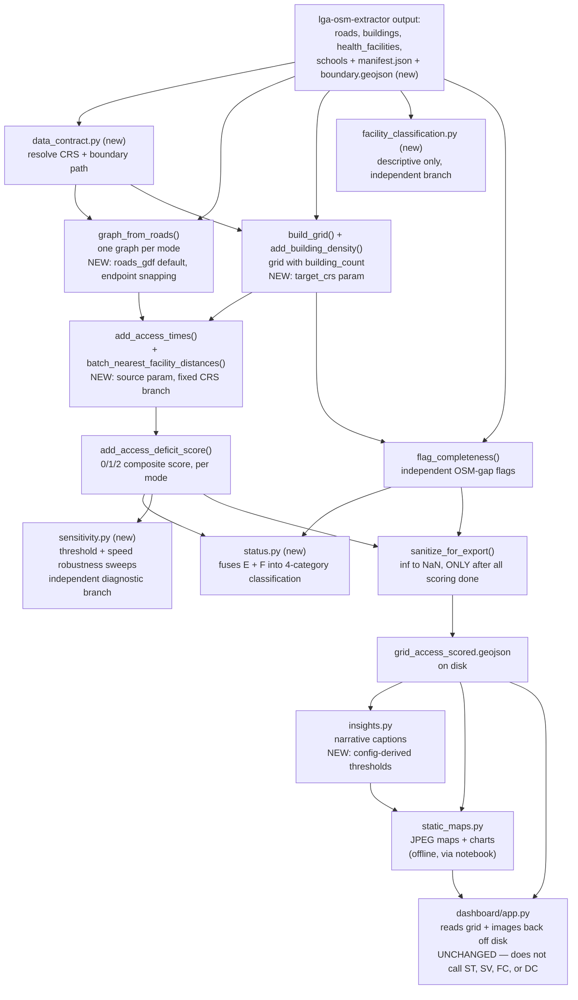

# Data Flow — akure-accessibility-dashboard

This page traces how data changes shape as it moves through this
repository — from the extractor's output files to a scored grid to displayed
maps and captions. For a function-call-level trace, see
[End-to-End Walkthrough](end-to-end.md).

## Stage-by-Stage

### 1. Input: files from `lga-osm-extractor`

Everything starts with GeoJSON/Shapefile output already sitting on disk —
`roads`, `buildings`, `health_facilities`, `schools` layers, in
`EPSG:32631`, produced by an entirely separate prior run of
`lga-osm-extractor`. **New:** the extractor's output directory now also
includes `manifest.json` and `boundary.geojson`, and every layer's GeoJSON
now carries a richer schema (curated semantic OSM tags + a full JSON tag
copy, not just `osmid`/`name`/`geometry`) — see
[Cross-Repo Integration](../cross-repo/integration.md) for the exact
schema contract.

### 1b. New: resolving CRS and boundary from the manifest

[`data_contract.resolve_crs_from_manifest()`](modules/data_contract.md) and
[`resolve_boundary_path_from_manifest()`](modules/data_contract.md) read
`manifest.json` directly, rather than either side independently guessing
or re-deriving what CRS/boundary was actually used upstream. This is a
new, optional first step — `scoring.build_grid()`'s `target_crs` parameter
is designed to be fed directly from `resolve_crs_from_manifest()`'s
output, though a caller can still supply `target_crs` explicitly or rely
on the (Akure-only-correct) `FALLBACK_CRS` default without ever touching
this module.

### 2. A routable graph, per mode — now defaulting to the extractor's own data

[`network_graph.graph_from_roads()`](modules/accessibility/network_graph.md)
turns the roads layer into a `networkx` graph with
`length`/`travel_time_min` edge attributes — one separate graph per
requested travel mode. **New:** the default construction path
(`source="auto"`) now prefers the `roads_gdf` input whenever it's
available — even if a boundary polygon is also supplied — rather than
defaulting to a live OSM query. This graph is now also built with
**endpoint snapping** (a new fix in `_graph_from_geometries()`), correcting
a previously-undocumented floating-point junction-fragmentation risk. See
[`network_graph.md`](modules/accessibility/network_graph.md) for the full
reasoning behind this reversal.

### 3. A fishnet grid, with a settlement signal

[`scoring.build_grid()`](modules/accessibility/scoring.md) turns the LGA
boundary into a regular square grid — **new:** now accepting an explicit
`target_crs` parameter (ideally sourced from step 1b above), falling back
to the Akure-specific `FALLBACK_CRS` only if omitted — and
[`scoring.add_building_density()`](modules/accessibility/scoring.md) adds
a `building_count` column from the buildings layer.

### 3b. New, optional: facility classification

[`facility_classification.add_facility_class()`](modules/facility_classification.md)
can independently classify the health/education facility layers into
human-meaningful subtypes (Hospital/Primary care/Pharmacy;
Primary/Secondary), using the new semantic OSM tags from step 1. **This
pathway does not feed into scoring or the grid at all** — it operates
directly on the facility `GeoDataFrame`s, producing a purely descriptive
`facility_class` column, entirely independent of every other stage on this
page.

### 4. Two independent analyses over the same grid

- **Accessibility**: [`scoring.add_access_times()`](modules/accessibility/scoring.md)
  uses the mode-specific graph plus
  [`isochrones.batch_nearest_facility_distances()`](modules/accessibility/isochrones.md)
  to compute nearest-facility distance/time per settled cell, per mode, per
  service. **New:** `add_access_times()` now accepts a `source` parameter,
  passed straight through to `graph_from_roads()`, and its facility/centroid
  CRS-handling now branches on the graph's own recorded `G.graph["source"]`
  rather than on whether a boundary polygon argument was supplied — a
  correctness fix made necessary by step 2's default-path reversal. Then
  [`scoring.add_access_deficit_score()`](modules/accessibility/scoring.md)
  reduces those times into the composite 0–2 deficit score.
- **Completeness**: [`grid_check.flag_completeness()`](modules/completeness/grid_check.md)
  independently checks, per settled cell (using its *own*, stricter
  settlement threshold — **new:** now explicitly justified in
  `config/default.yaml`'s own comments, not just an unexplained
  discrepancy), whether a facility of each service type exists within a
  search radius.

### 4b. New: fusing the two independent analyses into one status

[`status.add_access_status()`](modules/status.md) reads the outputs of
*both* stage 4 pathways — the underserved flags from scoring, the
completeness flags from grid_check — and classifies each cell into one of
four categories: `SERVED`, `UNDERSERVED` (confirmed), `POTENTIAL_DATA_GAP`
(underserved *and* flagged as possibly under-mapped), or `UNKNOWN`
(unsettled). **This does not change either upstream analysis** — it's a
pure read-only fusion layer, computing nothing that wasn't already
independently available, but making the combination explicit and reusable
rather than left for a viewer (or `dashboard/app.py`'s own inline callout)
to reconstruct manually.

### 4c. New, optional: sensitivity testing

[`sensitivity.run_threshold_sensitivity()`](modules/sensitivity.md) and
[`run_speed_sensitivity()`](modules/sensitivity.md) can re-run stage 4's
accessibility scoring (cheaply, for thresholds — reusing already-computed
travel times; expensively, for speeds — rebuilding the graph and re-routing
per candidate value) across several parameter values, reporting whether
the *set* of underserved cells stays stable (via Jaccard similarity) as
those assumptions vary. This is a diagnostic pathway that consumes stage 3
and 4's outputs but produces its own separate summary — it does not modify
or replace the "official" scored grid from stage 4.

### 5. Sanitization, only once, only at the very end

[`scoring.sanitize_for_export()`](modules/accessibility/scoring.md) converts
every `inf` value to `NaN` — but only after **every** scoring/flagging step
above has already run. This ordering remains a hard, unenforced
requirement, unchanged by this revision — see that function's own
documentation.

### 6. Two independent consumers of the final grid — unchanged, but with a caveat

- **[`insights.py`](modules/insights.md)** generates narrative captions
  directly from the grid's numbers — **new:** its default thresholds are
  now config-derived rather than an independently-hardcoded, manually-synced
  copy (see [`insights.md`](modules/insights.md)), plus one new function,
  `describe_settlement_proxy_limitation()`.
- **[`visualization/static_maps.py`](modules/visualization/static_maps.md)**
  generates publication-quality JPEG maps/charts. Unchanged in this
  revision.
- **[`dashboard/app.py`](dashboard-app.md)** reads the exported, sanitized
  grid back off disk. **Unchanged in this revision** — it does not
  currently read `manifest.json`, does not call `facility_classification.py`,
  `sensitivity.py`, or `status.py`, and computes its own inline
  accessibility/completeness cross-check exactly as before, independent of
  the new `status.py` module that now formalizes the same idea as a
  reusable function.

## What Changes at Each Boundary

| Transition | Input shape | Output shape | What changes |
|---|---|---|---|
| Extractor output → CRS/boundary resolution (**new**) | `manifest.json` | `target_crs` string, `boundary_path` string or `None` | The extractor's own recorded determinations become directly usable inputs, instead of being re-derived or re-queried |
| Extractor output → grid | Point/Line/Polygon layers, per LGA | Regular square grid, `cell_id` | The analysis unit shifts from arbitrary OSM features to a uniform spatial sampling grid; **new:** CRS is now explicitly resolvable rather than hardcoded |
| Grid → building density | Grid with no attributes | Grid + `building_count` | A population proxy is attached per cell via spatial join |
| Facility layers → classified facilities (**new**, independent branch) | Point layers with semantic OSM tags | Same layers + `facility_class` column | Purely descriptive; does not touch the grid or scoring |
| Roads + boundary → graph | GeoDataFrame / polygon | `nx.MultiDiGraph` or `MultiGraph`, per mode | Geometry becomes topology; edges gain time weights; **new:** default source path reversed, endpoint snapping applied |
| Graph + facilities → distances | Graph + facility points | `{node: distance}` dict, per mode per service | Routing collapses from "per cell per facility" to "per graph node," computed once |
| Distances → scored grid | Node-distance dict | Grid + time/distance/deficit columns | Per-cell lookup; `inf` deliberately preserved through scoring |
| Scored grid → completeness-flagged grid | Grid + `building_count` | Grid + completeness flags | A parallel, independent analytical track is layered on, not derived from the deficit score |
| Scored + flagged grid → fused status (**new**) | Deficit score + completeness flags | `{service}_status_{mode}` column, 4 categories | Two independently-computed signals become one explicit, reusable classification |
| Flagged grid → exportable grid | `inf` present | `inf` replaced with `NaN` | The one-way, order-dependent sanitization step — must be last |
| Exportable grid → persisted file | In-memory `GeoDataFrame` | `grid_access_scored.geojson` on disk | The single artifact both output tracks (dashboard, static maps) independently consume |
| Persisted grid → static figures | GeoJSON | `.jpg` files + `captions.json` | Cartographic styling and data-driven prose are layered on top, produced once and reused by the dashboard |
| Scored grid → sensitivity report (**new**, independent branch) | Grid + candidate parameter values | DataFrame of per-value robustness metrics + a summary sentence | A diagnostic on the *stability* of the findings, not a new finding itself |

## Where State Lives

There is no database and no analysis-time computation inside the
Streamlit app itself. State is:

1. **Ephemeral, in-process, during notebook execution**: the graph
   objects, distance dicts, and intermediate grids passed between
   `network_graph.py` → `isochrones.py` → `scoring.py` →
   `completeness/grid_check.py` → (**new**) `status.py` calls.
2. **On disk, the single source of truth for both output tracks**:
   `data/processed/{lga}/grid_access_scored.geojson` and
   `visuals/{lga}/*.jpg` + `captions.json`. **New, upstream:**
   `manifest.json` and `boundary.geojson` in the extractor's own output
   directory — read by `data_contract.py`, not modified by anything in
   this repository.
3. **Streamlit's session-independent, cross-visitor cache**
   (`app.py`'s `load_data()`) — unchanged in this revision.
4. **`nearest_graph_node`'s per-graph KD-tree cache** (`isochrones.py`) —
   unchanged.
5. **New: `config.py`'s import-time-snapshotted constants.** Every
   module deriving a default from `config.get_config()` captures that
   value once, at import time — see [`config.md`](modules/config.md) for
   the full caveat. This is a distinct kind of state from the others on
   this list: it's neither ephemeral-per-call nor persisted-to-disk, but
   bound once per process and stable for that process's lifetime unless
   explicitly reloaded.

## Why Two Independent Analyses Never Talk to Each Other

Stage 4's split between accessibility scoring and completeness flagging
is worth dwelling on, since it's easy to assume one feeds the other when
skimming the diagram. They don't: `flag_completeness()` never reads any
`*_time_min_*` or `*_access_deficit_score` column, and
`add_access_deficit_score()` never reads either completeness flag
column. Both independently derive from the same upstream
`building_count` signal, but compute entirely separate things from it.
This is deliberate — see [`grid_check.py`](modules/completeness/grid_check.md)'s
own documentation for why keeping "is this area underserved" and "is
this area possibly under-mapped in OSM" as genuinely separate,
non-blended signals matters for how a viewer should interpret either one.
Only at the presentation layer (`dashboard/app.py`'s Findings Summary
cross-check callout) are the two ever brought into the same sentence,
and even there, only as a caveat on the accessibility numbers, not as
an adjustment to them.

## Why `dashboard/app.py` Still Does Its Own Cross-Check, Not `status.py`'s

Worth stating explicitly, since it's a real asymmetry a reader could
otherwise miss: `dashboard/app.py`'s Findings Summary section computes a
percentage-based accessibility/completeness cross-check **inline, in the
app's own code**, and this is **unchanged** by `status.py`'s addition in
this revision. The two now exist side by side, computing conceptually
related things independently — `status.py` is available as a
per-cell, reusable classification, but the dashboard hasn't been refactored
to call it. A future revision consolidating the two would be a reasonable
next step, but has not happened as of this one.

## Diagram

