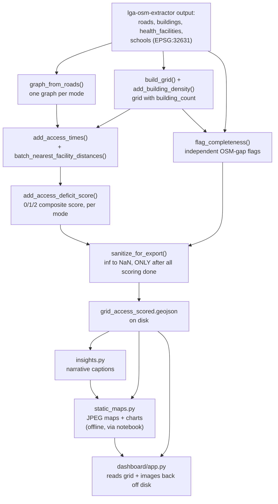

# Data Flow — akure-accessibility-dashboard

This page traces how data changes shape as it moves through this
repository — from the extractor's output files to a scored grid to displayed
maps and captions. For a function-call-level trace, see
[End-to-End Walkthrough](end-to-end.md).

## Stage-by-Stage

### 1. Input: files from `lga-osm-extractor`

Everything starts with GeoJSON/Shapefile output already sitting on disk —
`roads`, `buildings`, `health_facilities`, `schools` layers, in
`EPSG:32631`, produced by an entirely separate prior run of
`lga-osm-extractor`. See [Cross-Repo Integration](../cross-repo/integration.md)
for the exact schema contract this data must satisfy.

### 2. A routable graph, per mode

[`network_graph.graph_from_roads()`](modules/accessibility/network_graph.md)
turns the roads layer (plus, ideally, the LGA boundary polygon) into a
`networkx` graph with `length`/`travel_time_min` edge attributes — one
separate graph per requested travel mode (`walk`/`okada`/`drive`), since
walk and drive networks can differ in which roads are included at all, not
just in assumed speed.

### 3. A fishnet grid, with a settlement signal

In parallel with graph-building, [`scoring.build_grid()`](modules/accessibility/scoring.md)
turns the LGA boundary into a regular square grid, and
[`scoring.add_building_density()`](modules/accessibility/scoring.md) adds a
`building_count` column from the buildings layer — this single column is
what every later stage uses to distinguish "settled, worth analyzing" cells
from empty land.

### 4. Two independent analyses over the same grid

From here, two genuinely separate pathways run, each producing its own new
columns on the grid, neither depending on the other's output:

- **Accessibility**: [`scoring.add_access_times()`](modules/accessibility/scoring.md)
  uses the mode-specific graph plus
  [`isochrones.batch_nearest_facility_distances()`](modules/accessibility/isochrones.md)
  to compute nearest-facility distance/time per settled cell, per mode, per
  service — then [`scoring.add_access_deficit_score()`](modules/accessibility/scoring.md)
  reduces those times into the composite 0–2 deficit score.
- **Completeness**: [`grid_check.flag_completeness()`](modules/completeness/grid_check.md)
  independently checks, per settled cell (using its *own*, stricter
  settlement threshold), whether a facility of each service type exists
  within a search radius — producing boolean data-gap flags with no
  awareness of the accessibility scores at all.

### 5. Sanitization, only once, only at the very end

[`scoring.sanitize_for_export()`](modules/accessibility/scoring.md) converts
every `inf` value (meaning "unreachable") to `NaN` (meaning "no value") —
but only after **every** scoring/flagging step above has already run for
every mode of interest. This ordering is a hard, unenforced requirement —
see that function's own documentation for what goes wrong if it's violated.

### 6. Two independent consumers of the final grid

The fully-scored, sanitized grid feeds two entirely separate downstream
paths, generated independently of each other:

- **[`insights.py`](modules/insights.md)** generates narrative captions
  directly from the grid's numbers.
- **[`visualization/static_maps.py`](modules/visualization/static_maps.md)**
  generates publication-quality JPEG maps/charts (via the project's
  analysis notebook, offline), each accompanied by a caption from
  `insights.py`.
- **[`dashboard/app.py`](dashboard-app.md)** reads the exported, sanitized
  `grid_access_scored.geojson` back off disk at Streamlit app startup, and
  independently reads the already-generated static images/`captions.json`
  from disk — the dashboard never runs any scoring/flagging itself, it's a
  pure consumer of both prior outputs.

## Diagram

