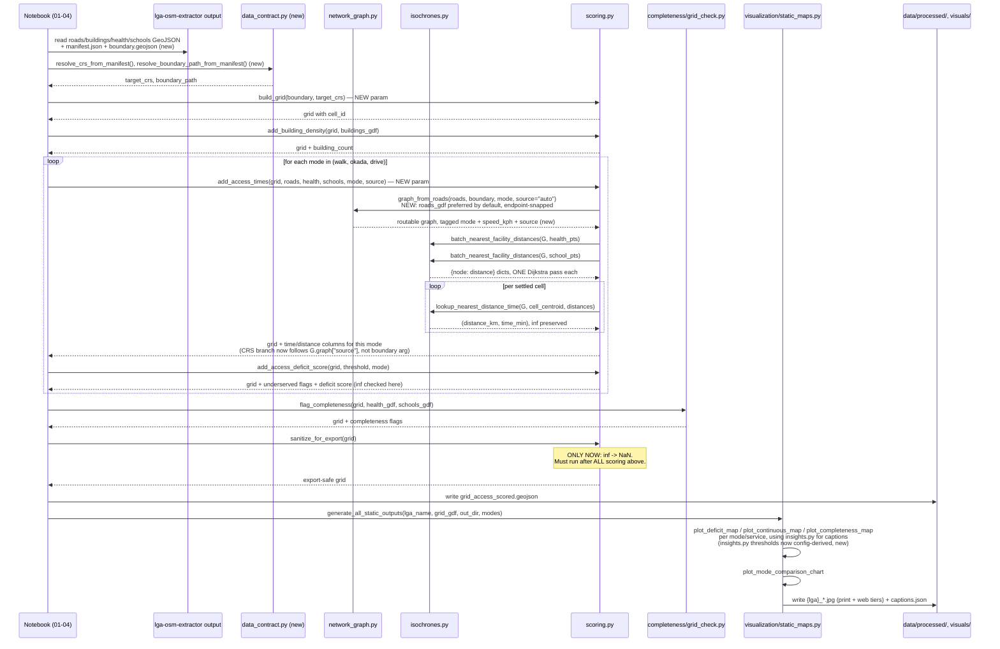
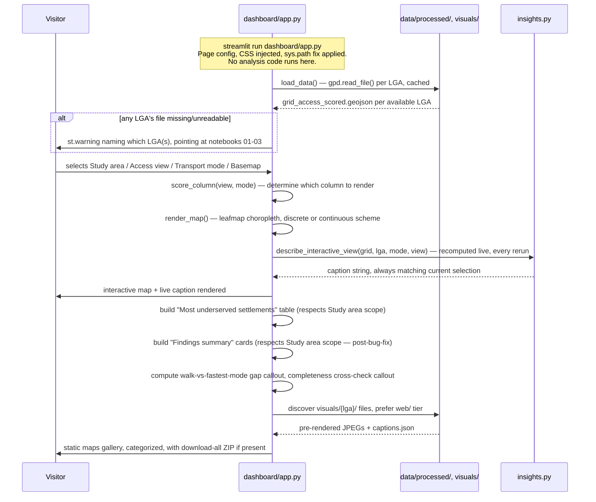

# End-to-End Walkthrough — akure-accessibility-dashboard

This page traces a concrete function-call sequence for one real analysis
run, split into two parts: **offline analysis** (the notebook-driven part
that actually computes everything, run once per LGA/data-update) and
**dashboard runtime** (what happens each time a user opens or interacts
with the Streamlit app, which never re-runs the analysis itself). For how
the *data* changes shape at each stage, see [Data Flow](data-flow.md).

## Sequence Overview

Both parts at a glance, before the detailed step-by-step walkthrough below.

**Part 1 — Offline Analysis:**

**Part 2 — Dashboard Runtime:**

## Part 1: Offline Analysis (run via the project's notebooks, not the dashboard)

### 1. Start: extractor output already on disk

Everything here assumes `lga-osm-extractor` has already been run for the
target LGA, and its GeoJSON/Shapefile output already exists on disk (see
[Cross-Repo Integration](../cross-repo/integration.md)). **New:** this now
includes `manifest.json` and `boundary.geojson`.

### 1b. New, optional: resolve CRS and boundary from the manifest

`data_contract.resolve_crs_from_manifest(data_dir)` and
`resolve_boundary_path_from_manifest(data_dir)` can be called here to
obtain the extractor's own recorded `target_crs` and boundary file path,
rather than the notebook independently hardcoding `"EPSG:32631"` or
re-calling `boundary.resolve_boundary()` live. This step is optional —
a notebook can still proceed without it, falling back to
`scoring.build_grid()`'s `FALLBACK_CRS` default — but is the mechanism
that closes the previously-documented CRS-hardcoding gap (see
[`scoring.md`](modules/accessibility/scoring.md)).

### 2. Build the road network — now preferring the extractor's own roads by default

For each mode being analyzed: `network_graph.graph_from_roads(roads_gdf,
boundary_polygon=boundary_wgs84, mode=mode, source="auto")` is called.
**New:** with `source="auto"` (the default), this now builds the graph
directly from `roads_gdf` — the extractor's own versioned, cached roads
layer — whenever it's non-empty, **even though a boundary polygon is also
being passed**. This is a reversal from the previous behavior, where
supplying a boundary meant a live `ox.graph_from_polygon()` OSM query was
used. **The offline pipeline's live-OSM network dependency at this step is
now avoidable by default**, not required — a caller wanting the old
behavior explicitly passes `source="live_osm"`. The `roads_gdf` path now
also applies endpoint snapping (`snap_tolerance_m=0.5`), fixing a
previously-undocumented junction-fragmentation risk. `_assign_travel_times()`
populates `travel_time_min` on every edge as before.

### 3. Build the grid — now with an explicit CRS option

`scoring.build_grid(boundary_gdf, cell_size_m=500, target_crs=None)`
produces the fishnet grid. **New:** if `target_crs` is supplied (ideally
from step 1b), the grid uses exactly that CRS; if omitted, falls back to
`FALLBACK_CRS` (`"EPSG:32631"`, Akure-only correct) as before.
`scoring.add_building_density(grid, buildings_gdf)` is unchanged.

### 3b. New, optional, independent branch: facility classification

`facility_classification.add_facility_class(health_gdf, kind="health")`
and the equivalent call for `schools_gdf` can run at any point after step
1, entirely independently of the grid/scoring pipeline — this branch
produces a `facility_class` column on the facility layers themselves, not
on the grid, and has no effect on any subsequent step in this walkthrough.

### 4. Score accessibility, per mode — a CRS-branch fix, not just a new parameter

For each mode:

- `isochrones.batch_nearest_facility_distances(G, health_gdf)` — unchanged,
  still the single most expensive computational step in the pipeline.
- `scoring.add_access_times(grid, roads_gdf, health_gdf, schools_gdf,
  boundary_polygon_wgs84=boundary_wgs84, modes=(mode,), source="auto")` —
  **new `source` parameter**, threaded straight through to
  `graph_from_roads()`. **New, more consequential:** the decision of
  whether to reproject facilities/grid centroids to WGS84 now checks
  `G.graph.get("source") == "live_osm"` — the graph's own recorded
  provenance — rather than `boundary_polygon_wgs84 is not None`. This
  fixes a real, if previously-latent, coordinate-mismatch bug that step 2's
  default-path reversal would otherwise have introduced (see
  [`scoring.md`](modules/accessibility/scoring.md) for the full
  before/after).
- `scoring.add_access_deficit_score(grid, threshold_min=mode_threshold,
  mode=mode)` — unchanged. `inf` values are still preserved through this
  entire sequence.

### 5. Flag completeness, independently

`grid_check.flag_completeness(grid, health_gdf, schools_gdf)` — unchanged
in logic; its threshold constants are now config-derived (see
[`grid_check.md`](modules/completeness/grid_check.md)) but the numeric
values and behavior are identical to before.

### 5b. New, optional, independent branch: status fusion

`status.add_access_status(grid, service="health", mode=mode)` (and the
equivalent call for `"education"`) can run any time after steps 4 and 5
have both completed for a given mode — it reads the underserved flags and
completeness flags already present on the grid and adds one new
`{service}_status_{mode}` column with the four-category classification.
This step does not feed into step 6's sanitization or anything downstream
in the required flow — it's an additional, optional column a notebook can
choose to compute and export alongside the rest.

### 5c. New, optional, independent branch: sensitivity testing

`sensitivity.run_threshold_sensitivity(grid, mode=mode,
thresholds_min=(20, 30, 45))` can run any time after step 4 has completed
for the relevant mode — cheap, since it reuses already-computed travel
times. `sensitivity.run_speed_sensitivity(...)` is far more expensive
(full graph rebuild + full Dijkstra pass per candidate speed) and is
explicitly documented as intended for a handful of values, not a fine
sweep. Neither function modifies the "official" grid used in the rest of
this walkthrough — both produce a separate `DataFrame` report.

### 6. Sanitize, once, at the very end

Unchanged: `scoring.sanitize_for_export(grid)` converts every remaining
`inf` to `NaN`, only after steps 4 and 5 (and, if used, 5b) have run for
every mode/service of interest. The resulting grid is written to
`data/processed/{lga}/grid_access_scored.geojson`.

### 7. Generate static outputs

`visualization.static_maps.generate_all_static_outputs(...)` — unchanged
in logic; captions are still generated via `insights.py`'s `describe_*()`
functions, whose default thresholds are now config-derived (see step 4's
note above and [`insights.md`](modules/insights.md)) rather than an
independently-hardcoded, manually-synced copy.

## A Note on the New Optional Branches (1b, 3b, 5b, 5c)

None of `data_contract.py`, `facility_classification.py`, `sensitivity.py`,
or `status.py` are currently wired into a required position in this
walkthrough — each is a standalone capability a notebook *can* call, not
one that any other step in Parts 1 or 2 currently depends on. This is
confirmed directly: `dashboard/app.py` (Part 2, below) is byte-identical
to its pre-revision version, meaning none of these new modules' outputs
are currently read anywhere in the deployed interactive experience. They
exist, are tested, and are ready to be integrated — but that integration
is future work, not something this revision completed.

## Part 2: Dashboard Runtime (what happens on `streamlit run dashboard/app.py`)

**This entire part is unchanged in this revision** — `dashboard/app.py` is
byte-identical to its pre-revision version. Included below for
completeness and because Part 1's sequence diagram references it, not
because anything in it is new.

### 8. Process start

Streamlit starts, executes `dashboard/app.py` top-to-bottom once: the
`sys.path` fix runs first (before any `akure_access` import), page config
and CSS are set, `load_data()` (decorated `@st.cache_data`) is called —
this is the **only** point in the dashboard's entire runtime that touches
disk for the grid data — reading both LGAs'
`grid_access_scored.geojson` files (already fully scored and sanitized by
Part 1, steps 1–6) directly into memory, cached for the remainder of the
app process's lifetime.

### 9. Widget state, on every rerun

Streamlit reruns the whole script on every user interaction. The current
values of the Study area / Access view / Transport mode / Basemap /
colorblind-safe selectors are all read fresh from Streamlit's
widget-state system at the top of each rerun — none of this state is
computed, only read.

### 10. Map rendering

`render_map(gdf, view, mode, ...)` is called (once, or twice side-by-side
for the "Both (compare)" case) — `score_column(view, mode)` resolves which
already-present column to visualize, a Leafmap map is built and displayed.
**No routing, scoring, or facility-lookup computation happens here** — this
step only ever reads already-computed columns off the in-memory grid
loaded in step 8.

### 11. Captions, recomputed live from already-scored data

`insights.describe_interactive_view(grid, lga_name, mode, view_choice)` is
called immediately after each map render — recomputing the caption's
actual numbers fresh from the loaded grid on every single rerun (not
cached), which is exactly what guarantees the caption always matches
whatever selector state produced the map above it.

### 12. Ranked table and Findings Summary

Both sections filter/aggregate the already-loaded grid live (`pd.concat()`,
`.sort_values()`, `.mean()` calls) — again, no new computation beyond what
was already present in the loaded GeoJSON, purely display-layer
aggregation.

### 13. Static maps section

Reads `visuals/{lga}/` (and `visuals/{lga}/web/`) off disk directly —
**a second, independent point where this dashboard touches disk**, separate
from `load_data()`'s GeoJSON read in step 8, and entirely dependent on
Part 1's step 7 having already been run and its output files present at
the expected paths.

## Where State Lives, Summarized

| State | Where it lives | How long it persists |
|---|---|---|
| The road network graph (per mode) | In-memory, during the offline analysis run only | Not persisted; **new:** now also carries a `source` graph attribute recording its own provenance |
| The multi-source Dijkstra distance dict | In-memory, during the offline analysis run only | Not persisted |
| The extractor's manifest/boundary resolution (**new**) | Read fresh from disk each time `data_contract.py` is called | Not cached across calls within `data_contract.py` itself |
| The fully-scored, sanitized grid | Disk, `data/processed/{lga}/grid_access_scored.geojson` | Persists indefinitely; the dashboard's sole data source |
| Static JPEG maps + `captions.json` | Disk, `visuals/{lga}/` and `visuals/{lga}/web/` | Persists indefinitely |
| Facility classifications (**new**, if computed) | Wherever a notebook chooses to persist them — no fixed path defined by this package | Depends entirely on notebook code, not a package convention |
| Fused status classifications (**new**, if computed) | Same — an optional additional grid column, no dedicated persisted artifact | Depends on notebook code |
| Sensitivity reports (**new**, if computed) | In-memory `DataFrame`, returned to the caller | Not persisted by the package itself |
| The loaded grid, in the dashboard process | Streamlit's `@st.cache_data` cache (server memory) | Persists for the life of the Streamlit server process, shared across all sessions/users |
| Widget selections (Study area, Access view, etc.) | Streamlit's per-session widget state | Persists only for the current browser session |
