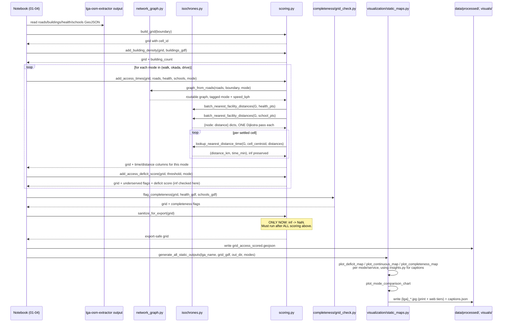
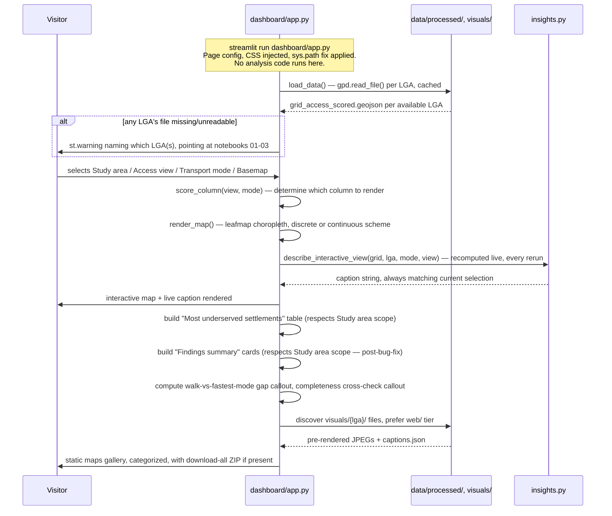

# End-to-End Walkthrough — akure-accessibility-dashboard

This page traces a concrete function-call sequence for one real analysis
run, split into two parts: **offline analysis** (the notebook-driven part
that actually computes everything, run once per LGA/data-update) and
**dashboard runtime** (what happens each time a user opens or interacts
with the Streamlit app, which never re-runs the analysis itself). For how
the *data* changes shape at each stage, see [Data Flow](data-flow.md).

## Sequence Overview

Both parts at a glance, before the detailed step-by-step walkthrough below.

**Part 1 — Offline Analysis:**

**Part 2 — Dashboard Runtime:**

## Part 1: Offline Analysis (run via the project's notebooks, not the dashboard)

### 1. Start: extractor output already on disk

Everything here assumes `lga-osm-extractor` has already been run for the
target LGA, and its GeoJSON/Shapefile output already exists on disk (see
[Cross-Repo Integration](../cross-repo/integration.md)).

### 2. Build the road network

For each mode being analyzed (typically all three:
`walk`/`okada`/`drive`): `network_graph.graph_from_roads(roads_gdf,
boundary_polygon=boundary_wgs84, mode=mode)` is called. Internally, this
hits OSM again (`ox.graph_from_polygon()`) — **this is the offline
pipeline's own network dependency**, separate from and in addition to
whatever network calls `lga-osm-extractor` already made to produce the
roads layer in the first place. `_assign_travel_times()` populates
`travel_time_min` on every edge using that mode's speed assumption.

### 3. Build the grid

`scoring.build_grid(boundary_gdf, cell_size_m=500)` produces the fishnet
grid, clipped to the LGA's actual shape. `scoring.add_building_density(grid,
buildings_gdf)` adds the `building_count` column via a spatial join against
the buildings layer.

### 4. Score accessibility, per mode

For each mode:

- `isochrones.batch_nearest_facility_distances(G, health_gdf)` runs **one**
  multi-source Dijkstra pass across the *entire* graph, returning
  `{node: distance}` for every reachable node relative to every health
  facility simultaneously. Repeated once more for `schools_gdf`. **This is
  the single most expensive computational step in the whole pipeline**, and
  the module's own performance framing (over an hour → roughly one Dijkstra
  run per mode per service) is specifically about this step.
- `scoring.add_access_times(grid, roads_gdf, health_gdf, schools_gdf,
  boundary_polygon_wgs84=boundary_wgs84, modes=(mode,))` loops over every
  *settled* grid cell (`building_count > 0`), calling
  `isochrones.lookup_nearest_distance_time()` — a cheap O(1) dictionary
  lookup against the already-computed distance dict, not a fresh graph
  search — twice per cell (health, education).
- `scoring.add_access_deficit_score(grid, threshold_min=mode_threshold,
  mode=mode)` derives the 0/1/2 composite score from the just-computed time
  columns for this mode. **Critically, `inf` values are preserved through
  this entire sequence** — nothing converts them to `NaN` yet.

### 5. Flag completeness, independently

`grid_check.flag_completeness(grid, health_gdf, schools_gdf)` runs
entirely separately from steps 2–4 above — no graph, no routing, just a
spatial-index nearest-neighbor search (`sjoin_nearest()`) per service,
against the grid's `building_count` (using its own, stricter threshold).

### 6. Sanitize, once, at the very end

Only after steps 4 and 5 have run for **every** mode/service of interest:
`scoring.sanitize_for_export(grid)` converts every remaining `inf` to
`NaN`. Calling this any earlier would have caused
`add_access_deficit_score()` (already run in step 4) to have silently
misclassified unreachable cells as adequately served — see
[`scoring.md`](modules/accessibility/scoring.md) for the full reasoning.
The resulting grid is written to
`data/processed/{lga}/grid_access_scored.geojson`.

### 7. Generate static outputs

`visualization.static_maps.generate_all_static_outputs(lga_name, grid,
out_dir="visuals/{lga}")` is called (still entirely offline, part of the
notebook run, not the dashboard). Internally, for every mode/service
combination present in the grid: `plot_deficit_map()` / `plot_continuous_map()`
/ `plot_completeness_map()` are called, each fetching fresh OSM basemap
tiles via `add_osm_basemap()` (a separate network dependency again,
distinct from steps 2 and the extractor's own OSM calls), and each
generating a caption via a direct call into `insights.py`'s
`describe_*()` functions. A `mode_comparison` chart is generated once at
the end. Every caption is written to `visuals/{lga}/captions.json`.

## Part 2: Dashboard Runtime (what happens on `streamlit run dashboard/app.py`)

### 8. Process start

Streamlit starts, executes `dashboard/app.py` top-to-bottom once: the
`sys.path` fix runs first (before any `akure_access` import), page config
and CSS are set, `load_data()` (decorated `@st.cache_data`) is called —
this is the **only** point in the dashboard's entire runtime that touches
disk for the grid data — reading both LGAs'
`grid_access_scored.geojson` files (already fully scored and sanitized by
Part 1, steps 1–6) directly into memory, cached for the remainder of the
app process's lifetime.

### 9. Widget state, on every rerun

Streamlit reruns the whole script on every user interaction. The current
values of the Study area / Access view / Transport mode / Basemap /
colorblind-safe selectors are all read fresh from Streamlit's
widget-state system at the top of each rerun — none of this state is
computed, only read.

### 10. Map rendering

`render_map(gdf, view, mode, ...)` is called (once, or twice side-by-side
for the "Both (compare)" case) — `score_column(view, mode)` resolves which
already-present column to visualize, a Leafmap map is built and displayed.
**No routing, scoring, or facility-lookup computation happens here** — this
step only ever reads already-computed columns off the in-memory grid
loaded in step 8.

### 11. Captions, recomputed live from already-scored data

`insights.describe_interactive_view(grid, lga_name, mode, view_choice)` is
called immediately after each map render — recomputing the caption's
actual numbers fresh from the loaded grid on every single rerun (not
cached), which is exactly what guarantees the caption always matches
whatever selector state produced the map above it.

### 12. Ranked table and Findings Summary

Both sections filter/aggregate the already-loaded grid live (`pd.concat()`,
`.sort_values()`, `.mean()` calls) — again, no new computation beyond what
was already present in the loaded GeoJSON, purely display-layer
aggregation.

### 13. Static maps section

Reads `visuals/{lga}/` (and `visuals/{lga}/web/`) off disk directly —
**a second, independent point where this dashboard touches disk**, separate
from `load_data()`'s GeoJSON read in step 8, and entirely dependent on
Part 1's step 7 having already been run and its output files present at
the expected paths.

## Where State Lives, Summarized

| State | Where it lives | How long it persists |
|---|---|---|
| The road network graph (per mode) | In-memory, during the offline analysis run only | Not persisted at all — rebuilt from scratch on every notebook re-run |
| The multi-source Dijkstra distance dict | In-memory, during the offline analysis run only | Not persisted — this is exactly why `batch_nearest_facility_distances()`'s one-pass-per-mode-per-service efficiency matters; if it had to be recomputed per dashboard pageview instead of once offline, the dashboard would be unusably slow |
| The fully-scored, sanitized grid | Disk, `data/processed/{lga}/grid_access_scored.geojson` | Persists indefinitely; the dashboard's sole data source |
| Static JPEG maps + `captions.json` | Disk, `visuals/{lga}/` and `visuals/{lga}/web/` | Persists indefinitely |
| The loaded grid, in the dashboard process | Streamlit's `@st.cache_data` cache (server memory) | Persists for the life of the Streamlit server process, shared across all sessions/users |
| Widget selections (Study area, Access view, etc.) | Streamlit's per-session widget state | Persists only for the current browser session |
