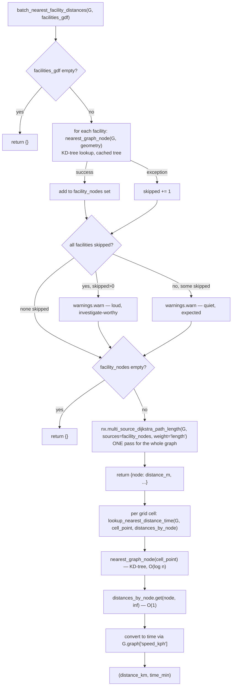

# isochrones.py

!!! info "Source"
    `akure_access/accessibility/isochrones.py` (444 lines — the largest and
    most algorithmically dense module in either repository)

## Purpose

Computes network-based travel-time isochrones from facility locations, and
finds nearest-facility travel times/distances for arbitrary origin points
(settlement or grid-cell centroids). Every function here operates on a
graph from [`network_graph.py`](network_graph.md) — this module contains
no graph-*building* logic of its own, only routing/query logic on top of an
already-built graph.

This module contains the single most consequential performance decision in
the whole project — the shift from per-cell shortest-path search to a
single multi-source Dijkstra pass — which is what makes scoring a full LGA
computationally tractable at all. See `batch_nearest_facility_distances()`
below.

## Dependencies

- **Imports:** `geopandas`, `networkx`, `numpy`, `scipy.spatial.cKDTree`,
  `shapely.geometry` (`Point`, `MultiPoint`), `shapely.ops.unary_union`.
- **Imported by:** `scoring.py` (`add_access_times()` uses
  `batch_nearest_facility_distances()` + `lookup_nearest_distance_time()`);
  `dashboard/app.py`; the project's accessibility-analysis notebook (for
  precomputing isochrone overlays).

## Functions & Classes

### `nearest_graph_node(G, point)`

| | |
|---|---|
| **What it does** | Finds the graph node nearest to an arbitrary point, using a cached KD-tree built from each node's `x`/`y` attributes. |
| **Why written this way** | Two deliberate engineering decisions here, both explained in the function's own docstring. **(1) Why a KD-tree, cached on the graph object itself** (`G.graph["_kdtree"]`), rather than a linear scan or a fresh tree per call: this function is called *very* frequently — once per origin point and once per candidate facility, for every settled grid cell, for every mode. A linear O(n) scan per call, or rebuilding the tree from scratch on every call, would dominate total runtime on a real road network with thousands of nodes; caching the tree means the O(n log n) build cost is paid once per graph, and every subsequent lookup is O(log n). **(2) Why not just use `osmnx.distance.nearest_nodes()`:** OSMnx's own nearest-node function assumes OSMnx's internal graph conventions (e.g. integer node IDs), and does not work reliably against the geometry-fallback graph produced by `network_graph._graph_from_geometries()` (which uses coordinate tuples as node IDs, not integers) — building a KD-tree directly over explicit `x`/`y` node attributes instead works uniformly regardless of which of `network_graph.py`'s two construction paths produced the graph. |
| **Inputs** | `G: MultiDiGraph`; `point: Point` (or any Shapely geometry with a `.centroid` — see the defensive backstop below). |
| **Outputs** | The nearest node's identifier (whatever type that graph uses as node keys — could be an OSM integer ID or a coordinate tuple, depending on which construction path built `G`). |
| **Internal workflow** | 1. **Defensive backstop**: if `point` is not already a `Point` instance (e.g. a `Polygon`/`MultiPolygon` slipped through), use its `.centroid` instead of raising — see below for why this specific line exists. 2. Check whether a KD-tree is already cached on `G.graph` under `"_kdtree"`/`"_kdtree_node_ids"`. If not: collect all node IDs, extract `x`/`y` arrays via `.get("x")`/`.get("y")` on each node's data dict; if any value is `NaN` (meaning a node is missing the attribute entirely — `.get()` returning `None` upcast to `NaN` by the `dtype=float` array construction), raise `ValueError` immediately, rather than building a tree that would silently misbehave; otherwise build a `cKDTree` over the stacked `(x, y)` columns and cache both the tree and the parallel node-ID list. 3. Query the (now-cached) tree for the single nearest neighbor to `(point.x, point.y)`. 4. Return the corresponding node ID from the cached ID list, indexed by the query result. |
| **Assumptions** | Assumes every node's `x`/`y` attributes are in the same CRS as `point` — this function does no CRS validation or reprojection itself; a mismatched CRS between the graph and the query point would silently return a nonsensical "nearest" node rather than raising. Assumes the KD-tree cache is safe to persist on the graph object for the graph's entire lifetime — true as long as the graph's node set doesn't change after the first call (adding/removing nodes after the tree is cached would leave the cache stale with no invalidation mechanism). |
| **Complexity** | O(n log n) once per graph, for the first call (tree construction); O(log n) for every subsequent call against the same graph, where n = number of graph nodes. |
| **Concurrency / race conditions** | **This is worth flagging explicitly.** The cache-check-then-set pattern (`if cache_key not in G.graph: ... G.graph[cache_key] = ...`) is a classic check-then-act sequence with no locking. If `nearest_graph_node()` were ever called concurrently on the *same* graph object from multiple threads before the cache is populated, two threads could both see the cache as absent, both build a tree, and both write to `G.graph[cache_key]` — the last write wins, and the other thread's tree is simply discarded (wasted work, not corrupted state, since both trees would be built from the same identical node set and be functionally equivalent). Not a correctness bug given this project's current sequential/single-threaded usage pattern, but a genuine latent race condition if this function were ever called from a parallelized scoring pipeline in the future. |
| **Covered by test(s)** | Not tested directly in isolation — exercised indirectly through every other function in this module that calls it (all of which have dedicated tests below). Its KD-tree caching behavior specifically has no dedicated test. |

**On the defensive backstop (step 1) — this is a real, previously-observed
failure mode, not speculative hardening.** The function's own comment is
explicit: a `Polygon`/`MultiPolygon` facility geometry (e.g. a hospital
mapped as a building outline rather than a point node) has no `.x`/`.y`
attribute and would otherwise raise inside this function. Before this
backstop existed, that exception used to propagate up and be caught by a
bare `except` clause further up the call chain, in
`batch_nearest_facility_distances()` — silently dropping the facility from
routing entirely, with no visible error. `lga_extractor.clean.py`'s
`POINT_LAYERS` centroid-collapse logic is the *primary* fix for this
upstream (see [Known Issues](../../../reference/known-issues.md)); this
`.centroid` fallback here is explicitly a **second line of defense**, for
any geometry that reaches this function without having gone through that
upstream cleaning step.

### `compute_isochrone_polygon(G, origin_point, trip_time_min, weight="travel_time_min")`

| | |
|---|---|
| **What it does** | Computes an approximate isochrone: the convex hull of every graph node reachable from `origin_point` within `trip_time_min`, based on network travel time. |
| **Why written this way — and why this is explicitly NOT what the project's actual scoring uses.** | This function underpins one specific, clearly-scoped feature: precomputed facility catchment-area overlays for the dashboard's optional "walking catchment" display (exported ahead of time by the project's analysis notebook to `data/processed/{lga}/isochrones_health_walk.geojson`, so the live dashboard never needs to build a routable graph at request time). The function's docstring is explicit about the approximation it makes and why it's acceptable *here specifically*: the returned polygon is a **convex hull** over reachable nodes, not the true reachable street-network footprint. Convex hulls can meaningfully overstate actual reachable area, since real street networks are rarely convex — a river, a gap in road connectivity, or a dead-end cluster can make a location *geometrically inside* the hull genuinely unreachable on the actual network. This tradeoff is accepted here because it's fast, simple, and sufficient for an illustrative map overlay — but the docstring flags, unambiguously, that the project's actual access-deficit scoring (in `scoring.py`) does **not** use this approximation at all; it uses exact network shortest-path distances/times via `nearest_facility_distance_and_time()` / `batch_nearest_facility_distances()` instead. Anyone reading only the dashboard's catchment overlay should not assume its precision matches the underlying deficit scores. |
| **Inputs** | `G: MultiDiGraph`; `origin_point: Point` (facility location, same CRS as `G`); `trip_time_min: float`; `weight: str`, default `"travel_time_min"` (which edge attribute to treat as the time cost). |
| **Outputs** | A Shapely `Polygon` (convex hull), or `None` if the origin can't be matched to the graph, or if fewer than 3 nodes are reachable (too few points to form a meaningful polygon). |
| **Internal workflow** | 1. Try to snap `origin_point` to its nearest graph node via `nearest_graph_node()`; return `None` immediately on any exception (broad `except Exception`, deliberately tolerant — an unmatched origin is a normal, expected outcome for this function, not something worth raising over). 2. Use `nx.ego_graph(G, center_node, radius=trip_time_min, distance=weight)` — NetworkX's built-in function for extracting the subgraph of all nodes within a given weighted distance of a center node — to get every node reachable within the time budget. 3. If fewer than 3 nodes were found, return `None` (can't form a polygon from fewer than 3 points). 4. Extract `(x, y)` points for every reachable node, build a `MultiPoint`, return its `.convex_hull`. |
| **Assumptions** | Assumes a convex hull is an acceptable approximation for the *specific illustrative use case* it's built for — explicitly not assumed acceptable for scoring, as covered above. |
| **Complexity** | `nx.ego_graph()`'s complexity dominates — effectively a bounded Dijkstra/BFS search from the center node, roughly O((V + E) log V) in the worst case for the reachable subgraph size; convex hull computation over the resulting points is O(k log k) where k = number of reachable nodes. |
| **Concurrency / race conditions** | None beyond what `nearest_graph_node()` already carries (see above). |
| **Covered by test(s)** | See [tests.md](../../tests.md) — `test_compute_isochrone_polygon_returns_larger_area_for_longer_trip_time`, `test_compute_isochrone_polygon_returns_none_for_unmatchable_origin`. |

### `build_isochrones_for_facilities(G, facilities_gdf, trip_times_min=(15, 30, 45))`

| | |
|---|---|
| **What it does** | Calls `compute_isochrone_polygon()` for every `(facility, trip_time)` combination, returning one row per successfully-computed isochrone. |
| **Why written this way** | A straightforward batch wrapper — the interesting design decision here isn't the looping logic, it's the empty-result handling (see workflow step 3), which reflects a broader pattern in this codebase (also seen in `lga_extractor`) of representing "empty but valid" consistently as a correctly-typed, correctly-CRS'd `GeoDataFrame` with zero rows, never as `None` or an untyped empty structure. |
| **Inputs** | `G: MultiDiGraph`; `facilities_gdf: GeoDataFrame` (point layer, cleaned/exported by `lga_extractor`, reprojected to match `G`'s CRS); `trip_times_min: tuple`, default `(15, 30, 45)` minutes. |
| **Outputs** | `GeoDataFrame`, one row per `(facility, trip_time)` pair that produced a valid polygon, columns `[facility_name, osmid, trip_time_min, geometry]`. |
| **Internal workflow** | 1. Double loop: for each facility row, for each requested trip time, call `compute_isochrone_polygon()`; skip (don't append) any `None` result. 2. If no records were produced at all (empty `facilities_gdf`, or every point failed to match the graph): construct an explicitly-typed empty `GeoDataFrame` with the correct columns, `geometry="geometry"`, and the correct CRS — done this way specifically because `gpd.GeoDataFrame([], crs=...)` cannot infer a geometry column from an empty list of records and raises an error if a CRS is also supplied at the same time; constructing it explicitly sidesteps that limitation. 3. Otherwise, build and return the `GeoDataFrame` from the collected records normally. |
| **Assumptions** | Assumes `facilities_gdf` is already reprojected to match `G`'s CRS — no reprojection happens inside this function. |
| **Complexity** | O(F × T × isochrone_cost) where F = number of facilities, T = number of trip-time bands — each isochrone computation itself bounded by `compute_isochrone_polygon()`'s own complexity. |
| **Concurrency / race conditions** | None — sequential nested loop. |
| **Covered by test(s)** | See [tests.md](../../tests.md) — `test_build_isochrones_for_facilities_one_row_per_facility_per_trip_time`, `test_build_isochrones_for_facilities_handles_empty_facilities`. |

### `nearest_facility_travel_time(G, origin_point, facilities_gdf, weight="travel_time_min")`

| | |
|---|---|
| **What it does** | Returns just the travel time (minutes) to the single nearest facility from one origin point. |
| **Why written this way** | A thin wrapper — its own docstring says so directly — kept purely for backward compatibility with existing calling code that only wants the time value, not the `(distance, time)` pair `nearest_facility_distance_and_time()` returns. |
| **Inputs / Outputs** | See `nearest_facility_distance_and_time()` below — identical inputs, returns only the time component. |
| **Internal workflow** | Single line: calls `nearest_facility_distance_and_time()`, discards the distance, returns the time. |
| **Complexity** | Identical to `nearest_facility_distance_and_time()`. |
| **Covered by test(s)** | No dedicated test — this is a one-line wrapper around `nearest_facility_distance_and_time()`, whose own tests (`test_nearest_facility_distance_and_time_finds_closer_facility`, `test_nearest_facility_distance_and_time_handles_empty_facilities` — see [tests.md](../../tests.md)) exercise the logic this function delegates to. |

### `nearest_facility_distance_and_time(G, origin_point, facilities_gdf, weight="travel_time_min", distance_attr="length")`

| | |
|---|---|
| **What it does** | Computes both network distance (km) and travel time (minutes) from one origin point to the single nearest facility, where "nearest" is defined by `weight` — meaning this reflects the *fastest* facility to reach, not necessarily the geometrically closest one. |
| **Why written this way — and why this function should usually NOT be the one you call.** | The docstring is unusually direct about this function's own limitation: it runs one full shortest-path search per facility, for a single origin — meaning scoring many origins against the same facility set (exactly what happens when scoring every grid cell in an LGA) means calling this function once per cell, each call redoing a from-scratch search across every facility. For that use case, the docstring explicitly directs readers to `batch_nearest_facility_distances()` + `lookup_nearest_distance_time()` instead, which computes the routing once via multi-source Dijkstra rather than once per origin — "dramatically faster at scale," in the module's own words. This function is retained specifically for single-lookup use cases and backward compatibility, not because it's the preferred approach for the project's actual scoring workload (`scoring.add_access_times()` uses the batch approach, not this one). |
| **Inputs** | `G: MultiDiGraph`; `origin_point: Point`; `facilities_gdf: GeoDataFrame`; `weight: str`, default `"travel_time_min"` (used to select the nearest facility and report time); `distance_attr: str`, default `"length"` (used to report distance, summed along the *same* shortest path the time calculation used — not independently re-optimized for shortest distance). |
| **Outputs** | `(distance_km: float, travel_time_min: float)` tuple. Both are `float('inf')` if no facility is reachable. |
| **Internal workflow** | 1. If `facilities_gdf` is empty, return `(inf, inf)` immediately. 2. Snap `origin_point` to its nearest node; return `(inf, inf)` on any failure. 3. For each facility: snap it to its nearest node, compute the shortest path (`nx.shortest_path()`, weighted by `weight`), then compute both the time-weighted and distance-weighted total cost of that *same* path (`nx.path_weight()`, called twice with different weight attributes on the identical path — not two separate optimizations); wrap this per-facility attempt in `try/except Exception: continue`, so one unreachable or unsnappable facility doesn't abort the whole search, it's simply skipped and the loop moves to the next facility. 4. Track the minimum `travel_time` seen so far across all facilities, updating `best_distance_km` alongside it whenever a new minimum is found. 5. Return the best `(distance_km, travel_time)` pair found, or `(inf, inf)` if every facility attempt failed. |
| **Assumptions** | Assumes selecting "nearest" by `weight` (typically time) rather than by distance is the semantically correct choice for this project's purposes — a facility that's geometrically further but reachable via a faster road is correctly treated as "nearer" in a meaningful, real-world sense. |
| **Complexity** | O(F × shortest_path_cost) per call, where F = number of facilities — this is the per-origin cost the module explicitly warns doesn't scale well when called once per grid cell across potentially hundreds of cells. |
| **Concurrency / race conditions** | None beyond `nearest_graph_node()`'s caching consideration. |
| **Covered by test(s)** | See [tests.md](../../tests.md) — `test_nearest_facility_distance_and_time_finds_closer_facility`, `test_nearest_facility_distance_and_time_handles_empty_facilities`. |

### `batch_nearest_facility_distances(G, facilities_gdf, distance_attr="length")`

**This is the performance-critical function the whole module exists to
support at scale.**

| | |
|---|---|
| **What it does** | Computes, for *every node in the graph simultaneously*, the network distance to the nearest facility — in one multi-source Dijkstra pass — rather than running a separate shortest-path search per origin. |
| **Why written this way — the actual performance story, in the module's own words.** | The naive approach (`nearest_facility_distance_and_time()`, called once per grid cell) does `cells × facilities` separate shortest-path searches. For a real LGA, this is "hundreds × dozens" — potentially tens of thousands of Dijkstra runs, across a road network with thousands of nodes, *per mode, per service*. The module states plainly: this is what made a full analysis-notebook run take over an hour in practice. `nx.multi_source_dijkstra_path_length()` instead finds the shortest distance from the **nearest of several source nodes** (here, every facility's snapped graph node) to every other node, in a single pass — so the expensive routing computation happens once per `(mode, service)` combination, not once per grid cell. Snapping each facility to its nearest node is still one KD-tree lookup per facility (fast — see `nearest_graph_node()`), but that's now the only per-facility cost; the actual graph traversal is shared across the whole grid. **Why distance, not travel time, is used as the Dijkstra weight:** within a single mode's graph, every edge shares the same assumed speed (set uniformly by `network_graph.MODE_CONFIG` for that mode), so travel time is simply distance divided by a constant — meaning the shortest path by distance and the shortest path by travel time are *identical* for this graph structure. This means time doesn't need its own separate, second Dijkstra pass; it can be derived from the already-computed distance afterward (see `lookup_nearest_distance_time()` below) via one division, not a second expensive graph traversal. This equivalence would **not** hold if edge speeds varied within a single mode's graph (e.g. per-road-type speeds) — a design constraint worth remembering if that simplification is ever revisited. |
| **Inputs** | `G: MultiDiGraph`; `facilities_gdf: GeoDataFrame`; `distance_attr: str`, default `"length"` (the Dijkstra weight, in meters). |
| **Outputs** | `dict` mapping `graph_node → distance in meters` to the nearest facility. A node **absent** from this dict means it's unreachable from every facility (equivalent to infinite distance) — this is an implicit-absence convention, not an explicit `inf` value stored for every unreachable node, which matters for how callers (`lookup_nearest_distance_time()`) must handle lookups. |
| **Internal workflow** | 1. If `facilities_gdf` is empty, return `{}` immediately. 2. For each facility, try to snap it to its nearest graph node, collecting results into a **set** (`facility_nodes`) — deduplicating automatically if multiple facilities happen to snap to the same node; count and skip (via `try/except Exception: continue`) any facility that fails to snap. 3. **If any facilities were skipped, raise a `UserWarning`** (not silently continue) with a message reporting the skip count and, notably, actionable guidance: check geometry type (should be Point after cleaning) and CRS before trusting the resulting scores. See below for why this warning exists at all. 4. If `facility_nodes` ended up empty (every facility failed to snap), return `{}`. 5. Otherwise, call `nx.multi_source_dijkstra_path_length(G, sources=facility_nodes, weight=distance_attr)` and return its result directly. |
| **Assumptions** | Assumes every edge in a single mode's graph genuinely shares one uniform speed (the load-bearing assumption behind reusing distance-based Dijkstra results for time, as explained above) — this assumption would silently produce wrong travel times, not an error, if `network_graph.py` were ever changed to support per-edge speed variation without a corresponding change here. |
| **Complexity** | **This is the entire point of the function**: O((V + E) log V) — a single Dijkstra-family pass over the whole graph — versus the naive O(cells × facilities × shortest_path_cost) the module explicitly contrasts itself against. The facility-snapping step is O(F log n) (F facility KD-tree lookups, each O(log n)). |
| **Concurrency / race conditions** | None introduced by this function itself; inherits `nearest_graph_node()`'s caching consideration during the snapping step. |
| **Covered by test(s)** | See [tests.md](../../tests.md) — this function's correctness under a partial-skip vs. total-skip scenario is exactly the kind of thing worth dedicated test coverage for, given the history described below. |

**On the loud-warning-on-total-skip behavior (step 3) — this is a directly
documented incident, not hypothetical caution.** The module's own comment
states plainly: this is exactly what happened when a whole LGA's health
facilities were mapped as building-outline polygons upstream (the Akure
North bug — see [Known Issues](../../../reference/known-issues.md)) — a
bare `except: continue` at this point in the code used to silently produce
**0% health access for an entire LGA**, with no visible sign anything had
gone wrong; every grid cell simply scored as unreachable, indistinguishable
from a genuinely severe accessibility crisis. The current behavior
distinguishes two very different situations: a **partial** skip (some
facilities genuinely un-snappable — e.g. truly disconnected from the road
graph) is treated as expected and unremarkable, producing only a warning;
a **total** skip (every facility in a non-empty layer fails) is treated as
almost certainly a real upstream bug, and is surfaced loudly enough that a
caller reviewing the run cannot miss it. This is the same fail-loud
philosophy documented in `lga_extractor.layers.py`'s `LayerExtractionError`
design (see [Known Issues](../../../reference/known-issues.md)), applied
at a different layer of the pipeline.

### `lookup_nearest_distance_time(G, origin_point, distances_by_node)`

| | |
|---|---|
| **What it does** | Looks up the precomputed nearest-facility distance for one origin point (from `batch_nearest_facility_distances()`'s output) and converts it into `(distance_km, travel_time_min)`. |
| **Why written this way** | This is the "cheap half" of the two-function pattern that replaces the expensive per-cell approach: after `batch_nearest_facility_distances()` has done the one expensive graph-wide Dijkstra pass, this function is called once per grid cell, and does only an O(1) dictionary lookup (plus one KD-tree snap for the origin point itself) — no further graph traversal. This is precisely what makes `scoring.add_access_times()` (which calls this function once per grid cell, across potentially hundreds of cells) computationally cheap despite the number of calls. |
| **Inputs** | `G: MultiDiGraph` (the *same* graph passed to `batch_nearest_facility_distances()` — required so its `speed_kph` graph attribute, set by `graph_from_roads()`, is available to convert distance into time); `origin_point: Point`; `distances_by_node: dict` (the output of `batch_nearest_facility_distances()`). |
| **Outputs** | `(distance_km, travel_time_min)` tuple. Both `float('inf')` if the origin can't be matched to the graph, or is unreachable from every facility (i.e. its node is absent from `distances_by_node`, or explicitly `inf` in it). |
| **Internal workflow** | 1. If `distances_by_node` is empty, return `(inf, inf)` immediately — no facilities were ever successfully snapped. 2. Snap `origin_point` to its nearest node; return `(inf, inf)` on failure. 3. Look up `distances_by_node.get(origin_node, float("inf"))` — the explicit default handles the "node absent from dict" convention documented in `batch_nearest_facility_distances()`'s output above. 4. If the looked-up distance is `inf`, short-circuit and return `(inf, inf)` — no need to attempt a speed conversion on an already-infinite value. 5. Read `speed_kph` off `G.graph`; if missing/falsy, return `(inf, inf)` (can't convert distance to time without a known speed — treated the same as unreachable, rather than raising). 6. Convert: `speed_m_per_min = (speed_kph * 1000) / 60`; `time_min = distance_m / speed_m_per_min` (guarded against division by zero the same way `network_graph._assign_travel_times()` is, returning `inf` rather than raising). 7. Return `(distance_m / 1000, time_min)`. |
| **Assumptions** | Assumes `G`'s `speed_kph` graph attribute accurately reflects the uniform speed used when `distances_by_node` was computed — this function trusts that whatever graph is passed in is the same one (or an equivalent one) used to produce `distances_by_node`; passing a mismatched graph/distances pair would silently produce wrong times, not an error. |
| **Complexity** | O(log n) — dominated entirely by the one KD-tree snap for `origin_point`; everything else is O(1). |
| **Concurrency / race conditions** | None beyond `nearest_graph_node()`'s caching consideration. |
| **Covered by test(s)** | Not tested in isolation, but exercised as part of `test_batch_nearest_facility_distances_matches_naive_per_pair_approach` and `test_batch_nearest_facility_distances_much_faster_than_naive_at_scale` (see [tests.md](../../tests.md)), since those tests compare this function's output against the naive approach end to end. |

## Internal Workflow

## Gotchas

- **Two genuinely different accuracy models coexist in this file, for
  different purposes, and it's easy to conflate them.** `compute_isochrone_polygon()`
  (and everything built on it) is a fast convex-hull *approximation*, used
  only for illustrative dashboard overlays. Everything else in this module
  — `nearest_facility_distance_and_time()`, `batch_nearest_facility_distances()`,
  `lookup_nearest_distance_time()` — computes *exact* network shortest-path
  distances/times, and is what the project's actual access-deficit scores
  are built from. A map showing a facility's "15-minute walking catchment"
  and a grid cell's individually-scored "18 minutes to nearest health
  facility" are produced by genuinely different computational methods with
  different accuracy characteristics, even though both describe the same
  underlying concept.
- **`batch_nearest_facility_distances()`'s distance-only Dijkstra trick
  depends on a currently-true but not-enforced assumption**: uniform edge
  speed within one mode's graph. If per-road-type speed variation were ever
  introduced into `network_graph.py`, this function's reuse of
  distance-based results for travel time would become silently wrong,
  without any error — a change to that module's speed model would need a
  corresponding change here.
- **The "node absent from dict = unreachable" convention in
  `batch_nearest_facility_distances()`'s output requires careful handling
  by callers.** `lookup_nearest_distance_time()` handles this correctly via
  `.get(node, float("inf"))`, but any other code consuming this function's
  raw dict output directly needs to replicate that same explicit-default
  pattern, or risk a `KeyError` on an unreachable node rather than
  correctly treating it as infinite distance.
