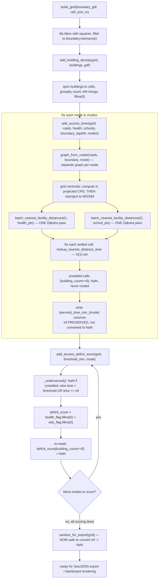

# scoring.py

!!! info "Source"
    `akure_access/accessibility/scoring.py` (318 lines)

## Purpose

Ties `network_graph.py` and `isochrones.py` together into the project's
actual output: a grid over the LGA, a building-density population proxy per
cell, nearest-facility travel times per cell per mode, and the composite
0–2 access-deficit score that everything else in the project (dashboard,
static maps, narrative captions) is ultimately built from.

This module is where the performance work in `isochrones.py` pays off
directly — `add_access_times()` is the function that actually invokes the
batch multi-source Dijkstra approach at LGA scale, and its own docstring
repeats the same "over an hour vs. roughly one Dijkstra run per mode per
service" performance framing found in `isochrones.py`, since this is the
function where that difference is actually felt.

## Dependencies

- **Imports:** `geopandas`, `numpy`, `shapely.geometry.box`; locally,
  `graph_from_roads` from `.network_graph`, and
  `batch_nearest_facility_distances`, `lookup_nearest_distance_time` from
  `.isochrones`.
- **Imported by:** `dashboard/app.py`; `insights.py` and
  `visualization/static_maps.py` consume this module's *output* (a scored
  grid), not the module directly.

## Functions & Classes

### Module-level constants

| Constant | Value | Purpose |
|---|---|---|
| `DEFAULT_ACCESS_THRESHOLD_MIN` | `30` | Default travel-time threshold (minutes) beyond which a cell is considered underserved for a service. |
| `DEFAULT_GRID_CELL_SIZE_M` | `500` | Default fishnet grid cell size, in meters. |

### `build_grid(boundary_gdf, cell_size_m=DEFAULT_GRID_CELL_SIZE_M)`

| | |
|---|---|
| **What it does** | Builds a regular square fishnet grid covering the LGA boundary, clipped to the boundary's actual shape (not a bounding-box rectangle). |
| **Why written this way** | A straightforward regular grid, rather than an adaptive or hexagonal one — consistent with the project's broader design choice (see [overview](../../overview.md)) to analyze accessibility at a uniform grid-cell resolution rather than per-building, since the underlying travel-time/speed assumptions don't support finer claimed precision anyway. Clipping to the boundary's actual geometry (via `.intersects()`), rather than just using the bounding box, avoids scoring cells that fall entirely outside the LGA but inside its rectangular extent — important for LGAs with irregular (non-rectangular) shapes, where a bounding-box grid would otherwise include a meaningful number of cells outside the actual area of interest. |
| **Inputs** | `boundary_gdf: GeoDataFrame` (LGA boundary, any CRS — reprojected internally); `cell_size_m: float`, default `500`. |
| **Outputs** | `GeoDataFrame`, EPSG:32631, one row per grid cell (square `Polygon`), with a `cell_id` column (a simple `0..n-1` integer sequence from the post-filter index). |
| **Internal workflow** | 1. Reproject `boundary_gdf` to `EPSG:32631` (the project's fixed metric CRS — see Gotchas below on why this is fixed rather than auto-selected). 2. Get `total_bounds` (the bounding rectangle) of the reprojected boundary. 3. Build `xs`/`ys` arrays via `np.arange(min, max, cell_size_m)` — one array per axis, evenly spaced by `cell_size_m`. 4. Build a `box()` (square polygon) for every `(x, y)` combination in the Cartesian product of `xs` and `ys` — a full grid over the bounding rectangle, not yet clipped. 5. Compute `boundary_m.union_all()` — dissolve the (possibly multi-row) boundary into one geometry. 6. Filter the grid to only cells that `.intersects()` that unioned boundary — this is the clipping step; cells entirely outside the LGA's actual shape but inside its bounding box are dropped here. 7. Reset the index, assign `cell_id` from the (now-clean) index. |
| **Assumptions** | Assumes a fixed `500m` default cell size is an appropriate resolution for the LGAs this project targets (Akure North/South) — not derived from any principled sizing calculation, a reasonable-looking round number. Assumes `.intersects()` (any overlap at all) rather than a stricter containment or majority-overlap test is the right clipping criterion — a cell that only barely clips the boundary's edge is still included in full, not partially. |
| **Complexity** | O((maxx-minx)/cell_size_m × (maxy-miny)/cell_size_m) for the initial full-rectangle grid construction — i.e. proportional to boundary area divided by cell area; the `.intersects()` filter is an additional O(N) spatial predicate evaluation over that initial cell count (GeoPandas' vectorized spatial operations, not a naive per-cell loop in Python). |
| **Concurrency / race conditions** | None — sequential, no shared mutable state. |
| **Covered by test(s)** | See [tests.md](../../tests.md) — `test_scoring.py`. |

### `add_building_density(grid_gdf, buildings_gdf)`

| | |
|---|---|
| **What it does** | Adds a `building_count` column to each grid cell — the count of building footprints intersecting that cell — used throughout the rest of the pipeline as a proxy for population/settlement, in the absence of fine-grained population data. |
| **Why written this way** | A spatial join (`gpd.sjoin`) followed by a `groupby().size()` count, rather than a per-cell loop calling `.intersects()` against every building — the vectorized spatial-join approach is dramatically faster for this kind of many-to-many spatial relationship at scale (thousands of buildings against hundreds of grid cells) than an explicit nested loop would be. `building_count` is explicitly documented as a **proxy**, not actual population data — the module's docstring is upfront that this is a stand-in used specifically because fine-grained population figures aren't available, not a claim that building count is itself the metric of interest. |
| **Inputs** | `grid_gdf: GeoDataFrame` (output of `build_grid()`, EPSG:32631); `buildings_gdf: GeoDataFrame` (cleaned buildings layer, EPSG:32631). |
| **Outputs** | `grid_gdf` with an added integer `building_count` column (never `NaN` — cells with zero intersecting buildings get an explicit `0`, not a missing value). |
| **Internal workflow** | 1. Copy the input grid. 2. If `buildings_gdf` is empty: set `building_count = 0` for every cell, return immediately — an explicit short-circuit rather than letting an empty spatial join produce the same result less directly. 3. Otherwise: `gpd.sjoin(buildings_gdf, grid[["cell_id", "geometry"]], how="inner", predicate="intersects")` — a spatial inner join, attaching each building to every cell it intersects (a building could technically straddle a cell boundary and match more than one cell, though at 500m cell size and typical building footprint size this is a rare edge case). 4. `.groupby("cell_id").size()` — count buildings per matched `cell_id`. 5. Left-merge those counts back onto the full grid (`how="left"`, so cells with zero matching buildings aren't dropped, they just don't appear in the join result at all). 6. `.fillna(0).astype(int)` — cells absent from the join result (zero buildings) get `0`, and the column is cast to integer (the merge would otherwise leave it as float, due to the `NaN`s introduced by the left join before filling). |
| **Assumptions** | Assumes `"intersects"` (not `"within"`) is the correct predicate — a building that straddles two cells counts toward both, rather than being assigned to a single "primary" cell. This is a reasonable, if unstated, choice for a density proxy (a building genuinely does occupy space in both cells), but does mean the sum of `building_count` across all cells can slightly exceed the true total building count in the layer, for buildings that straddle a cell boundary. |
| **Complexity** | The spatial join itself is the dominant cost — GeoPandas'/`shapely`'s spatial-index-backed join is typically near O((B + C) log(B + C)) in practice (B = buildings, C = cells) rather than the naive O(B × C), though the exact complexity depends on the underlying spatial index implementation. The groupby/merge/fillna steps are O(B) / O(C) respectively. |
| **Concurrency / race conditions** | None. |
| **Covered by test(s)** | See [tests.md](../../tests.md) — `test_add_building_density_counts_correctly`, `test_add_building_density_handles_empty_buildings`. |

### `add_access_times(grid_gdf, roads_gdf, health_gdf, schools_gdf, boundary_polygon_wgs84=None, modes=("walk",))`

**This is where the multi-source Dijkstra optimization documented in
[`isochrones.py`](isochrones.md) is actually put to work at LGA scale.**

| | |
|---|---|
| **What it does** | For every populated grid cell (`building_count > 0`), computes nearest-facility distance and travel time to both health facilities and schools, for every requested transport mode. |
| **Why written this way** | Three deliberate design choices stand out. **(1) Only settled cells are routed.** Cells with `building_count == 0` are left as `NaN` rather than routed — since these are presumed unsettled/empty land, routing them would be wasted computation with no meaningful interpretation (there's no one there to have an access time). This is also the mechanism that keeps runtime bounded even for a large grid: routing cost scales with settled-cell count, not total grid-cell count. **(2) One graph is built per mode, not one graph reused across modes.** `"walk"` uses OSM's walk network; `"okada"`/`"drive"` both use OSM's drive network (see `network_graph.MODE_CONFIG`) — these are genuinely different road-network subsets (a walk network includes pedestrian paths a drive network excludes, for instance), so a single shared graph across modes would be structurally wrong, not just differently-weighted. **(3) The batch Dijkstra approach is applied per `(mode, service)` combination, not per cell.** `batch_nearest_facility_distances()` is called exactly twice per mode (once for health, once for schools) regardless of how many settled cells exist — the function's own docstring states this directly: "the previous per-cell approach could take over an hour for a full LGA across all three modes; this approach reduces the routing cost to roughly one Dijkstra run per mode per service, regardless of how many grid cells there are." |
| **Inputs** | `grid_gdf: GeoDataFrame` (output of `add_building_density()`, EPSG:32631); `roads_gdf: GeoDataFrame` (cleaned roads, EPSG:32631, used only as a fallback if `boundary_polygon_wgs84` isn't given — see `network_graph.graph_from_roads()`'s two construction paths); `health_gdf`, `schools_gdf: GeoDataFrame` (cleaned facility point layers, EPSG:32631); `boundary_polygon_wgs84`, optional (LGA boundary in EPSG:4326, passed through to `graph_from_roads()` for the recommended OSMnx-based path); `modes: tuple`, default `("walk",)` (any subset of `{"walk", "okada", "drive"}`). |
| **Outputs** | `grid_gdf` with added columns per mode/service: `health_time_min_{mode}`, `health_distance_km_{mode}`, `education_time_min_{mode}`, `education_distance_km_{mode}`. When `modes == ("walk",)` specifically, plain unsuffixed `health_time_min`/`education_time_min` columns are *also* populated, mirroring the suffixed walk columns — a backward-compatibility measure for any code written before mode-suffixed columns existed. |
| **Internal workflow** | 1. Copy the grid. 2. For each requested mode: build a mode-specific graph via `graph_from_roads()`. 3. **Facility point CRS handling** — if `boundary_polygon_wgs84` was given (the recommended path): reproject `health_gdf`/`schools_gdf` to EPSG:4326 (to match the OSMnx-built graph, which is natively in WGS84 in that construction path); compute grid-cell centroids **in the grid's own projected CRS first** (EPSG:32631, meters), *then* reproject those resulting points to EPSG:4326 — deliberately not the reverse order (see Gotchas below for why this ordering matters). If no boundary polygon was given (fallback path, graph built directly from `roads_gdf`, which stays in EPSG:32631): facility points and grid centroids are used as-is, no reprojection needed, since everything is already in the same projected CRS. 4. Call `batch_nearest_facility_distances(G, health_pts)` and again for `school_pts` — two Dijkstra passes total for this mode, regardless of grid size. 5. Loop over every grid cell's centroid and `building_count` together (`zip()`): if `building_count == 0`, append `NaN` to all four output lists for this cell and `continue` — no routing attempted; otherwise call `lookup_nearest_distance_time()` twice (health, education) — each an O(1) dictionary lookup plus one KD-tree snap, not a fresh graph search. 6. Assign the four collected lists as new mode-suffixed columns on `grid`. 7. If `modes == ("walk",)` was the only mode requested, also populate the unsuffixed legacy column names from this mode's results. |
| **Assumptions** | Assumes `roads_gdf`/`health_gdf`/`schools_gdf` are all already in EPSG:32631 (the project's fixed CRS — see Gotchas) — no CRS validation is performed on these inputs beyond the explicit, deliberate reprojections described above. |
| **Complexity** | O(M × (graph_build_cost + 2 × Dijkstra_cost + settled_cells × O(log n))) where M = number of requested modes — dominated by graph construction and the two Dijkstra passes per mode, **not** by grid size beyond the settled-cell lookup loop, which is the entire point of the batch approach. |
| **Concurrency / race conditions** | None — sequential loop over modes, no threading. |
| **Covered by test(s)** | No dedicated fast unit test in `test_scoring.py` (its neighboring tests construct grid data with routing results already present, rather than calling this function directly, to keep unit tests independent of graph-building cost). Its actual integration with `network_graph.py` and `isochrones.py` is exercised end to end by `test_extractor_output_schema_matches_dashboard_expectations` in the [cross-repo integration test](../../../cross-repo/integration.md). |

**On why `inf` is deliberately kept, not converted to `NaN`, at this
stage** — this is directly stated in the source as an inline comment, and
is important enough to reproduce here explicitly: `add_access_deficit_score()`
(below) relies on detecting `inf` specifically to correctly treat
unreachable facilities as underserved. Converting `inf` to `NaN` at this
point would cause `NaN`'s "unknown, treat as adequately served"
`fillna(0)` handling in the scoring function to **silently misclassify
genuinely unreachable cells as served** — the opposite of the intended
meaning. `inf` is only ever sanitized to `NaN` by `sanitize_for_export()`,
and that function must be called **after** `add_access_deficit_score()`,
never before — see that function's own documentation below for the full
reasoning, and the Gotchas section for why this ordering constraint is
easy to violate accidentally.

### `add_access_deficit_score(grid_gdf, threshold_min=DEFAULT_ACCESS_THRESHOLD_MIN, mode="walk")`

| | |
|---|---|
| **What it does** | Derives the composite 0–2 access-deficit score per cell for one mode: `0` = adequately served for both health and education, `1` = underserved for one service, `2` = underserved for both. Unsettled cells stay unscored (`NaN`). |
| **Why written this way** | The threshold-based binary underserved/served classification per service, summed into a single 0–2 composite, is a simple, interpretable scoring model — deliberately simple enough that "2" unambiguously means "worst off on both dimensions measured," rather than a weighted or continuous score whose meaning would require more explanation to communicate to a non-technical audience (planners, the project's stated intended users). The docstring is explicit that `threshold_min`'s appropriate value differs meaningfully by mode — 30 minutes of walking covers far less ground than 30 minutes of okada or driving — and directs callers to consider passing a mode-appropriate threshold rather than reusing the walking default unchanged; the function itself does **not** auto-adjust the threshold per mode, that responsibility is left to the caller. |
| **Inputs** | `grid_gdf: GeoDataFrame` (output of `add_access_times()`); `threshold_min: float`, default `30`; `mode: str`, default `"walk"` (selects which mode's time columns to score). |
| **Outputs** | `grid_gdf` with added `{mode}_health_underserved`, `{mode}_education_underserved`, `{mode}_access_deficit_score` columns; when `mode == "walk"`, these are *also* mirrored to unsuffixed legacy column names (`health_underserved`, `education_underserved`, `access_deficit_score`). |
| **Internal workflow** | 1. Copy the grid. 2. Resolve which time columns to read: prefer the mode-suffixed column (`health_time_min_{mode}`) if present, else fall back to the unsuffixed legacy name — this makes the function tolerant of being called against a grid produced by either the single-mode or multi-mode code path in `add_access_times()`. 3. Define `_underserved(time_val)` inline: returns `NaN` if the input is itself `NaN` (via the module-level `pd_isna()` helper — see below); otherwise returns `1` if `time_val > threshold_min` **or** `time_val == float("inf")` (explicit `inf` check, not relying on `inf > threshold_min` evaluating true, though it would — the explicit check makes the intent unambiguous to a reader), else `0`. 4. Apply `_underserved()` element-wise to both the health and education time columns. 5. Sum the two flags into `deficit_score`, using `.fillna(0)` on each flag *before* summing — meaning a cell with one `NaN` flag and one real flag is NOT treated as `NaN` overall, it's treated as if the `NaN` flag contributed `0` to the sum (see Gotchas for why this matters). 6. **Overwrite** `deficit_score` to `NaN` wherever `building_count == 0` — this is the actual mechanism that keeps unsettled cells unscored; the `fillna(0)` in step 5 would otherwise have scored them as `0` (falsely "adequately served") rather than correctly leaving them out of the analysis entirely. 7. Assign the three new mode-suffixed columns; mirror to unsuffixed names if `mode == "walk"`. |
| **Assumptions** | Assumes a cell being unreachable (`inf` travel time) should be scored identically to a cell that's merely slow-but-reachable-past-the-threshold — both count as "underserved," with no distinction in the deficit score itself between "45 minutes away" and "genuinely unreachable by this mode." That distinction is preserved in the underlying time columns (still `inf` vs. a large finite number) even though the deficit score collapses them together. |
| **Complexity** | O(C) where C = grid cell count — two element-wise `.apply()` calls plus a constant number of vectorized operations. |
| **Concurrency / race conditions** | None. |
| **Covered by test(s)** | See [tests.md](../../tests.md) — `test_access_deficit_score_composite_logic`, `test_access_deficit_score_mode_suffix_columns`, `test_access_deficit_score_treats_inf_as_underserved`, `test_sanitize_for_export_does_not_break_deficit_scoring`, `test_sanitize_for_export_called_before_scoring_gives_wrong_result`. |

**On the settled/unsettled overwrite ordering (step 5 → step 6) — this is a
real, subtle correctness dependency worth being explicit about.** The
`fillna(0)` in step 5 happens *before* the `building_count == 0` overwrite
in step 6 specifically because doing it in the other order would produce a
wrong result: if the `NaN`-masking-for-unsettled-cells happened first and
`fillna(0)` ran afterward, the `fillna(0)` call would overwrite the
just-applied `NaN`s for unsettled cells right back to `0` — silently
re-classifying every unsettled cell as "adequately served" rather than
correctly leaving it out of the analysis. The current order —
`fillna` first (to handle individual-flag `NaN`s from cells with a `NaN`
service-time reading, distinct from unsettled cells), *then* the
unsettled-cell overwrite — is the only ordering that produces the correct
result for both cases simultaneously.

### `pd_isna(val)`

| | |
|---|---|
| **What it does** | A minimal standalone `NaN`-check: returns `True` if `val` is `NaN`, without importing `pandas` just for this one utility. |
| **Why written this way** | Exploits the IEEE 754 floating-point property that `NaN != NaN` evaluates `True` — so `val != val` is `True` exactly when `val` is `NaN`. This avoids a `pandas` import purely for `pd.isna()`, in a module that otherwise only needs `geopandas`/`numpy`. The name deliberately mirrors `pandas.isna()`'s name/behavior for readability at call sites, despite not actually being pandas. |
| **Inputs** | `val` (any type). |
| **Outputs** | `bool`. |
| **Internal workflow** | Wrapped in `try/except Exception: return val is None` — the `!=` comparison could theoretically raise for an exotic type that overrides `__ne__` in a way that errors rather than returns a bool; the fallback treats an outright `None` as "is NA" too, covering the case where `!=` isn't even the right question to ask (e.g. `val` genuinely is Python's `None`, not a float `NaN`, both of which are things `add_access_deficit_score()` might plausibly encounter in a `.apply()` call over a column). |
| **Complexity** | O(1). |
| **Concurrency / race conditions** | None. |
| **Covered by test(s)** | No dedicated test — this is a tiny private helper exercised only implicitly, wherever `add_access_deficit_score()`'s own tests happen to pass a `NaN` value through it. |

### `sanitize_for_export(grid_gdf)`

| | |
|---|---|
| **What it does** | Replaces every `inf`/`-inf` value with `NaN`, across all numeric columns, in preparation for GeoJSON export. |
| **Why written this way — and why call order relative to scoring is a hard requirement, not a suggestion.** | The docstring states this explicitly and forcefully: this function **must only be called after** `add_access_deficit_score()` has already run for every mode of interest. The reasoning is the mirror image of the note under `add_access_times()` above: while scoring is happening, `inf` is the correct, meaningful representation of "facility genuinely unreachable" — `add_access_deficit_score()` specifically checks for `inf` to correctly classify such cells as underserved. Calling `sanitize_for_export()` beforehand would convert those meaningful `inf`s to `NaN` *before* the scoring function ever sees them, silently triggering `NaN`'s "unknown, treat as adequately served" `fillna(0)` handling instead — misclassifying genuinely unreachable cells as adequately served, the same failure mode flagged in `add_access_times()`'s own inline comment. Once scoring is actually complete and `inf`'s job is finished, `inf` becomes purely a liability going forward: it isn't valid JSON, and GeoJSON writers either raise an error on it or silently null it out with a warning of their own — this function makes that final conversion explicit and intentional, at the one point in the pipeline (right before export) where it's actually safe. |
| **Inputs** | `grid_gdf: GeoDataFrame` — expected to already be **fully scored** (both `add_access_times()` and `add_access_deficit_score()` already run for every mode being exported). |
| **Outputs** | A copy of `grid_gdf` with `inf`/`-inf` replaced by `NaN` in every numeric column; geometry and non-numeric columns are left untouched. |
| **Internal workflow** | 1. Copy the input. 2. Select numeric columns via `.select_dtypes(include=["number"])`. 3. `.replace([np.inf, -np.inf], np.nan)` on just those columns. 4. Return the copy. |
| **Assumptions** | Assumes the caller has correctly sequenced the pipeline (scoring fully complete before this is called) — this function performs no check or assertion verifying that precondition; calling it too early produces a silently wrong result (misclassified cells), not an error. |
| **Complexity** | O(C × K) where C = grid cell count, K = number of numeric columns — a full-column scan/replace. |
| **Concurrency / race conditions** | None. |
| **Covered by test(s)** | See [tests.md](../../tests.md) — given the strict ordering requirement, a test explicitly verifying the "called too early" failure mode (or at minimum, verifying correct behavior when called at the right time) is valuable regression coverage here. |

## Internal Workflow

## Gotchas

- **The `inf`-preservation-until-export ordering constraint is the single
  most important cross-function dependency in this module, and nothing in
  the code enforces it mechanically.** The correct call order is:
  `build_grid()` → `add_building_density()` → `add_access_times()` →
  `add_access_deficit_score()` (once per mode of interest) →
  `sanitize_for_export()` (last, only once, after all scoring is done). No
  runtime check exists anywhere in this module that would catch a caller
  invoking `sanitize_for_export()` too early, or forgetting to call
  `add_access_deficit_score()` for a mode before exporting that mode's
  data — both would fail *silently*, producing plausible-looking but
  incorrect output (unreachable cells misclassified as served), not an
  error or warning at the point of the actual mistake.
- **`EPSG:32631` is hardcoded throughout this module**, unlike
  `lga_extractor.clean.py`'s auto-selected UTM zone. `build_grid()`
  reprojects to `"EPSG:32631"` explicitly, not via anything analogous to
  `clean.resolve_target_crs()`'s longitude-based auto-selection. This is
  consistent with this repository's actual scope (Akure North/South only,
  both within zone 31N), but means this module would silently produce a
  wrong (or at best, non-optimal) projection if ever reused for an LGA
  outside that zone — unlike `lga_extractor`, which was explicitly
  generalized beyond its original Akure-only scope. This is a real
  difference in geographic-generality design between the two repositories
  worth being aware of if `akure-accessibility-dashboard`'s scope is ever
  expanded beyond Ondo State.
- **The centroid-then-reproject ordering in `add_access_times()` (step 3)
  mirrors a principle also documented in
  `lga_extractor.clean._collapse_areas_to_points()`**: compute centroids in
  a projected/metric CRS, only reproject afterward if a geographic CRS is
  needed downstream — never the reverse. The inline comment here notes an
  additional, practical benefit beyond correctness: doing it this way also
  silences GeoPandas' own "Geometry is in a geographic CRS" runtime
  warning, which exists specifically to flag exactly this class of mistake
  (computing centroids/areas/distances directly in lat/lon degrees).
