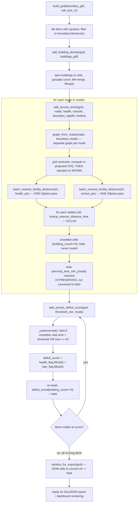

# scoring.py

!!! info "Source"
    `akure_access/accessibility/scoring.py` (400 lines — grew from 318
    with the addition of a configurable `target_crs`, the `source`
    parameter, and an explicit settlement-proxy disclaimer, see below)

## Purpose

Ties `network_graph.py` and `isochrones.py` together into the project's
actual output: a grid over the LGA, a building-density population proxy per
cell, nearest-facility travel times per cell per mode, and the composite
0–2 access-deficit score that everything else in the project (dashboard,
static maps, narrative captions) is ultimately built from.

This module is where the performance work in `isochrones.py` pays off
directly — `add_access_times()` is the function that actually invokes the
batch multi-source Dijkstra approach at LGA scale, and its own docstring
repeats the same "over an hour vs. roughly one Dijkstra run per mode per
service" performance framing found in `isochrones.py`, since this is the
function where that difference is actually felt.

## Dependencies

- **Imports:** `geopandas`, `numpy`, `shapely.geometry.box`; locally,
  `graph_from_roads` from `.network_graph`,
  `batch_nearest_facility_distances`/`lookup_nearest_distance_time` from
  `.isochrones`, and (new) `get_config` from
  [`..config`](../config.md).
- **Imported by:** `dashboard/app.py`; `insights.py` and
  `visualization/static_maps.py` consume this module's *output* (a scored
  grid), not the module directly; (new) [`sensitivity.py`](../sensitivity.md)
  calls both `add_access_deficit_score()` and `add_access_times()` directly
  as part of its parameter sweeps.

## Functions & Classes

### Module-level constants

| Constant | Value | Purpose |
|---|---|---|
| `DEFAULT_ACCESS_THRESHOLD_MIN` | `30` (now **config-derived**, see below) | Default travel-time threshold (minutes) beyond which a cell is considered underserved for a service. |
| `DEFAULT_GRID_CELL_SIZE_M` | `500` (now **config-derived**) | Default fishnet grid cell size, in meters. |
| `FALLBACK_CRS` (new) | `"EPSG:32631"` | Last-resort default for `build_grid()`'s new `target_crs` parameter, used only when no explicit CRS is supplied. See the dedicated section below — this is a genuine, if partial, resolution of the previous revision's hardcoded-CRS gotcha. |

**`DEFAULT_ACCESS_THRESHOLD_MIN`/`DEFAULT_GRID_CELL_SIZE_M` are now derived
from [`config.get_config()`](../config.md)**, read once at import time —
`_config["accessibility"]["threshold_min"]["walk"]` and
`_config["grid"]["cell_size_m"]` respectively — rather than independent
hardcoded literals. Both remain plain module-level constants (not
functions), specifically so every existing caller reading
`scoring.DEFAULT_ACCESS_THRESHOLD_MIN` directly, or relying on it as a
function's default-argument value (which Python binds at
function-*definition* time, not call time), continues to work unchanged.
The module's own comment is explicit that a caller specifically needing
the *live* config value (e.g. after a `reload=True`) should call
`get_config()` directly rather than reading these constants, which are
snapshotted once.

## New in this revision: `build_grid()` gains a `target_crs` parameter — a genuine, partial fix for the previous revision's hardcoded-CRS gotcha

This directly addresses the Gotcha this documentation page previously
flagged: *"`EPSG:32631` is hardcoded throughout this module, unlike
`lga_extractor.clean.py`'s auto-selected UTM zone... this module would
silently produce a wrong (or at best, non-optimal) projection if ever
reused for an LGA outside that zone."* This revision's fix is deliberate
and worth understanding precisely, since it's a **partial** fix, not a
full auto-selection mechanism like `clean.resolve_target_crs()`.

**What changed:** `build_grid(boundary_gdf, cell_size_m=..., target_crs=None)`
— a new, optional parameter. If supplied, the grid is built in exactly
that CRS. If omitted, `build_grid()` falls back to the new `FALLBACK_CRS`
constant (`"EPSG:32631"`) — functionally identical to the previous
revision's hardcoded behavior in the no-argument case, preserving backward
compatibility for any existing caller that doesn't pass this new
parameter.

**Why this is a *partial* fix, not the same auto-selection approach as
`clean.py`:** `scoring.py` does **not** independently re-derive the
correct UTM zone from the boundary's longitude the way
`clean.resolve_target_crs()` does. Instead, the module's own docstring
directs callers toward reading the *already-determined* CRS from the
extraction manifest:
```python
from akure_access.data_contract import resolve_crs_from_manifest
target_crs = resolve_crs_from_manifest(data_dir)
grid = build_grid(boundary, target_crs=target_crs)
```
This is a deliberate architectural choice, not a missed opportunity to
duplicate `resolve_target_crs()`'s logic here too: the CRS a grid should
use **must** match whatever CRS this LGA's roads/buildings/facility layers
were actually cleaned into upstream (see
[`clean.py`](../../../lga-osm-extractor/modules/clean.md)) — re-deriving
it independently on this side, even correctly, risks the two sides
disagreeing due to a subtly different boundary geometry or edge-case
handling between the two zone-selection implementations. Reading the
extractor's own recorded determination via
[`data_contract.py`](../data_contract.md) guarantees agreement by
construction, rather than by two independent calculations happening to
produce the same answer.

**The remaining Gotcha, now narrower:** a caller who doesn't know about
`resolve_crs_from_manifest()` and doesn't pass `target_crs` explicitly
still silently gets `FALLBACK_CRS` (Akure-correct, wrong elsewhere) — the
underlying risk hasn't been eliminated, only given an escape hatch. See
the updated Gotchas section below.

### `build_grid(boundary_gdf, cell_size_m=DEFAULT_GRID_CELL_SIZE_M, target_crs=None)`

| | |
|---|---|
| **What it does** | Builds a regular square fishnet grid covering the LGA boundary, clipped to the boundary's actual shape, in `target_crs` (or `FALLBACK_CRS` if not supplied). |
| **Why written this way** | Unchanged reasoning for the grid construction itself (regular square cells, `.intersects()`-based clipping) — see the CRS discussion above for what's new. |
| **Inputs** | `boundary_gdf: GeoDataFrame`; `cell_size_m: float`, default from config; `target_crs: str`, **new**, optional — see above. |
| **Outputs** | `GeoDataFrame`, in `target_crs` (or `FALLBACK_CRS`), one row per grid cell, with a `cell_id` column. |
| **Internal workflow** | 1. **New:** `if target_crs is None: target_crs = FALLBACK_CRS`.<br>2. Reproject `boundary_gdf` to `target_crs` (was hardcoded `"EPSG:32631"`, now the resolved value).<br>3–7. Unchanged: bounding-box grid construction, boundary-intersection clipping, `cell_id` assignment. |
| **Assumptions** | Unchanged cell-size and clipping-predicate assumptions. **New:** assumes a caller either knows to pass `target_crs` explicitly (ideally via `resolve_crs_from_manifest()`) or accepts `FALLBACK_CRS`'s Akure-only correctness as a known limitation. |
| **Complexity** | Unchanged. |
| **Concurrency / race conditions** | None. |
| **Covered by test(s)** | See [tests.md](../../tests.md) — `test_scoring.py`, plus new: `test_build_grid_uses_explicit_target_crs_when_given`, `test_build_grid_falls_back_to_fallback_crs_when_target_crs_omitted`. |

## New in this revision: `SETTLEMENT_PROXY_DISCLAIMER`

```python
SETTLEMENT_PROXY_DISCLAIMER = (
    "building_count is a BUILDING-BASED SETTLEMENT PROXY, not a population "
    "figure. It counts OSM building footprints intersecting each grid cell; "
    "it does not know how many people live or work in any of them..."
)
```

A long, explicit, module-level string constant — not used programmatically
anywhere else in this module (it's a documentation string, not a runtime
check), but exported specifically so any consumer (a notebook cell, a
future dashboard tooltip, this documentation site) can display or quote
the exact, carefully-worded caveat about what `building_count` is and
isn't, rather than each consumer writing its own paraphrase that could
drift in precision or completeness over time.

**The forward-looking design note embedded in the disclaimer is worth
surfacing explicitly:** the text states that this module is *"deliberately
structured so a real population dataset (e.g. gridded census/WorldPop
data) could be substituted for `building_count` as the settlement signal
in the future without changing any other function's interface — every
downstream function here only ever checks `building_count > 0` /
`>= threshold`, not its specific value."* This is a real architectural
property worth confirming holds: every consumer of `building_count`
throughout `scoring.py`, `grid_check.py`, and `status.py` does indeed only
ever branch on threshold comparisons against it, never on its specific
numeric value in a way that would assume "count of buildings" specifically
— meaning a hypothetical future swap to a population-based settlement
column really would be a drop-in replacement, not a scattered
multi-file refactor.

### `add_building_density(grid_gdf, buildings_gdf)`

Logic is **unchanged** from the previous revision — only the docstring
changed, now pointing readers at `SETTLEMENT_PROXY_DISCLAIMER` explicitly
rather than restating the population-proxy caveat inline.

| | |
|---|---|
| **What it does** | Adds a `building_count` column to each grid cell — the count of building footprints intersecting that cell — used throughout the rest of the pipeline as a settlement-presence proxy (see `SETTLEMENT_PROXY_DISCLAIMER` above), in the absence of fine-grained population data. |
| **Why written this way** | A spatial join (`gpd.sjoin`) followed by a `groupby().size()` count, rather than a per-cell loop calling `.intersects()` against every building — the vectorized spatial-join approach is dramatically faster for this kind of many-to-many spatial relationship at scale (thousands of buildings against hundreds of grid cells) than an explicit nested loop would be. |
| **Inputs** | `grid_gdf: GeoDataFrame` (output of `build_grid()`); `buildings_gdf: GeoDataFrame` (cleaned buildings layer, matching CRS). |
| **Outputs** | `grid_gdf` with an added integer `building_count` column (never `NaN` — cells with zero intersecting buildings get an explicit `0`, not a missing value). |
| **Internal workflow** | 1. Copy the input grid.<br>2. If `buildings_gdf` is empty: set `building_count = 0` for every cell, return immediately.<br>3. Otherwise: `gpd.sjoin(buildings_gdf, grid[["cell_id", "geometry"]], how="inner", predicate="intersects")` — a spatial inner join, attaching each building to every cell it intersects (a building could technically straddle a cell boundary and match more than one cell).<br>4. `.groupby("cell_id").size()` — count buildings per matched `cell_id`.<br>5. Left-merge those counts back onto the full grid, so cells with zero matching buildings aren't dropped.<br>6. `.fillna(0).astype(int)` — cells absent from the join result get `0`, cast to integer. |
| **Assumptions** | Assumes `"intersects"` (not `"within"`) is the correct predicate — a building that straddles two cells counts toward both, rather than being assigned to a single "primary" cell. This means the sum of `building_count` across all cells can slightly exceed the true total building count in the layer, for buildings that straddle a cell boundary. |
| **Complexity** | The spatial join is the dominant cost — near O((B + C) log(B + C)) in practice (B = buildings, C = cells) via GeoPandas' spatial-index-backed join, rather than naive O(B × C). |
| **Concurrency / race conditions** | None. |
| **Covered by test(s)** | See [tests.md](../../tests.md) — `test_add_building_density_counts_correctly`, `test_add_building_density_handles_empty_buildings`. |

### `add_access_times(grid_gdf, roads_gdf, health_gdf, schools_gdf, boundary_polygon_wgs84=None, modes=("walk",), source="auto")`

**This is where the multi-source Dijkstra optimization documented in
[`isochrones.py`](isochrones.md) pays off directly, unchanged from
before.** **New in this revision:** a `source` parameter, passed straight
through to [`network_graph.graph_from_roads()`](network_graph.md), plus a
correctness fix to the facility/centroid CRS-handling logic that this
parameter's introduction made necessary.

**New: the `source` parameter.** Identical semantics to
`graph_from_roads()`'s own `source` parameter (`"auto"` / `"roads_gdf"` /
`"live_osm"`) — `add_access_times()` doesn't add any new logic of its own
here, it simply threads the argument through: `graph_from_roads(roads_gdf,
boundary_polygon=boundary_polygon_wgs84, mode=mode, source=source)`.

**The real fix this revision makes: how the facility/centroid CRS branch
is decided.** Previously:
```python
if boundary_polygon_wgs84 is not None:
    # ...reproject facilities and grid centroids to EPSG:4326...
```
This condition made sense under the *previous* default behavior, where
supplying a boundary polygon meant the OSMnx (`live_osm`-equivalent) graph
path was being used, which returns a graph in EPSG:4326 — so facilities
and grid centroids needed reprojecting to match. **But under this
revision's new default** (`roads_gdf` preferred whenever available, even
when a boundary polygon is *also* supplied — see
[`network_graph.md`](network_graph.md)), checking `boundary_polygon_wgs84
is not None` alone would incorrectly trigger the WGS84-reprojection branch
even when the graph was actually built from `roads_gdf` and stayed in its
native projected CRS (typically EPSG:32631) — a real, silent
coordinate-system mismatch bug that this revision's diff directly fixes.

**The fix:** check the graph's own recorded provenance instead of the
input argument:
```python
if G.graph.get("source") == "live_osm":
    # ...reproject facilities and grid centroids to EPSG:4326...
else:
    # ...use facilities and grid centroids as-is, in their native projected CRS...
```
This reads `G.graph["source"]` — the attribute `graph_from_roads()` now
always sets, recording which path was **actually used**, not what the
caller merely requested (see [`network_graph.md`](network_graph.md)'s
documentation of this exact field) — so the CRS-handling branch is now
always correct regardless of *why* `roads_gdf` or `live_osm` was chosen
(explicit `source` argument, or `"auto"`'s data-driven fallback).
[`isochrones.py`](isochrones.md) is actually put to work at LGA scale.**

| | |
|---|---|
| **What it does** | For every populated grid cell (`building_count > 0`), computes nearest-facility distance and travel time to both health facilities and schools, for every requested transport mode. |
| **Why written this way** | Three deliberate design choices stand out. **(1) Only settled cells are routed.** Cells with `building_count == 0` are left as `NaN` rather than routed — since these are presumed unsettled/empty land, routing them would be wasted computation with no meaningful interpretation (there's no one there to have an access time). This is also the mechanism that keeps runtime bounded even for a large grid: routing cost scales with settled-cell count, not total grid-cell count. **(2) One graph is built per mode, not one graph reused across modes.** `"walk"` uses OSM's walk network; `"okada"`/`"drive"` both use OSM's drive network (see `network_graph.MODE_CONFIG`) — these are genuinely different road-network subsets (a walk network includes pedestrian paths a drive network excludes, for instance), so a single shared graph across modes would be structurally wrong, not just differently-weighted. **(3) The batch Dijkstra approach is applied per `(mode, service)` combination, not per cell.** `batch_nearest_facility_distances()` is called exactly twice per mode (once for health, once for schools) regardless of how many settled cells exist — the function's own docstring states this directly: "the previous per-cell approach could take over an hour for a full LGA across all three modes; this approach reduces the routing cost to roughly one Dijkstra run per mode per service, regardless of how many grid cells there are." |
| **Inputs** | `grid_gdf: GeoDataFrame` (output of `add_building_density()`, EPSG:32631); `roads_gdf: GeoDataFrame` (cleaned roads, EPSG:32631, used only as a fallback if `boundary_polygon_wgs84` isn't given — see `network_graph.graph_from_roads()`'s two construction paths); `health_gdf`, `schools_gdf: GeoDataFrame` (cleaned facility point layers, EPSG:32631); `boundary_polygon_wgs84`, optional (LGA boundary in EPSG:4326, passed through to `graph_from_roads()` for the recommended OSMnx-based path); `modes: tuple`, default `("walk",)` (any subset of `{"walk", "okada", "drive"}`). |
| **Outputs** | `grid_gdf` with added columns per mode/service: `health_time_min_{mode}`, `health_distance_km_{mode}`, `education_time_min_{mode}`, `education_distance_km_{mode}`. When `modes == ("walk",)` specifically, plain unsuffixed `health_time_min`/`education_time_min` columns are *also* populated, mirroring the suffixed walk columns — a backward-compatibility measure for any code written before mode-suffixed columns existed. |
| **Internal workflow** | 1. Copy the grid.<br>2. For each requested mode: build a mode-specific graph via `graph_from_roads()`.<br>3. **Facility point CRS handling** — if `boundary_polygon_wgs84` was given (the recommended path): reproject `health_gdf`/`schools_gdf` to EPSG:4326 (to match the OSMnx-built graph, which is natively in WGS84 in that construction path); compute grid-cell centroids **in the grid's own projected CRS first** (EPSG:32631, meters), *then* reproject those resulting points to EPSG:4326 — deliberately not the reverse order (see Gotchas below for why this ordering matters). If no boundary polygon was given (fallback path, graph built directly from `roads_gdf`, which stays in EPSG:32631): facility points and grid centroids are used as-is, no reprojection needed, since everything is already in the same projected CRS.<br>4. Call `batch_nearest_facility_distances(G, health_pts)` and again for `school_pts` — two Dijkstra passes total for this mode, regardless of grid size.<br>5. Loop over every grid cell's centroid and `building_count` together (`zip()`): if `building_count == 0`, append `NaN` to all four output lists for this cell and `continue` — no routing attempted; otherwise call `lookup_nearest_distance_time()` twice (health, education) — each an O(1) dictionary lookup plus one KD-tree snap, not a fresh graph search.<br>6. Assign the four collected lists as new mode-suffixed columns on `grid`.<br>7. If `modes == ("walk",)` was the only mode requested, also populate the unsuffixed legacy column names from this mode's results. |
| **Assumptions** | Assumes `roads_gdf`/`health_gdf`/`schools_gdf` are all already in EPSG:32631 (the project's fixed CRS — see Gotchas) — no CRS validation is performed on these inputs beyond the explicit, deliberate reprojections described above. |
| **Complexity** | O(M × (graph_build_cost + 2 × Dijkstra_cost + settled_cells × O(log n))) where M = number of requested modes — dominated by graph construction and the two Dijkstra passes per mode, **not** by grid size beyond the settled-cell lookup loop, which is the entire point of the batch approach. |
| **Concurrency / race conditions** | None — sequential loop over modes, no threading. |
| **Covered by test(s)** | No dedicated fast unit test in `test_scoring.py` (its neighboring tests construct grid data with routing results already present, rather than calling this function directly, to keep unit tests independent of graph-building cost). Its actual integration with `network_graph.py` and `isochrones.py` is exercised end to end by `test_extractor_output_schema_matches_dashboard_expectations` in the [cross-repo integration test](../../../cross-repo/integration.md). **New:** `test_add_access_times_source_passthrough_uses_roads_gdf_when_available`, `test_add_access_times_crs_branch_follows_graph_source_not_boundary_argument` — the second of these directly regression-tests the `G.graph.get("source")` fix described above. |

**On why `inf` is deliberately kept, not converted to `NaN`, at this
stage** — this is directly stated in the source as an inline comment, and
is important enough to reproduce here explicitly: `add_access_deficit_score()`
(below) relies on detecting `inf` specifically to correctly treat
unreachable facilities as underserved. Converting `inf` to `NaN` at this
point would cause `NaN`'s "unknown, treat as adequately served"
`fillna(0)` handling in the scoring function to **silently misclassify
genuinely unreachable cells as served** — the opposite of the intended
meaning. `inf` is only ever sanitized to `NaN` by `sanitize_for_export()`,
and that function must be called **after** `add_access_deficit_score()`,
never before — see that function's own documentation below for the full
reasoning, and the Gotchas section for why this ordering constraint is
easy to violate accidentally.

### `add_access_deficit_score(grid_gdf, threshold_min=DEFAULT_ACCESS_THRESHOLD_MIN, mode="walk")`

| | |
|---|---|
| **What it does** | Derives the composite 0–2 access-deficit score per cell for one mode: `0` = adequately served for both health and education, `1` = underserved for one service, `2` = underserved for both. Unsettled cells stay unscored (`NaN`). |
| **Why written this way** | The threshold-based binary underserved/served classification per service, summed into a single 0–2 composite, is a simple, interpretable scoring model — deliberately simple enough that "2" unambiguously means "worst off on both dimensions measured," rather than a weighted or continuous score whose meaning would require more explanation to communicate to a non-technical audience (planners, the project's stated intended users). The docstring is explicit that `threshold_min`'s appropriate value differs meaningfully by mode — 30 minutes of walking covers far less ground than 30 minutes of okada or driving — and directs callers to consider passing a mode-appropriate threshold rather than reusing the walking default unchanged; the function itself does **not** auto-adjust the threshold per mode, that responsibility is left to the caller. |
| **Inputs** | `grid_gdf: GeoDataFrame` (output of `add_access_times()`); `threshold_min: float`, default `30`; `mode: str`, default `"walk"` (selects which mode's time columns to score). |
| **Outputs** | `grid_gdf` with added `{mode}_health_underserved`, `{mode}_education_underserved`, `{mode}_access_deficit_score` columns; when `mode == "walk"`, these are *also* mirrored to unsuffixed legacy column names (`health_underserved`, `education_underserved`, `access_deficit_score`). |
| **Internal workflow** | 1. Copy the grid.<br>2. Resolve which time columns to read: prefer the mode-suffixed column (`health_time_min_{mode}`) if present, else fall back to the unsuffixed legacy name — this makes the function tolerant of being called against a grid produced by either the single-mode or multi-mode code path in `add_access_times()`.<br>3. Define `_underserved(time_val)` inline: returns `NaN` if the input is itself `NaN` (via the module-level `pd_isna()` helper — see below); otherwise returns `1` if `time_val > threshold_min` **or** `time_val == float("inf")` (explicit `inf` check, not relying on `inf > threshold_min` evaluating true, though it would — the explicit check makes the intent unambiguous to a reader), else `0`.<br>4. Apply `_underserved()` element-wise to both the health and education time columns.<br>5. Sum the two flags into `deficit_score`, using `.fillna(0)` on each flag *before* summing — meaning a cell with one `NaN` flag and one real flag is NOT treated as `NaN` overall, it's treated as if the `NaN` flag contributed `0` to the sum (see Gotchas for why this matters).<br>6. **Overwrite** `deficit_score` to `NaN` wherever `building_count == 0` — this is the actual mechanism that keeps unsettled cells unscored; the `fillna(0)` in step 5 would otherwise have scored them as `0` (falsely "adequately served") rather than correctly leaving them out of the analysis entirely.<br>7. Assign the three new mode-suffixed columns; mirror to unsuffixed names if `mode == "walk"`. |
| **Assumptions** | Assumes a cell being unreachable (`inf` travel time) should be scored identically to a cell that's merely slow-but-reachable-past-the-threshold — both count as "underserved," with no distinction in the deficit score itself between "45 minutes away" and "genuinely unreachable by this mode." That distinction is preserved in the underlying time columns (still `inf` vs. a large finite number) even though the deficit score collapses them together. |
| **Complexity** | O(C) where C = grid cell count — two element-wise `.apply()` calls plus a constant number of vectorized operations. |
| **Concurrency / race conditions** | None. |
| **Covered by test(s)** | See [tests.md](../../tests.md) — `test_access_deficit_score_composite_logic`, `test_access_deficit_score_mode_suffix_columns`, `test_access_deficit_score_treats_inf_as_underserved`, `test_sanitize_for_export_does_not_break_deficit_scoring`, `test_sanitize_for_export_called_before_scoring_gives_wrong_result`. |

**On the settled/unsettled overwrite ordering (step 5 → step 6) — this is a
real, subtle correctness dependency worth being explicit about.** The
`fillna(0)` in step 5 happens *before* the `building_count == 0` overwrite
in step 6 specifically because doing it in the other order would produce a
wrong result: if the `NaN`-masking-for-unsettled-cells happened first and
`fillna(0)` ran afterward, the `fillna(0)` call would overwrite the
just-applied `NaN`s for unsettled cells right back to `0` — silently
re-classifying every unsettled cell as "adequately served" rather than
correctly leaving it out of the analysis. The current order —
`fillna` first (to handle individual-flag `NaN`s from cells with a `NaN`
service-time reading, distinct from unsettled cells), *then* the
unsettled-cell overwrite — is the only ordering that produces the correct
result for both cases simultaneously.

### `pd_isna(val)`

| | |
|---|---|
| **What it does** | A minimal standalone `NaN`-check: returns `True` if `val` is `NaN`, without importing `pandas` just for this one utility. |
| **Why written this way** | Exploits the IEEE 754 floating-point property that `NaN != NaN` evaluates `True` — so `val != val` is `True` exactly when `val` is `NaN`. This avoids a `pandas` import purely for `pd.isna()`, in a module that otherwise only needs `geopandas`/`numpy`. The name deliberately mirrors `pandas.isna()`'s name/behavior for readability at call sites, despite not actually being pandas. |
| **Inputs** | `val` (any type). |
| **Outputs** | `bool`. |
| **Internal workflow** | Wrapped in `try/except Exception: return val is None` — the `!=` comparison could theoretically raise for an exotic type that overrides `__ne__` in a way that errors rather than returns a bool; the fallback treats an outright `None` as "is NA" too, covering the case where `!=` isn't even the right question to ask (e.g. `val` genuinely is Python's `None`, not a float `NaN`, both of which are things `add_access_deficit_score()` might plausibly encounter in a `.apply()` call over a column). |
| **Complexity** | O(1). |
| **Concurrency / race conditions** | None. |
| **Covered by test(s)** | No dedicated test — this is a tiny private helper exercised only implicitly, wherever `add_access_deficit_score()`'s own tests happen to pass a `NaN` value through it. |

### `sanitize_for_export(grid_gdf)`

| | |
|---|---|
| **What it does** | Replaces every `inf`/`-inf` value with `NaN`, across all numeric columns, in preparation for GeoJSON export. |
| **Why written this way — and why call order relative to scoring is a hard requirement, not a suggestion.** | The docstring states this explicitly and forcefully: this function **must only be called after** `add_access_deficit_score()` has already run for every mode of interest. The reasoning is the mirror image of the note under `add_access_times()` above: while scoring is happening, `inf` is the correct, meaningful representation of "facility genuinely unreachable" — `add_access_deficit_score()` specifically checks for `inf` to correctly classify such cells as underserved. Calling `sanitize_for_export()` beforehand would convert those meaningful `inf`s to `NaN` *before* the scoring function ever sees them, silently triggering `NaN`'s "unknown, treat as adequately served" `fillna(0)` handling instead — misclassifying genuinely unreachable cells as adequately served, the same failure mode flagged in `add_access_times()`'s own inline comment. Once scoring is actually complete and `inf`'s job is finished, `inf` becomes purely a liability going forward: it isn't valid JSON, and GeoJSON writers either raise an error on it or silently null it out with a warning of their own — this function makes that final conversion explicit and intentional, at the one point in the pipeline (right before export) where it's actually safe. |
| **Inputs** | `grid_gdf: GeoDataFrame` — expected to already be **fully scored** (both `add_access_times()` and `add_access_deficit_score()` already run for every mode being exported). |
| **Outputs** | A copy of `grid_gdf` with `inf`/`-inf` replaced by `NaN` in every numeric column; geometry and non-numeric columns are left untouched. |
| **Internal workflow** | 1. Copy the input.<br>2. Select numeric columns via `.select_dtypes(include=["number"])`.<br>3. `.replace([np.inf, -np.inf], np.nan)` on just those columns.<br>4. Return the copy. |
| **Assumptions** | Assumes the caller has correctly sequenced the pipeline (scoring fully complete before this is called) — this function performs no check or assertion verifying that precondition; calling it too early produces a silently wrong result (misclassified cells), not an error. |
| **Complexity** | O(C × K) where C = grid cell count, K = number of numeric columns — a full-column scan/replace. |
| **Concurrency / race conditions** | None. |
| **Covered by test(s)** | See [tests.md](../../tests.md) — given the strict ordering requirement, a test explicitly verifying the "called too early" failure mode (or at minimum, verifying correct behavior when called at the right time) is valuable regression coverage here. |

## Internal Workflow



## Gotchas

- **The centroid-then-reproject ordering in `add_access_times()` mirrors a
  principle also documented in
  `lga_extractor.clean._collapse_areas_to_points()`**: compute centroids in
  a projected/metric CRS, only reproject afterward if a geographic CRS is
  needed downstream — never the reverse. The inline comment notes an
  additional, practical benefit beyond correctness: doing it this way also
  silences GeoPandas' own "Geometry is in a geographic CRS" runtime
  warning, which exists specifically to flag exactly this class of mistake
  (computing centroids/areas/distances directly in lat/lon degrees).

- **The `inf`-preservation-until-export ordering constraint is the single
  most important cross-function dependency in this module, and nothing in
  the code enforces it mechanically.** The correct call order is:
  `build_grid()` → `add_building_density()` → `add_access_times()` →
  `add_access_deficit_score()` (once per mode of interest) →
  `sanitize_for_export()` (last, only once, after all scoring is done). No
  runtime check exists anywhere in this module that would catch a caller
  invoking `sanitize_for_export()` too early, or forgetting to call
  `add_access_deficit_score()` for a mode before exporting that mode's
  data — both would fail *silently*, producing plausible-looking but
  incorrect output (unreachable cells misclassified as served), not an
  error or warning at the point of the actual mistake.
- **`EPSG:32631` is no longer unconditionally hardcoded, but the risk it
  created is only narrowed, not eliminated.** `build_grid()` now accepts
  `target_crs` explicitly, and the module's own docstring directs callers
  toward [`data_contract.resolve_crs_from_manifest()`](../data_contract.md)
  to obtain the extractor's own correct, LGA-specific determination rather
  than assuming Akure's zone. **But this requires the caller to know to do
  it** — a caller who calls `build_grid(boundary)` without `target_crs`
  still silently gets `FALLBACK_CRS` (`"EPSG:32631"`), correct for Akure,
  silently wrong for any LGA in a different UTM zone. Unlike
  `lga_extractor.clean.resolve_target_crs()`, this module still does not
  *automatically* derive the correct zone from the boundary's own
  longitude — it relies on the caller supplying it, sourced from the
  extractor's manifest. This is a real, if smaller, remaining gap between
  the two repositories' geographic-generality: `lga_extractor` gets the
  right answer with no caller effort required; `scoring.py` gets the right
  answer only if the caller specifically opts in via `target_crs`.
- **New: the facility/centroid CRS-handling branch was silently
  miswired by the `source`-parameter reversal until this revision's fix —
  worth understanding even though it's now fixed.** Before this revision,
  `add_access_times()` decided whether to reproject facilities/centroids
  to WGS84 based on `if boundary_polygon_wgs84 is not None:` — a
  reasonable proxy under the *old* default (boundary given → OSMnx path →
  WGS84 graph). Under the *new* default (`roads_gdf` preferred whenever
  available, even alongside a supplied boundary), that same condition
  would have incorrectly triggered WGS84 reprojection for a graph that was
  actually built in a projected CRS — a latent coordinate-mismatch bug
  that never shipped, since this revision's diff fixes the condition
  (`G.graph.get("source") == "live_osm"`) in the same change that
  introduced the `source` parameter. Included here as a reminder that
  **any future revision reworking how a graph's CRS/provenance is
  determined must re-check every place downstream code branches on the
  *old* signal (here, `boundary_polygon_wgs84 is not None`) rather than
  the graph's own recorded state** — this is exactly the kind of bug that
  a partial refactor can reintroduce silently.

## Related

- [`network_graph.py`](network_graph.md) — supplies `graph_from_roads()`
  and the `G.graph["source"]` attribute this module's CRS-branching logic
  now depends on.
- [`config.py`](../config.md) — the source of this module's default
  threshold and grid-size values.
- [`data_contract.py`](../data_contract.md) — the intended source of a
  correct `target_crs` value for `build_grid()`, in place of the Akure-only
  `FALLBACK_CRS`.
- [`sensitivity.py`](../sensitivity.md) — calls `add_access_deficit_score()`
  and `add_access_times()` directly for its parameter sweeps.
