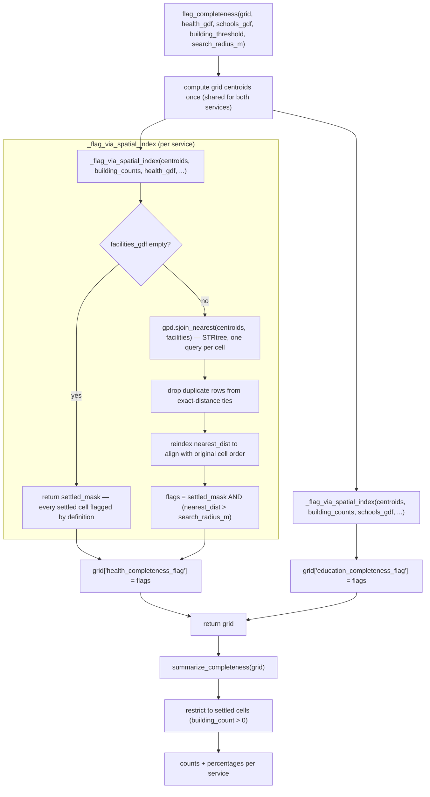

# grid_check.py

!!! info "Source"
    `akure_access/completeness/grid_check.py` (155 lines — grew slightly
    with the migration to config-derived constants, see below)

## Purpose

Implements the project's independent OSM-completeness pathway: flagging
grid cells that show visible settlement (via building density) but have no
nearby OSM-tagged health facility or school — a signal that the area may be
**under-mapped in OSM**, rather than genuinely lacking that service. This is
the concrete code behind the problem statement in the
[repository overview](../../overview.md): an "unreachable" cell in the
accessibility scoring could mean a real service gap, or it could mean OSM
simply hasn't caught up to a facility that actually exists — this module is
what lets the project distinguish the two rather than presenting one number
as if it settles the question.

Deliberately lightweight by design: the module's own docstring is explicit
that this intentionally avoids a full land-cover classification pipeline
(no satellite imagery classification required) specifically to keep the
check fast to build — building density, already available from
`lga_extractor`'s extracted buildings layer, is used as the settlement-
presence signal instead of a heavier remote-sensing approach.

## Dependencies

- **Imports:** `geopandas`, `pandas`.
- **Imported by:** `dashboard/app.py`; consumed alongside (not merged with)
  `accessibility.scoring`'s output by `insights.py` and
  `visualization/static_maps.py`.
- **Notably independent of:** `accessibility.network_graph` and
  `accessibility.isochrones` — this module does no network routing at all,
  consistent with it being a data-quality check rather than an
  accessibility measure (see [overview](../../overview.md)'s "Dependencies
  Between Components" section).

## Functions & Classes

### Module-level constants

| Constant | Value | Purpose |
|---|---|---|
| `DEFAULT_BUILDING_PRESENCE_THRESHOLD` | `3` (now **config-derived**, see below) | Minimum building count for a cell to be considered "settled" for completeness-checking purposes. |
| `DEFAULT_FACILITY_SEARCH_RADIUS_M` | `1000` (now **config-derived**) | Radius (meters) to search for a nearby facility before flagging a settled cell as potentially under-mapped. |

**Both are now derived from [`config.get_config()`](../config.md)**
(`_config["completeness"]["building_presence_threshold"]` and
`_config["completeness"]["facility_search_radius_m"]`), read once at
import time into plain module-level constants — the same migration
pattern applied identically across `scoring.py`, `network_graph.py`, and
this module (see [`config.md`](../config.md) for the full story and its
import-time-snapshot caveat). The numeric values themselves are
unchanged.

**The settlement-threshold discrepancy this page previously flagged as an
unexplained inconsistency is now explicitly justified in the source
itself.** `DEFAULT_BUILDING_PRESENCE_THRESHOLD` (3 buildings) remains a
*different*, **stricter** settlement threshold than
`accessibility.scoring.add_access_times()` uses (`building_count > 0`,
i.e. effectively a threshold of 1) — the two modules still define
"settled" independently for their own purposes. What's new: `config/
default.yaml`'s own inline comment now states directly *why* this
difference is intentional, not accidental — a completeness *flag* is a
stronger claim ("this looks like a possible OSM data gap") than a mere
scoring-inclusion decision, and warrants more confidence that a cell is
genuinely settled before making that claim. See
[`config.md`](../config.md) for the full quote and context. See Gotchas
below for what this means in practice.

### `flag_completeness(grid_gdf, health_gdf, schools_gdf, building_threshold=DEFAULT_BUILDING_PRESENCE_THRESHOLD, search_radius_m=DEFAULT_FACILITY_SEARCH_RADIUS_M)`

| | |
|---|---|
| **What it does** | Flags each grid cell as potentially under-mapped for health and, separately, for education: a cell is flagged for a given service if it's visibly settled (`building_count >= building_threshold`) **and** no facility of that type exists within `search_radius_m` of the cell's centroid. |
| **Why written this way** | The two-condition definition (settled AND no nearby facility) is precisely what distinguishes "genuinely underserved" from "possibly a data gap," per the module's own docstring: a cell that's settled with no facility nearby, in an area where OSM completeness otherwise looks fine, points toward a real service gap; the same pattern repeating suspiciously across many cells points toward an OSM data gap instead. The function itself doesn't try to distinguish these two interpretations automatically — it produces the flag, and interpretation (does this look like isolated genuine gaps or a systematic mapping gap) is left to whoever's reading the output (the dashboard, `insights.py`'s narrative generation, or a human analyst). |
| **Inputs** | `grid_gdf: GeoDataFrame` (must have a `building_count` column, as produced by `scoring.add_building_density()`, EPSG:32631); `health_gdf`, `schools_gdf: GeoDataFrame` (cleaned facility point layers, EPSG:32631); `building_threshold: int`, default `3`; `search_radius_m: float`, default `1000`. |
| **Outputs** | `grid_gdf` with two added boolean columns: `health_completeness_flag`, `education_completeness_flag` (`True` = settled but no nearby OSM facility of that type — a likely OSM data gap rather than confirmed non-access). |
| **Internal workflow** | 1. Copy the grid. 2. Compute cell centroids once, as a separate `GeoDataFrame` (`centroids_gdf`), shared by both the health and education checks below — avoids recomputing centroids twice. 3. Call `_flag_via_spatial_index()` once for health, once for education, each producing the corresponding flag column. |
| **Assumptions** | Assumes `grid_gdf` already has a `building_count` column — no validation or informative error if it's missing; would raise a plain `KeyError` from inside `_flag_via_spatial_index()` rather than a clear message pointing at the actual problem. |
| **Complexity** | Dominated by `_flag_via_spatial_index()`'s complexity, called twice. |
| **Concurrency / race conditions** | None. |
| **Covered by test(s)** | See [tests.md](../../tests.md) — `test_completeness.py`. |

### `_flag_via_spatial_index(centroids_gdf, building_counts, facilities_gdf, building_threshold, search_radius_m)`

| | |
|---|---|
| **What it does** | The actual per-facility-type flagging logic: vectorized, using `geopandas.sjoin_nearest()` rather than a per-cell distance loop. |
| **Why written this way — the specific performance reasoning, in the module's own words.** | The docstring explains precisely why `sjoin_nearest()` was chosen: it builds a spatial index (an STRtree) over the facility points once, then finds each cell centroid's nearest match via a single indexed query — O(n log m) for n cells and m facilities, rather than the O(n × m) cost of comparing every cell centroid against every facility with a plain linear distance scan. The module is refreshingly honest about the practical significance of this choice at the project's actual scale: "at this project's actual scale (a few thousand grid cells, a few dozen facilities per LGA) the difference is not the dominant runtime cost, unlike the network routing in `accessibility/isochrones.py`, which was the real bottleneck" — but the indexed approach is used anyway because it scales correctly if this were ever applied to a much larger area or denser facility dataset, at essentially no extra implementation cost over the naive approach. This is worth noting as a contrast with `isochrones.py`'s optimization, which *was* the dominant real-world bottleneck (over an hour of runtime) — here, the same category of optimization (avoid O(n×m)) is applied proactively/defensively rather than because it was empirically necessary. |
| **Inputs** | `centroids_gdf: GeoDataFrame` (grid cell centroids); `building_counts: pd.Series` (aligned with `centroids_gdf`'s row order); `facilities_gdf: GeoDataFrame` (one facility type's point layer); `building_threshold: int`; `search_radius_m: float`. |
| **Outputs** | `list[bool]`, one flag per cell, in the same row order as `centroids_gdf`. |
| **Internal workflow** | 1. Reset `building_counts`' index (defensive — ensures positional alignment regardless of what index the caller's `Series` happened to have) and compute `settled_mask = building_counts >= building_threshold`. 2. **Short-circuit for the no-facilities-at-all case**: if `facilities_gdf` is empty, return `settled_mask.tolist()` directly — every settled cell is, by definition, unmapped for this service if literally zero facilities of that type exist anywhere in the LGA's OSM data. No spatial join is even attempted in this case. 3. Otherwise, call `gpd.sjoin_nearest(centroids_gdf, facilities_gdf[["geometry"]], distance_col="_nearest_dist", how="left")` — a left join, so every cell centroid gets a row in the result even if (hypothetically) no match were found, with the distance to its nearest facility recorded in `_nearest_dist`. Both inputs' indices are reset first to guarantee clean positional alignment in the join result. 4. **Handle exact-tie duplicates**: `sjoin_nearest()` can produce multiple result rows for the same input cell if more than one facility is at the exact same nearest distance — deduplicate via `~joined.index.duplicated(keep="first")`, since only the distance value itself is needed, not which specific tied facility matched. 5. Reindex `nearest_dist` against `range(len(centroids_gdf))` — restores strict positional alignment with the original cell order, guarding against any subtle reordering the join/dedup steps might have introduced. 6. Compute the final flag: `settled_mask & (nearest_dist > search_radius_m)` — a cell is flagged only if both conditions hold. |
| **Assumptions** | Assumes `centroids_gdf` and `building_counts` are already aligned by position (same row order) on input — the function does not verify this itself beyond resetting each one's own index independently; if a caller passed misaligned inputs (same length, different underlying order), this would silently produce wrong flags rather than raising. |
| **Complexity** | O(n log m) for the spatial join (n = cells, m = facilities) via the STRtree-backed `sjoin_nearest()`, as documented; O(n) for the deduplication and reindexing steps. |
| **Concurrency / race conditions** | None. |
| **Covered by test(s)** | See [tests.md](../../tests.md) — the empty-facilities short-circuit and the exact-tie deduplication are both specific enough edge cases to be worth direct test coverage. |

### `summarize_completeness(grid_gdf)`

| | |
|---|---|
| **What it does** | Produces a simple summary dict of completeness-flag counts and percentages, scoped to settled cells only, for reporting/dashboard display. |
| **Why written this way** | Percentages are computed as a share of *settled* cells (`building_count > 0`), not all grid cells — an unsettled cell is neither flagged nor unflagged in any meaningful sense (there's nothing there to be under-mapped), so including it in the denominator would understate the real proportion of affected settled areas. |
| **Inputs** | `grid_gdf: GeoDataFrame` — expected to already have `health_completeness_flag`/`education_completeness_flag` columns (from `flag_completeness()`) and `building_count`. |
| **Outputs** | `dict`. If there are no settled cells at all: `{"settled_cells": 0, "health_flagged": 0, "education_flagged": 0}` (a deliberately minimal shape, no percentage keys — see Gotchas). Otherwise: `{"settled_cells": int, "health_flagged": int, "health_flagged_pct": float, "education_flagged": int, "education_flagged_pct": float}`, percentages rounded to 1 decimal place. |
| **Internal workflow** | 1. Filter to settled cells (`building_count > 0`). 2. If zero settled cells, return the minimal no-percentage dict immediately. 3. Otherwise: `n_settled = len(settled)`; for each service, sum the boolean flag column (`True` sums as `1`) cast to `int` for the count, and compute `100 * flag.mean()` rounded to 1 decimal for the percentage (`.mean()` on a boolean column is equivalent to the proportion `True`, a concise idiom for "percentage flagged"). |
| **Assumptions** | Assumes the flag columns are already present — no validation, would raise `KeyError` if `flag_completeness()` wasn't called first. |
| **Complexity** | O(C) where C = grid cell count — a filter plus a small constant number of aggregate operations. |
| **Concurrency / race conditions** | None. |
| **Covered by test(s)** | See [tests.md](../../tests.md) — `test_summarize_completeness_reports_correct_percentages`, `test_summarize_completeness_handles_no_settled_cells`. |

## Internal Workflow

## Gotchas

- **`grid_check.py`'s settlement threshold (3 buildings) is different from
  `scoring.add_access_times()`'s (any building at all, `> 0`) — this is
  now explicitly confirmed as intentional, not just inferred.** A cell
  with exactly 1 or 2 buildings is "settled" for accessibility-scoring
  purposes (it gets routed and scored) but **not** "settled" for
  completeness-flagging purposes (it's excluded from the completeness
  check entirely, treated the same as truly empty land). Previously, this
  page could only note this was "very likely intentional" based on
  reasoning about what would make sense; `config/default.yaml`'s own
  inline comment (see [`config.md`](../config.md)) now states the
  justification directly in the source itself — a completeness flag is a
  stronger claim than a routing-inclusion decision, and warrants more
  confidence in the settlement signal. Still worth being explicit about
  here, since reading only one module's threshold in isolation would give
  a misleading picture of which cells get analyzed by which pathway — but
  this is no longer an unexplained discrepancy, just a documented design
  choice.
- **`summarize_completeness()`'s zero-settled-cells return shape omits the
  percentage keys entirely**, rather than including them as `0.0` or `NaN`.
  Any caller (e.g. `insights.py` or `dashboard/app.py`) reading this dict's
  output needs to handle both possible shapes — code that assumes
  `health_flagged_pct` is always present would raise `KeyError` on an LGA
  (or a filtered subset) with literally zero settled cells.
- **The empty-facilities short-circuit in `_flag_via_spatial_index()` means
  a completeness flag can be `True` for a reason entirely outside the
  search-radius logic.** If `health_gdf` is empty (zero health facilities
  extracted anywhere in the LGA), every settled cell is flagged as a health
  completeness gap regardless of `search_radius_m` — this is a distinct
  code path from the normal spatial-join case, and worth remembering when
  interpreting a completeness summary that shows 100% of settled cells
  flagged for a service: it could mean genuinely zero coverage found
  everywhere, not just "everywhere happens to be more than `search_radius_m`
  from something."
