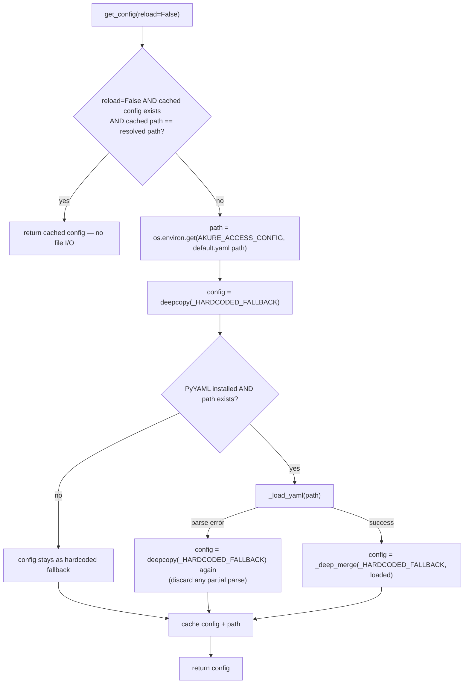

# `akure_access/config.py`

!!! info "Source"
    `akure_access/config.py` (146 lines) + `akure_access/config/default.yaml`
    (new files, entirely new module)

## Purpose

The single source of truth for every tunable numeric assumption in the
project: grid cell size, per-mode travel speeds, per-mode access-time
thresholds, and completeness-check parameters. Every one of these was
previously a hardcoded constant, defined independently in whichever module
happened to use it first.

## Why this exists — closing a gap this documentation itself flagged

This is worth stating plainly: before this module existed, `insights.py`
kept its own **separate copy** of per-mode access thresholds
(`DEFAULT_THRESHOLDS_MIN`), manually kept in sync with the analysis
notebook's configuration cell by convention — not by any code that would
actually catch the two drifting apart. The [Known Issues](../../reference/known-issues.md)
page on this site documented this exact risk in detail, and `insights.py`'s
own source comment (visible in that file's diff, see [`insights.md`](insights.md))
now explicitly references it as the reason this fix exists: *"this constant
used to be a manually-synced copy... see docs/reference/known-issues.md for
the drift risk this created."* Whether that comment was written in direct
response to this documentation site or arrived at independently, the effect
is the same — the specific risk this site called out is now structurally
impossible to reintroduce, because there's no longer a second copy of the
number to drift out of sync in the first place.

Beyond `insights.py`'s thresholds specifically, the same manual-duplication
pattern existed in four other places: `scoring.py`'s
`DEFAULT_ACCESS_THRESHOLD_MIN`/`DEFAULT_GRID_CELL_SIZE_M`,
`network_graph.py`'s `MODE_CONFIG` speeds, and `grid_check.py`'s
`DEFAULT_BUILDING_PRESENCE_THRESHOLD`/`DEFAULT_FACILITY_SEARCH_RADIUS_M` —
all now derived from this one module instead.

## `config/default.yaml`

```yaml
grid:
  cell_size_m: 500

accessibility:
  threshold_min:
    walk: 30
    okada: 20
    drive: 15
  modes:
    walk:  { network_type: walk,  speed_kph: 5.0 }
    okada: { network_type: drive, speed_kph: 25.0 }
    drive: { network_type: drive, speed_kph: 35.0 }

completeness:
  building_presence_threshold: 3
  facility_search_radius_m: 1000
```

**Every value here is unchanged from what each module's own hardcoded
constant used to be** — this is a deliberate, load-bearing property of the
migration, not a coincidence. Centralizing these numbers was explicitly
*not* the occasion to also silently change any of them; doing both at once
would make it impossible to tell, from a behavior change alone, whether it
came from the refactor or from an intentional new assumption.

**One value's discrepancy is now explained, not just present.** The YAML
file's own inline comment (visible when reading `default.yaml` directly)
notes that `completeness.building_presence_threshold` (3) is deliberately
*stricter* than the implicit "any building counts as settled" threshold
used elsewhere for routing/scoring purposes (`building_count > 0` in
`scoring.add_access_times()`) — because a completeness *flag* is a stronger
claim ("this looks like a possible OSM data gap") than a scoring inclusion
decision, and warrants more confidence that the cell is genuinely settled
before making that claim. This was previously an unexplained inconsistency
this documentation site's [Glossary](../../reference/glossary.md) entry on
"Settled cell" flagged as worth understanding — it's now explicitly
justified in the source itself, not just observed as a discrepancy from
outside.

## Functions

### `_load_yaml(path)` (private)

A one-line wrapper around `yaml.safe_load()` — exists mainly so
`get_config()`'s error handling has one specific call to wrap in a
`try/except`, rather than inlining the file open and parse.

### `_deep_merge(base, override)` (private)

**What it does:** recursively merges `override` onto a deep copy of `base`
— for any key whose value is a dict in *both* inputs, merges recursively;
otherwise, `override`'s value wins outright.

**Why this matters:** it's what lets a config file specify *only the values
it wants to change*. A user (or `sensitivity.py`'s sweep functions, see
below) can supply a YAML file containing just `accessibility: {threshold_min:
{walk: 25}}` and get every other value — grid cell size, other modes'
thresholds, completeness parameters — still filled in from
`_HARDCODED_FALLBACK`, rather than needing to restate the entire
configuration structure just to change one number.

### `get_config(reload=False) -> dict`

**What it does:** loads, caches, and returns the project's full
configuration dict.

**Resolution order — three ways to override, in increasing order of
scope**, exactly as documented in the module's own docstring:
1. **A direct function parameter** (e.g. `build_grid(boundary, cell_size_m=250)`)
   — always wins, entirely unaffected by this module. Unchanged from
   before `config.py` existed; every function's own explicit parameter
   still takes precedence over whatever `get_config()` would otherwise
   supply as its default.
2. **The `AKURE_ACCESS_CONFIG` environment variable**, pointing at an
   alternate YAML file — run the whole analysis under a different
   assumption set without editing any code. This is the mechanism
   [`sensitivity.py`](sensitivity.md) uses internally to sweep multiple
   parameter sets in one process.
3. **Editing `config/default.yaml` directly** — changes the project's own
   baseline assumptions for everyone, everywhere, with no code changes
   needed in any of the five modules that used to hardcode these numbers
   independently.

**Caching, and why `reload` exists as an escape hatch:** the loaded config
is cached in a module-level `_cached_config` dict, keyed alongside the path
it was loaded from (`_cached_config_path`) — so calling `get_config()`
repeatedly (it's called from several modules at import time) doesn't
re-read and re-parse the YAML file on every call. `reload=True` forces a
fresh read regardless of the cache. This exists specifically for
`sensitivity.py`'s sweep functions, which repeatedly point
`AKURE_ACCESS_CONFIG` at different generated files *within one running
process* — without `reload`, the second and subsequent sweep iterations
would silently keep serving the *first* sweep file's cached config, since
the cache-hit check (`_cached_config_path == path`) would only naturally
invalidate if the path itself changed, and a sweep can legitimately reuse
the same path with different file contents written to it between reads.

**Failure handling — deliberately permissive, at every level:**
- `PyYAML` not installed → `_HAS_YAML = False`, set once at import time via
  a `try/except ImportError` around the top-level `import yaml` — falls
  straight to `_HARDCODED_FALLBACK`, no error.
- The resolved path doesn't exist → same fallback, no error.
- The file exists but fails to parse (malformed YAML) → caught broadly
  (`except Exception`) around the load-and-merge step, falls back to
  `_HARDCODED_FALLBACK` **entirely** (not a partial merge of whatever did
  parse) — the module's own comment is explicit about why: "a malformed
  YAML file should not prevent every module that depends on config from
  importing... a caller that wants to know their config file is broken
  should validate it explicitly (e.g. via a lint/CI step), not discover it
  through an import-time crash somewhere unrelated." This is the same
  "availability over strictness for a foundational import-time
  dependency" philosophy seen in `clean.py`'s `resolve_target_crs()`
  fallback behavior (see [`clean.md`](../../lga-osm-extractor/modules/clean.md))
  — a config problem degrades to a known-safe default rather than taking
  down the whole package.

## Internal Workflow



## Backward Compatibility — the migration pattern used everywhere this module is consumed

Every module that used to hardcode one of these values still exposes the
**same constant name**, at the **same import path**, but now derived from
`get_config()` rather than being an independent literal. For example,
`scoring.py`:

```python
# Before:
DEFAULT_ACCESS_THRESHOLD_MIN = 30

# After:
DEFAULT_ACCESS_THRESHOLD_MIN = get_config()["accessibility"]["threshold_min"]["walk"]
```

**Why this matters for anyone who already imports these constants
directly:** `from akure_access.accessibility.scoring import
DEFAULT_ACCESS_THRESHOLD_MIN` continues to work completely unchanged —
existing code, existing tests, existing notebook cells don't need to be
rewritten. What *does* change: this value is now read once, at import
time, from whichever config file was resolved at that moment — if
`AKURE_ACCESS_CONFIG` or `default.yaml` is changed *after* a module has
already been imported (and therefore already captured its own constant's
value), that already-imported constant does **not** automatically update.
A process needing to pick up a config change without a full restart would
need to call `get_config(reload=True)` directly and re-derive its own
values, rather than relying on the module-level constants staying live.

## Gotchas

- **The five migrated constants (`DEFAULT_ACCESS_THRESHOLD_MIN`,
  `DEFAULT_GRID_CELL_SIZE_M`, `MODE_CONFIG`, `DEFAULT_BUILDING_PRESENCE_THRESHOLD`,
  `DEFAULT_FACILITY_SEARCH_RADIUS_M`) are snapshotted at each consuming
  module's import time, not live-linked to `config.py`.** Changing
  `default.yaml` or `AKURE_ACCESS_CONFIG` after Python has already imported
  `scoring.py`/`network_graph.py`/`grid_check.py` in a given process has no
  effect on those already-bound module-level names — only a fresh process
  (or an explicit `get_config(reload=True)` call plus manual re-derivation)
  picks up the change. This is a standard Python import-time-binding
  behavior, not a bug specific to this module, but worth knowing given how
  many places now derive their defaults from here.
- **A malformed config file fails *silently* from the perspective of
  someone editing it.** If you break `default.yaml`'s YAML syntax, nothing
  raises anywhere — every dependent module simply falls back to the
  original hardcoded values with no warning printed. This is a deliberate
  choice (see the failure-handling discussion above), but means a typo in
  the config file could go unnoticed for a while unless something outside
  this module (a CI lint step, a manual check) is validating it separately.
- **`reload=True` isn't something most callers should ever need.** It
  exists specifically for `sensitivity.py`'s sweep pattern. Calling it
  elsewhere in application code is a sign the caller may be trying to work
  around the import-time-snapshot behavior described above rather than
  addressing it at the right layer.

## Related

- [`sensitivity.py`](sensitivity.md) — the primary consumer of
  `get_config(reload=True)` and `AKURE_ACCESS_CONFIG`, for parameter
  sweeps.
- `accessibility/scoring.py`, `accessibility/network_graph.py`,
  `completeness/grid_check.py`, `insights.py` — all five migrated to derive
  their previously-hardcoded defaults from this module.
- [Known Issues](../../reference/known-issues.md) — documents the specific
  drift risk this module's creation resolves.
