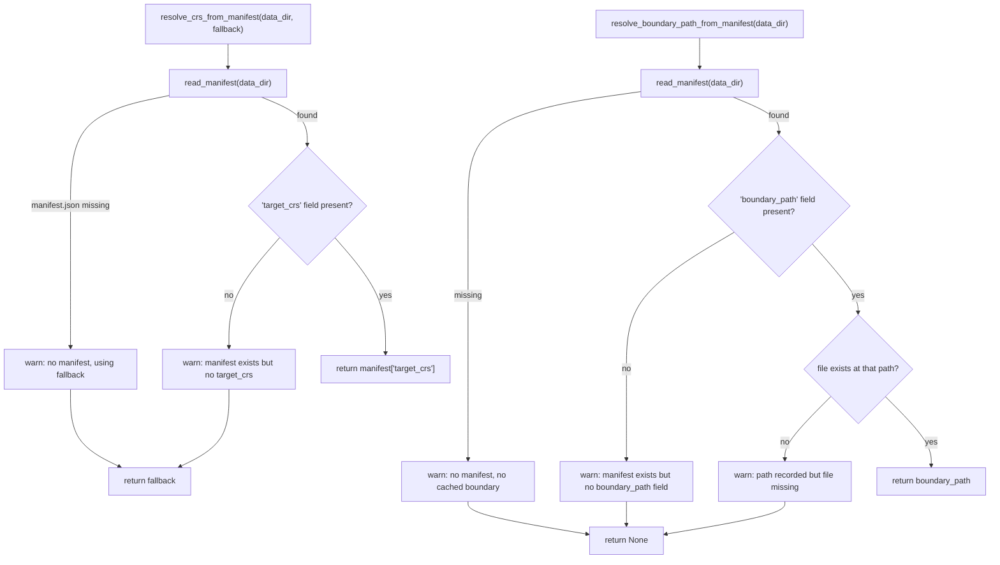

# `akure_access/data_contract.py`

!!! info "Source"
    `akure_access/data_contract.py` (162 lines, entirely new module)

## Purpose

Reads the formal extraction manifest — `manifest.json` — written by
`lga_extractor.pipeline.extract_lga()` (via `lga_extractor.manifest`, see
[`manifest.md`](../../lga-osm-extractor/modules/manifest.md)), so this
dashboard consumes the extractor's own recorded determinations (target
CRS, boundary polygon location) instead of re-deciding them independently,
and potentially inconsistently, on the dashboard side.

This is the dashboard-side half of the cross-repo contract — see
[Cross-Repo Integration](../../cross-repo/integration.md) for how this
module fits into the bigger picture of what the two repositories agree on.

## Why this exists — closing two gaps this documentation site had already identified independently

Both gaps this module closes were things this documentation site's earlier
pages had already flagged as real, if minor, architectural rough edges —
worth noting explicitly, since it means this module isn't fixing a
*hypothetical* problem.

**Gap 1 — the CRS.** `lga_extractor.clean.resolve_target_crs()` already
determines the geographically-correct UTM zone per LGA (see
[`clean.md`](../../lga-osm-extractor/modules/clean.md)) — but before this
module existed, that determination only ever reached `run_log.json`, a
file the dashboard never read. `scoring.build_grid()` (and other
CRS-consuming functions on this side) kept their *own*, independent,
hardcoded `"EPSG:32631"` default — correct for Akure specifically, but
silently wrong for any LGA outside Ondo State, exactly the class of
cross-repo drift this documentation's [`network_graph.md`](accessibility/network_graph.md)
and [`scoring.md`](accessibility/scoring.md) pages already noted as a
latent risk in the two repos' historically independent CRS-handling logic.

**Gap 2 — the boundary polygon.** Even with every layer's GeoJSON being
read from the extractor's cached, versioned output, the boundary polygon
itself had no equivalent cached path — any function needing it (chiefly
`scoring.add_access_times()`'s `boundary_polygon_wgs84` parameter) had to
call `lga_extractor.boundary.resolve_boundary()` **live**, reintroducing a
network dependency into what was otherwise meant to be a fully offline,
reproducible analysis step. `lga_extractor`'s new `boundary.geojson` export
plus `manifest.json`'s `boundary_path` field (see
[`manifest.md`](../../lga-osm-extractor/modules/manifest.md)) together
close this gap — but only if something on this side actually reads them,
which is precisely this module's job.

## Constant

```python
FALLBACK_CRS = "EPSG:32631"
```

**Deliberately kept identical to `lga_extractor.clean.FALLBACK_CRS`** — not
an independent choice. The module's own comment is explicit about why: this
is what the extractor itself falls back to when no boundary is available to
determine a zone from, so using the *same* fallback here, only when
`manifest.json` is missing or unreadable, keeps the two repositories'
degraded-case behavior consistent with each other, rather than each side
picking its own arbitrary default that could disagree even in the fallback
path.

## Functions

### `read_manifest(data_dir) -> dict | None`

**What it does:** reads and parses `{data_dir}/manifest.json`, returning
`None` (not raising) if the file doesn't exist at that path.

**Why `None`, not an exception, for a missing file:** `manifest.json` is
new — every extractor output directory produced before this feature existed
genuinely won't have one, and that's an expected, not exceptional,
condition. The docstring is explicit: callers should treat `None` as "no
contract available" and fall back to an explicit, documented default,
"since this manifest is new and older/manual data directories legitimately
won't have one yet." This mirrors the same "missing information is a valid
state, not a failure" philosophy seen throughout `lga_extractor` itself
(e.g. a layer legitimately finding zero features, see
[`layers.md`](../../lga-osm-extractor/modules/layers.md)).

### `resolve_crs_from_manifest(data_dir, fallback=FALLBACK_CRS) -> str`

**What it does:** returns the extractor's own recorded `target_crs` from
`manifest.json` if available; otherwise warns and returns `fallback`.

**Two distinct warning paths, both explicit about exactly what's uncertain
and why:**
- No `manifest.json` at all → warns that falling back to `fallback` "is
  only correct if this LGA's data was actually extracted using that CRS,"
  and directs the caller to re-run the extractor to produce one.
- `manifest.json` exists but has no `target_crs` field (e.g. from an even
  older extractor revision predating this field entirely) → a distinct,
  narrower warning specifically about the missing field, not conflated
  with the "no manifest at all" case.

**Why a warning, not a silent fallback or a hard failure:** this is a
deliberate middle ground. A hard failure would break every existing
notebook/script run against pre-manifest extractor output, which is an
unnecessarily disruptive way to roll out a new, optional contract. A
*silent* fallback would reintroduce exactly the kind of invisible
CRS-mismatch risk this module exists to close — a caller running an LGA
outside Ondo State against old extractor output would get a silently wrong
CRS with no indication anything was assumed rather than determined. A
warning is the calibrated choice: the analysis still runs, but the person
running it has a chance to notice and fix the root cause (re-run the
extractor).

### `resolve_boundary_path_from_manifest(data_dir) -> str | None`

**What it does:** returns the extractor's recorded `boundary_path` from
`manifest.json`, but only after checking that the file it points to
**actually exists on disk** — three independent conditions, each producing
its own specific warning, all collapsing to a `None` return:
1. No `manifest.json` at all.
2. `manifest.json` exists but has no `boundary_path` field (an even older
   extractor run, predating this specific field even though the file
   itself might have `target_crs`).
3. `manifest.json` has a `boundary_path`, but nothing exists at that path
   — the extractor's output may have moved, or been partially deleted.

**Why this function deliberately does *not* fall back to a live
`resolve_boundary()` call on the caller's behalf** — this is the single
most important design decision in this module, stated directly in its own
docstring: doing so "would reintroduce an implicit live-network dependency
inside what's meant to be a pure, offline file-path lookup." A function
named `resolve_boundary_path_from_manifest` that silently reached out to
Nominatim under the hood, on any of the three failure conditions above,
would be quietly doing something its name gives no indication of — a
caller checking `if path is None: <handle it>` deserves to make that
network-access decision explicitly, in their own code, not have it made
invisibly inside a helper that looks purely like a file-path lookup from
its signature alone.

## Internal Workflow



## Gotchas

- **Neither resolver function raises — both degrade to a warning plus a
  documented fallback (or `None`).** A caller relying on an exception to
  detect "the manifest was unusable" needs to check the return value or
  filter warnings explicitly instead; nothing here will stop execution on
  its own.
- **`resolve_boundary_path_from_manifest()` never performs a live fallback,
  by design** — see the dedicated explanation above. Any caller wanting
  "use the cached boundary if available, otherwise resolve it live" needs
  to write that two-step logic itself, checking for `None` and then
  calling `lga_extractor.boundary.resolve_boundary()` explicitly.
- **`FALLBACK_CRS`'s correctness is scoped to Southwest Nigeria specifically**
  — exactly as true here as it is for `lga_extractor.clean.FALLBACK_CRS`
  itself (see [`clean.md`](../../lga-osm-extractor/modules/clean.md)). A
  caller processing an LGA outside Ondo State whose extractor output
  predates `manifest.json` will silently get an incorrect CRS unless they
  pass an explicit `fallback` argument or otherwise notice the warning.
- **This module has no test coverage of its own from the cross-repo
  integration test.** `tests/test_cross_repo_integration.py` is unchanged
  since before this module existed (see [Cross-Repo Integration](../../cross-repo/integration.md)
  and [Known Issues](../../reference/known-issues.md)) — the one test whose
  entire purpose is verifying the two repos actually agree with each other
  does not currently exercise `manifest.json`, `boundary.geojson`, or any
  function in this module at all.

## Related

- [`manifest.py`](../../lga-osm-extractor/modules/manifest.md) — the
  extractor-side module that writes exactly what this module reads.
- [`clean.py`](../../lga-osm-extractor/modules/clean.md) — the source of
  `FALLBACK_CRS`'s value and of `resolve_target_crs()`, whose output this
  module ultimately surfaces to the dashboard.
- [Cross-Repo Integration](../../cross-repo/integration.md) — the full
  picture of the data contract this module is one half of.
