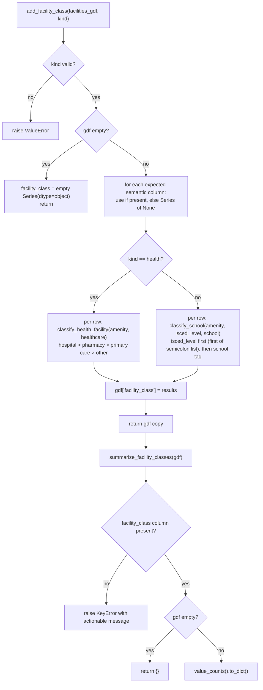

# `akure_access/facility_classification.py`

!!! info "Source"
    `akure_access/facility_classification.py` (192 lines, entirely new
    module)

## Purpose

Classifies health and education facilities into human-meaningful subtypes
— Hospital / Primary care / Pharmacy for health, Primary / Secondary for
education — using the curated OSM semantic tags `lga_extractor.clean.py`
now preserves (`amenity`, `healthcare`, `isced:level`, `school`), rather
than treating every facility within a layer as an interchangeable,
undifferentiated point.

## Why this exists — a direct, dependent consequence of the extractor's schema change

This module could not have existed before `lga_extractor.clean.py`'s
`SEMANTIC_COLUMNS` addition (see [`clean.md`](../../lga-osm-extractor/modules/clean.md)):
prior to that change, every facility was reduced to `osmid`/`name`/`geometry`
— there was no tag information left downstream to classify against, no
matter how this module's own logic was written. This is worth calling out
explicitly as an example of how the two repositories' changes in this
revision are genuinely linked, not independently coincidental — the
extractor's schema change and this module were designed together, as two
halves of one improvement.

**The value this unlocks, in the project's own framing** (quoted from the
module's docstring): *"a planner doesn't simply need 'there is a health
facility', they need 'what type of healthcare access exists here'."* A
finding of "there is a health facility here" becomes "there is a pharmacy
here, but the nearest hospital is elsewhere" — a materially more useful
answer for the project's stated audience (health/education planners).

## Explicit scope boundary: descriptive only, not scoring

Stated directly and unambiguously in the module's own docstring, worth
repeating here since it's the single most important thing to understand
about how this module relates to the rest of the codebase: **this module
does not change accessibility scoring in any way.** A grid cell's
nearest-facility distance/time (computed by
[`isochrones.py`](accessibility/isochrones.md) and
[`scoring.py`](accessibility/scoring.md)) still treats every facility of a
given layer as an equally valid destination — a pharmacy counts exactly the
same as a hospital for "nearest health facility" purposes, unchanged by
this module's existence. Facility classification is presented as an
**additional descriptive layer on top of** the existing scoring, not a
replacement for it or an input to it. A scoring model that weighted
facility types differently (e.g. treating a pharmacy as inadequate access
for a serious health need) would be a separate, larger methodology change
— explicitly out of scope for this module.

## Constants

```python
HEALTH_HOSPITAL = "Hospital"
HEALTH_PRIMARY_CARE = "Primary care"
HEALTH_PHARMACY = "Pharmacy"
HEALTH_OTHER = "Other"

EDU_PRIMARY = "Primary"
EDU_SECONDARY = "Secondary"
EDU_OTHER = "Other"
```

Seven fixed category labels — exported as named constants rather than bare
strings specifically so calling code can write `if facility_class ==
HEALTH_HOSPITAL` instead of a string literal prone to typos, and so a
future rename of the display label only needs to change one definition.

## Functions

### `classify_health_facility(amenity=None, healthcare=None) -> str`

**What it does:** classifies one facility's OSM tags into one of the four
health categories, checking `amenity` and `healthcare` together (not
`healthcare` only as a fallback when `amenity` is absent — both are
checked at each priority tier).

**Priority order, and why it matters:** hospital → pharmacy → primary
care → other. This ordering directly resolves a real, plausible ambiguity
called out in the module's own inline comment: a hospital that also
happens to carry an `amenity=pharmacy` tag for its in-house pharmacy
counter should classify as `"Hospital"`, not `"Pharmacy"` — the hospital
classification is checked first and wins, since it's the more informative
and correct answer for a feature that could plausibly match more than one
category.

**Normalization:** both inputs are `.strip().lower()`'d before comparison
(with `None` coerced to `""` first via `amenity or ""`), so tag-value
casing or incidental whitespace from OSM data doesn't cause a
classification miss.

**Never raises:** an unrecognized or entirely absent tag combination
returns `HEALTH_OTHER`, not an exception — "we don't know what type this
is" is treated as a valid, expected real-world outcome for OSM data, not a
failure mode.

### `classify_school(amenity=None, isced_level=None, school=None) -> str`

**What it does:** classifies one education facility into Primary /
Secondary / Other, checking `isced:level` first (the more precise, if less
commonly present, signal), falling back to the simpler `school` tag.

**Handling ISCED's multi-value convention:** `isced:level` can legitimately
hold a semicolon-separated list (e.g. `"1;2"`, a real OSM tagging
convention for institutions spanning both a primary and lower-secondary
level). This function takes only the **first** value in that list
(`isced_level.split(";")[0]`) — a deliberate simplification, not an
oversight: classifying such a facility under its first-listed level is a
reasonable single answer for a descriptive summary, even though it
technically discards information about the facility also serving the
second level.

**ISCED level mapping:** `"0"`/`"1"` → Primary (early childhood/primary
education), `"2"`/`"3"` → Secondary (lower/upper secondary) — per UNESCO's
International Standard Classification of Education.

**The `amenity` parameter's real purpose:** almost every feature reaching
this function already has `amenity="school"` (that's what
`DEFAULT_TAG_CONFIG`'s schools filter queries for in the first place) — the
parameter exists mainly so a feature that matched the schools query for
some *other* reason (an edge case in how OSM/Overpass resolved the tag
filter) and doesn't actually carry `amenity="school"` still classifies
correctly as `EDU_OTHER` rather than being silently miscategorized as a
normal school.

### `add_facility_class(facilities_gdf, kind) -> GeoDataFrame`

**What it does:** appends a `facility_class` column to a health or
education facilities `GeoDataFrame`, applying the appropriate classifier
row-by-row.

**`kind` validation:** `if kind not in ("health", "education"): raise
ValueError(...)` — fails fast and clearly on a typo'd or unsupported
`kind` value, rather than silently doing nothing or misclassifying every
row.

**Missing-column tolerance:** if `facilities_gdf` lacks one of the expected
semantic columns entirely (e.g. output from an extractor run predating
`clean.py`'s `SEMANTIC_COLUMNS` addition, or a layer that genuinely had no
matching OSM tags in that LGA), the missing column is substituted with a
`pd.Series([None] * len(gdf))` before classification — every row simply
falls through to the relevant `*_OTHER` category via the classifier
functions' own `None`-input handling, rather than raising a `KeyError` on
column access. This means `add_facility_class()` works correctly against
both old and new extractor output, degrading gracefully rather than
requiring a hard version check.

**Empty-input handling:** `if len(gdf) == 0:` short-circuits to an empty
`facility_class` column with explicit `dtype="object"` — a small but
deliberate detail, since an empty column without an explicit dtype could
default to `float64` in some pandas code paths, which would look wrong for
a column meant to hold strings.

### `summarize_facility_classes(facilities_gdf) -> dict`

**What it does:** a simple `value_counts()`-based tally of the
`facility_class` column, e.g. `{"Hospital": 2, "Primary care": 6,
"Pharmacy": 4, "Other": 6}` — usable directly in a caption or a dashboard
metric.

**Requires `add_facility_class()` to have already run:** raises `KeyError`
with an explicit, actionable message ("run `add_facility_class()` first")
if the `facility_class` column isn't present — a clear failure rather than
a confusing downstream error from `value_counts()` on a nonexistent column.

## Internal Workflow



## Gotchas

- **This module has zero effect on any distance, time, or deficit-score
  number anywhere in the project.** It's purely descriptive. If you're
  looking for where facility *type* might influence accessibility
  *scoring*, it doesn't happen anywhere in this codebase — see the explicit
  scope-boundary discussion above.
- **A facility classified as `HEALTH_OTHER`/`EDU_OTHER` could mean either
  "genuinely an unusual/unclear facility type" or "the semantic tag columns
  simply aren't present in this data" (older extractor output) — the two
  are indistinguishable from `facility_class` alone.** A consumer wanting
  to tell these apart needs to separately check whether `amenity`/
  `healthcare`/`isced:level`/`school` columns exist on the input
  `GeoDataFrame` at all.
- **ISCED multi-value tags are simplified to their first listed value** —
  a facility genuinely spanning two education levels (e.g. `"1;2"`) is
  classified under only the first, discarding the second level's
  information. This is a documented simplification, not a bug, but worth
  knowing if precise multi-level facility counts matter for a specific use
  case.
- **No test coverage gap here** — unlike `manifest.py`/`data_contract.py`,
  this module has a full, dedicated test file (`test_facility_classification.py`,
  27 test functions) exercising both classifiers' priority ordering,
  normalization, multi-value handling, and both DataFrame-level functions'
  missing-column and empty-input behavior. See [tests.md](../tests.md).

## Related

- [`clean.py`](../../lga-osm-extractor/modules/clean.md) — the source of
  the `SEMANTIC_COLUMNS` this module depends on entirely; without that
  change, this module would have no tag data to classify against.
- `dashboard/app.py` — **not currently a consumer.** As of this revision,
  `dashboard/app.py` is unchanged and does not call any function in this
  module — facility classification exists as a library capability, not yet
  surfaced in the deployed interactive dashboard. See
  [`dashboard-app.md`](../dashboard-app.md).
