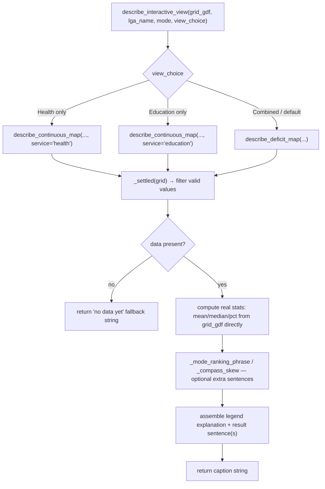

# insights.py

!!! info "Source"
    `akure_access/insights.py` (351 lines — grew from 321 with the
    resolution of the `DEFAULT_THRESHOLDS_MIN` drift risk and one new
    function, see below)

## Purpose

Generates short, data-driven narrative captions — what a map's colors mean,
and what the actual numbers behind it say — consumed by both the live
Streamlit dashboard and the static export pipeline. This is the module that
implements the design principle stated in the
[repository overview](../overview.md): captions are computed programmatically
from the same scored `GeoDataFrame` a map is drawn from, never hand-written
prose sitting next to a chart, which guarantees a caption can never say
something the underlying data doesn't actually support, and means
re-running the analysis with updated OSM data automatically keeps every
caption accurate everywhere it appears — nobody has to remember to update
wording by hand.

The module's own docstring makes a second, deliberate architectural
promise worth repeating here: it has **no dependency on `matplotlib` or
Streamlit**, only `geopandas`/`numpy` — meaning it's safe to import from
`dashboard/app.py` without pulling in the heavier static-map plotting
stack, and equally safe to import from the static-map generator without
pulling in Streamlit. This is what allows one caption-generation codepath
to genuinely serve two very differently-shaped consumers.

## Dependencies

- **Imports:** `warnings`, `typing.Optional`, `numpy`. Notably absent:
  `matplotlib`, `streamlit`, `geopandas` itself isn't even imported directly
  (functions receive already-constructed `GeoDataFrame`s and operate on
  them via their pandas-like interface, without needing GeoPandas'
  own namespace).
- **Imported by:** `dashboard/app.py`; `visualization/static_maps.py`.

## Functions & Classes

### Module-level constants

| Constant | Purpose |
|---|---|
| `MODE_LABELS` | `{"walk": "walking", "okada": "okada", "drive": "driving"}` — maps internal mode keys to the human-readable words used in generated prose. |
| `SERVICE_LABELS` | `{"health": "health", "education": "education"}` — same idea for service names (currently identity-mapped, but kept as an explicit lookup rather than using the raw key directly, presumably for future flexibility if a label ever needed to differ from its key). |
| `DEFAULT_THRESHOLDS_MIN` | `{"walk": 30, "okada": 20, "drive": 15}` — default per-mode thresholds used **only for caption phrasing** (e.g. "within 30 minutes by walking"), not for actual scoring. **Now config-derived — see below, this is a resolved drift risk.** |

**This documentation site previously flagged a specific, real drift risk
here, and this revision resolves it directly — worth documenting in
detail as a genuine before/after fix, not just a refactor.**

**Before:** `DEFAULT_THRESHOLDS_MIN = {"walk": 30, "okada": 20, "drive": 15}`
— an independently hardcoded dict, manually kept in sync with the
project's analysis notebook's own separate `ACCESS_THRESHOLDS_MIN`
configuration cell *by convention*, not by any code that would catch the
two drifting apart. This was documented on this site's [Known
Issues](../../reference/known-issues.md) page as a live risk: nothing
would catch this constant silently diverging from whatever threshold was
actually used at scoring time.

**Now:** `DEFAULT_THRESHOLDS_MIN = get_config()["accessibility"]["threshold_min"]`
— derived from the exact same [`config.get_config()`](config.md) call
that `scoring.DEFAULT_ACCESS_THRESHOLD_MIN` itself reads from. The
module's own updated comment states the resolution plainly: *"previously
this was an independently hardcoded dict, manually kept in sync with
Notebook 03's own separate configuration cell by convention rather than by
code, which was a genuine, live drift risk (see
docs/reference/known-issues.md). Both now trace back to the same
`config/default.yaml`, so there is nothing left to keep in sync."* This
comment directly references this documentation site's own known-issues
page by path — whether written in direct response to it or arrived at
independently, the effect is identical: there is no longer a second copy
of this number that could silently diverge from the first.

**On why `DEFAULT_THRESHOLDS_MIN` exists as a separate value from
`scoring.DEFAULT_ACCESS_THRESHOLD_MIN` at all, rather than being unified
into one single constant — this distinction is unchanged by the fix, and
still matters:** the actual underserved/well-served classification a
caption describes always comes straight from the grid's own
`*_access_deficit_score` columns, computed by `accessibility.scoring`
using whatever threshold was actually passed in *at scoring time* — this
module never re-derives that classification itself.
`DEFAULT_THRESHOLDS_MIN` here is used only to produce threshold-*aware
phrasing* in the caption text (mentioning "the 30-minute walking
threshold"), and every caption-generating function still accepts an
explicit `thresholds` parameter so a caller can override this default with
the authoritative values actually used in a specific analysis run — that
override mechanism is unchanged; what changed is only where the *default*
value itself comes from.

### `_article(word)`

| | |
|---|---|
| **What it does** | Returns `"an"` if `word` starts with a vowel sound, else `"a"`. |
| **Why written this way** | A small grammatical-correctness helper, used so generated captions read naturally as "a health facility" but "an education facility," rather than uniformly defaulting to one article regardless of what follows — a detail that matters for captions meant to read as genuine prose rather than a template with visible seams. |
| **Inputs / Outputs** | `word: str` in, `"a"` or `"an"` out. |
| **Internal workflow** | Checks whether the lowercased first character is in the string `"aeiou"`. |
| **Assumptions** | Assumes English vowel-sound rules can be approximated by checking the first *letter* against `"aeiou"` — this is a simplification that would be wrong for edge cases like "an hour" (silent h) or "a university" (consonant sound despite starting with a vowel letter) — but is entirely adequate for the specific, small vocabulary of service-label words this function is actually applied to (`"health"`, `"education"`), where it produces correct results. |
| **Complexity** | O(1). |
| **Covered by test(s)** | See [tests.md](../tests.md) — `test_insights.py`. |

### `_settled(grid_gdf)`

A one-line filter: `grid_gdf[grid_gdf["building_count"] > 0]`. Used
throughout this module as the consistent definition of "cells worth
describing" — captions about accessibility are scoped to settled cells
only, mirroring the same `building_count > 0` convention used in
`scoring.add_access_times()` (though notably *not* the same threshold
`completeness.grid_check.py` uses — see that module's own gotchas about
the two different settlement thresholds in use across the codebase).

### `_compass_skew(target_gdf, reference_gdf)`

| | |
|---|---|
| **What it does** | Compares the centroid of `target_gdf` (e.g. underserved cells) against the centroid of `reference_gdf` (e.g. all settled cells), and returns a short compass-direction phrase like `"the southeast"` if the offset is large enough to be worth mentioning in prose, or `None` if the two centroids are close enough that no direction clearly stands out. |
| **Why written this way — three separate careful design choices worth unpacking.** | **(1) CRS-agnostic by design**: the function works whether the input is in a projected (meters) or geographic (degrees) CRS, because both conventions preserve "increasing X is east, increasing Y is north" — so only the *sign* of the offset matters here, and that sign is unaffected by which CRS is in use. This means the function doesn't need to know or care what CRS it's been handed, unlike almost every other geometric computation in either repository, which is generally CRS-sensitive. **(2) Deliberately suppressing GeoPandas' own centroid warning**: GeoPandas normally warns when `.centroid` is computed on a geographic (lat/lon) CRS, since that's imprecise for accurate area/distance work — true in general, but the module's comment explains this warning is irrelevant here specifically, since this function only needs the *sign* of an offset between two centroids, never a precise distance, and that sign is unaffected by the exact same approximation that would distort a genuine area/distance calculation. The warning is suppressed explicitly and locally (`warnings.catch_warnings()` + `simplefilter("ignore", UserWarning)`, scoped tightly around just the two centroid computations) rather than left to surface — a deliberate, scoped silencing of a specific known-irrelevant warning, not a blanket suppression. **(3) Normalized by the study area's own extent, not a fixed distance**: the offset is expressed as a *fraction* of the reference area's bounding-box width/height (`dx_frac`, `dy_frac`), rather than a fixed meter or degree threshold — this is what makes "large enough to mention" behave consistently whether the input happens to be in a projected CRS (meters) or a geographic one (degrees), since a fixed absolute threshold would need to mean wildly different things in each unit system. |
| **Inputs** | `target_gdf`, `reference_gdf: GeoDataFrame`. |
| **Outputs** | `Optional[str]` — one of `"the north"`, `"the south"`, `"the east"`, `"the west"`, a combined form like `"the northeast"`, or `None`. |
| **Internal workflow** | 1. Return `None` immediately if either input is empty. 2. Suppress the geographic-CRS centroid warning, compute mean centroid `(x, y)` for both `target_gdf` and `reference_gdf`. 3. Get `reference_gdf.total_bounds` (west, south, east, north); compute `width`/`height`; return `None` if either is zero (a degenerate reference area — can't meaningfully normalize by a zero-width/height extent). 4. Compute `dx_frac`/`dy_frac`: the offset as a fraction of the reference extent. 5. Apply a fixed `skew_threshold = 0.08` (8% of the study area's extent) to classify north/south and east/west independently — a direction axis contributes to the output only if its fractional offset magnitude exceeds this threshold; otherwise that axis contributes nothing (empty string). 6. If neither axis crossed the threshold, return `None` — no direction is worth mentioning. 7. Otherwise, combine whichever axis label(s) fired into a single phrase (`"the northeast"` if both, `"the north"` if only one). |
| **Assumptions** | Assumes an 8% skew threshold is a reasonable, if unvalidated, cutoff for "worth mentioning in prose" — not derived from any statistical significance test, a judgment call about what reads as a meaningful directional pattern versus noise. |
| **Complexity** | O(N) for the centroid mean computations (N = rows in each input `GeoDataFrame`); everything else O(1). |
| **Concurrency / race conditions** | `warnings.catch_warnings()` as a context manager is documented by Python's own standard library as **not thread-safe** — it saves and restores global warnings-filter state, which is process-wide, not thread-local. If this function were ever called concurrently from multiple threads, one thread's warning-suppression window could unintentionally suppress or unsuppress warnings in another thread's unrelated code running at the same time. Not a concern under this module's current synchronous, single-threaded usage (called from Streamlit's single request-handling flow, or from the static-export pipeline's sequential generation loop), but worth flagging as a real constraint if caption generation were ever parallelized. |
| **Covered by test(s)** | See [tests.md](../tests.md) — exercised indirectly through `test_describe_deficit_map_reports_directional_skew`, which checks the caption text this function's output feeds into, rather than testing the helper in isolation. |

### `_mode_ranking_phrase(grid_gdf, mode)`

| | |
|---|---|
| **What it does** | Compares the current mode's "underserved for at least one service" rate against whichever *other* modes happen to also be present as columns in this grid, and returns a phrase describing where the current mode ranks (`"the most restrictive..."`, `"the least restrictive..."`, `"in between..."`), or `None` if fewer than two modes are available to compare at all. |
| **Why written this way** | Deliberately tolerant of partial data: rather than requiring all three modes (`walk`/`okada`/`drive`) to be present, it checks which mode-specific `{mode}_access_deficit_score` columns actually exist in the grid and only compares among those — meaning this function works correctly whether the grid was scored for one mode, two, or all three, gracefully degrading to `None` (no ranking phrase at all) rather than raising when comparison isn't meaningful because too few modes are available. |
| **Inputs** | `grid_gdf: GeoDataFrame`; `mode: str`. |
| **Outputs** | `Optional[str]`. |
| **Internal workflow** | 1. Filter to settled cells; return `None` if empty. 2. For each of the three known modes, check if its deficit-score column exists in the settled data; if so, compute that mode's underserved rate as `(settled[col] > 0).mean() * 100` (percentage of settled cells with a deficit score above zero, i.e. underserved for at least one service). 3. If the requested `mode` isn't among the modes found, or fewer than 2 modes total were found, return `None` — no meaningful ranking is possible. 4. Sort the available modes by rate, descending (worst/most-restrictive first); find the requested mode's position in that ranking. 5. Return `"the most restrictive..."` if it ranks first, `"the least restrictive..."` if it ranks last, `"in between the other modes shown here"` for any middle position (handles the 3-mode case where the middle position isn't literally "second of three" in a way that needs special-casing — the same phrase covers any non-extreme rank). |
| **Assumptions** | Assumes "underserved for at least one service" (`deficit_score > 0`) is the right single number to rank modes by — a mode with many cells scoring exactly `1` (underserved for one service) versus a mode with fewer cells but more scoring `2` (underserved for both) could plausibly be argued either way as "more restrictive"; this function collapses that distinction into one rate. |
| **Complexity** | O(C) where C = settled cell count, for computing each mode's rate; O(1) for the ranking/lookup once rates are computed (at most 3 items). |
| **Covered by test(s)** | No dedicated test — not directly exercised by any test in `test_insights.py`; the mode-ranking sentence it produces is an optional addition to `describe_deficit_map()`'s output that none of the current caption tests specifically check for. |

### `describe_deficit_map(grid_gdf, lga_name, mode, thresholds=None)`

| | |
|---|---|
| **What it does** | Generates the full caption for the categorical (green/yellow/red) access-deficit map: what the colors mean, the actual underserved percentages for this specific LGA and mode, a cross-mode ranking sentence (via `_mode_ranking_phrase()`), and a directional clustering note (via `_compass_skew()`) — composed together into one coherent paragraph. |
| **Why written this way** | This function is a clear illustration of the module's core design principle in action: every number in the output sentence — `pct_any`, `pct_both`, the ranking, the direction — is computed fresh from `grid_gdf` at call time, not looked up from anywhere pre-written. The function also handles the "not yet scored" case gracefully (see workflow step 2) with a specific, actionable message rather than raising an exception or producing a caption describing data that doesn't exist. |
| **Inputs** | `grid_gdf: GeoDataFrame`; `lga_name: str`; `mode: str`; `thresholds: dict`, optional (defaults to `DEFAULT_THRESHOLDS_MIN`). |
| **Outputs** | `str` — a multi-sentence caption. |
| **Internal workflow** | 1. Resolve `thresholds`, `mode_label`, `threshold` (this mode's specific value), and the deficit-score column name to read. 2. Filter to settled cells; if empty, or the expected column doesn't exist (grid hasn't been scored for this mode yet), return an early, specific "no scored data available... re-run the analysis" message rather than proceeding. 3. Compute `pct_any` (share underserved for ≥1 service) and `pct_both` (share underserved for both). 4. Get the ranking phrase via `_mode_ranking_phrase()` and the compass direction of underserved cells (relative to all settled cells) via `_compass_skew()`. 5. Build the legend sentence (what the colors mean, including the numeric threshold in the "well served" description if one is available). 6. Build the results sentence (the actual percentages). 7. Conditionally append the ranking sentence (only if `_mode_ranking_phrase()` returned something) and the directional sentence (only if `_compass_skew()` returned something) — both optional additions, gracefully omitted when there isn't enough data/signal to support them, rather than the caption ever containing a placeholder or "N/A" for a sentence that couldn't be generated. |
| **Assumptions** | Assumes callers pass a `mode` that's one of the three known keys — an unrecognized mode string would still "work" (fall back to using the raw string itself via `.get(mode, mode)` for the label, and simply produce a column name that likely doesn't exist in the grid, triggering the "no scored data" early return) rather than raising, a graceful-degradation choice consistent with the rest of the module. |
| **Complexity** | O(C) — dominated by the settled-cell filter and the percentage computations, all linear in grid size. |
| **Covered by test(s)** | See [tests.md](../tests.md) — `test_describe_deficit_map_returns_real_numbers`, `test_describe_deficit_map_missing_mode_column_does_not_crash`, `test_describe_deficit_map_reports_directional_skew`. |

### `describe_continuous_map(grid_gdf, lga_name, mode, service, thresholds=None)`

| | |
|---|---|
| **What it does** | Generates the caption for the continuous travel-time map (a colorbar in minutes, rather than the three-category deficit map): what the color gradient means, real summary statistics (mean, median, share exceeding the mode's threshold), and where the longest travel times cluster geographically. |
| **Why written this way** | Structurally parallel to `describe_deficit_map()` (same early-return-on-missing-data pattern, same legend-then-results-then-optional-extras composition), but working with continuous time values rather than a categorical score — this function computes real descriptive statistics (`mean()`, `median()`) directly from the travel-time column, rather than describing a pre-computed category. The "worst" subset used for the directional clustering note is chosen differently depending on whether a threshold is available: if `threshold` is known, "worst" means cells exceeding that specific threshold (a meaningful, externally-defined cutoff); if no threshold is available for this mode, it falls back to the top quartile (`times.quantile(0.75)`) as a threshold-free notion of "notably long" — ensuring the directional note can still be generated even without a defined threshold, using a purely statistical definition of "worst" instead. |
| **Inputs** | `grid_gdf`, `lga_name`, `mode`, `service: str` (`"health"` or `"education"`), `thresholds`, optional. |
| **Outputs** | `str`. |
| **Internal workflow** | 1. Resolve labels/threshold/column name (`{service}_time_min_{mode}`). 2. Filter to settled cells with a non-null value in that column; if none exist (empty settled set, missing column, or all-null column — the third case checked explicitly via `.notna().sum() == 0`, distinct from the column simply not existing), return an early "no data available" message. 3. Compute `mean_t`, `median_t` over the valid (non-null) values. 4. Build the legend sentence describing the gradient direction (cooler/darker = shorter, warmer = longer). 5. Build the results sentence with mean/median. 6. If a threshold is known: compute and append the percentage exceeding it, and use the over-threshold subset as `worst` for the directional note. If no threshold: skip the percentage-exceeding sentence, and use the top-quartile subset as `worst` instead. 7. Get the compass direction of `worst` relative to all settled cells; append if non-`None`. |
| **Assumptions** | Assumes the top-quartile fallback (when no threshold is known) is a reasonable proxy for "notably long" travel times — an arbitrary but defensible statistical choice, not derived from any domain-specific reasoning the way the threshold-based cutoff is. |
| **Complexity** | O(C) — filtering plus a small number of statistical aggregations over the settled/valid subset. |
| **Covered by test(s)** | See [tests.md](../tests.md) — `test_describe_continuous_map_returns_real_numbers`, `test_describe_continuous_map_all_nan_column_does_not_crash`, `test_describe_continuous_map_missing_column_does_not_crash`. |

### `describe_completeness_map(grid_gdf, lga_name, service)`

| | |
|---|---|
| **What it does** | Generates the caption for the OSM-completeness map — explaining what "confirmed nearby" (teal) versus "possible data gap" (gold) means, and the real share of settled cells in each category, explicitly framed to warn the reader that a large "possible data gap" share means part of what might look like an accessibility problem elsewhere could actually reflect thin OSM coverage rather than a confirmed absence of service. |
| **Why written this way** | This caption is the most directly tied to the project's core problem statement (see [overview](../overview.md)) of any function in the module — its legend text explicitly states, in plain language, the distinction the whole `completeness` package exists to draw: a gold cell "may reflect a real service gap or simply that OSM's coverage is still incomplete there." This is deliberate, careful hedging in the generated prose itself, not just in supporting documentation elsewhere — the caption a dashboard viewer actually reads is written to avoid overclaiming confidence the underlying data doesn't support. |
| **Inputs** | `grid_gdf`, `lga_name`, `service: str`. |
| **Outputs** | `str`. |
| **Internal workflow** | 1. Resolve `service_label`, the completeness-flag column name (`{service}_completeness_flag`). 2. Filter to settled cells; early-return a "no data available" message if empty or the column is missing. 3. Compute `pct_gap` (`== True` share — the `# noqa: E712` comment acknowledges this is normally a lint warning, since `== True` is usually discouraged in favor of just using the boolean value directly, but is kept here for explicitness/readability in this specific comparison) and `pct_confirmed` as its complement. 4. Build the legend sentence with the article-aware `_article(service_label)` helper for grammatical correctness (`"a health facility"` / `"an education facility"`). 5. Build the results sentence with both percentages. |
| **Assumptions** | Assumes `pct_confirmed = 100 - pct_gap` correctly represents "not flagged," which is true given the flag column is boolean and every settled cell is definitionally either flagged or not — no third state to account for. |
| **Complexity** | O(C). |
| **Covered by test(s)** | See [tests.md](../tests.md) — `test_describe_completeness_map_returns_real_numbers`, `test_describe_completeness_map_missing_column_does_not_crash`, `test_describe_completeness_map_uses_correct_article`. |

### `describe_mode_comparison_chart(mode_stats, lga_name)`

| | |
|---|---|
| **What it does** | Generates the caption for the mode-comparison bar chart (walking vs. okada vs. driving underserved rates side by side). |
| **Why written this way** | Takes `mode_stats` — described in the docstring as "the same sequence of `(mode, pct_any, pct_both)` tuples used to draw the chart itself" (shared with `visualization.static_maps.plot_mode_comparison_chart()` and the dashboard's own Findings Summary section) — as a direct parameter, rather than recomputing statistics from a raw grid itself. This is a deliberate architectural choice ensuring the caption and the bars it describes are drawn from the literal same numbers, guaranteeing they can never disagree, even in principle. The function also handles a genuinely tricky prose-generation edge case explicitly: when the highest and lowest underserved rates are close enough to be statistically indistinguishable at the display precision used (a difference under `0.5` percentage points), saying "highest at X%, lowest at X%" would read as a nonsensical contradiction (the same number can't be both), so the function detects this case and switches to describing the modes as comparably restrictive instead, with a different, more accurate framing ("switching travel mode alone would not meaningfully change who counts as underserved"). |
| **Inputs** | `mode_stats`: sequence of `(mode, pct_any, pct_both)` tuples; `lga_name: str`. |
| **Outputs** | `str`. |
| **Internal workflow** | 1. If `mode_stats` is empty/falsy, return an early "no data" message. 2. Sort by `pct_any` descending; identify `worst_mode`/`worst_pct` (first) and `best_mode`/`best_pct` (last). 3. **Near-tie check**: if `abs(worst_pct - best_pct) < 0.5`, build the "comparably restrictive across every mode" sentence, listing all analyzed modes by name, and return early — this branch does not go on to build the normal ranking sentence at all. 4. Otherwise, build the standard ranking sentence naming the specific worst and best modes and their rates, plus a closing sentence about what that gap implies (that travel mode choice alone meaningfully changes who counts as underserved). |
| **Assumptions** | Assumes a `0.5` percentage-point threshold is the right cutoff for "indistinguishable enough to avoid a contradictory-sounding sentence" — a display/readability judgment call tied to the `.1f}%"` formatting precision used elsewhere in this module (a gap smaller than the displayed decimal precision could otherwise round to appear identical while the sentence still claims one is "highest" and the other "lowest," which is the exact confusing outcome this check avoids). |
| **Complexity** | O(M log M) where M = number of modes being compared (at most 3) — the sort dominates, trivial at this scale. |
| **Covered by test(s)** | See [tests.md](../tests.md) — the near-tie branch is a specific enough behavior to be worth direct test coverage confirming it actually triggers correctly at the boundary. |

### `describe_interactive_view(grid_gdf, lga_name, mode, view_choice, thresholds=None)`

| | |
|---|---|
| **What it does** | The single entry point the dashboard actually calls — dispatches to the correct caption generator based on the dashboard's current "Access view" selector state (`"Combined"`, `"Health only"`, `"Education only"`). |
| **Why written this way** | Centralizing the dispatch logic in one function, rather than having `dashboard/app.py` itself decide which caption function to call, means the caption shown always matches whatever the map is currently displaying by construction — the dashboard passes its current `view_choice` state straight through, and this function is the single place that translates UI state into the correct underlying caption function, keeping that mapping in one place rather than duplicated logic in the dashboard script itself. |
| **Inputs** | `grid_gdf`, `lga_name`, `mode`, `view_choice: str`; `thresholds`, optional. |
| **Outputs** | `str` — delegates entirely to one of `describe_continuous_map()` (health or education) or `describe_deficit_map()` (the default/combined case). |
| **Internal workflow** | Simple if/elif/else dispatch on `view_choice`'s exact string value; anything other than `"Health only"` or `"Education only"` (including the expected `"Combined"` value, and, as a side effect, any unrecognized string) falls through to the combined deficit-map caption. |
| **Assumptions** | Assumes `view_choice` will only ever be one of the three values the dashboard's own selector widget presents — an unrecognized string silently falls through to the combined-map branch rather than raising, which is graceful but could mask a genuine bug (e.g. a typo in the dashboard's widget option string) by producing a plausible-looking caption for the wrong view rather than an error. |
| **Covered by test(s)** | See [tests.md](../tests.md) — `test_describe_interactive_view_dispatches_correctly`. |

### `describe_settlement_proxy_limitation()` (new)

| | |
|---|---|
| **What it does** | Returns a fixed, plain-language caveat string about what `building_count` and the settled/unsettled distinction actually mean — suitable for display alongside any map or chart driven by it (e.g. a persistent dashboard footnote, or appended to a static map's own caption). |
| **Why written this way — the one function in this module that is *not* data-driven, deliberately.** | Every other `describe_*()` function in this module computes its output from the actual `GeoDataFrame` it's describing — that's the module's entire design philosophy (see Purpose above). This function is the sole, explicit exception: it returns a fixed string with no parameters and no data dependency at all, because its subject is a *methodology caveat* ("here's what this proxy measure does and doesn't tell you"), not a data-driven finding. The module's own comment is explicit about this distinction — the string is "kept as a fixed string, not derived from data, since this is a methodology caveat... unlike every other describe_*() function in this module." |
| **Relationship to `scoring.SETTLEMENT_PROXY_DISCLAIMER`:** | This function's returned text and `scoring.py`'s new `SETTLEMENT_PROXY_DISCLAIMER` constant (see [`scoring.md`](accessibility/scoring.md)) cover the same underlying caveat — that `building_count` is a settlement proxy, not population data — but are two independently-worded strings, not one shared constant referenced from both places. `SETTLEMENT_PROXY_DISCLAIMER` is written as a long, precise, technical explanation (including the forward-looking note about future population-data substitutability); this function's string is shorter and more suited to appearing directly in a UI as a footnote. Worth knowing they're not the same string if a future edit updates one's wording and not the other's — there's no shared source of truth tying them together, unlike `DEFAULT_THRESHOLDS_MIN`'s fix above. |
| **Inputs** | None. |
| **Outputs** | `str` — a fixed, several-sentence caveat. |
| **Covered by test(s)** | No dedicated test found in `test_insights.py` for this specific function — a real, if minor, coverage gap for a newly-added function. |

## Internal Workflow

## Gotchas

- **`DEFAULT_THRESHOLDS_MIN`'s drift risk is now resolved — this Gotcha is
  kept here as a record of the fix, not as a live warning.** Previously,
  this constant and the project's analysis notebook's own
  `ACCESS_THRESHOLDS_MIN` were two independently-maintained copies of the
  same values, kept in sync manually. This revision fixes that: both now
  derive from the same [`config.get_config()`](config.md) call, so there
  is no longer a second copy that could silently diverge. If you're
  reading older notes (including earlier versions of this documentation
  site, or the codebase's own git history) referencing this as an active
  risk, it has been addressed as of this revision — see the dedicated
  discussion in the constants section above for the full before/after.
- **`describe_settlement_proxy_limitation()` and `scoring.SETTLEMENT_PROXY_DISCLAIMER`
  cover the same caveat with independently-worded text — no shared
  constant ties them together.** A future edit to one's wording won't
  automatically propagate to the other. This is a smaller-scale version of
  exactly the kind of duplication `DEFAULT_THRESHOLDS_MIN`'s fix just
  eliminated elsewhere in this same file — worth watching, though the
  stakes are lower here since both strings convey the same substance, just
  phrased differently for different display contexts.
- **`warnings.catch_warnings()`'s non-thread-safety in `_compass_skew()`**
  is a genuine, if currently dormant, constraint — see that function's own
  concurrency note above.
- **An unrecognized `mode` or `view_choice` string degrades silently rather
  than raising**, across multiple functions in this module — a deliberate
  choice favoring a working (if slightly wrong) caption over a crashed
  dashboard, but one that could mask an upstream typo or a stale UI option
  string without any visible signal.
