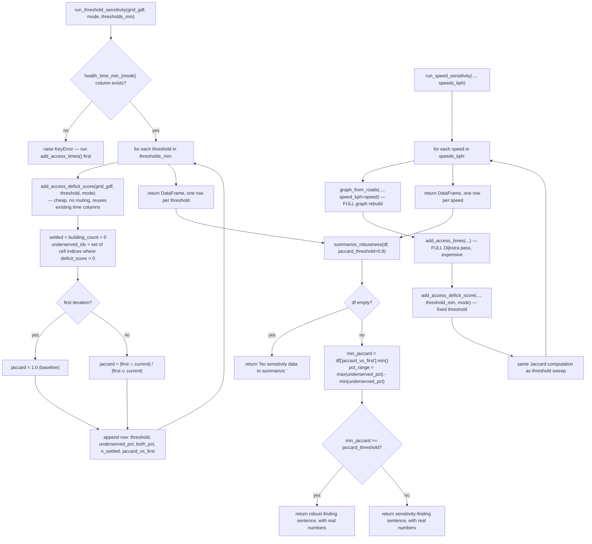

# `akure_access/sensitivity.py`

!!! info "Source"
    `akure_access/sensitivity.py` (263 lines, entirely new module)

## Purpose

Runs the accessibility scoring pipeline under several parameter variations
— alternative time thresholds, alternative walking speeds — and reports
whether the project's *conclusions* (which cells/areas are underserved)
are robust to reasonable choices in the underlying assumptions, rather
than reporting a single number as if it were uniquely correct.

This is the most analytically substantial of the five new modules in this
revision — not a bug fix or a schema formalization, but a genuinely new
methodological capability.

## Why this exists

Stated directly in the module's own docstring: every accessibility number
this project produces depends on assumptions that are reasonable but not
uniquely correct — a 30-minute walking threshold, a 5 km/h walking speed, a
500m grid cell (see [`config.py`](config.md) for where these now live).
Reporting results under exactly one set of these numbers, with no sense of
how sensitive the findings are to them, risks presenting one arbitrary
scenario as if it were ground truth.

**Two possible outcomes, both treated as valuable findings, not just one
as "good" and the other as "bad":**
- If the same spatial hotspots remain underserved across the whole sweep
  of tested values, that's evidence the finding is robust to reasonable
  modeling choices, not an artifact of one specific threshold pick.
- If the underserved set changes substantially across the sweep, that's a
  genuine finding *about model sensitivity itself*, worth reporting
  honestly rather than masked by presenting only one scenario as the
  answer.

## The central design decision: measuring overlap of the *set*, not just the *rate*

This is the module's most important idea, worth understanding before the
individual functions: it would be easy to build a sensitivity check that
only compares the **underserved percentage** across parameter values (e.g.
"38% underserved at threshold=20, 41% at threshold=30, 45% at
threshold=45") — but two runs with *nearly identical percentages* could,
in principle, be flagging **almost entirely different cells** as
underserved, which a percentage-only comparison would completely miss.
Every function in this module computes a **Jaccard similarity** (`|A ∩ B|
/ |A ∪ B|`) between the *set* of underserved cell indices at each tested
parameter value and the set at the first-tested value — `1.0` means
identical sets of cells, `0.0` means no overlap at all, regardless of how
similar the raw percentages happen to look. This is "the number that
actually answers 'are the conclusions robust'," per the module's own
docstring, precisely because it can't be fooled by two different cell sets
that coincidentally produce similar aggregate percentages.

## Functions

### `run_threshold_sensitivity(grid_gdf, mode="walk", thresholds_min=(20, 30, 45)) -> pd.DataFrame`

**What it does:** re-derives the access-deficit score under several
candidate `threshold_min` values, reusing the grid's **already-computed**
travel-time columns — no routing is re-run.

**Why this is cheap, and precisely why it's correct to be cheap:** the
module's docstring is explicit about the underlying invariant that makes
this valid — changing the underserved/served threshold does not change
any travel time, it only changes which side of the cutoff a given
already-known travel time falls on. `add_access_deficit_score()` (see
[`scoring.md`](accessibility/scoring.md)) is a fast, O(cells) operation
with no graph routing involved, so this function can call it once per
threshold value in the sweep at negligible cost — a sweep across a dozen
threshold values costs about the same as scoring once.

**Precondition check, with an actionable error:** raises `KeyError` up
front if neither `health_time_min_{mode}` nor the unsuffixed
`health_time_min` column exists — i.e. `scoring.add_access_times()` hasn't
been run for this mode yet — with a message directly naming the fix
("run `accessibility.scoring.add_access_times()` for mode='...' first").

**Returned columns:** one row per tested threshold — `threshold_min`,
`underserved_pct` (of settled cells), `both_underserved_pct` (deficit
score exactly 2), `n_settled`, and `jaccard_vs_first` (this sweep's
signature metric, described above; `1.0` for the first-tested threshold
by construction, since it's being compared against itself).

**A deliberate non-default:** the docstring notes the project's own
configured default threshold for a mode (from
[`config.get_config()`](config.md)) is a reasonable value to *include* in
`thresholds_min` for a like-for-like comparison against the project's
actual headline number — but it is **not** automatically included; a
caller must pass it explicitly if they want that specific comparison
point in the sweep.

### `run_speed_sensitivity(boundary_polygon_wgs84, roads_gdf, health_gdf, schools_gdf, grid_gdf, mode="walk", speeds_kph=(4.0, 5.0, 6.0), threshold_min=30) -> pd.DataFrame`

**What it does:** re-runs the **entire** routing pipeline — a fresh graph
build via `network_graph.graph_from_roads()` plus a fresh
`isochrones.batch_nearest_facility_distances()` Dijkstra pass — once per
candidate speed value, since a different assumed travel speed genuinely
changes which cells are reachable within any given time budget. Unlike the
threshold sweep, there is no cheap shortcut available here.

**Why this is explicitly called out as the expensive path, with a direct
warning to keep the sweep small:** the docstring states plainly that this
is `O(len(speeds_kph))` **full** Dijkstra passes, not `O(1)` — testing
three speeds costs roughly three times what a single `add_access_times()`
call costs. Callers are advised to keep `speeds_kph` to "a handful of
values, not a fine-grained grid" for exactly this reason. This is a real,
deliberate constraint on how this function should be used, not just
incidental advice — a caller sweeping across 50 speed values would be
running 50 full routing passes, each potentially taking as long as a
normal `add_access_times()` call for one mode.

**Same output shape as the threshold sweep**, keyed by `speed_kph` instead
of `threshold_min`, using the identical Jaccard-based robustness metric —
deliberately consistent, so `summarize_robustness()` (below) can consume
either function's output without needing to know which sweep produced it.

**`threshold_min` held fixed across the sweep:** since this function's
whole purpose is isolating the effect of the *speed* assumption, the
time-threshold is deliberately kept constant throughout — varying both at
once would conflate two separate sources of sensitivity into one
confusing result.

### `summarize_robustness(sensitivity_df, jaccard_threshold=0.8) -> str`

**What it does:** turns either sweep function's output into one
plain-language sentence — "robust" or "sensitive" — based on the **worst**
(minimum) Jaccard overlap observed anywhere in the sweep, not the average.

**Why the minimum, not the average or the last value:** a robustness claim
is only as strong as its weakest point — if 4 out of 5 tested parameter
values agree closely but one diverges sharply, `summarize_robustness()`
should (and does) flag that as a sensitivity concern, not average it away
against the four values that happened to agree.

**`jaccard_threshold=0.8` is an explicit, named judgment call, not a
derived statistical cutoff.** The docstring states this plainly: 80%+
overlap across the whole tested range is treated as "the same story,"
below that as "meaningfully different results depending on the assumption
chosen." This is a reasonable, defensible threshold, but it's worth
knowing it's a chosen convention, not a mathematically-derived boundary —
a caller with a different tolerance for what counts as "robust enough" can
pass a different value.

**Two distinct, fully-written sentences, not a template with blanks
filled in:** the module writes genuinely different phrasing for the robust
vs. sensitive case, each including the actual minimum-overlap percentage
and the actual percentage-point range observed — both numbers, and the
framing around them, are specific to the sensitivity result rather than a
generic "results may vary" disclaimer.

**Empty-input handling:** `if sensitivity_df.empty: return "No sensitivity
data to summarize."` — a plain, safe fallback rather than an index error
on an empty DataFrame's `.min()`/`.max()` calls.

## Internal Workflow

## Gotchas

- **`run_speed_sensitivity()` is genuinely expensive — don't sweep a fine
  grid of speeds.** This bears repeating outside the function's own
  docstring since it's the single easiest way to misuse this module: each
  additional speed value tested is a full graph rebuild plus a full
  Dijkstra routing pass, not a cheap re-derivation like the threshold
  sweep. Three to five values is the intended scale; twenty would likely
  take twenty times as long as a single `add_access_times()` call.
- **The two sweep functions are not interchangeable in cost, despite
  sharing an output shape.** `run_threshold_sensitivity()` is cheap enough
  to call with a dozen or more threshold values without concern;
  `run_speed_sensitivity()` is not, even though both return a DataFrame
  with the same column structure and can both be fed into
  `summarize_robustness()`.
- **`jaccard_threshold=0.8` in `summarize_robustness()` is a stated
  convention, not a statistically derived cutoff** — treat the resulting
  "robust" / "sensitive" language as reflecting that specific chosen
  threshold, not an objective property of the data. A stricter or looser
  threshold could flip the conclusion for a borderline sensitivity result.
- **This module has no dedicated notebook or dashboard integration yet** —
  like the other four new modules in this revision, it exists as a library
  capability; `dashboard/app.py` is unchanged and does not currently
  surface sensitivity results anywhere in the deployed interface.

## Related

- [`config.py`](config.md) — the source of the project's default threshold
  and speed values, which a caller may want to include explicitly in a
  sweep for a like-for-like comparison against the headline result.
- [`accessibility/scoring.py`](accessibility/scoring.md) — supplies
  `add_access_deficit_score()` and `add_access_times()`, the two functions
  this module's sweeps are built around.
- [`accessibility/network_graph.py`](accessibility/network_graph.md) /
  [`accessibility/isochrones.py`](accessibility/isochrones.md) — the
  routing stack `run_speed_sensitivity()` re-invokes in full, once per
  speed value.
