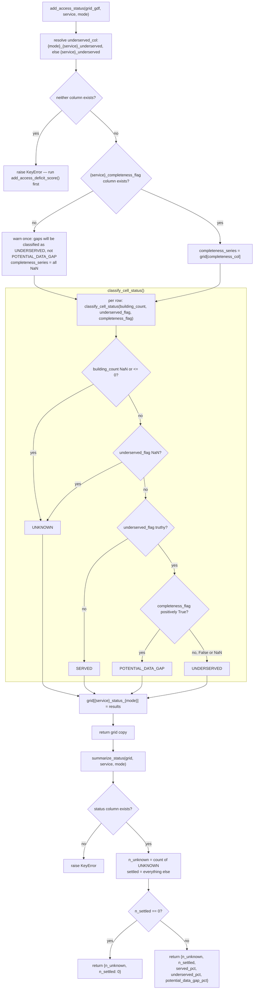

# `akure_access/status.py`

!!! info "Source"
    `akure_access/status.py` (198 lines, entirely new module)

## Purpose

Fuses two signals that are computed **entirely independently** of each
other elsewhere in this package — accessibility scoring
(`accessibility.scoring.add_access_deficit_score()`) and OSM-completeness
flagging (`completeness.grid_check.flag_completeness()`) — into **one**
per-cell, per-service status label that makes the distinction between
"confirmed underserved" and "underserved, but the underlying OSM facility
data may itself be incomplete" structurally impossible to miss.

## Why this exists — formalizing something the dashboard already did, ad hoc, in one place

This is arguably the most conceptually significant of the five new modules
in this revision, because it directly addresses a distinction this
documentation site has been careful to describe correctly every time it
came up: [`grid_check.md`](completeness/grid_check.md)'s own documentation,
[`data-flow.md`](../data-flow.md), and `dashboard/app.py`'s Findings
Summary cross-check callout (see [`dashboard-app.md`](../dashboard-app.md))
all independently express the same caution — a cell with no reachable
facility within its threshold might mean a genuine service gap, or it might
mean OSM simply hasn't mapped a facility that exists in reality. Until this
module existed, that distinction lived only as **two separate map layers**
(a deficit-score map and a completeness map) that a viewer had to mentally
cross-reference themselves, or as an **inline percentage callout** computed
ad hoc inside `dashboard/app.py`'s own Findings Summary section — nowhere
was the *per-cell* fused classification itself a first-class, reusable
output.

The module's own docstring states the stakes plainly: presenting the two
signals as separate maps "risks the system implying, even unintentionally,
that 'no mapped facility within reach' and 'no facility exists in reality'
are the same finding. They are not, and this project's own core value
proposition — distinguishing OSM coverage gaps from genuine service gaps —
depends on that distinction being visible in the **output**, not just
present somewhere in the underlying data for a sufficiently careful reader
to notice."

**This module computes nothing new.** It is purely a classification layer
over two already-computed signals — no routing, no spatial joins, nothing
that wasn't already available from `scoring.py` and `grid_check.py`
separately. Its entire contribution is making the *combination* of those
two signals a single, explicit, reusable value per cell.

## The four status categories

```python
SERVED = "served"
UNDERSERVED = "underserved"
POTENTIAL_DATA_GAP = "potential_data_gap"
UNKNOWN = "unknown"
```

| Category | Meaning |
|---|---|
| `SERVED` | Reachable within the mode's threshold. |
| `UNDERSERVED` | **Confirmed** underserved: beyond the threshold, **and** the completeness check found no reason to doubt the underlying OSM facility coverage nearby (not flagged as a possible gap). |
| `POTENTIAL_DATA_GAP` | Underserved **and** flagged by the completeness check as having no mapped facility of this type within its search radius. Deliberately ambiguous by design — this module does not try to resolve whether it's a real service gap or an OSM mapping gap; it surfaces the ambiguity rather than guessing. |
| `UNKNOWN` | Cell has no `building_count > 0` (unsettled) — not analyzed at all, not a finding about access one way or the other. |

## `STATUS_DISPLAY` — a shared reference for consistent legends

```python
STATUS_DISPLAY = {
    SERVED: {"color": "#4C9A8C", "label": "Served", "icon": "🟢"},
    UNDERSERVED: {"color": "#C4622D", "label": "Underserved", "icon": "🔴"},
    POTENTIAL_DATA_GAP: {"color": "#E8B84B", "label": "Potential OSM data gap", "icon": "🟡"},
    UNKNOWN: {"color": "#9AA0A8", "label": "Unknown (unsettled)", "icon": "⚪"},
}
```

Not enforced anywhere by this module's own logic — provided purely as a
single shared reference so a future dashboard legend or static-map legend
never independently invents a different color/label pairing that drifts
out of sync with this module's own categories. The colors reuse this
project's existing accent palette (`#4C9A8C` teal, `#C4622D` laterite
red-orange — see [`static_maps.md`](visualization/static_maps.md)'s
`ACCENT_PRIMARY`/`ACCENT_SECONDARY` constants) plus two new colors for the
gap/unknown states, **deliberately chosen to be distinguishable under
common color-vision deficiencies** — the module's own comment notes gold
and gray are both visually distinct from the served/underserved red-green
pairing independent of hue, avoiding a pure red/green-only distinguishing
cue that would be a real accessibility problem for a red-green
colorblind viewer trying to read this exact legend.

## Functions

### `classify_cell_status(building_count, underserved_flag, completeness_flag) -> str`

**What it does:** the pure classification logic for one cell/service
combination, given its three already-computed inputs.

**Decision order, and exactly what each input's missing-value state
means:**
1. `building_count` is `NaN` or `<= 0` → `UNKNOWN`, immediately. A missing
   or non-positive building count is treated as unsettled, consistent with
   how `scoring.py` treats the same condition elsewhere.
2. `underserved_flag` is `NaN` → `UNKNOWN`. In this project's existing
   scoring output, an unsettled cell's underserved flag is itself `NaN`
   (see [`scoring.md`](accessibility/scoring.md)), so in practice this
   check and the previous one are usually redundant with each other — but
   both are checked explicitly rather than relying on that redundancy
   holding in every possible caller-supplied input.
3. `underserved_flag` is falsy → `SERVED`.
4. `underserved_flag` is truthy, and `completeness_flag` is **positively**
   `True` (not `NaN`, not `False`) → `POTENTIAL_DATA_GAP`.
5. `underserved_flag` is truthy, and `completeness_flag` is anything else
   (`False`, or `NaN`/missing) → `UNDERSERVED`.

**The single most important behavioral detail in this function**, worth
stating explicitly since it's easy to get backwards: a **missing**
completeness signal (`NaN`) resolves to `UNDERSERVED`, **not**
`POTENTIAL_DATA_GAP`. This module only escalates to `POTENTIAL_DATA_GAP`
when the completeness check **positively flagged** the cell — never as a
default assumption applied just because completeness information happens
to be unavailable. This is a deliberate conservatism: treating "we don't
know" as "there's probably a data gap" would systematically overstate how
much of the underserved finding is uncertain, when the correct
interpretation of missing completeness data is simply "this dimension
wasn't checked," not "this dimension is suspect."

### `add_access_status(grid_gdf, service, mode="walk") -> GeoDataFrame`

**What it does:** appends a `{service}_status_{mode}` column by applying
`classify_cell_status()` row-wise, resolving both required input columns
with fallback logic.

**Underserved-column resolution — mirrors `scoring.py`'s own fallback
pattern deliberately:** looks for `{mode}_{service}_underserved` first,
falling back to the unsuffixed `{service}_underserved` — the same
dual-naming convention `add_access_deficit_score()` itself uses for
`mode == "walk"` backward compatibility (see
[`scoring.md`](accessibility/scoring.md)). If **neither** column exists,
raises `KeyError` with a direct pointer to the fix: "run
`accessibility.scoring.add_access_deficit_score(mode='...')` first."

**Completeness-column absence is a warning, not a hard failure:** if
`{service}_completeness_flag` is missing entirely (completeness checking
was never run for this grid), `add_access_status()` doesn't raise — it
issues one `warnings.warn()` explaining exactly what will happen as a
result ("every underserved cell for '{service}' will be classified as
UNDERSERVED rather than POTENTIAL_DATA_GAP"), then proceeds using an
all-`NaN` completeness series, which — per `classify_cell_status()`'s own
documented behavior for missing completeness data — correctly falls
through to `UNDERSERVED` for every genuinely underserved cell rather than
crashing. This lets a caller who only cares about the accessibility
dimension use this module without first being forced to also run
completeness checking, while still being clearly told what they're giving
up by skipping it.

### `summarize_status(grid_gdf, service, mode="walk") -> dict`

**What it does:** a percentage breakdown across the three settled-cell
categories (`served_pct`, `underserved_pct`, `potential_data_gap_pct`),
with `UNKNOWN` cells reported as a separate count rather than folded into
the percentage denominator.

**Why `UNKNOWN` is excluded from the percentage denominator, deliberately
mirroring `grid_check.summarize_completeness()`'s own convention:** an
unsettled cell was never a candidate for either accessibility or
completeness analysis in the first place — including it in the
denominator would dilute the reported percentages with cells that were
never "at risk" of being underserved to begin with, the same reasoning
`grid_check.py`'s own summary function already applies (see
[`grid_check.md`](completeness/grid_check.md)).

**Zero-settled-cells shape, also mirroring `grid_check.py`'s convention:**
returns `{"n_unknown": ..., "n_settled": 0}` — a deliberately smaller dict,
omitting the percentage keys entirely rather than risking a `0/0`
division — for the edge case where every cell in the grid is unsettled.

## Internal Workflow



## Gotchas

- **A missing completeness signal resolves to `UNDERSERVED`, not
  `POTENTIAL_DATA_GAP` — the opposite of what some readers might
  intuitively expect.** "We don't know if there's a data gap" is treated
  as "assume no data gap," not "assume there might be one." This is
  covered in detail above, but worth repeating here as the single easiest
  point to get backwards when reasoning about this module's behavior.
- **The warning issued by `add_access_status()` when the completeness
  column is missing fires every single call**, not just once per session —
  there's no deduplication of repeated warnings across multiple calls with
  the same missing column. A notebook cell calling this function in a loop
  across several LGAs without completeness data would print the same
  warning once per LGA.
- **This module has no dashboard or static-map integration yet.**
  `dashboard/app.py`'s existing Findings Summary cross-check callout
  computes a broadly similar cross-check **inline**, independently, and is
  unchanged by this module's addition — the two currently coexist as
  separate implementations of a conceptually related idea, not as one
  calling the other. A future refactor could have `dashboard/app.py` call
  `status.py` directly instead of recomputing its own inline percentage,
  but that consolidation hasn't happened as of this revision.
- **`STATUS_DISPLAY`'s color/label mapping is a convention, not an
  enforced contract** — nothing in this module (or elsewhere) currently
  reads from `STATUS_DISPLAY` to render anything, since no consumer has
  been wired up yet. It exists ready for a future dashboard/static-map
  integration to use.

## Related

- [`accessibility/scoring.py`](accessibility/scoring.md) — supplies
  `building_count` and the underserved flag columns this module fuses.
- [`completeness/grid_check.py`](completeness/grid_check.md) — supplies
  the completeness flag columns, and the settled-only percentage
  convention this module's `summarize_status()` deliberately mirrors.
- `dashboard/app.py`'s Findings Summary section (see
  [`dashboard-app.md`](../dashboard-app.md)) — computes a conceptually
  similar cross-check inline, independently of this module, as of this
  revision.
