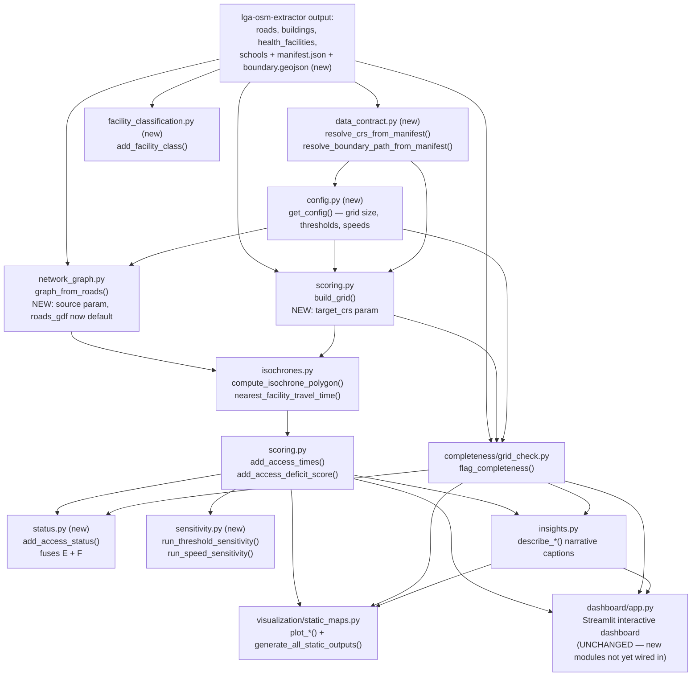

# Overview — akure-accessibility-dashboard

## Purpose

`akure-accessibility-dashboard` turns OSM road and facility data — extracted
by the companion [`lga-osm-extractor`](../lga-osm-extractor/overview.md)
repo — into a concrete answer to a planning-relevant question: **which
communities in Akure North and Akure South LGAs (Ondo State, Nigeria)
actually lack practical access to healthcare and education**, across
walking, okada (motorcycle taxi), and driving — and, just as importantly,
which apparent gaps are genuine service gaps versus places where OSM's own
mapping simply hasn't caught up yet.

It does this by building a routable road network, computing travel time
from every settled grid cell to its nearest health facility and nearest
school for each of the three travel modes, scoring each cell's access
deficit, and presenting the results through an interactive Streamlit
dashboard, publication-quality static maps with auto-generated captions,
and standalone Kepler.gl exports.

## Problem Statement

Two distinct problems motivate this repository's design, and the codebase
treats them as genuinely separate concerns rather than conflating them:

1. **Measuring accessibility correctly requires network distance, not
   straight-line distance.** A facility 800 meters away as the crow flies
   might be a 20-minute walk if the only road connecting the two points
   loops around a river or an unpaved section. Straight-line distance
   would understate real-world inaccessibility, sometimes severely. This is
   why [`isochrones.py`](modules/accessibility/isochrones.md) exists as its
   own substantial module, built on the road network from
   [`network_graph.py`](modules/accessibility/network_graph.md), rather
   than the analysis just buffering points on a map.
2. **OSM data gaps look identical to real service gaps unless explicitly
   distinguished.** A grid cell that appears "unreachable" from any health
   facility could mean one of two very different things: (a) there is
   genuinely no nearby clinic, a real service gap worth planning attention,
   or (b) there is a real clinic there, but nobody has mapped it in OSM yet
   — a data gap, not a service gap. Treating (b) as (a) risks misdirecting
   real planning resources toward an area that already has the service it
   appears to lack, while under-resourcing genuinely underserved areas
   elsewhere. This is precisely why
   [`completeness/grid_check.py`](modules/completeness/grid_check.md) exists
   as an independent analysis pathway, run alongside — not merged into —
   the accessibility scoring in
   [`scoring.py`](modules/accessibility/scoring.md), and why the dashboard
   surfaces both findings honestly rather than presenting an accessibility
   score alone as if it were unambiguous ground truth.

## System Architecture

Three structural decisions were already worth calling out; this revision
adds a fourth:

- **`completeness` is a sibling package to `accessibility`, not a
  submodule of it.** This mirrors the problem-statement split above at the
  code level — OSM-completeness flagging and accessibility scoring are
  computed independently, over the same grid, and both feed into the
  dashboard and static outputs as parallel, separately-labeled findings
  rather than being merged into one number. **New: `status.py` now
  formalizes the fusion of these two independent signals into a single
  reusable classification**, without changing the fact that `scoring.py`
  and `grid_check.py` remain computed independently of each other — see
  [`status.md`](modules/status.md).
- **`insights.py` sits between the analysis layers and the presentation
  layers.** It generates narrative captions describing what a given map or
  chart shows, consumed by *both* the live dashboard and the static export
  pipeline.
- **`dashboard/app.py` and `visualization/static_maps.py` are two
  independent consumers of the same underlying scored grid**, not a
  pipeline where one produces the other.
- **New: five modules exist as standalone library capabilities not yet
  wired into `dashboard/app.py`.** `config.py`, `data_contract.py`,
  `facility_classification.py`, `sensitivity.py`, and `status.py` are all
  genuinely new, tested capabilities — but `dashboard/app.py` itself is
  **unchanged** in this revision (confirmed by direct diff — see each
  module's own page for this same note). This is worth understanding
  architecturally: the new modules currently sit "above" or "alongside"
  the existing pipeline, consumable from notebooks or future dashboard
  work, rather than already integrated into the deployed interactive
  experience.

## Design Philosophy

**Distance and time are computed on a network, never as-the-crow-flies**,
for the reasons in the Problem Statement above.

**A grid, not individual buildings, is the unit of analysis.**
`scoring.build_grid()` creates a fishnet grid over the settled area, and
every subsequent function — access time, deficit score, completeness
flagging, and (**new**) status fusion — operates at the grid-cell level.

**Multiple travel modes are first-class, not an afterthought.** Walking,
okada, and driving are computed as three genuinely separate analyses.

**Narrative output is generated from data, not hand-written.** Every
caption produced by `insights.py` is derived programmatically from the
actual numbers behind a given map or chart.

**New: every tunable assumption lives in one place, not scattered across
independently-hardcoded copies.** Before this revision, grid cell size,
per-mode thresholds, per-mode speeds, and completeness parameters were
each defined independently in whichever module used them first —
including, in `insights.py`'s case, a manually-synced *duplicate* of
`scoring.py`'s own threshold values, a real drift risk this documentation
site had specifically flagged (see [Known Issues](../reference/known-issues.md)).
[`config.py`](modules/config.md) centralizes all of this into one
YAML-backed source of truth, resolvable via function parameter, an
environment variable, or the config file itself, in that priority order —
resolving the flagged drift risk directly, not just refactoring around it.

**New: a finding's confidence should be as visible as the finding itself.**
This project always distinguished "confirmed underserved" from "possibly
just an OSM data gap" conceptually (see the Problem Statement above), but
that distinction previously lived only as two separate map layers a viewer
had to mentally cross-reference, or an ad hoc inline percentage computed
directly inside `dashboard/app.py`. [`status.py`](modules/status.md) now
makes this distinction a first-class, per-cell, reusable output — a
`POTENTIAL_DATA_GAP` classification is now something any consumer can read
directly, not something they have to reconstruct by comparing two
different maps themselves.

**New: reproducibility matters more than routing fidelity, when the two
are in tension.** `network_graph.py`'s default construction path reversal
— `roads_gdf` (the extractor's versioned, cached export) now preferred
over a live OSM query, even when a boundary is available — is a direct
expression of this priority. See [`network_graph.md`](modules/accessibility/network_graph.md)
for the full reasoning and its trade-offs.

**New: no finding should be presented as if it were the only reasonable
answer.** [`sensitivity.py`](modules/sensitivity.md) exists specifically
to test whether this project's conclusions hold up under reasonable
alternative assumptions (different thresholds, different speeds) — treating
both "the finding is robust" and "the finding is sensitive to this
assumption" as valuable, honestly-reported outcomes, rather than
presenting one specific parameter choice as ground truth.

## Module Map

| File | Responsibility |
|---|---|
| `akure_access/accessibility/network_graph.py` | Build a routable graph per travel mode — **now defaults to the extractor's versioned `roads_gdf` rather than a live OSM query** |
| `akure_access/accessibility/isochrones.py` | Compute travel-time isochrones and nearest-facility distance/time per grid cell |
| `akure_access/accessibility/scoring.py` | Build the analysis grid; compute access times and the composite deficit score |
| `akure_access/completeness/grid_check.py` | Flag grid cells where OSM likely has incomplete facility coverage, independent of accessibility scoring |
| `akure_access/visualization/static_maps.py` | Generate publication-quality static maps and charts |
| `akure_access/insights.py` | Generate data-driven narrative captions, shared by the dashboard and static exports |
| `akure_access/config.py` **(new)** | Centralize every tunable numeric assumption (grid size, thresholds, speeds) in one YAML-backed source of truth |
| `akure_access/data_contract.py` **(new)** | Read `manifest.json`/`boundary.geojson` from the extractor, resolving CRS and boundary path without re-deriving or re-querying independently |
| `akure_access/facility_classification.py` **(new)** | Classify health/education facilities into human-meaningful subtypes using the extractor's new semantic OSM tags |
| `akure_access/sensitivity.py` **(new)** | Test whether findings are robust to reasonable variation in thresholds/speeds |
| `akure_access/status.py` **(new)** | Fuse accessibility scoring and completeness flagging into one per-cell classification (Served / Underserved / Potential Data Gap / Unknown) |
| `dashboard/app.py` | The interactive Streamlit dashboard (741 lines, the largest file in either repo) — **unchanged in this revision**, does not yet consume any of the five new modules |
| `tests/` | Test coverage across the above, plus a dedicated cross-repo integration test — **unchanged in this revision**, does not yet cover any of the new contract surface (`manifest.json`, `boundary.geojson`) |

## Dependencies Between Components

- `isochrones.py` depends on `network_graph.py` for its graph input.
- `scoring.py` depends on **both** `network_graph.py` and `isochrones.py`
  directly, and (**new**) on `config.py` for its default threshold/cell-size
  constants.
- `completeness/grid_check.py` depends on `scoring.build_grid()`'s grid
  output and (**new**) `config.py`, but is otherwise independent of
  `accessibility`.
- `insights.py` depends on the *outputs* of both `scoring.py` and
  `grid_check.py`, and (**new**) on `config.py` for its default threshold
  values — no longer an independently-hardcoded copy of them.
- `visualization/static_maps.py` depends on `insights.py` and the
  scored/flagged grid outputs, unchanged.
- **New: `network_graph.py` depends on `config.py`** for `MODE_CONFIG`'s
  speed values.
- **New: `facility_classification.py` depends on `lga_extractor.clean.py`'s
  `SEMANTIC_COLUMNS`** existing in its input — it has no meaningful output
  without that upstream schema change, and depends on no other module in
  this package.
- **New: `status.py` depends on the *outputs* of both `scoring.py` (the
  underserved flags) and `grid_check.py` (the completeness flags)**, the
  same dependency shape as `insights.py` — a pure fusion layer with no
  computation of its own beyond combining two already-computed signals.
- **New: `sensitivity.py` depends on `scoring.py`, `network_graph.py`, and
  `isochrones.py` directly** — its speed-sweep function re-invokes the full
  routing stack, unlike every other consumer of scored output, which reads
  already-computed results.
- **New: `data_contract.py` depends only on the file system** (reading
  `manifest.json`/`boundary.geojson` from a given directory) — it has no
  dependency on any other module in this package, and is the one module
  whose entire purpose is bridging to the *other* repository rather than
  composing with the rest of this one.
- **New: `config.py` is depended upon by five other modules**
  (`scoring.py`, `network_graph.py`, `grid_check.py`, `insights.py`, and
  indirectly `sensitivity.py` via its `AKURE_ACCESS_CONFIG`-driven sweep
  mechanism) **but depends on nothing else in this package itself** — it
  sits at the base of the dependency graph, alongside `data_contract.py`.
- `dashboard/app.py` remains the one place that ties most (not all, as of
  this revision — see above) other modules together at runtime.
