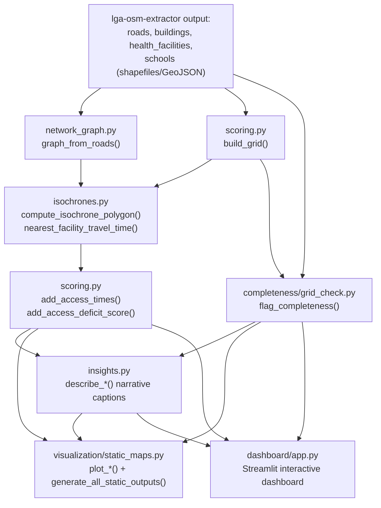

# Overview — akure-accessibility-dashboard

## Purpose

`akure-accessibility-dashboard` turns OSM road and facility data — extracted
by the companion [`lga-osm-extractor`](../lga-osm-extractor/overview.md)
repo — into a concrete answer to a planning-relevant question: **which
communities in Akure North and Akure South LGAs (Ondo State, Nigeria)
actually lack practical access to healthcare and education**, across
walking, okada (motorcycle taxi), and driving — and, just as importantly,
which apparent gaps are genuine service gaps versus places where OSM's own
mapping simply hasn't caught up yet.

It does this by building a routable road network, computing travel time
from every settled grid cell to its nearest health facility and nearest
school for each of the three travel modes, scoring each cell's access
deficit, and presenting the results through an interactive Streamlit
dashboard, publication-quality static maps with auto-generated captions,
and standalone Kepler.gl exports.

## Problem Statement

Two distinct problems motivate this repository's design, and the codebase
treats them as genuinely separate concerns rather than conflating them:

1. **Measuring accessibility correctly requires network distance, not
   straight-line distance.** A facility 800 meters away as the crow flies
   might be a 20-minute walk if the only road connecting the two points
   loops around a river or an unpaved section. Straight-line distance
   would understate real-world inaccessibility, sometimes severely. This is
   why [`isochrones.py`](modules/accessibility/isochrones.md) exists as its
   own substantial module, built on the road network from
   [`network_graph.py`](modules/accessibility/network_graph.md), rather
   than the analysis just buffering points on a map.
2. **OSM data gaps look identical to real service gaps unless explicitly
   distinguished.** A grid cell that appears "unreachable" from any health
   facility could mean one of two very different things: (a) there is
   genuinely no nearby clinic, a real service gap worth planning attention,
   or (b) there is a real clinic there, but nobody has mapped it in OSM yet
   — a data gap, not a service gap. Treating (b) as (a) risks misdirecting
   real planning resources toward an area that already has the service it
   appears to lack, while under-resourcing genuinely underserved areas
   elsewhere. This is precisely why
   [`completeness/grid_check.py`](modules/completeness/grid_check.md) exists
   as an independent analysis pathway, run alongside — not merged into —
   the accessibility scoring in
   [`scoring.py`](modules/accessibility/scoring.md), and why the dashboard
   surfaces both findings honestly rather than presenting an accessibility
   score alone as if it were unambiguous ground truth.

## System Architecture

Three structural decisions are worth calling out:

- **`completeness` is a sibling package to `accessibility`, not a
  submodule of it.** This mirrors the problem-statement split above at the
  code level — OSM-completeness flagging and accessibility scoring are
  computed independently, over the same grid, and both feed into the
  dashboard and static outputs as parallel, separately-labeled findings
  rather than being merged into one number.
- **`insights.py` sits between the analysis layers and the presentation
  layers.** It generates narrative captions describing what a given map or
  chart shows, consumed by *both* the live dashboard and the static export
  pipeline — meaning a caption's wording only has to be gotten right once
  to be correct everywhere it's used, rather than the dashboard and static
  exports each hand-writing separate descriptions that could drift out of
  sync with the underlying numbers.
- **`dashboard/app.py` and `visualization/static_maps.py` are two
  independent consumers of the same underlying scored grid**, not a
  pipeline where one produces the other — the interactive dashboard and the
  publication-quality static exports are both "views" over
  `scoring.py`'s/`grid_check.py`'s output, generated separately, so a
  static map can be produced without ever running the Streamlit app.

## Design Philosophy

**Distance and time are computed on a network, never as-the-crow-flies**,
for the reasons in the Problem Statement above — this shows up concretely
as every accessibility function in `isochrones.py` operating on a
`networkx` graph rather than raw point-to-point geometry.

**A grid, not individual buildings, is the unit of analysis.** Rather than
scoring accessibility per-building (which would be noisy, and implies a
precision the underlying road/speed assumptions don't actually support),
`scoring.build_grid()` creates a fishnet grid over the settled area, and
every subsequent function — access time, deficit score, completeness
flagging — operates at the grid-cell level. This is a deliberate choice
about what level of precision the analysis can honestly claim.

**Multiple travel modes are first-class, not an afterthought.** Walking,
okada, and driving are computed as three genuinely separate analyses (three
separate graphs, three separate sets of travel times and deficit scores),
not one analysis with a mode-adjustment factor applied after the fact — this
matters because the *relative* accessibility picture can differ meaningfully
by mode (a cell might be reasonably walkable but poorly served by drivable
roads, or vice versa), and the project's own headline findings (walking
being dramatically more restrictive than okada/driving in both LGAs) depend
on that distinction being preserved rather than averaged away.

**Narrative output is generated from data, not hand-written.** Every
caption produced by `insights.py` is derived programmatically from the
actual numbers behind a given map or chart — this guarantees a caption
never says something the underlying data doesn't actually support, and
means the dashboard/static exports stay accurate automatically as
underlying data changes (e.g. a re-extraction with updated OSM data),
without anyone needing to remember to manually update prose elsewhere.

## Module Map

| File | Responsibility |
|---|---|
| `akure_access/accessibility/network_graph.py` | Build a routable graph per travel mode from cleaned roads data |
| `akure_access/accessibility/isochrones.py` | Compute travel-time isochrones and nearest-facility distance/time per grid cell |
| `akure_access/accessibility/scoring.py` | Build the analysis grid; compute access times and the composite deficit score |
| `akure_access/completeness/grid_check.py` | Flag grid cells where OSM likely has incomplete facility coverage, independent of accessibility scoring |
| `akure_access/visualization/static_maps.py` | Generate publication-quality static maps and charts |
| `akure_access/insights.py` | Generate data-driven narrative captions, shared by the dashboard and static exports |
| `dashboard/app.py` | The interactive Streamlit dashboard (741 lines, the largest file in either repo) |
| `tests/` | Test coverage across the above, plus a dedicated cross-repo integration test |

## Dependencies Between Components

- `isochrones.py` depends on `network_graph.py` for its graph input — it
  has no graph-building logic of its own.
- `scoring.py` depends on **both** `network_graph.py` and `isochrones.py`
  directly — `add_access_times()` imports and calls `graph_from_roads()`
  itself (once per travel mode) to build the graph it then hands to
  `isochrones.batch_nearest_facility_distances()`. The graph-building step
  is not encapsulated behind `isochrones.py`; `scoring.py` owns the
  decision of *when* to build a fresh graph (once per mode, inside its own
  mode loop) and passes the result into `isochrones.py`'s routing
  functions.
- `completeness/grid_check.py` depends on `scoring.build_grid()`'s grid
  output but is otherwise independent of `accessibility` — it does not use
  the road network or travel-time computations at all, consistent with it
  being a data-quality check rather than an accessibility measure.
- `insights.py` depends on the *outputs* of both `scoring.py` and
  `grid_check.py` (whatever numbers/columns they produce), but has no
  dependency on `network_graph.py` or `isochrones.py` directly — it works
  from already-computed results, not raw graphs.
- `visualization/static_maps.py` depends on `insights.py` (for captions)
  and on the scored/flagged grid outputs, but not on `network_graph.py` or
  `isochrones.py` directly, for the same reason.
- `dashboard/app.py` is the one place that ties every other module
  together at runtime — it's the closest equivalent this repo has to
  `lga-osm-extractor`'s `pipeline.py`, though structured as an interactive
  Streamlit script rather than a single callable orchestration function.
