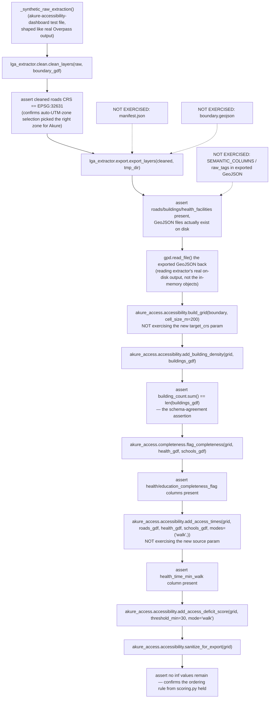

# Cross-Repo Integration

This page documents the data contract between
[`lga-osm-extractor`](../lga-osm-extractor/overview.md) (produces data) and
[`akure-accessibility-dashboard`](../akure-accessibility-dashboard/overview.md)
(consumes data) — anchored directly to
`akure-accessibility-dashboard/tests/test_cross_repo_integration.py`, which
functions as the **executable specification** of this contract: it's the
one place in either codebase where both packages are actually imported and
exercised together, end to end, against synthetic-but-realistically-shaped
data.

!!! warning "The most important fact on this page"
    **`test_cross_repo_integration.py` is byte-identical to its
    pre-revision version.** Both repositories underwent substantial
    changes in this revision — a richer attribute schema, two new export
    artifacts, a reversed default routing-graph source, a formal manifest
    contract — and **none of it is exercised by the one test whose entire
    job is confirming the two repositories actually agree with each
    other.** Every claim on this page about the *current* contract is
    accurate as of reading both repositories' source directly, but is no
    longer fully backed by this executable specification the way it was
    before this revision. See [Known Failure Modes](#known-failure-modes)
    below for the specific, concrete risks this creates.

## Why This Test File Exists, and How It's Run

The test file's own docstring is direct about its purpose: verifying that
`lga-osm-extractor`'s actual output schema is what
`akure-accessibility-dashboard`'s analysis functions expect — that the two
sibling repositories genuinely work together, "not just that each one's own
unit tests pass in isolation." Every other test in both repositories tests
one package alone; this file is the only one that imports both.

Two deliberate design choices keep this test practical to run:

- **It requires `lga_extractor` to be importable alongside `akure_access`**,
  which most environments won't have set up by default — so the test uses
  `pytest.importorskip("lga_extractor", ...)`, meaning it's automatically
  **skipped, not failed**, in the regular single-repo test suite/CI job for
  either repository. A dedicated CI workflow
  (`.github/workflows/cross-repo-integration.yml`) checks out *both*
  repositories and installs both packages specifically to run this file.
- **No live OSM/Overpass calls are made.** `lga_extractor`'s real cleaning
  and export functions (`clean_layers()`, `export_layers()`) are exercised
  directly against small synthetic `GeoDataFrame`s shaped like real OSM
  output — keeping the test fast and network-independent while still
  testing the real schema contract between the two packages, not a
  simplified stand-in for it.
- **The synthetic coordinates are deliberately realistic, not arbitrary.**
  The fixture builds its fake buildings/roads/facilities using small
  offsets (thousandths of a degree) around a real reference point near
  Akure (roughly 7.25°N, 5.20°E) — not large, arbitrary plane-scale
  numbers, for reasons explained in the test's own docstring around
  avoiding an accidental lat/lon-vs-projected-coordinate mismatch.

## What the Extractor Now Produces (this revision)

From [`lga_extractor.export.export_layers()`](../lga-osm-extractor/modules/export.md),
after [`clean_layers()`](../lga-osm-extractor/modules/clean.md) has run:

- **Format**: GeoJSON (always) and Shapefile (split by geometry category
  where needed) per layer, written to a caller-specified output directory
  — plus, **new**, `boundary.geojson` (the boundary polygon itself) and
  `manifest.json` (a formal, versioned summary of the whole run) written
  to the same directory.
- **Schema — changed significantly, in a way the current contract test
  does not verify.** GeoJSON now carries `CORE_COLUMNS` (`osmid`, `name`,
  `geometry` — the old, only, schema) **plus** a curated per-layer set of
  `SEMANTIC_COLUMNS` (e.g. a road's `surface`/`maxspeed`, a hospital's
  `beds`/`emergency`, whichever are actually present) **plus**
  `RAW_TAGS_COLUMN` (a JSON-encoded copy of every original OSM tag).
  Shapefile output, by contrast, is now **deliberately reduced** to
  `CORE_COLUMNS` only, via `_shapefile_safe_columns()` — meaning GeoJSON
  and Shapefile output for the same layer now carry genuinely different
  schemas, a real behavior change from before this revision, when both
  formats always carried identical (minimal) columns.
- **CRS**: a UTM zone auto-selected from the boundary's centroid via
  `clean.resolve_target_crs()` — unchanged mechanism. **New:** this
  determination is now also recorded in `manifest.json`'s `target_crs`
  field, readable via
  [`akure_access.data_contract.resolve_crs_from_manifest()`](../akure-accessibility-dashboard/modules/data_contract.md)
  — see below for how the dashboard side changed to consume it.
- **Geometry guarantee for `health_facilities`/`schools`**: unchanged —
  every feature in these two layers is still guaranteed to be a `Point`,
  via `clean._collapse_areas_to_points()`.
- **New: structured per-layer status.** `layers.extract_layers()`'s
  `"_status"` dict and `manifest.json`'s `layers` field now record, per
  layer, whether the extraction query genuinely succeeded, succeeded with
  zero features, or failed — a distinction previously only reachable
  through free-text warning strings. Nothing on the dashboard side
  currently reads this new structured signal.

## What the Dashboard Now Expects (this revision)

From [`akure_access.accessibility`](../akure-accessibility-dashboard/modules/accessibility/network_graph.md)
and [`akure_access.completeness`](../akure-accessibility-dashboard/modules/completeness/grid_check.md):

- **`build_grid(boundary_gdf, cell_size_m, target_crs=None)`** — **new
  parameter**: `target_crs` can now be supplied explicitly (ideally
  sourced from the manifest, via `data_contract.resolve_crs_from_manifest()`),
  falling back to `FALLBACK_CRS` (`"EPSG:32631"`) only if omitted. This is
  a genuine, if partial, resolution of the CRS-hardcoding gap documented on
  this page before this revision — see [Known Issues](../reference/known-issues.md).
- **`add_building_density(grid, buildings_gdf)`** — unchanged; still only
  needs `geometry`.
- **`add_access_times(grid, roads_gdf, health_gdf, schools_gdf, ...,
  source="auto")`** — **new parameter**: `source` controls whether the
  routing graph is built from `roads_gdf` (now the default, whenever
  available) or a live OSM query. This means the dashboard's *default*
  behavior, as of this revision, **no longer requires live network access
  at analysis time** for the routing step specifically — a meaningful
  reliability improvement for reproducing a past analysis run offline,
  though `visualization/static_maps.py`'s basemap-tile fetching and the
  original graph-building call in Notebook 03 may still involve network
  access depending on configuration.
- **`flag_completeness(grid, health_gdf, schools_gdf, ...)`** — unchanged.
- **CRS**: previously hardcoded to `EPSG:32631` unconditionally; **now
  configurable** via `build_grid()`'s `target_crs` parameter, with
  `EPSG:32631` remaining only the *fallback* when no explicit value is
  supplied. The contract's correctness for LGAs outside UTM Zone 31N now
  depends on whether the caller actually threads `target_crs` through from
  the manifest — see [`scoring.md`](../akure-accessibility-dashboard/modules/accessibility/scoring.md)'s
  own Gotchas for the remaining gap.
- **New: `data_contract.py`** reads `manifest.json`/`boundary.geojson`
  directly, rather than any `akure_access` function re-deriving or
  re-querying either independently. This is a new, optional first step in
  the contract's consumption path — see
  [`data_contract.md`](../akure-accessibility-dashboard/modules/data_contract.md).

## Schema Table (Updated for This Revision)

| Field | Type | Produced by | Consumed by |
|---|---|---|---|
| `osmid` | int/str | `lga_extractor.clean._clean_single_layer()` | Not directly used by `akure_access` scoring — retained for traceability/debugging only |
| `name` | str or `None` | `lga_extractor.clean._clean_single_layer()` | Not directly used by `akure_access` scoring |
| **`SEMANTIC_COLUMNS` (new)** | Per-layer curated OSM tags, present only when the source data has them | `lga_extractor.clean._clean_single_layer()` | `akure_access.facility_classification` (new) — the only current consumer; not read by `scoring.py`, `grid_check.py`, or `dashboard/app.py` |
| **`RAW_TAGS_COLUMN` = `raw_tags` (new)** | JSON string, full original tag set | `lga_extractor.clean._row_tags_to_json()` | No current `akure_access` consumer |
| `geometry` (roads) | `LineString`/`MultiLineString`/`Point` (mixed, may be split across Shapefiles) | `lga_extractor.layers` + `clean` | `network_graph.graph_from_roads()` |
| `geometry` (buildings) | `Polygon`/`MultiPolygon` | `lga_extractor.layers` + `clean` | `scoring.add_building_density()` |
| `geometry` (health_facilities / schools) | **`Point` only**, guaranteed by `clean._collapse_areas_to_points()` | `lga_extractor.clean` | `isochrones.nearest_graph_node()`, `grid_check._flag_via_spatial_index()`, `facility_classification` (new) |
| CRS (all layers) | Auto-selected upstream; **now optionally propagated downstream via `manifest.json`** (was: hardcoded downstream) | `lga_extractor.clean.resolve_target_crs()` | `akure_access.accessibility.scoring.build_grid()`, now via optional `target_crs` param |
| **`boundary.geojson` (new)** | The boundary polygon itself, EPSG:4326 | `pipeline.extract_lga()` | `data_contract.resolve_boundary_path_from_manifest()` (new) — the only current consumer |
| **`manifest.json` (new)** | Versioned JSON summary — see [`manifest.md`](../lga-osm-extractor/modules/manifest.md) for the full shape | `lga_extractor.manifest.write_manifest()` | `akure_access.data_contract` (new) |

## What the Integration Test Actually Exercises — Unchanged Since Before This Revision

`test_extractor_output_schema_matches_dashboard_expectations()` runs the
full real chain in one test: builds synthetic raw layers → `clean_layers()`
→ asserts the resulting CRS is `EPSG:32631` → `export_layers()` to a temp
directory → reads the exported GeoJSON back off disk → feeds it directly
into `build_grid()` → `add_building_density()` → `flag_completeness()` →
`add_access_times()` (using the geometry-fallback graph path, no live OSM
needed) → `add_access_deficit_score()` → `sanitize_for_export()`. A second
test, `test_extractor_run_log_captures_environment_for_reproducibility()`,
checks the run-log side of the contract.

**None of this exercises anything new.** `build_grid()` is called without
a `target_crs` argument (exercising only the fallback path);
`add_access_times()` is called without a `source` argument (exercising
only the implicit default, and not testing that the default actually
resolves to `"roads_gdf"` given the test's own boundary is also supplied);
`manifest.json` and `boundary.geojson` are never read or asserted against;
the richer GeoJSON schema (semantic columns, raw tags) is present in the
test's actual exported files but nothing in the test inspects it.

The same chain, visually — **unchanged from before this revision**, shown
here specifically so the gap between "what this diagram covers" and "what
actually changed" is visible at a glance:

## Known Failure Modes

- **If the extractor's auto-selected UTM zone ever differed from
  `EPSG:32631`**, and a caller doesn't explicitly thread `target_crs`
  through from the manifest, every downstream `akure_access` function
  would still silently operate on geometry in the wrong metric CRS
  relative to `build_grid()`'s fallback default. This risk is now
  **partially, not fully, mitigated** — `target_crs` exists as an escape
  hatch, but nothing forces a caller to use it. See
  [Known Issues](../reference/known-issues.md).
- **New: `manifest.json`/`boundary.geojson` could silently drift out of
  sync with what `data_contract.py` expects, with no test to catch it.**
  Because the cross-repo integration test doesn't exercise either file,
  a future change to `manifest.py`'s output shape (a renamed field, a
  restructured `layers` dict) could break `data_contract.py`'s parsing
  silently — the failure would only surface as a downstream warning or
  incorrect fallback value, not a test failure at the point the
  incompatibility was actually introduced.
- **New: the GeoJSON/Shapefile schema divergence is untested at the
  cross-repo level.** Nothing in the integration test confirms that a
  dashboard-side consumer reading GeoJSON gets the richer schema it might
  expect, or that Shapefile-only consumers aren't broken by the new
  columns (they aren't — Shapefile output was deliberately kept minimal —
  but this guarantee rests entirely on `export.py`'s own unit tests, not
  on anything confirming the dashboard side's expectations match).
- **New: `add_access_times()`'s `source` parameter default (`"auto"`,
  preferring `roads_gdf`) is not exercised in a scenario where both
  `roads_gdf` and a boundary are supplied together** — exactly the
  scenario the integration test's own fixture creates, and exactly the
  scenario this revision's default-path reversal is most consequential
  for. The test currently can't distinguish "the graph was built from
  roads_gdf because that's the new default" from "the graph was built via
  live OSM because a boundary happened to be present" — both would produce
  a graph that passes the test's existing assertions, since neither
  assertion inspects `G.graph["source"]`.
- **If a facility layer's Polygon-to-Point collapse were ever skipped or
  broken upstream** (the original Akure North bug) — unchanged risk
  description from before this revision; `isochrones.nearest_graph_node()`'s
  `.centroid` fallback would still prevent an outright crash, and the
  cross-repo test still doesn't directly assert geometry *type* on
  exported facility layers.

## What Would Close These Gaps

Stated plainly, since every item above points at the same underlying fix:
extending `test_extractor_output_schema_matches_dashboard_expectations()`
(or adding sibling tests in the same file) to: (1) read and assert against
`manifest.json`'s and `boundary.geojson`'s presence and shape; (2) call
`build_grid()` with an explicit `target_crs` sourced from
`data_contract.resolve_crs_from_manifest()`, not the implicit fallback;
(3) call `add_access_times()` with `source="auto"` in a scenario with both
`roads_gdf` and a boundary present, and assert `G.graph["source"] ==
"roads_gdf"`; and (4) assert at least one `SEMANTIC_COLUMNS` value and the
presence of `RAW_TAGS_COLUMN` survive the full round trip. None of this
requires new production code — every capability being tested already
exists and is unit-tested in isolation on each side; what's missing is the
cross-repo assertion tying them together, which is precisely this test
file's stated purpose.
