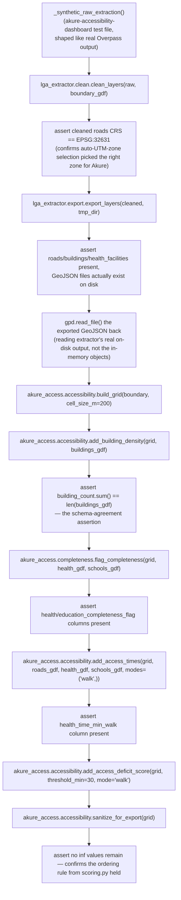

# Cross-Repo Integration

This page documents the data contract between
[`lga-osm-extractor`](../lga-osm-extractor/overview.md) (produces data) and
[`akure-accessibility-dashboard`](../akure-accessibility-dashboard/overview.md)
(consumes data) — anchored directly to
`akure-accessibility-dashboard/tests/test_cross_repo_integration.py`, which
functions as the **executable specification** of this contract: it's the
one place in either codebase where both packages are actually imported and
exercised together, end to end, against synthetic-but-realistically-shaped
data.

## Why This Test File Exists, and How It's Run

The test file's own docstring is direct about its purpose: verifying that
`lga-osm-extractor`'s actual output schema is what
`akure-accessibility-dashboard`'s analysis functions expect — that the two
sibling repositories genuinely work together, "not just that each one's own
unit tests pass in isolation." Every other test in both repositories tests
one package alone; this file is the only one that imports both.

Two deliberate design choices keep this test practical to run:

- **It requires `lga_extractor` to be importable alongside `akure_access`**,
  which most environments won't have set up by default — so the test uses
  `pytest.importorskip("lga_extractor", ...)`, meaning it's automatically
  **skipped, not failed**, in the regular single-repo test suite/CI job for
  either repository. A dedicated CI workflow
  (`.github/workflows/cross-repo-integration.yml`) checks out *both*
  repositories and installs both packages specifically to run this file.
- **No live OSM/Overpass calls are made.** `lga_extractor`'s real cleaning
  and export functions (`clean_layers()`, `export_layers()`) are exercised
  directly against small synthetic `GeoDataFrame`s shaped like real OSM
  output — keeping the test fast and network-independent while still
  testing the real schema contract between the two packages, not a
  simplified stand-in for it.
- **The synthetic coordinates are deliberately realistic, not arbitrary.**
  The fixture builds its fake buildings/roads/facilities using small
  offsets (thousandths of a degree) around a real reference point near
  Akure (roughly 7.25°N, 5.20°E) — not large, arbitrary plane-scale
  numbers. This matters for a specific, easy-to-miss reason: labeling a
  large plane-scale coordinate pair (say, `x=650, y=650`) as if it were
  EPSG:4326 lat/lon would place it far outside valid longitude/latitude
  range, and reprojecting a "coordinate" like that into a UTM CRS sends
  it toward infinity. Using genuinely realistic Akure-area coordinates
  means the test exercises the real auto-UTM-zone-selection path under
  the same kind of input it will actually see in production, rather than
  accidentally sidestepping the exact class of bug (a lat/lon vs.
  projected-coordinate mismatch) this whole cross-repo boundary is most
  at risk of.

## What the Extractor Produces

From [`lga_extractor.export.export_layers()`](../lga-osm-extractor/modules/export.md),
after [`clean_layers()`](../lga-osm-extractor/modules/clean.md) has run:

- **Format**: GeoJSON (always) and Shapefile (split by geometry category
  where needed) per layer, written to a caller-specified output directory.
- **Schema**: exactly three columns per layer — `osmid`, `name`,
  `geometry` — per `clean.py`'s `KEEP_COLUMNS` constant.
- **CRS**: a UTM zone auto-selected from the boundary's centroid via
  `clean.resolve_target_crs()` — for the Akure North/South study area
  specifically, this resolves to **`EPSG:32631`** (UTM Zone 31N), which
  the cross-repo test explicitly asserts as a check that the auto-selected
  zone matches what the dashboard repo hardcodes as its own fixed CRS (see
  [Known Issues](../reference/known-issues.md) for why these two repos
  handle CRS selection differently).
- **Geometry guarantee for `health_facilities`/`schools`**: every feature
  in these two layers is guaranteed to be a `Point` — never a `Polygon`/
  `MultiPolygon` — because `clean.py`'s `_collapse_areas_to_points()`
  collapses any area geometry to its centroid before export. This
  guarantee is precisely what makes the Akure North bug fix effective at
  the schema-contract level: the dashboard's routing/isochrone code can
  assume `.x`/`.y` attributes exist on every facility without a defensive
  fallback of its own having to fire (though, per
  [`isochrones.md`](../akure-accessibility-dashboard/modules/accessibility/isochrones.md),
  `nearest_graph_node()` does keep a second-line-of-defense `.centroid`
  fallback anyway).

## What the Dashboard Expects

From [`akure_access.accessibility`](../akure-accessibility-dashboard/modules/accessibility/network_graph.md)
and [`akure_access.completeness`](../akure-accessibility-dashboard/modules/completeness/grid_check.md):

- **`build_grid(boundary_gdf, cell_size_m)`** needs only a boundary
  polygon — no dependency on extractor output directly.
- **`add_building_density(grid, buildings_gdf)`** needs the `buildings`
  layer's `geometry` column (for the spatial join) — `osmid`/`name` aren't
  used.
- **`add_access_times(grid, roads_gdf, health_gdf, schools_gdf, ...)`**
  needs: `roads_gdf`'s `geometry` (for `graph_from_roads()`); `health_gdf`/
  `schools_gdf`'s `geometry` specifically as `Point` geometry (per the
  extractor's collapse guarantee above) — a `Polygon` slipping through
  would still be tolerated by `isochrones.nearest_graph_node()`'s
  `.centroid` fallback, but is not the contract this function is written
  to expect.
- **`flag_completeness(grid, health_gdf, schools_gdf, ...)`** needs the
  same `Point`-geometry facility layers, for its own nearest-neighbor
  spatial join.
- **CRS**: every function above assumes `EPSG:32631` specifically —
  hardcoded in `scoring.build_grid()`'s reprojection step, not
  auto-detected — meaning the contract implicitly assumes the extractor's
  auto-selected zone for this project's actual LGAs happens to match this
  hardcoded value (which it does, for Akure North/South, but wouldn't for
  an LGA outside UTM Zone 31N — see [Known Issues](../reference/known-issues.md)).

## Schema Table

| Field | Type | Produced by | Consumed by |
|---|---|---|---|
| `osmid` | int/str | `lga_extractor.clean._clean_single_layer()` | Not directly used by `akure_access` scoring — retained for traceability/debugging only |
| `name` | str or `None` | `lga_extractor.clean._clean_single_layer()` | Not directly used by `akure_access` scoring |
| `geometry` (roads) | `LineString`/`MultiLineString`/`Point` (mixed, may be split across files) | `lga_extractor.layers` + `clean` | `network_graph.graph_from_roads()` |
| `geometry` (buildings) | `Polygon`/`MultiPolygon` | `lga_extractor.layers` + `clean` | `scoring.add_building_density()` (spatial join only, geometry type not otherwise constrained) |
| `geometry` (health_facilities / schools) | **`Point` only**, guaranteed by `clean._collapse_areas_to_points()` | `lga_extractor.clean` | `isochrones.nearest_graph_node()`, `grid_check._flag_via_spatial_index()` |
| CRS (all layers) | `EPSG:32631` for the Akure North/South study area (auto-selected upstream, hardcoded downstream) | `lga_extractor.clean.resolve_target_crs()` | `akure_access.accessibility.scoring` (hardcoded assumption) |

## What the Integration Test Actually Exercises

`test_extractor_output_schema_matches_dashboard_expectations()` runs the
full real chain in one test: builds synthetic raw layers → `clean_layers()`
(with a real synthetic Akure-area boundary, exercising the actual
auto-UTM-selection path, not just the no-boundary fallback) → asserts the
resulting CRS is `EPSG:32631` → `export_layers()` to a temp directory →
reads the exported GeoJSON back off disk → feeds it directly into
`build_grid()` → `add_building_density()` (asserting the building count
matches exactly) → `flag_completeness()` → `add_access_times()` (using the
geometry-fallback graph path, no live OSM needed) → `add_access_deficit_score()`
→ `sanitize_for_export()` (asserting no `inf` values remain). A second test,
`test_extractor_run_log_captures_environment_for_reproducibility()`, checks
the run-log side of the contract.

This means the schema contract documented on this page isn't just prose —
every claim above is backed by an assertion in this one test file, and a
change to either repo that broke the contract (a renamed column, a changed
CRS default, a reintroduced Polygon-facility bug) would fail this specific
test, not silently surface as a downstream analysis bug later.

The same chain, visually:

## Known Failure Modes

- **If the extractor's auto-selected UTM zone ever differed from
  `EPSG:32631`** (e.g. the dashboard were pointed at an LGA outside Ondo
  State), every downstream `akure_access` function would silently operate
  on geometry that's technically valid but in the *wrong* metric CRS
  relative to the dashboard's hardcoded assumption — producing plausible
  but wrong distances/areas, not an error. See
  [Known Issues](../reference/known-issues.md).
- **If a facility layer's Polygon-to-Point collapse were ever skipped or
  broken upstream** (the original Akure North bug), `isochrones.nearest_graph_node()`'s
  `.centroid` fallback would still prevent an outright crash, but the
  cross-repo test's own schema assertion doesn't currently check geometry
  *type* on the exported facility layers directly — it's implicitly
  covered by the fact that the collapse function runs as part of
  `clean_layers()` in the test's own pipeline, but a more direct assertion
  (`assert (health_gdf.geom_type == "Point").all()`) would make this
  specific guarantee explicit rather than incidental to how the test
  happens to be structured.
