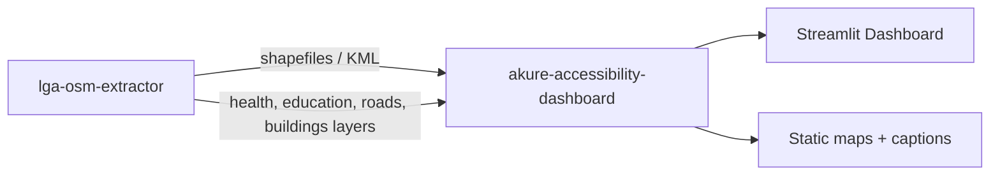

# Akure Geospatial Systems Documentation

This site documents two connected repositories built for **Map<>kathon 2026 (UseOSM)**,
analyzing multi-modal healthcare and education accessibility across Akure North and
Akure South Local Government Areas (LGAs), Ondo State, Nigeria.

## The Problem

Planning decisions about where to site clinics, schools, and roads depend on knowing
who can actually reach existing services — and how long that takes on foot, by
motorcycle taxi (okada), or by car. OpenStreetMap (OSM) has rich, free data for this,
but it is inconsistent in coverage and geometry type across regions, and turning raw
OSM extracts into a defensible accessibility analysis requires a full geospatial
pipeline: boundary resolution, feature extraction, cleaning, network routing,
isochrone computation, and scoring.

This system does that end to end, and packages the result as an interactive
dashboard aimed at planners and researchers working on SDG 3 (Health) and
SDG 4 (Education) in the Akure region.

## The Two Repositories

- **[lga-osm-extractor](lga-osm-extractor/overview.md)**
  Pulls an LGA boundary and its OSM feature layers (health, education, roads,
  buildings), cleans and reprojects them, and exports analysis-ready shapefiles
  and KML for downstream use in ArcGIS Pro, Google Earth Pro, or the dashboard
  below.

- **[akure-accessibility-dashboard](akure-accessibility-dashboard/overview.md)**
  Consumes the extractor's output to build a routable road network, compute
  travel-time isochrones per facility and mode, score a fishnet grid for
  accessibility and data completeness, generate static publication maps and
  narrative captions, and serve everything through an interactive Streamlit
  dashboard.

## How They Relate

See [Cross-Repo Integration](cross-repo/integration.md) for the exact data
contract between the two repos, and each repo's **End-to-End Walkthrough**
page for a full startup-to-output trace.

## How to Read This Documentation

Each repository section follows the same structure:

1. **Overview** — purpose, architecture, design philosophy
2. **Data Flow** — how data moves through the system at a high level
3. **Modules** — one page per source file, documenting every significant
   function and class: what it does, why it's written that way, inputs/outputs,
   internal logic, complexity, assumptions, and concurrency considerations
4. **End-to-End Walkthrough** — a single trace from process start to final output
5. **Tests** — what's covered and where

Start with whichever repository you need, or read the
[Cross-Repo Integration](cross-repo/integration.md) page first if you want
the full-system picture before diving into either one individually.
