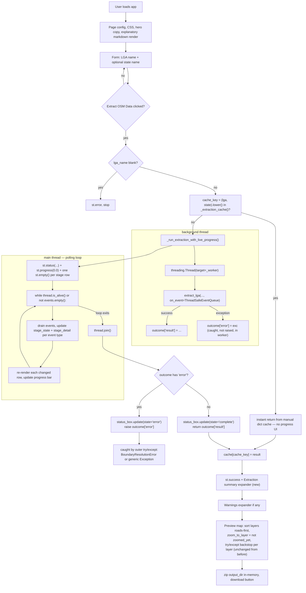

# Streamlit App — app.py

!!! info "Source"
    `app.py` (404 lines — grew from 289 with a complete rework of the
    caching/progress model, see below)

## Purpose

A Streamlit web UI wrapping `pipeline.extract_lga()`: a user types an LGA
name (and optionally a state), clicks "Extract OSM Data," previews every
extracted layer on an interactive Leafmap map with toggleable layers, and
downloads everything as a zip. This is the no-code, no-GIS-software path
into the extractor.

**This revision replaces the entire caching and feedback model.** The
previous version wrapped `extract_lga()` in a single `@st.cache_data`
decorator and showed one generic spinner for the whole multi-minute run —
a user had no visibility into *which* of the five pipeline stages was
running, whether it was stuck, or whether a retry was in progress. This
revision runs extraction on a background thread and drains a live event
stream (from [`events.py`](modules/events.md), new in the pipeline itself)
onto a per-stage progress checklist — the direct UI payoff of the
`on_event` plumbing added throughout `pipeline.py` and `layers.py` in this
same update.

Run with `streamlit run app.py`.

## Dependencies

- **Imports:** `streamlit`, `leafmap.foliumap`, `os`, `zipfile`, `io`,
  and (new) `threading`, `time`; `extract_lga`, `BoundaryResolutionError`,
  `DEFAULT_TAG_CONFIG` from the `lga_extractor` package's top-level
  `__init__.py`; (new) `ThreadSafeEventQueue`, `build_stage_order` from
  [`lga_extractor.events`](modules/events.md).
- **Imports from:** `pipeline.py`, indirectly depends on everything
  `extract_lga()` itself depends on, plus (new) `events.py` directly.

## Page Structure

1. **Page config + custom CSS** — unchanged from before: hero title/subtitle
   styling, callout box, orange-accented form/download buttons.
2. **Hero section + "About this tool" explanation** — unchanged static
   Markdown.
3. **Input form** (`st.form("extract_form")`) — unchanged: two text inputs,
   one primary submit button.
4. **New: `_extraction_cache()` and `_run_extraction_with_live_progress()`**
   — replace the old single `_cached_extract()` function. See below.
5. **`LAYER_STYLES`** — unchanged.
6. **On submit** — validates the LGA name, checks the new session cache
   for an exact repeat request (instant, no progress UI needed), otherwise
   runs `_run_extraction_with_live_progress()`. On success: shows the
   **new "Extraction summary" expander** (per-layer feature-count table),
   warnings expander, preview map, zip download — the map/download logic
   itself is unchanged from before.
7. **Footer** — unchanged GitHub link.

## New in this revision: the caching model changed shape, not just implementation

### `_extraction_cache()`

```python
@st.cache_resource(show_spinner=False)
def _extraction_cache():
    return {}
```

**Why `st.cache_resource`, not `st.cache_data` (the old decorator)** — this
is a deliberate, meaningful choice, not an arbitrary swap. `st.cache_data`
returns a **copy** of whatever's cached on every call; `st.cache_resource`
returns the **same object** every time. The old design relied on
`st.cache_data`'s own per-argument caching (keyed on `(lga_name,
state_name)`) to skip re-computation. The new design needs something
different: a single, persistent, **mutable** dict that the app can check
*and* write to itself (`cache[cache_key] = result`), used as a manual
cache the app controls directly — necessary because the actual extraction
call now happens inside `_run_extraction_with_live_progress()`, on a
background thread, not inside a function Streamlit's own decorator can
transparently memoize around.

### `_run_extraction_with_live_progress(lga_name, state_name)`

**What it does:** runs `extract_lga()` on a background `threading.Thread`,
passing a `ThreadSafeEventQueue` instance as `on_event`, while the main
thread polls that queue in a loop and renders a live, per-stage progress
checklist via `st.status(...)`.

**Why this exact architecture — background thread + main-thread polling
loop — rather than something simpler:** stated directly in the function's
own docstring. `extract_lga()` is a single, several-minutes-long blocking
call; the *only* way to update the UI *while* it runs (not just before and
after) is to have something else pushing progress updates while it's in
flight. But Streamlit's own APIs are not safe to call directly from a
background thread — so the background thread only ever touches the
thread-safe event queue, never Streamlit itself, and all actual UI updates
(`st.status`, `st.progress`, `st.markdown` per row) happen exclusively on
the main thread, inside the polling loop. This is precisely the pattern
[`events.py`](modules/events.md)'s own documentation describes as the
reason `ThreadSafeEventQueue` exists.

**Stage checklist construction:** `build_stage_order(DEFAULT_TAG_CONFIG)`
(from `events.py`) gives the fixed, ordered list of stage names — this app
always builds its checklist against `DEFAULT_TAG_CONFIG` specifically
(not whatever `tag_config` a call might theoretically use), since the UI
itself never exposes a custom `tag_config` option to begin with — see
Gotchas. Stage labels are derived automatically from stage names
(`stage.split(":", 1)[-1].replace("_", " ").title()`, e.g.
`"layer:health_facilities"` → `"Health Facilities"`), with three
hand-written overrides for the non-layer stages (`"boundary"` →
`"Resolving boundary"`, etc.) since those slugified poorly on their own.

**The `outcome` dict pattern for cross-thread exception propagation:**
```python
outcome = {}
def _worker():
    try:
        outcome["result"] = extract_lga(..., on_event=events)
    except Exception as exc:
        outcome["error"] = exc
```
A plain dict, closed over by the worker function, used to smuggle either
the successful result or the caught exception back out of the background
thread — `threading.Thread` has no built-in return-value or
exception-propagation mechanism of its own, so this is the standard
workaround: catch everything inside the thread, stash it, and after
`thread.join()` on the main thread, explicitly `raise outcome["error"]`
if one was captured, so the exception surfaces to `app.py`'s own
`try/except BoundaryResolutionError` / `except Exception` block exactly as
if `extract_lga()` had been called directly and synchronously — the
threading layer is otherwise invisible to that error-handling code.

**Per-stage row rendering and state machine:** each stage tracks one of
five states (`"pending"` / `"running"` / `"retrying"` / `"done"` /
`"failed"`), each rendered with a distinct symbol (`○` / `⟳` / `⟳` / `✓` /
`✗`) plus an optional detail string (a retry counter, a feature count on
completion, an error message on failure) — updated directly from each
drained event's `"type"` field (`stage_started` → running,
`retry` → retrying, `stage_completed` → done, `stage_failed` → failed).
**Unknown stages are silently ignored** (`if stage not in stage_state:
continue`) — a forward-compatibility choice: if `pipeline.py` or
`layers.py` ever emits an event for a stage this UI's checklist doesn't
know about, the polling loop simply skips it rather than crashing on an
unexpected key, so the pipeline and UI can evolve somewhat independently.

**The polling loop's exit condition:** `while thread.is_alive() or not
events.empty():` — deliberately checks *both* conditions, not just thread
liveness. This guards against a real, if narrow, race: the background
thread could finish and exit right after emitting its final event but
*before* the main thread has drained that event from the queue — checking
only `thread.is_alive()` could exit the loop one iteration too early,
leaving the final event(s) undrained and the UI's last row(s) stuck at
their second-to-last state. Checking `events.empty()` too closes that gap.

## Internal Workflow



## New in this revision: the "Extraction summary" expander

```python
with st.expander("Extraction summary", expanded=False):
    summary_rows = [...]  # one row per layer: {"Layer": ..., "Features": entry.get("feature_count", "?")}
    st.table(summary_rows)
    st.caption(f"CRS: ... • Boundary: ... • Warnings: ...")
```

A new, simple addition sitting between the success message and the
warnings expander: a per-layer feature-count table plus a one-line caption
summarizing CRS, boundary source, and warning count. This is the app's
first use of `export.export_layers()`'s `feature_count` field (new — see
[`export.md`](modules/export.md)) — previously that number existed in the
returned summary dict but had no dedicated place in the UI at all;
extraction "succeeding" gave a user no quick sense of *how much* data was
actually found per layer without opening the downloaded zip and inspecting
files individually.

## Layer Rendering Logic (unchanged from the previous revision)

The zoom-to-layer bug fix (tracking a running `zoomed_yet` flag rather than
a fixed list index) and the defensive `try/except (IndexError, KeyError,
ValueError)` backstop around each `m.add_geojson()` call are both
completely unchanged in this revision — see the previous documentation of
this logic, still accurate: layers are sorted roads-first, each
successfully-added layer's zoom flag is tracked independently of position,
and a malformed-on-disk file (e.g. from an interrupted write, a real risk
given multi-minute extraction times) is caught and reported without
crashing the whole preview.

## Gotchas

- **The manual dict cache (`_extraction_cache()`) is shared across users,
  same as the old `st.cache_data` behavior, but now the app owns the
  sharing semantics explicitly rather than delegating to Streamlit's own
  decorator.** `st.cache_resource` — like `st.cache_data` before it —
  returns the same object across all sessions of a running app instance by
  default. This app's own code (not Streamlit's caching internals) is what
  decides to check and write into that shared dict, but the practical
  effect for a deployed app is unchanged: one user's extraction can "warm
  the cache" for another user requesting the same LGA/state.
- **A cache hit shows no progress UI at all** — by design (there's nothing
  to show progress *for*), but worth knowing if you're specifically trying
  to see the new live-progress interface in action: request an LGA/state
  combination that hasn't been extracted yet in the current app session.
- **`build_stage_order(DEFAULT_TAG_CONFIG)` is called with the *default*
  tag config, always** — since this UI never exposes a custom `tag_config`
  option (unchanged from before, see the pre-existing `manual_boundary_path`
  / `strict` gotcha below), the progress checklist's layer rows are always
  exactly the six default layers, regardless of what `extract_lga()` might
  theoretically be called with elsewhere.
- **`manual_boundary_path` and `strict` are still not exposed in the UI**,
  unchanged from before — only `cli.py` exposes the full parameter surface,
  including the new `on_event`, which the CLI does *not* currently wire up
  to anything (see [`cli.md`](cli.md)).
- **The download zip is still built entirely in memory**, walking
  `output_dir` on disk at download time — unchanged.
