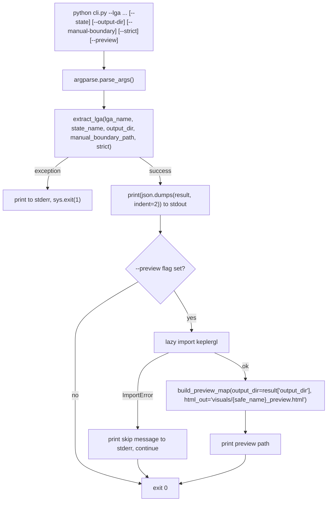

# CLI — cli.py

!!! info "Source"
    `cli.py` (91 lines)

## Purpose

The command-line entry point for the extractor: a thin `argparse` wrapper
around `pipeline.extract_lga()`, intended for scripted, automated, and
CI/batch use — the same pipeline `app.py` exposes interactively, but with a
fuller parameter surface (`--manual-boundary`, `--strict`) and no Streamlit
runtime overhead.

## Dependencies

- **Imports:** `argparse`, `json`, `sys`; `extract_lga` from the
  `lga_extractor` package (top-level re-export); `build_preview_map` from
  `lga_extractor.visualize`, imported lazily inside `main()` only when
  `--preview` is passed.
- **Imports from:** `pipeline.py` (via package re-export), and
  conditionally `visualize.py`.

## Functions & Classes

### `main()`

| | |
|---|---|
| **What it does** | Parses command-line arguments, calls `extract_lga()` with them, prints the resulting summary as formatted JSON to stdout, and optionally builds a Kepler.gl preview map if `--preview` was passed. |
| **Why written this way** | Every CLI flag maps directly onto an `extract_lga()` parameter (`--lga`→`lga_name`, `--state`→`state_name`, `--output-dir`→`output_dir`, `--manual-boundary`→`manual_boundary_path`, `--strict`→`strict`) with no CLI-specific logic reinterpreting them — consistent with `pipeline.py`'s design (see its docstring reasoning) of keeping every interface layer a thin, faithful pass-through so parameter behavior is documented in exactly one place. `--preview` is the one flag with no `extract_lga()` equivalent, since building a Kepler preview is a separate, optional step handled entirely within `main()` itself, not part of the core pipeline. |
| **Inputs** | Parsed from `sys.argv` via `argparse`: `--lga` (required); `--state`, `--output-dir`, `--manual-boundary` (all optional, default `None`); `--preview`, `--strict` (both `action="store_true"` boolean flags, default `False`). |
| **Outputs** | Prints the `extract_lga()` result dict as indented JSON to stdout (success path); prints an error message to stderr and calls `sys.exit(1)` on failure. If `--preview` was given, additionally prints either a confirmation message with the saved HTML path, or a skip notice if `keplergl` isn't installed. No Python return value (it's a script entry point, not a library function) — nothing in the codebase calls `main()` expecting a return value. |
| **Internal workflow** | 1. Build the `ArgumentParser` with all six flags described above.<br>2. Parse `sys.argv` via `parser.parse_args()`.<br>3. Call `extract_lga()` inside a `try/except Exception`. On any exception, print `f"Extraction failed: {exc}"` to stderr and exit with status code `1` — this is a deliberately broad `except Exception`, catching `BoundaryResolutionError`, `LayerExtractionError`, and anything else `extract_lga()` might raise, uniformly, rather than handling each exception type differently the way `app.py` does (which shows a boundary-specific error message via a separate `except BoundaryResolutionError` clause before its general `except Exception`). For a CLI/scripting context, a uniform "it failed, here's why, nonzero exit code" is the more appropriate behavior — the caller is expected to be another program or a human reading stderr, not a UI needing differentiated error presentation.<br>4. On success, `print(json.dumps(result, indent=2))` — the full result dict, human-readable and also directly parseable by any calling script (`subprocess` + `json.loads()` on stdout).<br>5. If `args.preview` is set: lazily import `build_preview_map` from `visualize.py` (deferred import here for the same reason `visualize.py` itself defers its `keplergl` import — see [`visualize.md`](modules/visualize.md) — so that *not* passing `--preview` never requires `keplergl` to be installed at all); compute the same `output/{slugified_name}` naming convention the HTML preview path uses; call `build_preview_map(output_dir=result["output_dir"], html_out=html_path)`; print a confirmation. If `ImportError` is raised (keplergl not installed), print a skip notice to stderr rather than crashing the whole run — extraction itself already succeeded and its result was already printed by this point, so a missing optional dependency for the preview step shouldn't undo that. |
| **Assumptions** | Assumes the caller wants a nonzero process exit code to be the sole failure signal for scripting purposes (standard CLI convention) — there's no `--quiet`/`--json-errors-only` mode; a failure always prints a human-readable message to stderr in addition to the exit code. Assumes `args.lga.strip().replace(" ", "_").lower()` (used to compute the preview HTML path) will always match whatever slugification `extract_lga()`/`pipeline.py` used internally for its default `output_dir` — this is the same implicit-naming-convention coupling noted in [`visualize.md`](modules/visualize.md)'s gotchas, duplicated here independently rather than shared from a single source. |
| **Complexity** | O(1) in this function's own logic; wall-clock cost is entirely delegated to `extract_lga()` and, conditionally, `build_preview_map()`. |
| **Concurrency / race conditions** | None — a CLI invocation runs once, synchronously, start to finish, in a single process. Running `cli.py` for the same LGA concurrently from two separate terminal invocations would hit the same unguarded-concurrent-write-to-same-`output_dir` consideration noted in [`export.md`](modules/export.md) and [`logging_utils.md`](modules/logging_utils.md), but this isn't specific to the CLI itself. |
| **Covered by test(s)** | No automated test coverage — `cli.py` has no dedicated test file in this repository (see [tests.md](tests.md) for the modules that do have coverage); this entry point is currently verified by manual invocation rather than an automated test. |

## Usage Examples

```bash
# Basic extraction with state disambiguation
python cli.py --lga "Akure North" --state "Ondo"

# Custom output directory
python cli.py --lga "Akure South" --state "Ondo" --output-dir data/processed/akure_south

# Using a manually-supplied boundary instead of OSM geocoding
python cli.py --lga "Some LGA" --manual-boundary path/to/boundary.geojson

# Strict mode: abort immediately on any genuine extraction failure
# (recommended for CI/automated pipelines)
python cli.py --lga "Akure North" --state "Ondo" --strict

# Also generate a standalone Kepler.gl HTML preview
python cli.py --lga "Akure North" --state "Ondo" --preview
```

## Internal Workflow



## Gotchas

- **`--strict` changes failure *sensitivity*, not failure *presentation*.**
  Both strict and permissive runs, if they fail, are reported the same way
  by `main()` (stderr message + exit code 1) — `--strict` only changes
  whether a single flaky layer query is treated as a fatal error in the
  first place (see [`layers.md`](modules/layers.md)'s `strict` parameter
  documentation), not how a failure, once it happens, is surfaced here.
- **The `--preview` HTML path naming is independently recomputed, not
  reused from `extract_lga()`'s result.** `main()` recomputes
  `f"visuals/{safe_name}_preview.html"` itself from `args.lga` rather than
  deriving it from anything in `result` — if the slugification logic in
  `pipeline.py` ever changed, this would need a matching update here too,
  the same drift risk documented in `visualize.py`.
- **A failed `--preview` step does not affect the CLI's exit code.** If
  extraction succeeds but the Kepler preview fails due to missing
  `keplergl`, `main()` still exits `0` (success) — only the preview-specific
  skip message goes to stderr. This is a deliberate choice: extraction is
  the CLI's primary job, and an optional visual convenience layer failing
  shouldn't be conflated with the primary job failing.
