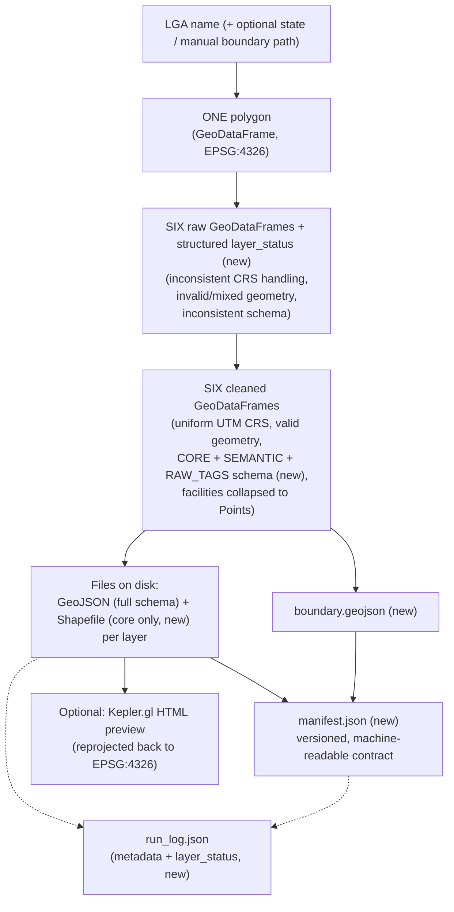

# Data Flow — lga-osm-extractor

This page traces how *data* changes shape as it moves through the pipeline
— from a plain LGA name to files on disk. For a function-call-level trace
instead, see [End-to-End Walkthrough](end-to-end.md).

## Stage-by-Stage

### 1. Input: a name

The pipeline starts with nothing but strings: an LGA name (e.g.
`"Akure North"`), optionally a state name (e.g. `"Ondo"`), and optionally a
path to a manual boundary file. No geometry exists yet.

### 2. Boundary resolution → one polygon

[`boundary.resolve_boundary()`](modules/boundary.md) turns the name into a
single-row `GeoDataFrame`, CRS EPSG:4326, holding one polygon (or
multipolygon) — the LGA's administrative boundary — plus two metadata
columns (`boundary_source`, `validation_warnings`). This is the only
geometry that exists in the system at this point, and everything after this
stage operates *within* it.

### 3. Layer extraction → six raw, messy GeoDataFrames

[`layers.extract_layers()`](modules/layers.md) takes that one polygon and
queries OSM six separate times (once per configured layer), producing a
`dict` of `layer_name → GeoDataFrame`. At this stage, data is **raw and
inconsistent**:

- Different CRS handling per query response (though OSM data is implicitly
  WGS84).
- Possibly-invalid geometries (self-intersections, etc. — a known
  characteristic of crowd-sourced OSM data).
- Mixed geometry types within a single layer (e.g. `roads` mixing
  `LineString` ways with `Point` traffic-signal nodes).
- Mixed geometry *representations* for conceptually similar features (e.g.
  a hospital as a `Point` node in one place, a `Polygon` building outline in
  another).
- Inconsistent/missing attribute columns across different layers' raw OSM
  tag sets.
- Some layers may be entirely empty `GeoDataFrame`s (valid data, not an
  error).

A `"_warnings"` list travels alongside the dict from this stage on, and
gets added to at every subsequent stage that has something worth flagging.

### 4. Cleaning → six standardized GeoDataFrames

[`clean.clean_layers()`](modules/clean.md) is where the data actually
becomes consistent. Every layer is: reprojected into one shared,
boundary-appropriate UTM CRS; stripped of invalid/null/duplicate geometry;
reduced to a **three-tier schema** — `CORE_COLUMNS` (`osmid`, `name`,
`geometry`, always present) plus this layer's present `SEMANTIC_COLUMNS`
(a curated set of useful OSM tags, e.g. a road's `surface`/`maxspeed`, a
hospital's `beds`/`emergency` — **new**, see [`clean.md`](modules/clean.md))
plus `RAW_TAGS_COLUMN` (**new** — a JSON-encoded copy of every original OSM
tag, the escape hatch for anything not in the curated set); and, for
`health_facilities`/`schools` specifically, has any `Polygon`/
`MultiPolygon` geometry collapsed to its centroid `Point` — this last step
is what guarantees every facility in those two layers is representable as a
single coordinate, which every downstream consumer (`akure_access`'s
routing and isochrone logic) depends on being true.

### 5. Export → files on disk

[`export.export_layers()`](modules/export.md) writes each cleaned layer to
both GeoJSON (the **full** three-tier schema, always one file, mixed
geometry types are fine in this format) and Shapefile (**new: reduced to
`CORE_COLUMNS` only** — `_shapefile_safe_columns()`, since Shapefile's DBF
format can't safely hold the semantic tags or the JSON blob; split into
multiple category-specific files — e.g. `roads_line.shp` +
`roads_point.shp` — only for layers that still contain more than one
geometry category after cleaning). This is the first point in the pipeline
where data leaves memory and becomes a persistent artifact.

**New: the boundary polygon is also written to disk here**, immediately
after the layer files — `boundary.geojson`, the boundary `GeoDataFrame`
from stage 2, unchanged, written as-is (already EPSG:4326). This closes a
gap where the boundary was previously the one input a downstream consumer
couldn't get from cached files alone.

### 6. New: Manifest building → a formal, versioned contract file

[`manifest.build_manifest()` + `write_manifest()`](modules/manifest.md)
reconcile two independently-computed per-layer records — the query-time
outcome from stage 3 (`layer_status`, was it a genuine failure or a
success with zero features) and the post-cleaning export outcome from
stage 5 (feature counts, file paths) — into one unified `manifest.json`,
recording `target_crs`, `boundary_source`, `boundary_path`, and a
per-layer breakdown. This is the file `akure-accessibility-dashboard`'s
[`data_contract.py`](../akure-accessibility-dashboard/modules/data_contract.md)
actually reads, rather than the less-stable `run_log.json`. See
[Cross-Repo Integration](../cross-repo/integration.md).

### 7. (Optional) Visualization → an HTML file

[`visualize.build_preview_map()`](modules/visualize.md) reads the
just-written GeoJSON files back off disk, reprojects them to WGS84 (Kepler's
required web-map CRS — note this is a *second* reprojection, since step 4
already projected into a metric UTM CRS for cleaning/export), and produces
either an in-memory `KeplerGl` object (for notebook display) or a
self-contained HTML file with any bundled Mapbox credential stripped. This
module is unchanged in this revision.

### 8. Logging → a JSON audit trail

[`logging_utils.log_run()`](modules/logging_utils.md) writes a
`run_log.json` alongside the exported layers, capturing the environment,
configuration, and outcome of the run — **new:** now also including the
same structured `layer_status` dict recorded in the manifest, so a human
reading `run_log.json` alone can still tell "did this layer actually fail,
or did it just find nothing" without cross-referencing `manifest.json`.
Not geospatial data itself, but a record of everything that produced it,
for traceability.

**New: progress events flow alongside every stage above, not as a separate
stage of their own.** [`events.py`](modules/events.md)'s `on_event`
callback, if supplied, receives a `stage_started`/`stage_completed`/
`stage_failed`/`retry` event around stages 2, 3, 4, and 5 (see
[`pipeline.md`](modules/pipeline.md)) — this is a pure side channel with no
effect on the data shown in this trace; it exists purely so
[`app.py`](app.md) can render a live progress checklist while the above
stages run.

## What Changes at Each Boundary

The stage-by-stage prose above describes what happens; this table makes
the schema transformation at each step explicit and comparable at a
glance.

| Transition | Input shape | Output shape | What changes |
|---|---|---|---|
| User input → boundary | Two plain strings (+ optional file path) | 1-row `GeoDataFrame`, WGS84 | A name becomes a geometry, validated against Nigeria's bounding box, a plausible-area range, and (**new**) OSM class/type metadata |
| Boundary → raw layers | 1 polygon | 6 (default) raw `GeoDataFrame`s + structured status dict (**new**) | One geometry becomes six independent Overpass query results, each with a structured `{"status", "feature_count", "attempts", "message"}` record (**new** — replaces an ambiguous string field), plus whatever raw OSM tag columns that query happened to return |
| Raw layers → cleaned layers | WGS84, inconsistent columns, mixed geometry types possible | Projected UTM CRS, `CORE_COLUMNS` + curated `SEMANTIC_COLUMNS` + `RAW_TAGS_COLUMN` (**new, richer schema**) | Reprojection for metric correctness; two specific layers (`health_facilities`, `schools`) have any `Polygon`/`MultiPolygon` rows collapsed to centroids; **new:** every feature also keeps a curated set of useful OSM tags plus a full JSON copy of everything else |
| Cleaned layers → exported files | In-memory `GeoDataFrame`s, full schema | Files on disk — GeoJSON (full schema) always; Shapefile (**new: `CORE_COLUMNS` only**) split into per-geometry-category files if needed | Persistence; **new:** GeoJSON and Shapefile now carry genuinely different attribute schemas for the same layer, not just different file formats |
| Cleaned boundary → boundary file | In-memory `GeoDataFrame` | `boundary.geojson` (**new**) | The boundary itself becomes a cached, reusable file — closing the gap where it was the one input still requiring a live query |
| Exported files + boundary → manifest | Paths + per-layer status + CRS | `manifest.json` (**new**) | A versioned, machine-readable contract — distinct from the human-oriented `run_log.json` — that downstream code should parse instead of inferring outcome from file presence |
| Exported files → run log | Paths + warnings + metadata + layer status (**new**) | One JSON file | A permanent, reproducible audit trail of exactly what happened, including which package versions were in use and (**new**) the same structured per-layer status carried in the manifest |

## Where State Lives

There is no database, no persistent server-side session state beyond
Streamlit's own per-deployment cache, and no in-memory global registry of
past extractions. State is entirely:

1. **Ephemeral, in-process**: the `GeoDataFrame`s and dicts passed between
   pipeline stages during a single `extract_lga()` call — nothing here
   survives past the function call except what's explicitly written to
   disk or returned to the caller.
2. **On disk**: `{output_dir}/*.geojson`, `{output_dir}/shapefiles/*.shp`
   (plus sidecar files — `.shx`, `.dbf`, `.prj`), `{output_dir}/boundary.geojson`
   (**new**), `{output_dir}/manifest.json` (**new**), and
   `{output_dir}/run_log.json`. This is the *only* durable record of an
   extraction; if it's deleted, the only way to reconstruct it is to
   re-run the pipeline (which may produce slightly different OSM data if
   the underlying map has changed since).
3. **Streamlit's cache** (`app.py` only): **changed in this revision** —
   now a manually-managed `st.cache_resource` dict (`_extraction_cache()`)
   rather than an `@st.cache_data`-decorated function, but the practical
   sharing semantics are unchanged: still a shared, cross-session,
   in-memory (per deployment instance) cache keyed on
   `(lga_name, state_name)`, holding the same summary dict
   `extract_lga()` returns. See [`app.md`](app.md) for why the caching
   mechanism itself changed (to support the new live-progress UI, which
   needs to run extraction on a background thread). Not durable across an
   app restart, but the *files* it points to are, as long as the
   underlying disk persists.
4. **New: an in-flight event queue** (`events.ThreadSafeEventQueue`,
   during a single extraction) — the most short-lived state in the whole
   system, existing only for the duration of one `extract_lga()` call when
   `on_event` is supplied, drained continuously by the consuming UI and
   holding nothing once extraction completes.

## Why the Flow Is Linear, Not Branching

Every stage transformation above is a strict one-directional dependency —
`clean_layers()` cannot run before `extract_layers()` produces raw data,
`export_layers()` cannot run before cleaning produces standardized
geometry. There's no stage that reads from two different upstream stages
simultaneously, and no stage writes back to an earlier stage's output.
This linearity is what makes the pipeline easy to reason about and safe
to parallelize *across* LGAs (each `extract_lga()` call is fully
self-contained, sharing no state with any other concurrent call) even
though it isn't parallelized *within* a single LGA's stages — the one
exception being stage 3's per-layer Overpass queries, which run
concurrently with each other but still block the pipeline as a whole
from proceeding to stage 4 until every layer (or its failure) has been
accounted for.

## Diagram

