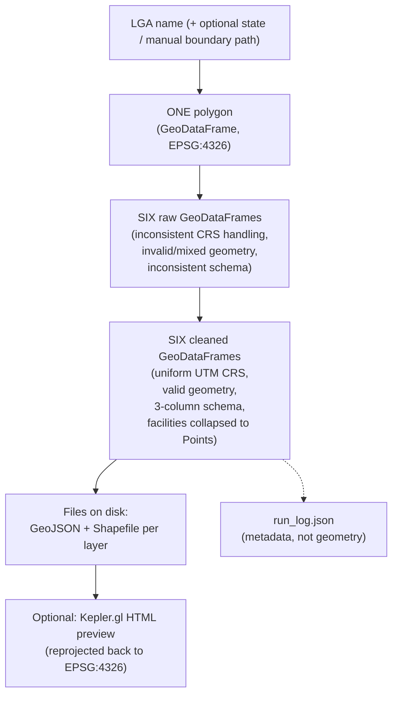

# Data Flow — lga-osm-extractor

This page traces how *data* changes shape as it moves through the pipeline
— from a plain LGA name to files on disk. For a function-call-level trace
instead, see [End-to-End Walkthrough](end-to-end.md).

## Stage-by-Stage

### 1. Input: a name

The pipeline starts with nothing but strings: an LGA name (e.g.
`"Akure North"`), optionally a state name (e.g. `"Ondo"`), and optionally a
path to a manual boundary file. No geometry exists yet.

### 2. Boundary resolution → one polygon

[`boundary.resolve_boundary()`](modules/boundary.md) turns the name into a
single-row `GeoDataFrame`, CRS EPSG:4326, holding one polygon (or
multipolygon) — the LGA's administrative boundary — plus two metadata
columns (`boundary_source`, `validation_warnings`). This is the only
geometry that exists in the system at this point, and everything after this
stage operates *within* it.

### 3. Layer extraction → six raw, messy GeoDataFrames

[`layers.extract_layers()`](modules/layers.md) takes that one polygon and
queries OSM six separate times (once per configured layer), producing a
`dict` of `layer_name → GeoDataFrame`. At this stage, data is **raw and
inconsistent**:

- Different CRS handling per query response (though OSM data is implicitly
  WGS84).
- Possibly-invalid geometries (self-intersections, etc. — a known
  characteristic of crowd-sourced OSM data).
- Mixed geometry types within a single layer (e.g. `roads` mixing
  `LineString` ways with `Point` traffic-signal nodes).
- Mixed geometry *representations* for conceptually similar features (e.g.
  a hospital as a `Point` node in one place, a `Polygon` building outline in
  another).
- Inconsistent/missing attribute columns across different layers' raw OSM
  tag sets.
- Some layers may be entirely empty `GeoDataFrame`s (valid data, not an
  error).

A `"_warnings"` list travels alongside the dict from this stage on, and
gets added to at every subsequent stage that has something worth flagging.

### 4. Cleaning → six standardized GeoDataFrames

[`clean.clean_layers()`](modules/clean.md) is where the data actually
becomes consistent. Every layer is: reprojected into one shared,
boundary-appropriate UTM CRS; stripped of invalid/null/duplicate geometry;
reduced to a uniform three-column schema (`osmid`, `name`, `geometry`); and,
for `health_facilities`/`schools` specifically, has any `Polygon`/
`MultiPolygon` geometry collapsed to its centroid `Point` — this last step
is what guarantees every facility in those two layers is representable as a
single coordinate, which every downstream consumer (`akure_access`'s
routing and isochrone logic) depends on being true.

### 5. Export → files on disk

[`export.export_layers()`](modules/export.md) writes each cleaned layer to
both GeoJSON (always one file, mixed geometry types are fine in this
format) and Shapefile (split into multiple category-specific files — e.g.
`roads_line.shp` + `roads_point.shp` — only for layers that still contain
more than one geometry category after cleaning, since Shapefile can't hold
mixed types in one file). This is the first point in the pipeline where
data leaves memory and becomes a persistent artifact — everything before
this stage exists only for the duration of one Python process.

### 6. (Optional) Visualization → an HTML file

[`visualize.build_preview_map()`](modules/visualize.md) reads the
just-written GeoJSON files back off disk, reprojects them to WGS84 (Kepler's
required web-map CRS — note this is a *second* reprojection, since step 4
already projected into a metric UTM CRS for cleaning/export), and produces
either an in-memory `KeplerGl` object (for notebook display) or a
self-contained HTML file with any bundled Mapbox credential stripped.

### 7. Logging → a JSON audit trail

[`logging_utils.log_run()`](modules/logging_utils.md) writes a
`run_log.json` alongside the exported layers, capturing the environment,
configuration, and outcome of the run — not geospatial data itself, but a
record of everything that produced it, for traceability.

## Diagram

