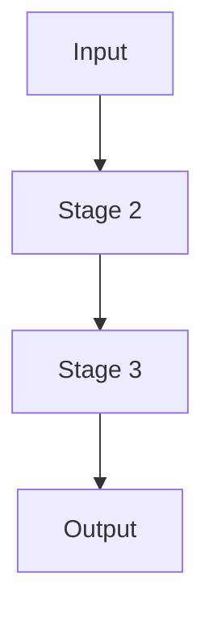

# Data Flow — lga-osm-extractor

_TODO: high-level walkthrough of how data moves through this repository, from initial input to final output. This page is the "one level up" companion to end-to-end.md — end-to-end.md traces function calls; this page traces the *data* (what shape it's in at each stage: DataFrame, GeoDataFrame, GeoJSON, shapefile, etc.)._

## Stage-by-Stage

1. **Input** — _TODO_
2. **Stage 2** — _TODO_
3. **...**
4. **Output** — _TODO_

## Diagram

