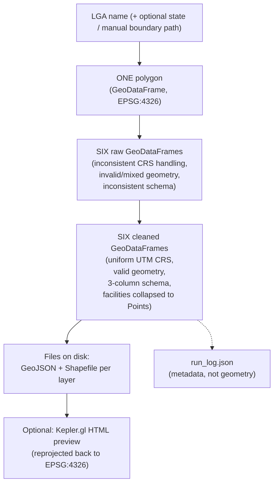

# Data Flow — lga-osm-extractor

This page traces how *data* changes shape as it moves through the pipeline
— from a plain LGA name to files on disk. For a function-call-level trace
instead, see [End-to-End Walkthrough](end-to-end.md).

## Stage-by-Stage

### 1. Input: a name

The pipeline starts with nothing but strings: an LGA name (e.g.
`"Akure North"`), optionally a state name (e.g. `"Ondo"`), and optionally a
path to a manual boundary file. No geometry exists yet.

### 2. Boundary resolution → one polygon

[`boundary.resolve_boundary()`](modules/boundary.md) turns the name into a
single-row `GeoDataFrame`, CRS EPSG:4326, holding one polygon (or
multipolygon) — the LGA's administrative boundary — plus two metadata
columns (`boundary_source`, `validation_warnings`). This is the only
geometry that exists in the system at this point, and everything after this
stage operates *within* it.

### 3. Layer extraction → six raw, messy GeoDataFrames

[`layers.extract_layers()`](modules/layers.md) takes that one polygon and
queries OSM six separate times (once per configured layer), producing a
`dict` of `layer_name → GeoDataFrame`. At this stage, data is **raw and
inconsistent**:

- Different CRS handling per query response (though OSM data is implicitly
  WGS84).
- Possibly-invalid geometries (self-intersections, etc. — a known
  characteristic of crowd-sourced OSM data).
- Mixed geometry types within a single layer (e.g. `roads` mixing
  `LineString` ways with `Point` traffic-signal nodes).
- Mixed geometry *representations* for conceptually similar features (e.g.
  a hospital as a `Point` node in one place, a `Polygon` building outline in
  another).
- Inconsistent/missing attribute columns across different layers' raw OSM
  tag sets.
- Some layers may be entirely empty `GeoDataFrame`s (valid data, not an
  error).

A `"_warnings"` list travels alongside the dict from this stage on, and
gets added to at every subsequent stage that has something worth flagging.

### 4. Cleaning → six standardized GeoDataFrames

[`clean.clean_layers()`](modules/clean.md) is where the data actually
becomes consistent. Every layer is: reprojected into one shared,
boundary-appropriate UTM CRS; stripped of invalid/null/duplicate geometry;
reduced to a uniform three-column schema (`osmid`, `name`, `geometry`); and,
for `health_facilities`/`schools` specifically, has any `Polygon`/
`MultiPolygon` geometry collapsed to its centroid `Point` — this last step
is what guarantees every facility in those two layers is representable as a
single coordinate, which every downstream consumer (`akure_access`'s
routing and isochrone logic) depends on being true.

### 5. Export → files on disk

[`export.export_layers()`](modules/export.md) writes each cleaned layer to
both GeoJSON (always one file, mixed geometry types are fine in this
format) and Shapefile (split into multiple category-specific files — e.g.
`roads_line.shp` + `roads_point.shp` — only for layers that still contain
more than one geometry category after cleaning, since Shapefile can't hold
mixed types in one file). This is the first point in the pipeline where
data leaves memory and becomes a persistent artifact — everything before
this stage exists only for the duration of one Python process.

### 6. (Optional) Visualization → an HTML file

[`visualize.build_preview_map()`](modules/visualize.md) reads the
just-written GeoJSON files back off disk, reprojects them to WGS84 (Kepler's
required web-map CRS — note this is a *second* reprojection, since step 4
already projected into a metric UTM CRS for cleaning/export), and produces
either an in-memory `KeplerGl` object (for notebook display) or a
self-contained HTML file with any bundled Mapbox credential stripped.

### 7. Logging → a JSON audit trail

[`logging_utils.log_run()`](modules/logging_utils.md) writes a
`run_log.json` alongside the exported layers, capturing the environment,
configuration, and outcome of the run — not geospatial data itself, but a
record of everything that produced it, for traceability.

## What Changes at Each Boundary

The stage-by-stage prose above describes what happens; this table makes
the schema transformation at each step explicit and comparable at a
glance.

| Transition | Input shape | Output shape | What changes |
|---|---|---|---|
| User input → boundary | Two plain strings (+ optional file path) | 1-row `GeoDataFrame`, WGS84 | A name becomes a geometry, validated against Nigeria's bounding box and a plausible-area range |
| Boundary → raw layers | 1 polygon | 6 (default) raw `GeoDataFrame`s | One geometry becomes six independent Overpass query results, each with whatever raw OSM tag columns that particular query happened to return — no two layers necessarily share the same column set at this stage |
| Raw layers → cleaned layers | WGS84, inconsistent columns, mixed geometry types possible | Projected UTM CRS, exactly `osmid`/`name`/`geometry` | Reprojection for metric correctness; two specific layers (`health_facilities`, `schools`) have any `Polygon`/`MultiPolygon` rows collapsed to centroids — the fix for the Akure North facility-mapping bug documented on the [clean.py page](modules/clean.md) |
| Cleaned layers → exported files | In-memory `GeoDataFrame`s | Files on disk (GeoJSON always, Shapefile split into per-geometry-category files if the layer still mixes point/line/polygon types after cleaning) | Persistence; also where Shapefile's single-geometry-type-per-file constraint is worked around |
| Exported files → run log | Paths + warnings + metadata | One JSON file | A permanent, reproducible audit trail of exactly what happened, including which package versions were in use |

## Where State Lives

There is no database, no persistent server-side session state beyond
Streamlit's own per-deployment cache, and no in-memory global registry of
past extractions. State is entirely:

1. **Ephemeral, in-process**: the `GeoDataFrame`s and dicts passed between
   pipeline stages during a single `extract_lga()` call — nothing here
   survives past the function call except what's explicitly written to
   disk or returned to the caller.
2. **On disk**: `{output_dir}/*.geojson`, `{output_dir}/shapefiles/*.shp`
   (plus sidecar files — `.shx`, `.dbf`, `.prj`), and
   `{output_dir}/run_log.json`. This is the *only* durable record of an
   extraction; if it's deleted, the only way to reconstruct it is to
   re-run the pipeline (which may produce slightly different OSM data if
   the underlying map has changed since).
3. **Streamlit's cache** (`app.py` only): a shared, cross-session,
   in-memory (per deployment instance) cache keyed on
   `(lga_name, state_name)`, holding the same summary dict
   `extract_lga()` returns. This cache is not itself durable across an
   app restart, but the *files* it points to (in `output_dir`) are, as
   long as the underlying disk persists — meaning a Streamlit restart
   loses the cache but not the actual extracted data, so a subsequent
   identical request re-reads from disk-backed reality rather than
   silently serving stale in-memory data from before the restart.

## Why the Flow Is Linear, Not Branching

Every stage transformation above is a strict one-directional dependency —
`clean_layers()` cannot run before `extract_layers()` produces raw data,
`export_layers()` cannot run before cleaning produces standardized
geometry. There's no stage that reads from two different upstream stages
simultaneously, and no stage writes back to an earlier stage's output.
This linearity is what makes the pipeline easy to reason about and safe
to parallelize *across* LGAs (each `extract_lga()` call is fully
self-contained, sharing no state with any other concurrent call) even
though it isn't parallelized *within* a single LGA's stages — the one
exception being stage 3's per-layer Overpass queries, which run
concurrently with each other but still block the pipeline as a whole
from proceeding to stage 4 until every layer (or its failure) has been
accounted for.

## Diagram

