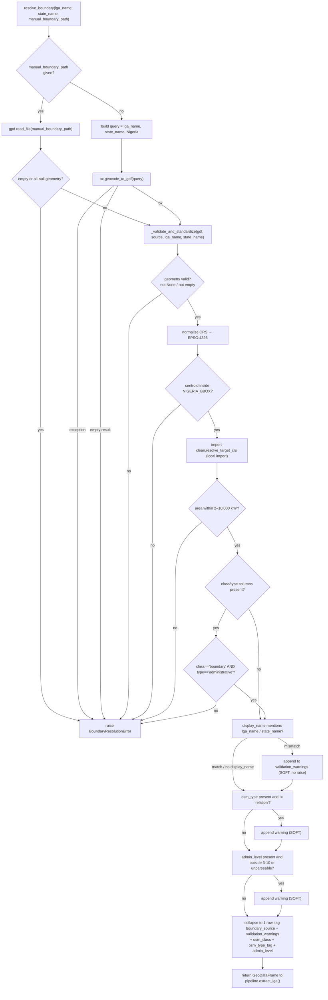

# boundary.py

!!! info "Source"
    `lga_extractor/boundary.py` (362 lines — grew from 220 with the addition
    of OSM class/type/admin_level metadata validation, see below)

## Purpose

Resolves a Nigerian LGA name (e.g. `"Akure North"`) into a validated,
standardized administrative boundary polygon, either by geocoding it against
OSM/Nominatim via OSMnx, or by loading a manually-supplied boundary file.
This boundary is the first thing every other module in the pipeline depends
on — `layers.py` queries features *within* it, and `clean.py` uses its
centroid to pick a correct UTM zone for the whole run.

The module's central concern isn't really "how do I get a boundary" (that's
one line: `ox.geocode_to_gdf(query)`) — it's **how do I know whether the
boundary I got back is actually right**, since a geocoder can return a
confident-looking but wrong result with no indication anything went wrong.

## Dependencies

- **Imports:** `geopandas`, `pandas` (new — for `pd.isna()` in
  `_first_value_or_none()`, see below), `shapely.geometry.base.BaseGeometry`,
  `osmnx`. Also imports `resolve_target_crs` from [`clean.py`](clean.md) —
  locally, inside `_validate_and_standardize()` — to measure candidate
  boundary area in a correct metric projection rather than raw WGS84
  degrees.
- **Imported by:** `pipeline.py` (as the first stage of `extract_lga()`).

## Functions & Classes

### `BoundaryResolutionError`

An exception class (subclass of `Exception`, no custom behavior) raised
whenever a boundary cannot be confidently resolved — either because OSM
returned nothing / raised an error, or because a resolved boundary fails one
of the hard validation checks in `_validate_and_standardize()`. Callers
(`pipeline.py`, `app.py`, `cli.py`) catch this to surface a clear,
actionable message rather than letting a downstream module fail confusingly
on a bad boundary later in the pipeline.

### `_first_value_or_none(gdf, column)` (private, new)

**What it does:** returns `gdf[column].iloc[0]` if `column` exists in `gdf` and its first value isn't missing, else `None`.

**Why this small helper earns its own function rather than being inlined at each call site:** a raw Nominatim result may either omit a column entirely, or include it with a `NaN`/`None` value — pandas' two different spellings of "missing" (a genuinely missing column raises `KeyError` on direct access; a present-but-null value passes an `is not None` check while still being unusable data). The three new metadata checks added to `_validate_and_standardize()` (see below) all need to treat both cases identically as "we don't have this information," and this helper is what makes that identical treatment automatic rather than something each check has to remember to handle separately, correctly, three separate times.

### `PLAUSIBLE_ADMIN_LEVEL_RANGE = (3, 10)` (new constant)

The plausible OSM `admin_level` range for a Nigerian LGA-scale administrative boundary. Nigeria's LGAs are conventionally tagged `admin_level=6`, but this is a deliberately wide, generous band — not a strict `== 6` check — since `admin_level` tagging in OSM is not perfectly consistent everywhere, and (as covered below) this specific check is advisory, not authoritative. The module's own comment notes a future pass that fetches Overpass relation metadata directly could tighten this to a firm `admin_level == 6` check; this first pass deliberately doesn't, since `admin_level` isn't reliably present in OSMnx's default geocode result, and forcing an extra network round-trip just to fetch it wasn't judged worth the cost for what remains a soft, advisory signal.

### `resolve_boundary(lga_name, state_name=None, manual_boundary_path=None)`

| | |
|---|---|
| **What it does** | Returns a single-row `GeoDataFrame` containing the validated LGA boundary, in EPSG:4326, tagged with `boundary_source` and `validation_warnings` columns. |
| **Why written this way** | Two resolution paths are supported — manual file and OSM geocode — and both are funneled through the *same* validation function (`_validate_and_standardize()`) at the end, so a manually-supplied boundary gets exactly the same sanity checks as an OSM-geocoded one. This matters: a manual file is a human-supplied escape hatch, but a typo'd path to the wrong file, or an outdated boundary, is just as capable of silently corrupting the run as a bad geocode. |
| **Error messages are written to be actionable, not just descriptive.** | Every `BoundaryResolutionError` raised here ends with a concrete next step rather than stopping at "what went wrong." A failed OSM lookup says *"Consider supplying manual_boundary_path"*; an empty OSM result says *"This LGA may be missing or mistagged in OSM; consider a manual boundary."* This reflects a deliberate choice about who reads these messages: not just a developer reading a traceback, but potentially a non-technical user of `app.py`'s Streamlit interface, who needs to know what to *do*, not just that something failed. |
| **The original exception is never swallowed.** | When `ox.geocode_to_gdf(query)` raises for any reason (network timeout, malformed query, Nominatim downtime), the wrapping `BoundaryResolutionError` is raised with `from exc` — Python's exception chaining. This means a traceback still shows the *original* underlying error beneath the friendlier message, which matters for debugging a failure that the friendly message alone can't diagnose (e.g. distinguishing "Nominatim is down" from "the query string was malformed" — both would otherwise look identical from the outside). |
| **Inputs** | `lga_name: str` (required, e.g. `"Akure North"`); `state_name: str` (optional, e.g. `"Ondo"` — recommended to disambiguate LGAs that share a name across states); `manual_boundary_path: str` (optional path to a GeoJSON/Shapefile, used instead of querying OSM). |
| **Outputs** | A single-row `geopandas.GeoDataFrame`, CRS EPSG:4326, with the boundary geometry plus `boundary_source` and `validation_warnings` columns. |
| **Internal workflow** | 1. If `manual_boundary_path` is given: read it with `gpd.read_file()`, check it's non-empty with valid geometry, pass to `_validate_and_standardize()` with `source="manual:<path>"`, return. 2. Otherwise: build a Nominatim-style query string (`"{lga_name}, {state_name}, Nigeria"` or `"{lga_name}, Nigeria"` if no state given), call `ox.geocode_to_gdf(query)`. 3. If that raises, wrap it in `BoundaryResolutionError` with the original exception chained (`from exc`), so the underlying cause isn't lost. 4. If it returns an empty result, raise `BoundaryResolutionError` — OSM found nothing for that query. 5. Otherwise pass the result to `_validate_and_standardize()` with `source="osm_geocode:<query>"`, return its result. |
| **A subtlety in the manual path's empty check.** | The check is `gdf.empty or gdf.geometry.isnull().all()` — two distinct failure modes handled together. `gdf.empty` catches a file with zero rows (e.g. an empty GeoJSON `FeatureCollection`). `gdf.geometry.isnull().all()` catches a file that *has* rows but every one of them has a null geometry (e.g. a shapefile with attribute data but corrupted or missing geometry columns) — a real, different failure mode a naive `.empty` check alone would miss, since a GeoDataFrame with null-geometry rows is not itself "empty" by pandas' definition. |
| **Assumptions** | Assumes `state_name`, when given, is spelled/formatted the way Nominatim expects (no fuzzy matching is attempted). Assumes network access to OSM's Nominatim/geocoding service when not using a manual file. |
| **Complexity** | O(1) beyond the network call itself — no loops or scaling with input size. The actual latency is dominated by the geocoding API round-trip, not by anything in this function. |
| **Concurrency / race conditions** | None — this function is not called concurrently anywhere in the codebase (`layers.py` is the module that introduces threading, not this one). |
| **Covered by test(s)** | See [tests.md](../tests.md) — `test_resolve_boundary_accepts_plausible_akure_sized_boundary`, `test_resolve_boundary_rejects_centroid_outside_nigeria`, `test_resolve_boundary_rejects_implausibly_tiny_area`, `test_resolve_boundary_rejects_implausibly_huge_area`. |

### `_validate_and_standardize(gdf, source, lga_name=None, state_name=None)`

This is the real substance of the module. It takes whatever geometry was
resolved (from either path above) and decides whether to trust it.

| | |
|---|---|
| **What it does** | Standardizes CRS to EPSG:4326, then runs two tiers of validation — **hard checks** that raise `BoundaryResolutionError`, and **soft checks** that are recorded as warnings but don't block execution — before returning a cleaned, single-row, metadata-tagged `GeoDataFrame`. |
| **Why written this way** | The hard/soft split reflects a deliberate confidence judgment. Geometry validity, being inside Nigeria's bounding box, and having a plausible LGA-scale area are all strong, mechanical signals that something went *badly* wrong (wrong place entirely) — these block. Whether Nominatim's free-text `display_name` field happens to mention the requested LGA/state name is a much weaker signal — Nominatim's naming and abbreviation conventions vary a lot, so a mismatch is often nothing, not necessarily a wrong resolution — so this only warns, never blocks. Treating a weak signal as a hard failure would create false rejections; treating a strong signal as just a warning would let genuinely wrong boundaries slip through silently. |
| **A real gap in the soft check, worth knowing about.** | The `display_name` check tests `lga_name.split()[0].lower()` — only the **first word** of the requested LGA name — against the display name, but tests `state_name.lower()` — the **entire** state string — with no splitting. For a single-word LGA like `"Akure"` this distinction doesn't matter. But for a multi-word LGA like `"Akure North"`, only `"akure"` is checked; `"north"` is never verified at all. In practice, this means the soft check **cannot distinguish Akure North from Akure South** — a boundary resolved for the wrong one of the two, but still genuinely within Nigeria, still within a plausible area range, would pass every check in this function with no warning whatsoever. This isn't a bug exactly — the check was always meant to be soft, and disambiguating same-first-word LGA variants was never its stated job — but it's a real blind spot worth knowing about specifically for a two-LGA study area (Akure North vs. Akure South) like this project's own. |
| **The centroid check is a bounding-box test, not a distance test.** | `NIGERIA_BBOX` validation is `min_lon <= x <= max_lon and min_lat <= y <= max_lat` — a rectangle containment check, not "within N km of Nigeria's actual outline." This means the check can't catch a boundary that's centered in, say, western Cameroon or northern Benin — both fall inside a *rectangle* loosely bounding Nigeria even though they're outside the country itself. The bbox is deliberately generous (per the module's own comment) specifically to avoid false-rejecting genuine Nigerian LGAs near the border, accepting this blind spot as the trade-off. |
| **Inputs** | `gdf` (raw resolved `GeoDataFrame`, from either source); `source: str` (human-readable provenance string, e.g. `"osm_geocode:Akure North, Ondo, Nigeria"`, recorded verbatim in the output); `lga_name`, `state_name` (optional, used only for the soft `display_name` check). |
| **Outputs** | Single-row `GeoDataFrame`, CRS EPSG:4326, with **five** added columns: `boundary_source` (the `source` string); `validation_warnings` (`None`, or a `"; "`-joined string of soft-check concerns); and three **new** OSM metadata columns carried through from the raw geocode result — `osm_class` (the raw Nominatim `"class"` value, expected `"boundary"`), `osm_type_tag` (the raw Nominatim `"type"` value, expected `"administrative"` — named `osm_type_tag` rather than `type` specifically to avoid colliding with a `"type"` column that might already exist on the input, and to distinguish it from the separate `osm_type` element-type field checked internally), and `admin_level` (the raw OSM `admin_level` value if present, kept as a plain string rather than cast to int, since OSM tag values are strings by convention and a failed/unexpected value should be visible as-is rather than silently coerced). All three are `None` for a manually-supplied boundary, which carries no such Nominatim tags at all. |
| **Internal workflow** | 1. Grab the first geometry; raise if it's `None`, not a valid Shapely geometry, or empty. 2. Standardize CRS: `set_crs("EPSG:4326")` if the input has no CRS at all, otherwise `to_crs("EPSG:4326")` to reproject. 3. **Hard check — geography:** compute the geometry's centroid, raise if it falls outside `NIGERIA_BBOX` (a generous approximate bounding box for the whole country). This catches name collisions with similarly-named places elsewhere in the world. 4. **Hard check — area:** call `resolve_target_crs(gdf)` (from `clean.py`) to get the correct local UTM zone, reproject a copy into it, compute area in km². Raise if area is below `MIN_PLAUSIBLE_LGA_AREA_KM2` (2 km²) or above `MAX_PLAUSIBLE_LGA_AREA_KM2` (10,000 km²). 5. **Hard check — OSM class/type (new).** If the input has `"class"`/`"type"` columns (present for OSM-geocoded results, absent — and therefore skipped entirely, not a failure — for a manually-supplied boundary), raise unless `class == "boundary"` and `type == "administrative"`. See the dedicated section below for why this check exists and what it catches that the geography/area checks above cannot. 6. **Soft check — display name:** if the input has a `display_name` column and an `lga_name`/`state_name` was supplied, lowercase-substring-check whether the first word of `lga_name` and/or `state_name` appears in it; append a warning for each miss. 7. **Soft check — OSM element type (new).** If an `"osm_type"` column is present, warn if it is not `"relation"`. 8. **Soft check — admin_level plausibility (new).** If an `"admin_level"` column is present, warn if it doesn't parse as an integer within `PLAUSIBLE_ADMIN_LEVEL_RANGE`. 9. Take just the first row (`.iloc[[0]]`), attach `boundary_source`, `validation_warnings`, `osm_class`, `osm_type_tag`, `admin_level`, return. |

## New in this revision: the OSM class/type hard check

This is the single most consequential addition to this module, and worth explaining in full since it closes a real, previously-unaddressed gap in what the existing checks could catch.

**The gap it closes:** the pre-existing geography and area checks (steps 3–4 above) are both *geometric* — they only look at where a resolved boundary is and how big it is. Neither can distinguish an administrative boundary relation from some *other* OSM feature that happens to share the requested name, sits in a plausible location, and — once force-interpreted as a polygon — has a plausible-looking area. A same-named road, river, or place node resolved by mistake could, in principle, sail through both existing checks with no warning at all.

**What the check actually does:** if the raw geocode result carries Nominatim's `"class"`/`"type"` tags (it does for genuine OSM-geocoded results — a manually-supplied boundary file never carries these, so the check is a complete no-op, not a failure, on that path), they must read `class="boundary"`, `type="administrative"`. This is Nominatim's own classification of *what kind of thing* was matched — the strongest available signal, stronger than geometry alone, that OSM actually resolved an administrative boundary relation rather than some other feature type.

**Why this is a hard check, not a soft one** — a deliberate escalation relative to the existing soft `display_name` check: a class/type mismatch is a structural fact about what OSM returned, not a fuzzy naming-convention question. `display_name` not mentioning the requested name is often nothing (Nominatim's naming conventions vary); `class` not being `"boundary"` means, unambiguously, that OSM did not return an administrative boundary at all — there's no benign interpretation of that mismatch worth a mere warning.

## New in this revision: two additional soft checks

Both added alongside the class/type hard check, both kept as warnings rather than blocking, for reasons specific to each:

- **`osm_type` (element type) should be `"relation"`.** LGA-scale administrative boundaries are essentially always OSM *relations* (multi-way collections) — a *way* or *node* resolving here instead is suspicious. Kept as a warning, not a hard check, because it's a secondary signal relative to the class/type check above, not as direct evidence of a wrong resolution.
- **`admin_level`, when present, should fall within `PLAUSIBLE_ADMIN_LEVEL_RANGE` (3–10).** This is explicitly a **best-effort** check: OSMnx's default geocode result doesn't reliably include this field at all, so the check's own logic only fires when the column is actually present — absence of the column produces *no* warning, since warning about the absence of information the check never had access to would be noise, not signal. When the value is present but fails to parse as an integer at all, a distinct warning is raised for that (`"unparseable admin_level value"`), separate from the out-of-range warning, so a reader can tell "we have a value but it's nonsensical" apart from "the value is a real integer, just outside the expected band."
| **Why `.iloc[[0]]` and not `.iloc[0]`.** | The double-bracket form `.iloc[[0]]` returns a one-row *DataFrame*; the single-bracket form `.iloc[0]` would return a *Series* (a single row flattened to a 1-D structure, losing the GeoDataFrame's column/geometry structure). This distinction matters here specifically because the next two lines immediately assign new columns (`boundary_source`, `validation_warnings`) onto the result — an operation that requires a DataFrame, not a Series. |
| **Assumptions** | Assumes Nigeria's true extent is fully contained within the hardcoded `NIGERIA_BBOX` margin. Assumes `MIN_PLAUSIBLE_LGA_AREA_KM2`/`MAX_PLAUSIBLE_LGA_AREA_KM2` (2–10,000 km²) is wide enough to never falsely reject a genuinely valid but unusually small/large LGA. Assumes the display-name substring check on just the *first word* of `lga_name` is a reasonable enough heuristic. **New:** assumes Nominatim's `class`/`type` tagging is reliable enough to hard-fail on — a reasonable assumption given these are Nominatim's own structural classification of what was matched, not free-text like `display_name`, but still an assumption that a sufficiently unusual OSM data quality issue could theoretically violate. Assumes `admin_level`'s absence (common in OSMnx's default result) should produce silence, not a warning — treating "we don't know" and "we checked and it's fine" as needing to look identical to a reader, which is a deliberate choice, not an oversight. |
| **Complexity** | O(1) — a fixed, small number of geometric and dict-lookup operations regardless of the boundary's vertex count; no loops over the geometry itself. The three new metadata checks are each O(1) column lookups via `_first_value_or_none()`, adding negligible cost. |
| **Concurrency / race conditions** | None. Pure function over its inputs, no shared mutable state, no I/O beyond the CRS transform (in-memory). |
| **Covered by test(s)** | See [tests.md](../tests.md) — `test_validate_and_standardize_display_name_mismatch_warns_not_raises`, plus 10 new tests covering the metadata checks: `test_validate_and_standardize_accepts_correct_class_and_type`, `test_validate_and_standardize_rejects_non_boundary_class`, `test_validate_and_standardize_rejects_non_administrative_type`, `test_validate_and_standardize_missing_class_type_columns_is_a_noop`, `test_validate_and_standardize_warns_on_non_relation_osm_type`, `test_validate_and_standardize_accepts_relation_osm_type_silently`, `test_validate_and_standardize_warns_on_implausible_admin_level`, `test_validate_and_standardize_accepts_plausible_admin_level_silently`, `test_validate_and_standardize_missing_admin_level_produces_no_warning`, `test_validate_and_standardize_treats_nan_metadata_as_absent`. |

## Internal Workflow

## Gotchas

- **The new class/type hard check is a complete no-op for manually-supplied
  boundaries.** A manual GeoJSON/Shapefile never carries Nominatim's
  `class`/`type` tags, so this check silently skips for the entire manual
  path — exactly as intended (there's no Nominatim classification to check
  against), but worth knowing explicitly: the manual path's safety net is
  still only the pre-existing geometry/area/bbox checks, unchanged by this
  revision. If you're relying on a manual boundary file specifically
  *because* OSM's geocoding kept resolving the wrong feature, this new check
  won't help catch a similarly-wrong manual file — that responsibility still
  rests entirely on whoever supplies the file.
- **The display-name soft check cannot distinguish Akure North from Akure
  South (or any same-first-word LGA pair).** Covered in detail in
  `_validate_and_standardize()`'s table above — worth repeating here since
  it's exactly the kind of thing a Gotchas section exists to surface. For
  this project's own two-LGA study area, a boundary resolved for the wrong
  one of the pair would raise zero warnings if it otherwise looked
  geographically plausible.
- **The area check depends on `clean.py`, creating an import that only
  resolves at call time.** `_validate_and_standardize()` does
  `from .clean import resolve_target_crs` *inside* the function body, not at
  module top level. This avoids a circular import at module load time (since
  `clean.py` doesn't import from `boundary.py`, there's no actual cycle here
  — but the local import keeps the dependency scoped to exactly where it's
  needed and makes the coupling visible at the call site rather than buried
  in the top-of-file import block).
- **A "wrong but plausible" boundary can still pass.** The validation is
  deliberately loose — it catches *categorically* wrong resolutions (totally
  different location, single point, entire state), not *subtly* wrong ones
  (e.g. a neighboring LGA with a similar name and similar size, inside
  Nigeria, at a plausible area). For genuinely ambiguous LGA names, a manual
  boundary file is the safer path, not blind trust in geocoding.
- **`display_name` isn't guaranteed to exist.** The soft check is skipped
  entirely (no warning generated) if the resolved `GeoDataFrame` has no
  `display_name` column at all — this happens for manually-supplied boundary
  files, which typically won't have that field.
