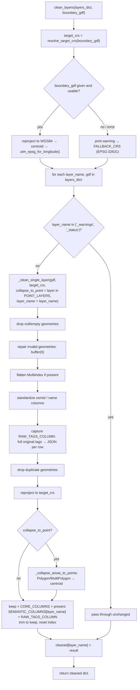

# clean.py

!!! info "Source"
    `lga_extractor/clean.py` (375 lines — grew from 264 with the addition
    of a richer per-layer attribute schema, see below)

## Purpose

Takes the raw layers produced by [`layers.py`](layers.md) and turns them
into a consistent, analysis-ready form: correct metric projection, valid
non-duplicate geometries, a predictable attribute schema across every layer
and every LGA run — and, critically, a single uniform geometry *type* per
layer, even when OSM itself mixed types for the same kind of real-world
feature.

**This revision substantially changes what "predictable attribute schema"
means.** Previously, cleaning reduced every layer to exactly three columns
(`osmid`, `name`, `geometry`), discarding every other OSM tag unconditionally
— simple and predictable, but it meant this extractor's output was only
ever useful for this project's own accessibility-scoring purposes, since
any other downstream consumer needing, say, a road's surface type or a
hospital's bed count had nothing to work with. This revision preserves a
curated, per-layer set of semantic OSM tags on top of the original minimal
schema, plus a full JSON-encoded escape hatch for everything else — see
`SEMANTIC_COLUMNS` and `RAW_TAGS_COLUMN` below. See the module's design
review framing, quoted directly in the source: previously "every OSM
attribute except osmid/name/geometry" was discarded; this fix means the
extractor's output is now "genuinely reusable beyond this project's specific
accessibility-scoring use case."

This module is the architectural center of the repository. `boundary.py`
imports from it (for area-check projection); `export.py` and `visualize.py`
both operate on its output rather than on raw extracted layers; and its
point-collapse logic is the direct fix for the most significant technical
issue found in the wider Map<>kathon 2026 project (see
[Known Issues](../../reference/known-issues.md)).

## Dependencies

- **Imports:** `geopandas`, `json` (new — for `RAW_TAGS_COLUMN` encoding, see
  `_row_tags_to_json()` below).
- **Imported by:** `pipeline.py` (third stage, after `layers.extract_layers()`);
  `boundary.py` (imports `resolve_target_crs()` only, locally, for its area
  sanity check — see [`boundary.md`](boundary.md)); `export.py` (imports
  `CORE_COLUMNS` and `RAW_TAGS_COLUMN` — new — to know which columns are
  safe to write to Shapefile, see [`export.md`](export.md)); `akure_access.
  facility_classification` (new, dashboard repo — reads the semantic
  `amenity`/`healthcare`/`isced:level`/`school` columns this module now
  preserves, see [`facility_classification.md`](../../akure-accessibility-dashboard/modules/facility_classification.md)).

## Functions & Classes

### Module-level constants

| Constant | Value | Purpose |
|---|---|---|
| `FALLBACK_CRS` | `"EPSG:32631"` | UTM Zone 31N — correct for Southwest Nigeria (Ondo State) specifically. Used only when no boundary geometry is available to auto-select a zone from. **Not** universally correct across Nigeria. |
| `CORE_COLUMNS` (renamed from the old `KEEP_COLUMNS`) | `["osmid", "name", "geometry"]` | The minimal attribute schema every cleaned layer *always* has, regardless of layer type or what OSM tags were present. |
| `KEEP_COLUMNS` (new: backward-compatible alias) | `= CORE_COLUMNS` | Kept pointing at the same list as `CORE_COLUMNS` specifically so any existing caller or test that still imports `KEEP_COLUMNS` directly continues to work unchanged — a rename with a compatibility shim, not a breaking change. |
| `SEMANTIC_COLUMNS` (new) | `dict`, layer name → list of OSM tag names | The curated, per-layer set of additional OSM attributes preserved on top of `CORE_COLUMNS`, when present in that layer's query results. See dedicated section below. |
| `RAW_TAGS_COLUMN` (new) | `"raw_tags"` | The name of a new column added to every non-empty layer, holding that feature's *complete* original OSM tag set as a JSON string — the escape hatch for anything not in `SEMANTIC_COLUMNS`. See dedicated section below. |
| `_NON_TAG_COLUMNS` (new, private) | `{"geometry", "osmid", "name", "element_type", "id", RAW_TAGS_COLUMN}` | Columns excluded when building `RAW_TAGS_COLUMN`'s captured tag set, so it doesn't just re-encode `CORE_COLUMNS`/its own prior value back at itself. |
| `POINT_LAYERS` | `{"health_facilities", "schools"}` | Layers that downstream consumers (network routing, isochrone snapping, completeness nearest-neighbor checks) require as Point geometries, and therefore get polygon-to-centroid collapse applied. |

## New in this revision: `SEMANTIC_COLUMNS` — a curated, per-layer attribute set

```python
SEMANTIC_COLUMNS = {
    "roads": ["highway", "surface", "maxspeed", "lanes", "oneway", "access", "bridge", "tunnel", "ref"],
    "buildings": ["building", "building:levels", "building:use"],
    "health_facilities": ["amenity", "healthcare", "beds", "emergency", "operator", "opening_hours"],
    "schools": ["amenity", "isced:level", "school", "operator"],
    "waterways": ["waterway", "natural", "water", "intermittent"],
    "landuse": ["landuse"],
}
```

**Why a curated per-layer list, rather than either "keep everything OSM sends" or the old "keep nothing beyond the core three":** OSM tagging is wildly inconsistent feature-to-feature — most features will only ever carry a handful of these tags, and a "keep everything" approach would produce a different, unpredictable column set for every single LGA export (whatever tags happened to appear in that particular query's results), defeating the "predictable schema" goal this module exists for in the first place. `SEMANTIC_COLUMNS` is a deliberate, curated middle ground: a fixed, known set of the *most generally useful* tags per layer type — a road's surface/maxspeed/oneway status, a hospital's emergency/beds/operator — chosen because they're exactly the kind of attribute a real downstream consumer (a routing algorithm caring about `oneway`, a planner caring about hospital `beds`) would actually need, not because they're exhaustive. **Only whichever of a layer's semantic columns are actually present in a given query's results get kept** — the list is a ceiling, not a guarantee every column will exist for every LGA.

## New in this revision: `RAW_TAGS_COLUMN` — the escape hatch

**The problem `SEMANTIC_COLUMNS` alone doesn't solve:** no fixed, curated subset can anticipate every future downstream consumer's needs. A consumer that needs a tag not in the curated list (say, a school's `addr:street`, not currently in `SEMANTIC_COLUMNS["schools"]`) would otherwise have no way to recover it short of re-querying OSM from scratch.

**The fix:** every non-empty layer gets a `raw_tags` column holding that feature's *complete* original OSM tag set (everything except the columns in `_NON_TAG_COLUMNS`), JSON-encoded into a single string, captured via the new `_row_tags_to_json()` helper (see below) — captured *before* any column trimming happens, so nothing is lost between the raw query result and this column, even columns that don't survive into `SEMANTIC_COLUMNS` or `CORE_COLUMNS`.

### `_row_tags_to_json(row)` (private, new)

**What it does:** JSON-encodes one feature's non-null OSM tag values (everything in the row except `_NON_TAG_COLUMNS`) into a single string, for `RAW_TAGS_COLUMN`.

**Why it needs its own function rather than a bare `json.dumps(dict(row))`:** not every value pandas/GeoPandas hands back is natively JSON-serializable — `NaN` (a float that fails `json.dumps` in some contexts and needs explicit filtering, since `value != value` is the standard NaN self-inequality check used here rather than `pd.isna()`, avoiding an extra import for one check), numpy scalar types, or nested lists OSMnx sometimes returns for multi-valued tags. Rather than letting any of these raise partway through encoding a whole layer, each value is tried through `json.dumps(value)` individually; anything that fails is coerced to `str(value)` instead. **The design intent, stated in the source:** this column's job is to *preserve information for a human or downstream parser to read*, not to round-trip perfectly-typed Python objects — a `str()`-coerced fallback that a reader can still make sense of is strictly better than the whole layer's cleaning step raising because one feature had one awkward tag value.

**`NaN`/`None` values are skipped entirely, not encoded as null** — a tag the feature doesn't have shouldn't appear in its `raw_tags` JSON at all, keeping the JSON blob's size proportional to how much real information a feature actually carries, not padded with every possible tag name set to `null`.

## Why the richer schema needed a coordinated change in `export.py`

Worth flagging here even though it's `export.py`'s own concern (see [`export.md`](export.md#new-in-this-revision-_shapefile_safe_columnsgdf-private) for the full detail): Shapefile's DBF format truncates field names to 10 characters and has no sensible representation for a JSON blob, so `export.export_layers()` was updated in lockstep to write the full `CORE_COLUMNS` + `SEMANTIC_COLUMNS` + `RAW_TAGS_COLUMN` schema to **GeoJSON only**, while Shapefile output deliberately stays at the original minimal `CORE_COLUMNS`-only schema — a Shapefile consumer written against this extractor's *old* output continues to work identically; only GeoJSON consumers see the richer schema.

### `utm_epsg_for_longitude(longitude, latitude=0.0)`

| | |
|---|---|
| **What it does** | Returns the correct UTM zone EPSG code (e.g. `"EPSG:32631"`) for a given longitude/latitude, using the standard UTM zone formula. |
| **Why written this way** | Nigeria spans three UTM zones — 31N (Lagos/Ondo/Oyo), 32N (Abuja/Kaduna), 33N (Borno/Adamawa). Hardcoding a single zone for the whole country (as `FALLBACK_CRS` does) would distort every distance and area calculation for LGAs outside that one zone's true coverage. This function is what makes the tool correct for *any* Nigerian LGA, not only the original Akure/Ondo study area it was built and tested against. |
| **Inputs** | `longitude: float` (WGS84 decimal degrees, typically an LGA boundary's centroid); `latitude: float`, default `0.0` (used only to select the northern (`326xx`) vs. southern (`327xx`) hemisphere EPSG prefix — defaults to northern since Nigeria lies entirely in the northern hemisphere; the parameter exists mainly so the function isn't silently wrong if ever reused outside Nigeria). |
| **Outputs** | `str`, an EPSG code, e.g. `"EPSG:32631"`. |
| **Internal workflow** | 1. `zone = int((longitude + 180) / 6) + 1` — the standard UTM zone formula (each zone is 6° of longitude wide, numbered from the antimeridian).<br>2. Clamp `zone` to `[1, 60]` (the valid UTM zone range) in case of a longitude at or beyond ±180°.<br>3. Pick hemisphere prefix `326` (north) or `327` (south) from the sign of `latitude`.<br>4. Return `f"EPSG:{prefix}{zone:02d}"`. |
| **Assumptions** | Assumes `longitude` is a valid WGS84 value; no bounds-checking beyond the zone clamp. Assumes the caller has already picked an appropriate representative point (e.g. a boundary's centroid) — this function has no awareness of "Nigeria" itself, it's a generic UTM-zone lookup. |
| **Complexity** | O(1) — pure arithmetic. |
| **Concurrency / race conditions** | None — pure function. |
| **Covered by test(s)** | See [tests.md](../tests.md) — includes docstring doctests for known reference points (Akure → `EPSG:32631`, Abuja → `EPSG:32632`, Maiduguri → `EPSG:32633`). |

### `resolve_target_crs(boundary_gdf=None)`

| | |
|---|---|
| **What it does** | Determines the correct projected CRS to clean/export layers in, by auto-selecting a UTM zone from a boundary's actual centroid location — falling back to `FALLBACK_CRS` with a printed warning if no usable boundary is available. |
| **Why written this way** | This function is the bridge between the generic zone-lookup math in `utm_epsg_for_longitude()` and the rest of the pipeline's actual inputs (a boundary `GeoDataFrame`, which might be missing, empty, or in an arbitrary CRS). Falling back rather than raising matters for usability: `clean_layers()` can be called standalone (e.g. from tests or ad-hoc scripts) without a boundary on hand, and still get a usable — if less precise — result, rather than being forced to always thread a boundary through. `pipeline.extract_lga()`, which always has a boundary available, gets the accurate, location-aware behavior by default; only callers without one pay the fallback's imprecision. |
| **Inputs** | `boundary_gdf: GeoDataFrame`, optional. Any CRS is accepted — it's reprojected to WGS84 internally before computing a centroid. |
| **Outputs** | `str`, an EPSG code appropriate for the boundary's location, or `FALLBACK_CRS` if none could be determined. |
| **Internal workflow** | 1. If `boundary_gdf` is `None` or empty: print a warning, return `FALLBACK_CRS`.<br>2. Otherwise, try: reproject to WGS84 if it has a CRS, else assume it's already WGS84 and just tag it (`set_crs`); compute `union_all().centroid` (dissolving all rows into one geometry first, so multi-row inputs still produce a single sensible centroid); call `utm_epsg_for_longitude()` on that centroid's `x`/`y`.<br>3. If anything in that `try` block raises, catch it, print a warning including the exception, and fall back to `FALLBACK_CRS`. |
| **Assumptions** | Assumes a boundary's centroid is a reasonable proxy for "which UTM zone should this LGA use" — true for any LGA that doesn't itself straddle a UTM zone boundary (unlikely at LGA scale, but not impossible for LGAs very close to a zone edge). |
| **Complexity** | O(1) beyond the geometry operations, which themselves are effectively O(1) for a single boundary (not scaling with feature count in downstream layers). |
| **Concurrency / race conditions** | None — pure function, no shared state. Note the fallback path uses `print()` for warnings rather than the `logging` module or an exception — this is a deliberate but informal choice; a caller running many extractions in a batch/headless context won't see these warnings unless stdout is being captured. |
| **Covered by test(s)** | See [tests.md](../tests.md) — `test_resolve_target_crs_falls_back_with_no_boundary`, `test_resolve_target_crs_auto_selects_zone_from_boundary`. |

### `clean_layers(layers_dict, boundary_gdf=None)`

| | |
|---|---|
| **What it does** | Cleans every layer in `layers_dict` (as returned by `layers.extract_layers()`) using a shared target CRS resolved once for the whole batch. |
| **Why written this way** | Resolving the target CRS *once*, outside the per-layer loop, rather than inside `_clean_single_layer()` per call, guarantees every layer from the same extraction run ends up in the *same* projection — essential, since downstream consumers (`akure_access`) need roads, buildings, and facilities to all align in one coordinate space for routing and spatial joins to work correctly. |
| **Inputs** | `layers_dict: dict` (layer_name → raw `GeoDataFrame`, may include `"_warnings"` and, **new**, `"_status"` keys — see [`layers.md`](layers.md#extract_layersboundary_gdf-tag_confignone-strictfalse-on_eventnone)); `boundary_gdf`, optional (passed straight through to `resolve_target_crs()`). |
| **Outputs** | `dict`, layer_name → cleaned `GeoDataFrame`, all in the same resolved target CRS. **Both** `"_warnings"` and `"_status"` entries, if present, are passed through completely unchanged — cleaning doesn't inspect or alter extraction warnings or the structured status dict. |
| **Internal workflow** | 1. Resolve `target_crs` once via `resolve_target_crs(boundary_gdf)`.<br>2. Iterate `layers_dict.items()`: pass `"_warnings"` and `"_status"` through unchanged (`if layer_name in ("_warnings", "_status")`, new — previously only checked `"_warnings"`); for every real layer, call `_clean_single_layer(gdf, target_crs, collapse_to_point=(layer_name in POINT_LAYERS), layer_name=layer_name)` — the new `layer_name` argument is what lets `_clean_single_layer()` look up the right entry in `SEMANTIC_COLUMNS`.<br>3. Return the new dict. |
| **Assumptions** | Assumes `layers_dict`'s keys match the same layer names `POINT_LAYERS` and `SEMANTIC_COLUMNS` expect (`"health_facilities"`, `"schools"`, etc.) — a custom `tag_config` passed to `extract_layers()` with different layer names would silently *not* get point-collapse treatment or any semantic-column preservation, since both membership checks are purely string-based against these two independently-maintained dicts. |
| **Complexity** | O(L × N) where L = number of layers, N = average features per layer — dominated by `_clean_single_layer()`'s per-row operations (see below). |
| **Concurrency / race conditions** | None — sequential loop, no threading (unlike `layers.py`). |
| **Covered by test(s)** | See [tests.md](../tests.md) — `test_clean_layers_reprojects_and_dedupes`, `test_clean_layers_standard_schema`, `test_clean_layers_uses_boundary_to_select_crs`, plus new: `test_clean_layers_preserves_semantic_columns_when_present`, `test_clean_layers_semantic_columns_are_layer_specific`, `test_clean_layers_raw_tags_preserves_everything_as_json`. |

### `_clean_single_layer(gdf, target_crs=FALLBACK_CRS, collapse_to_point=False, layer_name=None)`

The actual per-layer cleaning logic — no docstring in source, but the steps
are individually commented. **New parameter:** `layer_name`, used to look up
this layer's entry in `SEMANTIC_COLUMNS`.

| | |
|---|---|
| **What it does** | Runs one `GeoDataFrame` through the full cleaning sequence: drop null/empty geometry, repair invalid geometry, normalize the index, standardize `osmid`/`name` columns, **capture the full original tag set as JSON (new)**, drop duplicate geometries, reproject, optionally collapse polygons to points, reduce to `CORE_COLUMNS` + this layer's present `SEMANTIC_COLUMNS` + `RAW_TAGS_COLUMN` (changed — previously just `KEEP_COLUMNS`). |
| **Why written this way** | Each step exists because raw OSMnx output is inconsistent in a specific, observed way (see internal workflow below for what each step is defending against). The **order** of steps is deliberate and load-bearing, in particular: geometry repair happens before duplicate-dropping; reprojection happens before the point-collapse step; and **the raw-tags capture happens before any column trimming** (new) — capturing the complete tag set right after `osmid`/`name` standardization but before `SEMANTIC_COLUMNS` filtering or the final column-reduction step means `RAW_TAGS_COLUMN` genuinely holds everything the query returned for that feature, not a subset already narrowed by an earlier trimming step. |
| **Inputs** | `gdf: GeoDataFrame` (one raw layer); `target_crs: str`, default `FALLBACK_CRS`; `collapse_to_point: bool`, default `False`; `layer_name: str`, default `None` (new — used only to look up `SEMANTIC_COLUMNS.get(layer_name, [])`; a `None` or unrecognized layer name simply means no semantic columns are added on top of `CORE_COLUMNS` + `RAW_TAGS_COLUMN`, not an error). |
| **Outputs** | Cleaned `GeoDataFrame`. Columns: always `CORE_COLUMNS` (`osmid`/`name`/`geometry`), plus whichever of this layer's `SEMANTIC_COLUMNS` entries are actually present in the data, plus `RAW_TAGS_COLUMN` — de-duplicated while preserving order (`list(dict.fromkeys(keep))`, guarding against the unlikely case of a semantic column name colliding with a core column name), reprojected to `target_crs`, index reset to a clean `RangeIndex`. Returns the input unchanged (short-circuit) if it was already empty. |
| **Internal workflow** | 1. Short-circuit: if `gdf.empty`, return it as-is.<br>2. Copy the input.<br>3. Drop rows with null geometry, then empty geometry. Short-circuit again if this emptied the frame.<br>4. Repair invalid geometries via `.buffer(0)`, applied only where `.is_valid` fails.<br>5. Reset the index if it's a `MultiIndex`.<br>6. Standardize `osmid` (existing column, any column containing `"id"`, or a synthetic `range()`).<br>7. Standardize `name`, defaulting to `None`.<br>8. **New:** capture `RAW_TAGS_COLUMN` — `tag_columns = [c for c in gdf.columns if c not in _NON_TAG_COLUMNS]`, then `gdf[RAW_TAGS_COLUMN] = gdf[tag_columns].apply(_row_tags_to_json, axis=1)` — every remaining original column, JSON-encoded per row, captured *before* any trimming below.<br>9. Drop duplicate rows based on geometry only.<br>10. Reproject: WGS84 tag if unset, then reproject to `target_crs`.<br>11. If `collapse_to_point=True`, call `_collapse_areas_to_points(gdf)`.<br>12. **Changed:** build the keep-list as `CORE_COLUMNS + [semantic columns present] + [RAW_TAGS_COLUMN]`, de-duplicated, and reduce to it — previously just `KEEP_COLUMNS`.<br>13. Return with a reset `RangeIndex`. |
| **Assumptions** | The `osmid` fallback assumes a column containing `"id"` is an acceptable substitute for a real OSM ID — unchanged from before. The `.buffer(0)` repair trick is a widely-used but imperfect fix, unchanged from before. **New:** assumes `SEMANTIC_COLUMNS.get(layer_name, [])`'s curated list stays reasonably in sync with what OSM tagging conventions actually use for each layer type — a tag not in the curated list is still recoverable via `RAW_TAGS_COLUMN`, so this assumption is lower-stakes than it would be without that escape hatch. |
| **Complexity** | O(N) in the number of features for the filtering/column steps, unchanged. The new `RAW_TAGS_COLUMN` capture step is an additional O(N × C) pass (C = number of remaining tag columns per row) via `.apply(..., axis=1)` — a row-wise apply, which is slower per-row than a fully vectorized operation, but bounded by a typically small column count per layer, so not a significant cost relative to the geometry operations. |
| **Concurrency / race conditions** | None — called sequentially from `clean_layers()`'s loop. |
| **Covered by test(s)** | See [tests.md](../tests.md) — exercised indirectly through `test_clean_layers_reprojects_and_dedupes` and `test_clean_layers_standard_schema`, plus new: `test_clean_layers_preserves_semantic_columns_when_present`, `test_clean_layers_semantic_columns_are_layer_specific`, `test_clean_layers_raw_tags_preserves_everything_as_json`. |

### `_collapse_areas_to_points(gdf)`

**This is the function behind the Akure North health-facility bug fix.**
See [Known Issues](../../reference/known-issues.md) for the full case study;
this section documents the function itself.

| | |
|---|---|
| **What it does** | Replaces every `Polygon`/`MultiPolygon` geometry in `gdf` with its centroid (a `Point`), leaving any geometries that are already `Point` untouched. |
| **Why written this way** | OSM allows the same real-world facility — a hospital, a school — to be mapped either as a single point node, *or* as a full building-outline polygon/way. Both are equally valid, common mapping choices; the outline just means someone traced the building footprint instead of dropping a node. Without this collapse step, any facility mapped as an outline has geometry with no `.x`/`.y` attributes to snap to a routing graph node, and every grid cell that would have relied on that facility for accessibility scoring silently loses access to it entirely — not as an error, just as a facility that quietly isn't there. This is precisely what happened to all 14 of Akure North's health facilities, which were uniformly mapped as building outlines rather than points, making health access in that LGA look catastrophically worse than it actually was, until this collapse logic was added. |
| **Inputs** | `gdf: GeoDataFrame`, expected to already be in a **projected (metric) CRS** — this is a precondition, not something the function checks or enforces itself. |
| **Outputs** | A copy of `gdf` with area geometries replaced by their centroids; non-area geometries unchanged. |
| **Internal workflow** | 1. Copy the input.<br>2. Build a boolean mask `is_area` via `gdf.geometry.geom_type.isin(["Polygon", "MultiPolygon"])`.<br>3. If any rows match, replace just those rows' `geometry` column with `.centroid` (vectorized, applied only to the masked subset — `Point` rows are never touched or recomputed).<br>4. Return the copy. |
| **Assumptions** | **Critical, undocumented-in-code assumption**: the caller has already reprojected `gdf` into a projected/metric CRS before calling this function. Computing a centroid in a geographic (lat/lon) CRS distorts the result — degrees aren't a uniform distance measure, so a naive lat/lon centroid can be measurably offset from the true geometric center, especially for larger or irregularly-shaped polygons. `_clean_single_layer()`'s call site enforces this correctly (reprojection happens at step 9, collapse at step 10 — see above), but `_collapse_areas_to_points()` itself has no internal check or assertion that its input is actually projected; calling it directly on unprojected data would silently produce a subtly-wrong result rather than an error. |
| **Complexity** | O(N) for the mask computation; O(A) for the centroid computation, where A = number of area geometries (a subset of N) — each centroid computation itself is O(V) in the polygon's vertex count, so worst case O(N + A·V̄). |
| **Concurrency / race conditions** | None — pure function over a copy of its input. |
| **Covered by test(s)** | See [tests.md](../tests.md) — this is one of the most important functions in the repository to have direct, explicit test coverage for (mixed Point/Polygon input, verifying only the Polygon rows change and that outputs are true `Point` geometries). |

## Internal Workflow



## Gotchas

- **`SEMANTIC_COLUMNS` and `POINT_LAYERS` are two independently-hardcoded
  dicts, and a custom `tag_config` can silently miss both.** If a caller
  extends `DEFAULT_TAG_CONFIG` (in `layers.py`) with a new layer — say,
  `"markets"` — that layer will get **no** semantic-column treatment (falls
  back to `CORE_COLUMNS` + `RAW_TAGS_COLUMN` only) and **no** point-collapse
  treatment, unless `SEMANTIC_COLUMNS` and `POINT_LAYERS` are *both*
  separately, manually updated to know about it. There's no single place
  that couples "this is a new layer type" to "here's how to treat it," so
  these can drift out of sync with `DEFAULT_TAG_CONFIG` — this was already
  true of `POINT_LAYERS` before this revision; `SEMANTIC_COLUMNS` inherits
  the identical risk.
- **`RAW_TAGS_COLUMN` makes GeoJSON exports meaningfully larger.** Every
  non-empty feature now carries a JSON-encoded copy of its full original tag
  set, in addition to the curated semantic columns — for a dense layer (e.g.
  `roads` in an urban LGA), this can noticeably increase the exported
  GeoJSON's file size compared to the pre-revision minimal schema. Shapefile
  exports are unaffected (see `export.py`'s coordinated change, linked
  above) — only GeoJSON consumers see this size increase.
- **`resolve_target_crs()`'s fallback warnings only print to stdout.** In an
  automated/CI context, or when running many LGAs in a batch, these warnings
  are easy to miss if stdout isn't being actively monitored — there's no
  structured warning collection (unlike `layers.py`'s `_warnings` list
  pattern) for this particular failure mode.
- **Duplicate-dropping is geometry-only.** Two OSM features with identical
  geometry (e.g. a data-entry artifact) but genuinely different `name`/`osmid`
  attributes are still merged into one row by `drop_duplicates(subset="geometry")`
  — whichever row pandas keeps first wins, the other's attributes are lost
  silently. **New consideration:** the two rows' `raw_tags` may also differ
  meaningfully (e.g. one copy has richer tagging than the other), and that
  richer information is lost the same way, silently, along with the rest.
