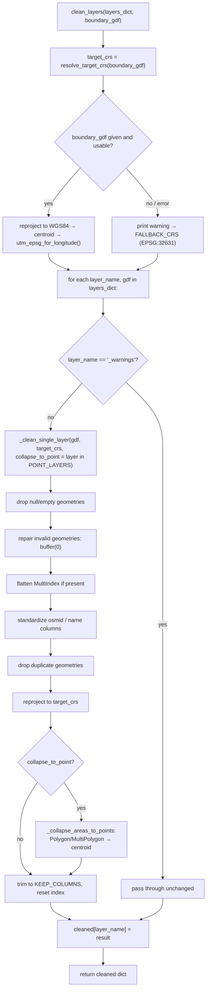

# clean.py

!!! info "Source"
    `lga_extractor/clean.py` (264 lines)

## Purpose

Takes the raw layers produced by [`layers.py`](layers.md) and turns them
into a consistent, analysis-ready form: correct metric projection, valid
non-duplicate geometries, a predictable minimal attribute schema across
every layer and every LGA run — and, critically, a single uniform geometry
*type* per layer, even when OSM itself mixed types for the same kind of
real-world feature.

This module is the architectural center of the repository. `boundary.py`
imports from it (for area-check projection); `export.py` and `visualize.py`
both operate on its output rather than on raw extracted layers; and its
point-collapse logic is the direct fix for the most significant technical
issue found in the wider Map<>kathon 2026 project (see
[Known Issues](../../reference/known-issues.md)).

## Dependencies

- **Imports:** `geopandas` only.
- **Imported by:** `pipeline.py` (third stage, after `layers.extract_layers()`);
  `boundary.py` (imports `resolve_target_crs()` only, locally, for its area
  sanity check — see [`boundary.md`](boundary.md)).

## Functions & Classes

### Module-level constants

| Constant | Value | Purpose |
|---|---|---|
| `FALLBACK_CRS` | `"EPSG:32631"` | UTM Zone 31N — correct for Southwest Nigeria (Ondo State) specifically. Used only when no boundary geometry is available to auto-select a zone from. **Not** universally correct across Nigeria. |
| `KEEP_COLUMNS` | `["osmid", "name", "geometry"]` | The minimal attribute schema every cleaned layer is reduced to, regardless of what extra columns OSM's raw response included. |
| `POINT_LAYERS` | `{"health_facilities", "schools"}` | Layers that downstream consumers (network routing, isochrone snapping, completeness nearest-neighbor checks) require as Point geometries, and therefore get polygon-to-centroid collapse applied. |

### `utm_epsg_for_longitude(longitude, latitude=0.0)`

| | |
|---|---|
| **What it does** | Returns the correct UTM zone EPSG code (e.g. `"EPSG:32631"`) for a given longitude/latitude, using the standard UTM zone formula. |
| **Why written this way** | Nigeria spans three UTM zones — 31N (Lagos/Ondo/Oyo), 32N (Abuja/Kaduna), 33N (Borno/Adamawa). Hardcoding a single zone for the whole country (as `FALLBACK_CRS` does) would distort every distance and area calculation for LGAs outside that one zone's true coverage. This function is what makes the tool correct for *any* Nigerian LGA, not only the original Akure/Ondo study area it was built and tested against. |
| **Inputs** | `longitude: float` (WGS84 decimal degrees, typically an LGA boundary's centroid); `latitude: float`, default `0.0` (used only to select the northern (`326xx`) vs. southern (`327xx`) hemisphere EPSG prefix — defaults to northern since Nigeria lies entirely in the northern hemisphere; the parameter exists mainly so the function isn't silently wrong if ever reused outside Nigeria). |
| **Outputs** | `str`, an EPSG code, e.g. `"EPSG:32631"`. |
| **Internal workflow** | 1. `zone = int((longitude + 180) / 6) + 1` — the standard UTM zone formula (each zone is 6° of longitude wide, numbered from the antimeridian). 2. Clamp `zone` to `[1, 60]` (the valid UTM zone range) in case of a longitude at or beyond ±180°. 3. Pick hemisphere prefix `326` (north) or `327` (south) from the sign of `latitude`. 4. Return `f"EPSG:{prefix}{zone:02d}"`. |
| **Assumptions** | Assumes `longitude` is a valid WGS84 value; no bounds-checking beyond the zone clamp. Assumes the caller has already picked an appropriate representative point (e.g. a boundary's centroid) — this function has no awareness of "Nigeria" itself, it's a generic UTM-zone lookup. |
| **Complexity** | O(1) — pure arithmetic. |
| **Concurrency / race conditions** | None — pure function. |
| **Covered by test(s)** | See [tests.md](../tests.md) — includes docstring doctests for known reference points (Akure → `EPSG:32631`, Abuja → `EPSG:32632`, Maiduguri → `EPSG:32633`). |

### `resolve_target_crs(boundary_gdf=None)`

| | |
|---|---|
| **What it does** | Determines the correct projected CRS to clean/export layers in, by auto-selecting a UTM zone from a boundary's actual centroid location — falling back to `FALLBACK_CRS` with a printed warning if no usable boundary is available. |
| **Why written this way** | This function is the bridge between the generic zone-lookup math in `utm_epsg_for_longitude()` and the rest of the pipeline's actual inputs (a boundary `GeoDataFrame`, which might be missing, empty, or in an arbitrary CRS). Falling back rather than raising matters for usability: `clean_layers()` can be called standalone (e.g. from tests or ad-hoc scripts) without a boundary on hand, and still get a usable — if less precise — result, rather than being forced to always thread a boundary through. `pipeline.extract_lga()`, which always has a boundary available, gets the accurate, location-aware behavior by default; only callers without one pay the fallback's imprecision. |
| **Inputs** | `boundary_gdf: GeoDataFrame`, optional. Any CRS is accepted — it's reprojected to WGS84 internally before computing a centroid. |
| **Outputs** | `str`, an EPSG code appropriate for the boundary's location, or `FALLBACK_CRS` if none could be determined. |
| **Internal workflow** | 1. If `boundary_gdf` is `None` or empty: print a warning, return `FALLBACK_CRS`. 2. Otherwise, try: reproject to WGS84 if it has a CRS, else assume it's already WGS84 and just tag it (`set_crs`); compute `union_all().centroid` (dissolving all rows into one geometry first, so multi-row inputs still produce a single sensible centroid); call `utm_epsg_for_longitude()` on that centroid's `x`/`y`. 3. If anything in that `try` block raises, catch it, print a warning including the exception, and fall back to `FALLBACK_CRS`. |
| **Assumptions** | Assumes a boundary's centroid is a reasonable proxy for "which UTM zone should this LGA use" — true for any LGA that doesn't itself straddle a UTM zone boundary (unlikely at LGA scale, but not impossible for LGAs very close to a zone edge). |
| **Complexity** | O(1) beyond the geometry operations, which themselves are effectively O(1) for a single boundary (not scaling with feature count in downstream layers). |
| **Concurrency / race conditions** | None — pure function, no shared state. Note the fallback path uses `print()` for warnings rather than the `logging` module or an exception — this is a deliberate but informal choice; a caller running many extractions in a batch/headless context won't see these warnings unless stdout is being captured. |
| **Covered by test(s)** | See [tests.md](../tests.md) — `test_resolve_target_crs_falls_back_with_no_boundary`, `test_resolve_target_crs_auto_selects_zone_from_boundary`. |

### `clean_layers(layers_dict, boundary_gdf=None)`

| | |
|---|---|
| **What it does** | Cleans every layer in `layers_dict` (as returned by `layers.extract_layers()`) using a shared target CRS resolved once for the whole batch. |
| **Why written this way** | Resolving the target CRS *once*, outside the per-layer loop, rather than inside `_clean_single_layer()` per call, guarantees every layer from the same extraction run ends up in the *same* projection — essential, since downstream consumers (`akure_access`) need roads, buildings, and facilities to all align in one coordinate space for routing and spatial joins to work correctly. |
| **Inputs** | `layers_dict: dict` (layer_name → raw `GeoDataFrame`, may include a `"_warnings"` key); `boundary_gdf`, optional (passed straight through to `resolve_target_crs()`). |
| **Outputs** | `dict`, layer_name → cleaned `GeoDataFrame`, all in the same resolved target CRS. The `"_warnings"` entry, if present, is passed through completely unchanged — cleaning doesn't inspect or alter extraction warnings. |
| **Internal workflow** | 1. Resolve `target_crs` once via `resolve_target_crs(boundary_gdf)`. 2. Iterate `layers_dict.items()`: pass `"_warnings"` through unchanged; for every real layer, call `_clean_single_layer(gdf, target_crs, collapse_to_point=(layer_name in POINT_LAYERS))`. 3. Return the new dict. |
| **Assumptions** | Assumes `layers_dict`'s keys match the same layer names `POINT_LAYERS` expects (`"health_facilities"`, `"schools"`) — a custom `tag_config` passed to `extract_layers()` with different layer names for facilities would silently *not* get point-collapse treatment, since the membership check is purely string-based. |
| **Complexity** | O(L × N) where L = number of layers, N = average features per layer — dominated by `_clean_single_layer()`'s per-row operations (see below). |
| **Concurrency / race conditions** | None — sequential loop, no threading (unlike `layers.py`). |
| **Covered by test(s)** | See [tests.md](../tests.md) — `test_clean_layers_reprojects_and_dedupes`, `test_clean_layers_standard_schema`, `test_clean_layers_uses_boundary_to_select_crs`. |

### `_clean_single_layer(gdf, target_crs=FALLBACK_CRS, collapse_to_point=False)`

The actual per-layer cleaning logic — no docstring in source, but the steps
are individually commented.

| | |
|---|---|
| **What it does** | Runs one `GeoDataFrame` through the full cleaning sequence: drop null/empty geometry, repair invalid geometry, normalize the index, standardize `osmid`/`name` columns, drop duplicate geometries, reproject, optionally collapse polygons to points, reduce to the minimal schema. |
| **Why written this way** | Each step exists because raw OSMnx output is inconsistent in a specific, observed way (see internal workflow below for what each step is defending against). The **order** of steps is deliberate and load-bearing, in particular: geometry repair happens before duplicate-dropping (so an invalid geometry that would otherwise compare unequal to its valid counterpart doesn't create a spurious "duplicate"); reprojection happens before the point-collapse step (centroids computed in a geographic/lat-lon CRS are measurably distorted compared to a projected metric CRS — the same reasoning applied elsewhere to grid-cell centroids in `akure_access.accessibility.scoring.add_access_times()`). |
| **Inputs** | `gdf: GeoDataFrame` (one raw layer); `target_crs: str`, default `FALLBACK_CRS`; `collapse_to_point: bool`, default `False`. |
| **Outputs** | Cleaned `GeoDataFrame`, columns reduced to whichever of `KEEP_COLUMNS` are present, reprojected to `target_crs`, index reset to a clean `RangeIndex`. Returns the input unchanged (short-circuit) if it was already empty. |
| **Internal workflow** | 1. Short-circuit: if `gdf.empty`, return it as-is — no point running the rest of the pipeline on nothing. 2. Copy the input (avoid mutating the caller's `GeoDataFrame`). 3. Drop rows with null geometry, then drop rows with empty geometry (two separate filters, since a "null" geometry and an "empty but present" geometry, e.g. an empty `Polygon`, are different states in Shapely/GeoPandas). Short-circuit again if this emptied the frame. 4. Repair invalid geometries via the common `geom.buffer(0)` trick, applied only to geometries that fail `.is_valid` (leaves already-valid geometries untouched, avoiding unnecessary computation). 5. Reset the index if it's a `MultiIndex` — OSMnx commonly returns results indexed by `(element_type, osmid)`, which is inconvenient for downstream row-wise operations; this flattens it back into regular columns. 6. Standardize an `osmid` column: if one doesn't already exist, look for any column whose name contains `"id"` (case-insensitive) and use that; if none exists at all, fall back to a plain `range(len(gdf))` sequential ID. 7. Standardize a `name` column similarly, defaulting to `None` if absent — guarantees every cleaned layer has a `name` column to select, even for layers (like `waterways`) where most features are unnamed. 8. Drop duplicate rows based on geometry only (`subset="geometry"`) — two features with identical geometry but different attributes are still considered duplicates here. 9. Reproject: tag as EPSG:4326 first if no CRS is set (OSM data is implicitly WGS84), then reproject to `target_crs`. 10. If `collapse_to_point=True` (only for `POINT_LAYERS`), call `_collapse_areas_to_points(gdf)` — see below. 11. Reduce to `KEEP_COLUMNS`, keeping only whichever of `osmid`/`name`/`geometry` are actually present. 12. Return with a reset, clean `RangeIndex`. |
| **Assumptions** | The `osmid` fallback (step 6) assumes that if no column literally contains the substring `"id"`, a synthetic sequential ID is an acceptable substitute — this loses any real traceability back to the original OSM element for that layer, silently. The `.buffer(0)` repair trick (step 4) is a widely-used but imperfect fix for invalid geometries; it can occasionally alter a geometry's shape slightly rather than perfectly "fixing" it, this is a known trade-off, not something this function detects or reports. |
| **Complexity** | O(N) in the number of features in the layer for the filtering/column steps; the `.buffer(0)` repair and centroid computation are each O(V) in vertex count per affected geometry, so worst case O(N·V̄) where V̄ is average vertex count, for layers with many invalid or area geometries. |
| **Concurrency / race conditions** | None — called sequentially from `clean_layers()`'s loop. |
| **Covered by test(s)** | See [tests.md](../tests.md) — exercised indirectly through `test_clean_layers_reprojects_and_dedupes` and `test_clean_layers_standard_schema`, both of which call `clean_layers()` (this function's only caller) and check its output. |

### `_collapse_areas_to_points(gdf)`

**This is the function behind the Akure North health-facility bug fix.**
See [Known Issues](../../reference/known-issues.md) for the full case study;
this section documents the function itself.

| | |
|---|---|
| **What it does** | Replaces every `Polygon`/`MultiPolygon` geometry in `gdf` with its centroid (a `Point`), leaving any geometries that are already `Point` untouched. |
| **Why written this way** | OSM allows the same real-world facility — a hospital, a school — to be mapped either as a single point node, *or* as a full building-outline polygon/way. Both are equally valid, common mapping choices; the outline just means someone traced the building footprint instead of dropping a node. Without this collapse step, any facility mapped as an outline has geometry with no `.x`/`.y` attributes to snap to a routing graph node, and every grid cell that would have relied on that facility for accessibility scoring silently loses access to it entirely — not as an error, just as a facility that quietly isn't there. This is precisely what happened to all 14 of Akure North's health facilities, which were uniformly mapped as building outlines rather than points, making health access in that LGA look catastrophically worse than it actually was, until this collapse logic was added. |
| **Inputs** | `gdf: GeoDataFrame`, expected to already be in a **projected (metric) CRS** — this is a precondition, not something the function checks or enforces itself. |
| **Outputs** | A copy of `gdf` with area geometries replaced by their centroids; non-area geometries unchanged. |
| **Internal workflow** | 1. Copy the input. 2. Build a boolean mask `is_area` via `gdf.geometry.geom_type.isin(["Polygon", "MultiPolygon"])`. 3. If any rows match, replace just those rows' `geometry` column with `.centroid` (vectorized, applied only to the masked subset — `Point` rows are never touched or recomputed). 4. Return the copy. |
| **Assumptions** | **Critical, undocumented-in-code assumption**: the caller has already reprojected `gdf` into a projected/metric CRS before calling this function. Computing a centroid in a geographic (lat/lon) CRS distorts the result — degrees aren't a uniform distance measure, so a naive lat/lon centroid can be measurably offset from the true geometric center, especially for larger or irregularly-shaped polygons. `_clean_single_layer()`'s call site enforces this correctly (reprojection happens at step 9, collapse at step 10 — see above), but `_collapse_areas_to_points()` itself has no internal check or assertion that its input is actually projected; calling it directly on unprojected data would silently produce a subtly-wrong result rather than an error. |
| **Complexity** | O(N) for the mask computation; O(A) for the centroid computation, where A = number of area geometries (a subset of N) — each centroid computation itself is O(V) in the polygon's vertex count, so worst case O(N + A·V̄). |
| **Concurrency / race conditions** | None — pure function over a copy of its input. |
| **Covered by test(s)** | See [tests.md](../tests.md) — this is one of the most important functions in the repository to have direct, explicit test coverage for (mixed Point/Polygon input, verifying only the Polygon rows change and that outputs are true `Point` geometries). |

## Internal Workflow

## Gotchas

- **`POINT_LAYERS` membership is a hardcoded string set, not driven by
  configuration.** If a caller extends `DEFAULT_TAG_CONFIG` (in `layers.py`)
  with a new facility-type layer that should also be point-normalized (e.g.
  a custom `"markets"` layer), it must also be manually added to
  `POINT_LAYERS` in `clean.py` — there's no single place that couples "this
  is a facility type" to "this needs point-collapse," so the two dictionaries
  can silently drift out of sync.
- **`resolve_target_crs()`'s fallback warnings only print to stdout.** In an
  automated/CI context, or when running many LGAs in a batch, these warnings
  are easy to miss if stdout isn't being actively monitored — there's no
  structured warning collection (unlike `layers.py`'s `_warnings` list
  pattern) for this particular failure mode.
- **Duplicate-dropping is geometry-only.** Two OSM features with identical
  geometry (e.g. a data-entry artifact) but genuinely different `name`/`osmid`
  attributes are still merged into one row by `drop_duplicates(subset="geometry")`
  — whichever row pandas keeps first wins, the other's attributes are lost
  silently.
