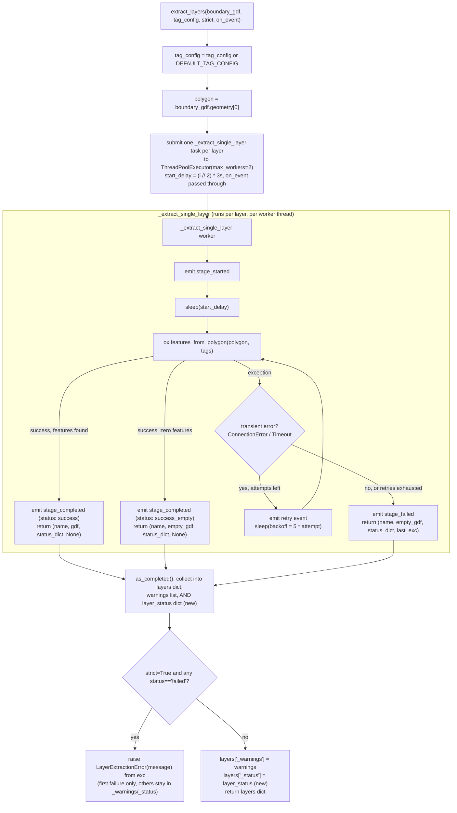

# layers.py

!!! info "Source"
    `lga_extractor/layers.py` (296 lines — grew from 211 with the addition
    of structured per-layer status and progress events, see below)

## Purpose

Given a validated boundary polygon (from [`boundary.py`](boundary.md)),
queries OpenStreetMap for each configured feature layer — roads, buildings,
waterways, land use, health facilities, schools — within that polygon, using
OSMnx's `features_from_polygon()` under the hood (which talks to the
Overpass API).

The bulk of this module's complexity has nothing to do with *what* to query
— that's a six-entry dictionary (`DEFAULT_TAG_CONFIG`). It's entirely about
**how to query six things from a shared public API server without getting
refused**, and how to tell the difference between "this layer genuinely has
no features" and "this layer's query failed."

## Dependencies

- **Imports:** `time`, `concurrent.futures.ThreadPoolExecutor` /
  `as_completed`, `geopandas`, `osmnx`, `requests` (for its exception
  types), and (new) `_emit` from [`events.py`](events.md).
- **Imported by:** `pipeline.py` (second stage of `extract_lga()`, after
  `boundary.resolve_boundary()`). Has no dependency on `boundary.py` or
  `clean.py` itself — it only needs a bare Shapely polygon, not a full
  validated `GeoDataFrame`, which keeps it independently testable.

## Functions & Classes

### `DEFAULT_TAG_CONFIG` (module-level dict)

Maps each layer name to the OSM tag filter used with
`osmnx.features_from_polygon()`:

```python
{
    "roads": {"highway": True},
    "buildings": {"building": True},
    "waterways": {"waterway": True, "natural": "water"},
    "landuse": {"landuse": True},
    "health_facilities": {"amenity": ["hospital", "clinic", "pharmacy"]},
    "schools": {"amenity": "school"},
}
```

Callers can pass their own `tag_config` to `extract_layers()` to add layers
(e.g. markets, places of worship) or override this default without touching
any extraction logic — the dict is the entire "what to extract" surface
area of the module.

### `LayerExtractionError`

Raised only for a **genuine** failure — an Overpass error, timeout, network
failure, or bad tag configuration — when running in `strict=True` mode, and
only after all retry attempts have been exhausted. Explicitly *not* raised
when a layer's query succeeds but legitimately finds zero features within
the boundary; that's valid data (and can itself be a meaningful completeness
signal — see `akure_access.completeness.grid_check`), not an error.

### `_is_transient_connection_error(exc)`

| | |
|---|---|
| **What it does** | Returns `True` if `exc` is a `requests.exceptions.ConnectionError` or `requests.exceptions.Timeout` — the categories of failure worth retrying. |
| **Why written this way** | A refused connection or timeout on a shared public Overpass mirror is often transient — retrying after a short wait frequently succeeds. A malformed tag filter, by contrast, will fail identically on every attempt; retrying it just burns time and retry budget for no benefit. This function is the gate that decides which failures get a second chance. |
| **Inputs / Outputs** | `exc: Exception` in, `bool` out. |
| **Complexity** | O(1) — a single `isinstance` check. |
| **Concurrency / race conditions** | None — pure function. |

### `_extract_single_layer(layer_name, tags, polygon, start_delay, on_event=None)`

| | |
|---|---|
| **What it does** | Runs one layer's Overpass query (via `ox.features_from_polygon()`), after first sleeping `start_delay` seconds, retrying transient connection failures with linear backoff, up to `MAX_RETRIES` (6) attempts. **Changed in this revision:** returns `(layer_name, gdf, status, exc)` — a structured `status` dict replaces the old ambiguous `warning_or_message` string — and emits progress events via `on_event` at each stage transition. Still never raises. |
| **Why the return shape changed** | The previous 4-tuple's third field (`warning_or_message`) was semantically overloaded — it meant an informational "found nothing" message on success, or a failure description on error, distinguished only by whether the fourth field (`error`) was `None`. This worked but was fragile to misread. **This revision replaces that overload with an explicit `status` dict**: `{"status": "success" \| "success_empty" \| "failed", "feature_count": int, "attempts": int, "message": str or None}` — the `"status"` field is now the single, explicit thing any caller should branch on, never inferred from an empty `GeoDataFrame` or from field presence/absence. The exception object is kept as a **separate** return value (`exc`, not folded into `status`) specifically so `extract_layers()` can still do a proper `raise ... from exc` with a real traceback in strict mode, while `status` itself stays plain, JSON-serializable data — exactly what ends up written into `run_log.json` and the new [extraction manifest](manifest.md) unchanged. |
| **New: progress events.** | Emits `{"type": "stage_started", "stage": f"layer:{layer_name}"}` once (after `start_delay` elapses, when the query actually begins), zero or more `{"type": "retry", "stage": ..., "attempt": N, "max_attempts": MAX_RETRIES, "message": ...}` events (one per retry), and exactly one terminal event — `{"type": "stage_completed", ...}` (success or success_empty) or `{"type": "stage_failed", ...}` (failure). See [`events.py`](events.md) for the full event schema. **Thread safety matters here specifically:** since this function runs inside a `ThreadPoolExecutor` worker (see `extract_layers()` below), `on_event` will be called from that worker thread, not the caller's thread — a callback passed here must be safe to call from multiple threads concurrently (see `events.ThreadSafeEventQueue`, the pattern [`app.py`](../app.md) actually uses). |
| **Inputs** | `layer_name: str`; `tags: dict`; `polygon` (Shapely polygon); `start_delay: float`; `on_event: callable, optional` (new — defaults to `None`, a guaranteed no-op). |
| **Outputs** | `(layer_name: str, gdf: GeoDataFrame, status: dict, exc: Exception or None)` — **changed** from the old `(layer_name, gdf, warning_or_None, error_or_None)`. `gdf` is always a valid (possibly empty) `GeoDataFrame` with CRS EPSG:4326 — never `None`. |
| **Internal workflow** | 1. Sleep `start_delay` seconds if nonzero.<br>2. Emit `stage_started`.<br>3. Loop `attempt` from 1 to `MAX_RETRIES`:<br>&nbsp;&nbsp;a. Call `ox.features_from_polygon(polygon, tags)`.<br>&nbsp;&nbsp;b. If it returns `None`/empty: build `status={"status": "success_empty", "feature_count": 0, "attempts": attempt, "message": "..."}`, emit `stage_completed` (with `status: "success_empty"`), return immediately. Never triggers a retry.<br>&nbsp;&nbsp;c. If it returns data: build `status={"status": "success", "feature_count": len(gdf), "attempts": attempt, "message": None}`, emit `stage_completed` (with `status: "success"` and a feature-count detail string), return.<br>&nbsp;&nbsp;d. If it raises: record the exception. If retryable and attempts remain, emit `retry`, sleep `RETRY_BACKOFF_BASE_SECONDS * attempt` seconds, loop again. Otherwise break.<br>4. If the loop exhausted: build `status={"status": "failed", "feature_count": 0, "attempts": attempt, "message": "..."}`, emit `stage_failed`, return an empty `GeoDataFrame` with `status` and the last exception attached. |
| **Assumptions** | Assumes `ox.features_from_polygon()` raising is the only failure signal to watch for. Assumes linear backoff (rather than exponential) is sufficient — the module's own comments still refer to this informally as "backoff" without the "exponential" mischaracterization from the prior revision's docstring, though the formula itself (`RETRY_BACKOFF_BASE_SECONDS * attempt`) is unchanged and still linear. **New:** assumes a caller's `on_event` callback is either thread-safe or `None` — this function does nothing itself to protect against an unsafe callback; that responsibility is entirely the caller's (see [`events.py`](events.md)'s own documentation of this exact risk). |
| **Complexity** | O(1) in terms of this function's own logic; wall-clock time scales with number of retries needed and the underlying Overpass query's own complexity. The event-emission calls themselves are O(1) each, negligible against network latency. |
| **Concurrency / race conditions** | This function itself has no shared mutable state — each call operates on its own local variables only, and multiple instances run safely in parallel as separate `ThreadPoolExecutor` workers. **New consideration:** `on_event` is now genuinely called concurrently from multiple worker threads for different layers' events — this was already implicitly true of the function's execution context before this revision, but is now directly relevant since a caller actually supplies a callback (previously there was nothing to call from these threads at all). See `extract_layers()` below for how concurrency is bounded across *multiple* calls to this function. |

### `extract_layers(boundary_gdf, tag_config=None, strict=False, on_event=None)`

| | |
|---|---|
| **What it does** | Extracts every layer defined in `tag_config` (or `DEFAULT_TAG_CONFIG`) within `boundary_gdf`'s polygon, using bounded, staggered concurrency, and returns a dict of `layer_name -> GeoDataFrame` plus `"_warnings"` and (**new**) `"_status"` keys. |
| **Why written this way** | The concurrency model here is the single most consequential design decision in this module, and it's empirically derived, not a default choice. Fully parallel querying (all 6 layers at once, `max_workers=6`, no stagger) was tried first and made things *worse*: the public Overpass mirror refused every connection outright (`Errno 111`, connection refused) when hit by a burst of simultaneous requests from one client. The current approach caps concurrency at `MAX_CONCURRENT_LAYER_QUERIES = 2` and staggers each new request's start by `REQUEST_STAGGER_SECONDS = 3`, so the server never sees more than 2 near-simultaneous connection attempts, even at the very start of a run. |
| **The stagger math, worked out concretely.** | With the default 6 layers and `MAX_CONCURRENT_LAYER_QUERIES = 2`, `start_delay = (i // 2) * 3` produces delays of `[0, 0, 3, 3, 6, 6]` seconds across `i = 0..5`. The *pairing* here is purely positional (dictionary insertion order in `DEFAULT_TAG_CONFIG`), not by any property of the layers themselves. |
| **`as_completed()` introduces a small but real nondeterminism.** | Futures are iterated in **completion order**, not submission order — so if two layers happen to fail at nearly the same wall-clock time, which one ends up recorded as `first_error` can vary between otherwise-identical runs. This doesn't affect *correctness* (every layer's outcome still ends up in both `_warnings` and, new, `_status`), but a strict-mode failure message isn't necessarily reproducible run-to-run when multiple layers fail simultaneously. |
| **The "third field means two things" ambiguity from the previous revision is now resolved — worth noting explicitly as a real, positive fix.** | The prior revision of this page flagged, as a genuine subtlety worth watching, that `_extract_single_layer()`'s returned tuple had a semantically-overloaded third field (an informational message on success, a failure description on error, distinguished only by the fourth field's presence). **This revision removes that ambiguity entirely** by replacing it with the explicit `status` dict described in `_extract_single_layer()` above — `extract_layers()` now reads `status["status"]` directly (`"success"` / `"success_empty"` / `"failed"`) rather than inferring meaning from field combinations. This is a genuine, clean fix to a documented design wart, not just a refactor for its own sake. |
| **New: progress events pass straight through.** | `on_event` is threaded directly into every `_extract_single_layer()` call (`executor.submit(_extract_single_layer, layer_name, tags, polygon, start_delay, on_event)`) — `extract_layers()` itself doesn't emit any events of its own at this level; all per-layer event emission happens inside the worker function. The thread-safety consideration described there applies identically here: `on_event` will be invoked from multiple worker threads. |
| **Inputs** | `boundary_gdf`; `tag_config` (optional); `strict: bool` (default `False`); `on_event: callable, optional` (new — default `None`). |
| **Outputs** | `dict` mapping each `layer_name` to a `GeoDataFrame`, plus `"_warnings"` (flat list of human-readable strings, unchanged shape, kept for backward compatibility) and (**new**) `"_status"` — `{layer_name: {"status", "feature_count", "attempts", "message"}}`, the same per-layer outcome as structured, machine-readable data. `"_status"`'s `"status"` field is what a downstream consumer should actually branch on; **never infer failure from an empty `GeoDataFrame` alone** — an empty `GeoDataFrame` is also exactly what `status="success_empty"` looks like, and conflating the two is precisely the failure mode this structured field exists to prevent. |
| **Internal workflow** | 1. Default `tag_config`; extract the boundary polygon.<br>2. Open a `ThreadPoolExecutor(max_workers=MAX_CONCURRENT_LAYER_QUERIES)`.<br>3. For each `(layer_name, tags)` pair, compute `start_delay`, submit `_extract_single_layer(..., on_event)` as a future.<br>4. As each future completes: unpack `(layer_name, gdf, status, exc)`; store `gdf` in `layers[layer_name]`; store `status` in `layer_status[layer_name]` (**new**); append `status["message"]` to `warnings` if truthy; record the *first* `status["status"] == "failed"` case as `first_error` (**changed** — now checks the explicit status field, not tuple-position inference).<br>5. After all futures complete: if `strict=True` and `first_error` is set, raise `LayerExtractionError`, chaining the original exception.<br>6. Otherwise, attach `layers["_warnings"] = warnings` **and** `layers["_status"] = layer_status` (**new**), return. |
| **Assumptions** | Assumes `MAX_CONCURRENT_LAYER_QUERIES=2` / `REQUEST_STAGGER_SECONDS=3` remain valid for whichever Overpass mirror OSMnx is configured to use. Assumes six is a small enough layer count that `max_workers=2` doesn't create an unreasonably long total runtime. |
| **Complexity** | O(L) where L = number of layers, in terms of number of Overpass queries issued. Wall-clock time is bounded below by `(L / MAX_CONCURRENT_LAYER_QUERIES) * REQUEST_STAGGER_SECONDS` for staggering alone. |
| **Concurrency / race conditions** | This is the one place in the whole repository where genuine concurrency is used. Each worker thread's result is only touched by the main thread inside `as_completed()`'s loop, so `layers`, `warnings`, `layer_status`, and `first_error` are all only ever *mutated* from the single main thread as futures complete — no data race on those structures. The genuinely concurrent part, `on_event` being called from worker threads (new in this revision), is the caller's responsibility to handle safely, not something this function protects against internally. |
| **Covered by test(s)** | See [tests.md](../tests.md) — `test_extraction.py`, plus new: `test_extract_layers_status_distinguishes_failed_from_empty`, `test_extract_layers_emits_started_and_completed_events`, `test_extract_layers_emits_retry_events_on_transient_failure`, `test_thread_safe_event_queue_drains_events_from_multiple_threads`. |

## Internal Workflow



## Gotchas

- **`strict` only affects genuine failures, never emptiness.** It's easy to
  misread `strict=True` as "fail if any layer has no data" — it does not do
  that. A layer with `status="success_empty"` is always recorded, in both
  modes, and never raises.
- **In strict mode, only the *first* error is surfaced, even if multiple
  layers fail.** All other layers still get queried to completion, but only
  one error message ends up in the raised exception. The full picture is in
  `layers["_status"]` if execution reaches permissive-mode's return path,
  but in strict mode the dict is never returned at all.
- **The status-field ambiguity documented in the previous revision of this
  page is now fixed, not just re-described.** Worth stating plainly: this
  isn't a lingering gotcha carried forward for historical interest — the
  explicit `status` dict genuinely eliminates the "which field means what"
  confusion the old 4-tuple had. Any code still written against the old
  `(layer_name, gdf, warning_or_None, error_or_None)` return shape will
  break against this revision and needs updating to unpack `(layer_name,
  gdf, status, exc)` instead.
- **`on_event` callbacks execute on worker threads, not the caller's
  thread.** This is unchanged in spirit from how `layers.py`'s concurrency
  always worked, but is newly *relevant* now that a caller actually supplies
  a callback here — see [`events.py`](events.md)'s dedicated thread-safety
  documentation, and don't pass a Streamlit-touching function directly as
  `on_event`.
- **Backoff is linear, not exponential**, despite occasional informal
  references to "backoff" in comments potentially reading that way at a
  glance — `RETRY_BACKOFF_BASE_SECONDS * attempt`, not `** attempt`. Across
  6 retries with base 5s this tops out at a reasonable 30s wait, but worth
  knowing precisely if tuning retry behavior later.
