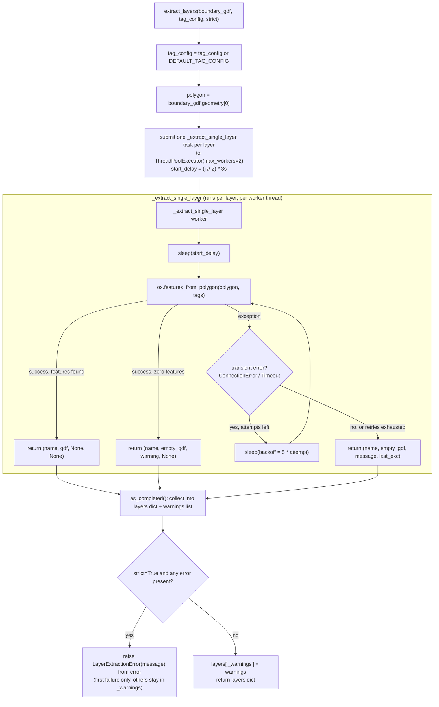

# layers.py

!!! info "Source"
    `lga_extractor/layers.py` (211 lines)

## Purpose

Given a validated boundary polygon (from [`boundary.py`](boundary.md)),
queries OpenStreetMap for each configured feature layer — roads, buildings,
waterways, land use, health facilities, schools — within that polygon, using
OSMnx's `features_from_polygon()` under the hood (which talks to the
Overpass API).

The bulk of this module's complexity has nothing to do with *what* to query
— that's a six-entry dictionary (`DEFAULT_TAG_CONFIG`). It's entirely about
**how to query six things from a shared public API server without getting
refused**, and how to tell the difference between "this layer genuinely has
no features" and "this layer's query failed."

## Dependencies

- **Imports:** `time`, `concurrent.futures.ThreadPoolExecutor` /
  `as_completed`, `geopandas`, `osmnx`, `requests` (for its exception
  types, used to classify retryable failures).
- **Imported by:** `pipeline.py` (second stage of `extract_lga()`, after
  `boundary.resolve_boundary()`). Has no dependency on `boundary.py` or
  `clean.py` itself — it only needs a bare Shapely polygon, not a full
  validated `GeoDataFrame`, which keeps it independently testable.

## Functions & Classes

### `DEFAULT_TAG_CONFIG` (module-level dict)

Maps each layer name to the OSM tag filter used with
`osmnx.features_from_polygon()`:

```python
{
    "roads": {"highway": True},
    "buildings": {"building": True},
    "waterways": {"waterway": True, "natural": "water"},
    "landuse": {"landuse": True},
    "health_facilities": {"amenity": ["hospital", "clinic", "pharmacy"]},
    "schools": {"amenity": "school"},
}
```

Callers can pass their own `tag_config` to `extract_layers()` to add layers
(e.g. markets, places of worship) or override this default without touching
any extraction logic — the dict is the entire "what to extract" surface
area of the module.

### `LayerExtractionError`

Raised only for a **genuine** failure — an Overpass error, timeout, network
failure, or bad tag configuration — when running in `strict=True` mode, and
only after all retry attempts have been exhausted. Explicitly *not* raised
when a layer's query succeeds but legitimately finds zero features within
the boundary; that's valid data (and can itself be a meaningful completeness
signal — see `akure_access.completeness.grid_check`), not an error.

### `_is_transient_connection_error(exc)`

| | |
|---|---|
| **What it does** | Returns `True` if `exc` is a `requests.exceptions.ConnectionError` or `requests.exceptions.Timeout` — the categories of failure worth retrying. |
| **Why written this way** | A refused connection or timeout on a shared public Overpass mirror is often transient — retrying after a short wait frequently succeeds. A malformed tag filter, by contrast, will fail identically on every attempt; retrying it just burns time and retry budget for no benefit. This function is the gate that decides which failures get a second chance. |
| **Inputs / Outputs** | `exc: Exception` in, `bool` out. |
| **Complexity** | O(1) — a single `isinstance` check. |
| **Concurrency / race conditions** | None — pure function. |

### `_extract_single_layer(layer_name, tags, polygon, start_delay)`

| | |
|---|---|
| **What it does** | Runs one layer's Overpass query (via `ox.features_from_polygon()`), after first sleeping `start_delay` seconds, retrying transient connection failures with exponential backoff, up to `MAX_RETRIES` (6) attempts. Always returns a 4-tuple `(layer_name, gdf, warning_or_None, error_or_None)` — it never raises. |
| **Why written this way** | This function is designed to run inside a worker thread (submitted to a `ThreadPoolExecutor` by `extract_layers()`). An exception raised inside a worker thread would need to be caught and re-raised by the caller anyway to be handled sensibly across threads — so instead of raising, this function catches everything itself and returns the outcome as data. That keeps `extract_layers()`'s job simple: collect tuples, decide what to do with them, no `try/except` needed around `future.result()` for the *expected* failure cases. |
| **Inputs** | `layer_name: str`; `tags: dict` (OSM tag filter for this one layer); `polygon` (Shapely polygon, the LGA boundary); `start_delay: float` (seconds to sleep before the first attempt — see `extract_layers()`'s staggering logic). |
| **Outputs** | `(layer_name: str, gdf: GeoDataFrame, warning: str or None, error: Exception or None)`. `gdf` is always a valid (possibly empty) `GeoDataFrame` with CRS EPSG:4326 — never `None`. |
| **Internal workflow** | 1. Sleep `start_delay` seconds if nonzero.<br>2. Loop `attempt` from 1 to `MAX_RETRIES`:<br>&nbsp;&nbsp;a. Call `ox.features_from_polygon(polygon, tags)`.<br>&nbsp;&nbsp;b. If it returns `None`/empty: this is **success with no data** — return immediately with a "returned no features" warning, `error=None`. This never triggers a retry, since it isn't a failure.<br>&nbsp;&nbsp;c. If it returns data: return immediately, no warning, no error.<br>&nbsp;&nbsp;d. If it raises: record the exception. If this isn't the last allowed attempt *and* `_is_transient_connection_error()` says it's retryable, sleep `RETRY_BACKOFF_BASE_SECONDS * attempt` seconds (linearly increasing backoff: 5s, 10s, 15s...) and loop again. Otherwise, break out of the loop.<br>3. If the loop exhausted without returning, return an empty `GeoDataFrame` with a failure message and the last exception attached. |
| **Assumptions** | Assumes `ox.features_from_polygon()` raising is the only failure signal to watch for (no separate handling for, e.g., a response that "succeeds" with malformed data). Assumes linear backoff (rather than exponential) is sufficient — despite the module docstring's inline comment referring to this as "exponential backoff," the actual formula (`RETRY_BACKOFF_BASE_SECONDS * attempt`) is linear, not exponential; worth confirming which was intended if retry behavior under sustained failure needs tuning. |
| **Complexity** | O(1) in terms of this function's own logic; wall-clock time scales with number of retries needed (up to `MAX_RETRIES`) and the underlying Overpass query's own complexity (which scales with feature density/boundary size, outside this function's control). |
| **Concurrency / race conditions** | This function itself has no shared mutable state — each call operates on its own local variables only, and multiple instances run safely in parallel as separate `ThreadPoolExecutor` workers. See `extract_layers()` below for how concurrency is bounded across *multiple* calls to this function. |

### `extract_layers(boundary_gdf, tag_config=None, strict=False)`

| | |
|---|---|
| **What it does** | Extracts every layer defined in `tag_config` (or `DEFAULT_TAG_CONFIG`) within `boundary_gdf`'s polygon, using bounded, staggered concurrency, and returns a dict of `layer_name -> GeoDataFrame` plus a `"_warnings"` list. |
| **Why written this way** | The concurrency model here is the single most consequential design decision in this module, and it's empirically derived, not a default choice. Fully parallel querying (all 6 layers at once, `max_workers=6`, no stagger) was tried first and made things *worse*: the public Overpass mirror refused every connection outright (`Errno 111`, connection refused) when hit by a burst of simultaneous requests from one client — it appears to treat simultaneous connection bursts as abusive traffic regardless of whether the requests are otherwise legitimate. The current approach caps concurrency at `MAX_CONCURRENT_LAYER_QUERIES = 2` and staggers each new request's start by `REQUEST_STAGGER_SECONDS = 3`, so the server never sees more than 2 near-simultaneous connection attempts, even at the very start of a run — while still overlapping queries in pairs rather than running fully sequentially. |
| **The stagger math, worked out concretely.** | With the default 6 layers and `MAX_CONCURRENT_LAYER_QUERIES = 2`, `start_delay = (i // 2) * 3` produces delays of `[0, 0, 3, 3, 6, 6]` seconds across `i = 0..5` — layers 0 and 1 start immediately, layers 2 and 3 start 3 seconds later, layers 4 and 5 start 6 seconds later. The *pairing* here is purely positional (dictionary insertion order in `DEFAULT_TAG_CONFIG`), not by any property of the layers themselves — `roads` and `buildings` (the first two keys) always start together, `health_facilities` and `schools` (the last two) always start last, regardless of which layers are actually slower or more likely to fail. |
| **`as_completed()` introduces a small but real nondeterminism.** | Futures are iterated in **completion order**, not submission order — so if two layers happen to fail at nearly the same wall-clock time, which one ends up recorded as `first_error` (and therefore which message a `strict=True` caller sees in the raised `LayerExtractionError`) can vary between otherwise-identical runs. This doesn't affect *correctness* (every layer's outcome still ends up in `_warnings` in permissive mode), but it does mean a strict-mode failure message shouldn't be treated as necessarily reproducible run-to-run when multiple layers are failing simultaneously. |
| **The returned tuple's third field means two different things depending on the fourth.** | `_extract_single_layer()` always returns `(layer_name, gdf, warning_or_message, error)` — but that third field is semantically overloaded: when `error is None`, it's either `None` (clean success) or an informational "returned no features" string; when `error is not None`, that same field holds the failure description instead. `extract_layers()` reads this correctly (appending it to `warnings` either way, and separately checking `error is not None` to decide whether to track it as `first_error`), but a future refactor renaming or restructuring this tuple should be careful not to lose that this one field is doing double duty. |
| **Inputs** | `boundary_gdf` (single-row `GeoDataFrame` from `boundary.resolve_boundary()`); `tag_config` (optional override dict, defaults to `DEFAULT_TAG_CONFIG`); `strict: bool` (default `False` — controls failure handling, see below). |
| **Outputs** | `dict` mapping each `layer_name` to a `GeoDataFrame` (possibly empty), plus a `"_warnings"` key holding a list of warning strings collected across all layers. |
| **Internal workflow** | 1. Default `tag_config` if not supplied; extract the boundary polygon from `boundary_gdf`.<br>2. Open a `ThreadPoolExecutor(max_workers=MAX_CONCURRENT_LAYER_QUERIES)`.<br>3. For each `(layer_name, tags)` pair (enumerated), compute `start_delay = (i // MAX_CONCURRENT_LAYER_QUERIES) * REQUEST_STAGGER_SECONDS` — this staggers layers in batches of `MAX_CONCURRENT_LAYER_QUERIES`, so layers 0–1 start immediately, layers 2–3 start after one stagger interval, etc. — and submit `_extract_single_layer()` as a future.<br>4. As each future completes (`as_completed`, i.e. in completion order, not submission order), unpack its result tuple; store the `GeoDataFrame` in `layers[layer_name]`; append any warning; record the *first* genuine error encountered (if any) for later.<br>5. After all futures complete: if `strict=True` and at least one genuine error occurred, raise `LayerExtractionError` for the first one encountered, chaining the original exception.<br>6. Otherwise (permissive mode, or strict mode with no errors), attach `layers["_warnings"] = warnings` and return the dict. |
| **Assumptions** | Assumes `MAX_CONCURRENT_LAYER_QUERIES=2` / `REQUEST_STAGGER_SECONDS=3` remain valid for whichever Overpass mirror OSMnx is configured to use — these constants were tuned against observed rate-limiting behavior on one server and are not derived from any documented API limit, so they might need re-tuning if the underlying Overpass endpoint changes. Assumes six is a small enough layer count that `max_workers=2` doesn't create an unreasonably long total runtime (worst case, all 6 layers hit `MAX_RETRIES` — the run could take several minutes). |
| **Complexity** | O(L) where L = number of layers, in terms of number of Overpass queries issued (one per layer, plus retries). Wall-clock time is bounded below by `(L / MAX_CONCURRENT_LAYER_QUERIES) * REQUEST_STAGGER_SECONDS` for staggering alone, before any query or retry latency. |
| **Concurrency / race conditions** | This is the one place in the whole repository where genuine concurrency is used. Each worker thread's result is only touched by the main thread inside `as_completed()`'s loop (via `future.result()`), so there's no shared mutable state written from multiple threads simultaneously — `layers`, `warnings`, and `first_error` are all only ever mutated from the single main thread as futures complete. The design explicitly avoids relying on `ox.features_from_polygon()` (or the underlying Overpass client) being thread-safe for truly simultaneous calls, by bounding concurrency to a small number the server tolerates — this is a mitigation for *server-side* rate-limiting behavior, not a client-side race condition in this codebase. |
| **Covered by test(s)** | See [tests.md](../tests.md) — `test_extraction.py`. |

## Internal Workflow



## Gotchas

- **`strict` only affects genuine failures, never emptiness.** It's easy to
  misread `strict=True` as "fail if any layer has no data" — it does not do
  that. A layer with zero features (a successful query, nothing found) is
  always recorded as a warning, in both modes, and never raises.
- **In strict mode, only the *first* error is surfaced, even if multiple
  layers fail.** All other layers still get queried to completion (the
  `ThreadPoolExecutor` runs to completion regardless), but only one error
  message ends up in the raised exception. The full picture is in
  `layers["_warnings"]` if execution reaches permissive-mode's return path,
  but in strict mode the dict is never returned at all — check `_warnings`
  content by using `strict=False` first if you need the complete failure
  list before deciding what to do.
- **The "exponential backoff" comment vs. actual linear formula.** As noted
  in `_extract_single_layer()` above, the backoff is `BASE * attempt`
  (linear), not `BASE ** attempt` (exponential), despite the surrounding
  comments' phrasing. Not a bug per se — linear backoff across 6 retries
  with base 5s tops out at a reasonable 30s wait — but worth knowing if
  tuning retry behavior later.
