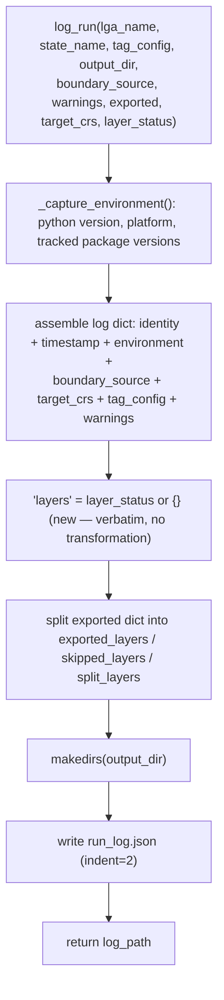

# logging_utils.py

!!! info "Source"
    `lga_extractor/logging_utils.py` (120 lines — grew from 107 with the
    addition of `layer_status`, see below)

## Purpose

Writes a structured JSON run log recording exactly what was queried, when,
under what environment, and with what configuration — so that any past
extraction can be traced and, in principle, reproduced later. This is the
pipeline's audit trail, not part of the actual geospatial output.

## Dependencies

- **Imports:** `json`, `os`, `platform`, `sys`, `datetime` (`datetime`,
  `timezone`), `importlib.metadata` (`version`, `PackageNotFoundError`).
- **Imported by:** `pipeline.py` (final stage of `extract_lga()`).

## Functions & Classes

### `_TRACKED_PACKAGES` (module-level list)

`["osmnx", "geopandas", "shapely", "fiona", "pandas"]` — the packages whose
installed versions are captured per run. The reasoning, per the module's own
comment: a discrepancy between two runs of the *same* LGA (different
results on a re-extraction) is much easier to diagnose if you can check
whether, say, OSMnx's version changed between runs and might be returning
different Overpass query results — rather than facing a silent, unexplained
difference in output with no way to investigate why.

Each of the five earns its place for a specific reason rather than being a
generic "log everything installed" list: `osmnx` is the actual OSM query
client, and its version most directly affects *what data comes back* from
an identical query (a version bump can change which Overpass endpoint it
targets, how it parses responses, or how `features_from_polygon()` handles
edge cases). `geopandas`, `shapely`, and `fiona` govern how geometry is
read, repaired, and written — a version change in any of these could
silently shift how `.buffer(0)` repairs invalid geometry, or how a
Shapefile gets serialized. `pandas` underlies nearly every tabular
operation in `clean.py`. Notably absent: `streamlit` (a UI-only
dependency, irrelevant to what data gets produced) and `requests` (used
only for exception-type classification in `layers.py`, not for anything
that would change extraction results between versions).

### `_capture_environment()`

| | |
|---|---|
| **What it does** | Returns a dict of the current Python version, platform string, and installed version of each package in `_TRACKED_PACKAGES`. |
| **Why written this way** | Uses `importlib.metadata.version()` rather than each package's own `__version__` attribute (if it has one) — this is more reliable and uniform across packages, since not every package consistently exposes `__version__`, but every installed package has metadata queryable this way. Catches `PackageNotFoundError` per-package (not a blanket try/except around the whole loop) so that one missing package doesn't prevent capturing the versions of the others — records `"not installed"` for that one entry instead. |
| **Inputs** | None. |
| **Outputs** | `dict` with keys `python_version` (e.g. `"3.11.4"`, via `sys.version.split()[0]`), `platform` (via `platform.platform()`), `package_versions` (dict of package name → version string or `"not installed"`). |
| **Complexity** | O(P) where P = number of tracked packages (fixed at 5) — negligible. |
| **Concurrency / race conditions** | None. |
| **Covered by test(s)** | No dedicated unit test — indirectly exercised only via `test_extract_lga_end_to_end_live_osm`, the one live-network test that runs the full pipeline including `log_run()`. |

### `log_run(lga_name, state_name, tag_config, output_dir, boundary_source, warnings=None, exported=None, target_crs=None, layer_status=None)`

| | |
|---|---|
| **What it does** | Assembles a JSON-serializable log dict from everything about a completed (or in-progress) extraction run, writes it to `{output_dir}/run_log.json`, and returns that path. |
| **Why written this way** | The log intentionally separates `exported_layers`, `skipped_layers`, and `split_layers` into distinct top-level keys, derived by filtering `export_layers()`'s returned dict. **New in this revision:** the log now also carries a `"layers"` key holding `layer_status` verbatim — the same per-layer query-time outcome (`"success"`/`"success_empty"`/`"failed"`, feature count, retry attempts, message) that also drives the new [extraction manifest](manifest.md). The reasoning for including it *here too*, not only in `manifest.json`: `manifest.json` is the formal, versioned, stable contract for programmatic downstream consumers, but `run_log.json` is meant to be self-contained for a human auditing one run after the fact — someone reading `run_log.json` alone should still be able to tell "did layer X actually fail, or did it just find nothing" without needing to cross-reference a second file. |
| **Inputs** | `lga_name`, `state_name`; `tag_config: dict`; `output_dir: str`; `boundary_source: str`; `warnings: list`, optional; `exported: dict`, optional; `target_crs: str`, optional; `layer_status: dict`, optional (**new** — the `"_status"` dict from `layers.extract_layers()`, see [`layers.md`](layers.md)). |
| **Outputs** | `str` — the path to the written `run_log.json` file. |
| **Internal workflow** | 1. Build the `log` dict: `lga_name`, `state_name`, a UTC ISO-format `timestamp_utc`, `environment` (from `_capture_environment()`), `boundary_source`, `target_crs`, `tag_config`, `warnings` (defaulting to `[]`), **`"layers"` (new — `layer_status or {}`, recorded verbatim, no transformation)**, `exported_layers`, `skipped_layers`, `split_layers`. 2. Ensure `output_dir` exists. 3. Write `log` as indented JSON to `{output_dir}/run_log.json`. 4. Return that path. |
| **Assumptions** | Assumes `tag_config` and everything nested inside `exported`/`layer_status` is JSON-serializable as-is — true for the current pipeline's data shapes. |
| **Complexity** | O(1) relative to pipeline scale — dominated by a fixed-size dict assembly and one file write. |
| **Concurrency / race conditions** | None on its own. Like `export_layers()`, concurrent calls to `log_run()` targeting the *same* `output_dir` aren't guarded against. |
| **Covered by test(s)** | See [tests.md](../tests.md) — `test_extract_lga_end_to_end_live_osm` and (**new**) `test_extract_lga_emits_full_stage_sequence`, both of which exercise this function as part of the full pipeline. |

## Internal Workflow

## Gotchas

- **This log captures the environment at the moment logging happens (end of
  the pipeline), not at the moment extraction actually queried OSM.** For a
  long-running extraction (e.g. one that hit multiple retries in
  `layers.py`), there's a small window between when the actual OSM query
  ran and when this log is written — in practice this only matters if
  packages were somehow being upgraded mid-run, which is not a realistic
  scenario for this pipeline's usage pattern, but worth noting for
  precision.
- **`warnings` and `exported` are optional parameters with mutable-looking
  defaults (`None`) handled safely.** Both default to `None` and are
  coalesced with `or []` / `or {}` inside the function body, avoiding the
  classic Python mutable-default-argument pitfall — this is the correct
  pattern, not a bug, but worth noting as a deliberate choice for anyone
  extending this function.
