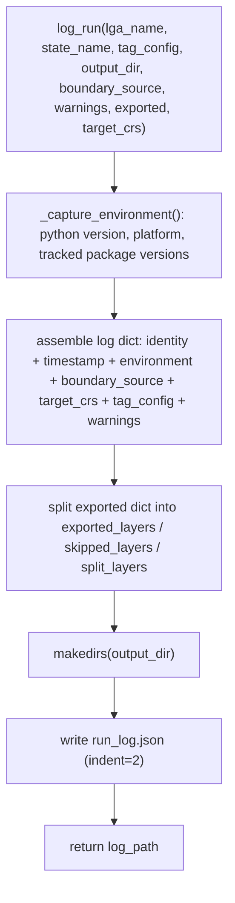

# logging_utils.py

!!! info "Source"
    `lga_extractor/logging_utils.py` (107 lines)

## Purpose

Writes a structured JSON run log recording exactly what was queried, when,
under what environment, and with what configuration — so that any past
extraction can be traced and, in principle, reproduced later. This is the
pipeline's audit trail, not part of the actual geospatial output.

## Dependencies

- **Imports:** `json`, `os`, `platform`, `sys`, `datetime` (`datetime`,
  `timezone`), `importlib.metadata` (`version`, `PackageNotFoundError`).
- **Imported by:** `pipeline.py` (final stage of `extract_lga()`).

## Functions & Classes

### `_TRACKED_PACKAGES` (module-level list)

`["osmnx", "geopandas", "shapely", "fiona", "pandas"]` — the packages whose
installed versions are captured per run. The reasoning, per the module's own
comment: a discrepancy between two runs of the *same* LGA (different
results on a re-extraction) is much easier to diagnose if you can check
whether, say, OSMnx's version changed between runs and might be returning
different Overpass query results — rather than facing a silent, unexplained
difference in output with no way to investigate why.

Each of the five earns its place for a specific reason rather than being a
generic "log everything installed" list: `osmnx` is the actual OSM query
client, and its version most directly affects *what data comes back* from
an identical query (a version bump can change which Overpass endpoint it
targets, how it parses responses, or how `features_from_polygon()` handles
edge cases). `geopandas`, `shapely`, and `fiona` govern how geometry is
read, repaired, and written — a version change in any of these could
silently shift how `.buffer(0)` repairs invalid geometry, or how a
Shapefile gets serialized. `pandas` underlies nearly every tabular
operation in `clean.py`. Notably absent: `streamlit` (a UI-only
dependency, irrelevant to what data gets produced) and `requests` (used
only for exception-type classification in `layers.py`, not for anything
that would change extraction results between versions).

### `_capture_environment()`

| | |
|---|---|
| **What it does** | Returns a dict of the current Python version, platform string, and installed version of each package in `_TRACKED_PACKAGES`. |
| **Why written this way** | Uses `importlib.metadata.version()` rather than each package's own `__version__` attribute (if it has one) — this is more reliable and uniform across packages, since not every package consistently exposes `__version__`, but every installed package has metadata queryable this way. Catches `PackageNotFoundError` per-package (not a blanket try/except around the whole loop) so that one missing package doesn't prevent capturing the versions of the others — records `"not installed"` for that one entry instead. |
| **Inputs** | None. |
| **Outputs** | `dict` with keys `python_version` (e.g. `"3.11.4"`, via `sys.version.split()[0]`), `platform` (via `platform.platform()`), `package_versions` (dict of package name → version string or `"not installed"`). |
| **Complexity** | O(P) where P = number of tracked packages (fixed at 5) — negligible. |
| **Concurrency / race conditions** | None. |
| **Covered by test(s)** | No dedicated unit test — indirectly exercised only via `test_extract_lga_end_to_end_live_osm`, the one live-network test that runs the full pipeline including `log_run()`. |

### `log_run(lga_name, state_name, tag_config, output_dir, boundary_source, warnings=None, exported=None, target_crs=None)`

| | |
|---|---|
| **What it does** | Assembles a JSON-serializable log dict from everything about a completed (or in-progress) extraction run, writes it to `{output_dir}/run_log.json`, and returns that path. |
| **Why written this way** | The log intentionally separates `exported_layers`, `skipped_layers`, and `split_layers` into distinct top-level keys, derived by filtering `export_layers()`'s returned dict (stripping its internal `"_"`-prefixed keys and re-surfacing them under clearer names) — this makes the log human-readable and directly answers "what actually happened to each layer" without requiring the reader to know `export_layers()`'s internal key-naming convention (`_skipped`, `_split_layers`). |
| **Inputs** | `lga_name`, `state_name`; `tag_config: dict` (the tag configuration actually used); `output_dir: str` (where the log itself is written, as `run_log.json`); `boundary_source: str` (from `boundary.resolve_boundary()`'s output column); `warnings: list`, optional; `exported: dict`, optional (the dict from `export.export_layers()`); `target_crs: str`, optional (the CRS actually used for this run, from `clean.resolve_target_crs()` — see [`pipeline.md`](pipeline.md)'s gotcha about this being resolved a second time specifically to pass in here). |
| **Outputs** | `str` — the path to the written `run_log.json` file. |
| **Internal workflow** | 1. Build the `log` dict: `lga_name`, `state_name`, a UTC ISO-format `timestamp_utc` (via `datetime.now(timezone.utc).isoformat()` — explicitly timezone-aware, not naive local time), `environment` (from `_capture_environment()`), `boundary_source`, `target_crs`, `tag_config`, `warnings` (defaulting to `[]` if `None`), `exported_layers` (every key in `exported` that does *not* start with `"_"`, i.e. the real per-layer export results), `skipped_layers` (from `exported["_skipped"]`, defaulting to `[]`), `split_layers` (from `exported["_split_layers"]`, defaulting to `{}`). 2. Ensure `output_dir` exists (`exist_ok=True`). 3. Write `log` as indented JSON to `{output_dir}/run_log.json`. 4. Return that path. |
| **Assumptions** | Assumes `tag_config` and everything nested inside `exported` is JSON-serializable as-is — true for the current pipeline's data shapes (strings, lists, dicts of strings), but would break if `tag_config` or `exported` ever contained a non-JSON-native type (e.g. a raw Shapely geometry) without additional serialization handling. |
| **Complexity** | O(1) relative to pipeline scale — dominated by a fixed-size dict assembly and one file write; not proportional to feature count in any layer. |
| **Concurrency / race conditions** | None on its own. Like `export_layers()`, concurrent calls to `log_run()` targeting the *same* `output_dir` (e.g. two processes extracting the same LGA simultaneously) aren't guarded against — the second write would simply overwrite the first's `run_log.json`. Not a concern under the pipeline's current sequential single-run-at-a-time usage pattern. |
| **Covered by test(s)** | See [tests.md](../tests.md) — `test_extract_lga_end_to_end_live_osm` is the only test exercising this function, since it's the final step of the full pipeline and has no meaningful unit-test boundary short of running the whole thing. |

## Internal Workflow

## Gotchas

- **This log captures the environment at the moment logging happens (end of
  the pipeline), not at the moment extraction actually queried OSM.** For a
  long-running extraction (e.g. one that hit multiple retries in
  `layers.py`), there's a small window between when the actual OSM query
  ran and when this log is written — in practice this only matters if
  packages were somehow being upgraded mid-run, which is not a realistic
  scenario for this pipeline's usage pattern, but worth noting for
  precision.
- **`warnings` and `exported` are optional parameters with mutable-looking
  defaults (`None`) handled safely.** Both default to `None` and are
  coalesced with `or []` / `or {}` inside the function body, avoiding the
  classic Python mutable-default-argument pitfall — this is the correct
  pattern, not a bug, but worth noting as a deliberate choice for anyone
  extending this function.
