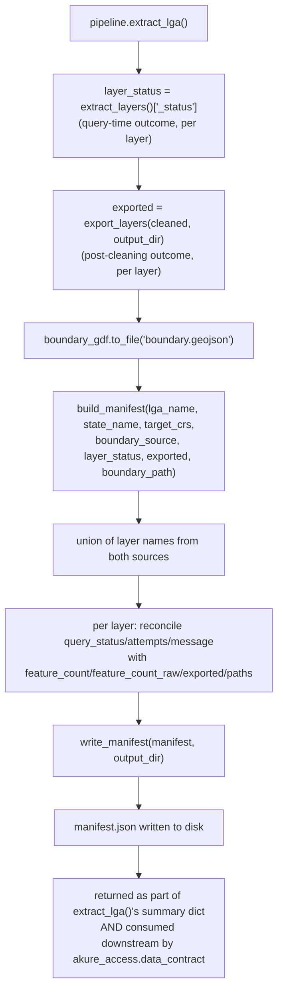

# `lga_extractor/manifest.py`

## Purpose

Builds and writes the formal extraction manifest — `manifest.json` — the machine-readable contract a downstream consumer (chiefly `akure-accessibility-dashboard`, but any future consumer too) should read instead of inferring extraction outcome from file presence, file absence, or an ambiguous empty `GeoDataFrame`.

## Why this exists

An empty `GeoDataFrame` is fundamentally ambiguous on its own: it's what **both** a genuinely empty area (the Overpass query succeeded and correctly found nothing) and a failed query (Overpass was down, timed out, or the tag filter was malformed) look like once they've passed through the extraction pipeline. [`layers.py`](layers.md) already computes this distinction internally, per layer, in real time (see `_extract_single_layer()`'s returned `status` dict) — but until this module existed, that distinction only ever reached `run_log.json`, a file whose broader, more free-form structure isn't something a downstream consumer should have to depend on as a stable contract.

`manifest.py`'s only job is to **combine** that already-computed per-layer query status with the export outcome (file paths, post-cleaning feature counts) and the resolved CRS into one flat, JSON-serializable structure — written to its own dedicated top-level file specifically so a consumer can depend on `manifest.json`'s shape without needing to also understand `run_log.json`'s structure.

## Constants

```python
MANIFEST_SCHEMA_VERSION = 1
```

A schema version number included in every manifest — the deliberate signal that this file's shape is a versioned contract, not an implementation detail that might silently change shape between extractor releases. A downstream consumer can check this field and handle a future schema change explicitly, rather than a shape change silently breaking `data_contract.py`-style parsing on the dashboard side.

## Functions

### `build_manifest(lga_name, state_name, target_crs, boundary_source, layer_status, exported, boundary_path=None) -> dict`

**What it does:** reconciles two independently-computed per-layer records — `layer_status` (query-time outcome, from `layers.extract_layers()`'s `"_status"`) and `exported` (post-cleaning export outcome, from `export.export_layers()`) — into one unified `layers` dict, keyed by layer name.

**Why reconciliation is needed at all, not just a merge:** a layer's query-time feature count and its exported feature count can legitimately differ — cleaning drops invalid, empty, or duplicate geometries (see [`clean.py`](clean.md)), so a layer that queried 50 features might export only 47. The manifest deliberately keeps both numbers separate and distinctly named (`feature_count` = post-cleaning, as actually written to disk; `feature_count_raw` = pre-cleaning, at query time) rather than collapsing them into one ambiguous count — a downstream consumer reading only `feature_count` gets the number that matches what's actually in the exported file, while a consumer curious about data loss during cleaning has `feature_count_raw` to compare against.

**Handling layers present in one source but not the other:**
```python
all_layer_names = set(layer_status.keys()) | (
    set((exported or {}).keys()) - {"_skipped", "_split_layers"}
)
```
This union — rather than iterating just one dict's keys — ensures a layer is represented in the manifest even in an edge case where it appears in only one of the two inputs (e.g. a future code path that populates `layer_status` before `export_layers()` runs, or vice versa). For each layer, `query_status`/`query_attempts`/`query_message` fall back to sensible defaults (`"unknown"`, `None`, `None`) if that layer is missing from `layer_status`, and `exported: bool` reflects simply whether export info exists for that layer at all.

**The `boundary_path` parameter — closing a real, previously-unaddressed gap:** prior to this parameter existing, a downstream consumer that needed the *boundary polygon itself* (not just layer data) — for example, `akure_access.accessibility.scoring.add_access_times()`'s `boundary_polygon_wgs84` parameter, used for consistent centroid reprojection — had no choice but to call `boundary.resolve_boundary()` again, live, even when every other input was already being read from the extractor's cached, versioned output on disk. That made the "canonical dataset, no live OSM access required" story incomplete in practice: every file *except* the boundary polygon could be read from disk. Recording `boundary_path` in the manifest (see [`pipeline.py`](pipeline.md)'s corresponding new `boundary.geojson` export) closes this gap — see [`data_contract.py`](../../akure-accessibility-dashboard/modules/data_contract.md) on the dashboard side for the actual consumer of this field.

### `write_manifest(manifest: dict, output_dir: str) -> str`

**What it does:** writes the manifest dict as indented JSON to `{output_dir}/manifest.json`, creating `output_dir` if needed (`os.makedirs(..., exist_ok=True)`), and returns the path written.

**Why this is a separate function from `build_manifest()`:** a clean separation between *constructing* the manifest (pure, no I/O, easily unit-testable) and *persisting* it (I/O, harder to unit-test in isolation) — the same separation-of-concerns pattern seen elsewhere in this codebase (e.g. `export.export_layers()`'s internal helpers).

## Manifest shape

```json
{
  "schema_version": 1,
  "lga_name": "Akure North",
  "state_name": "Ondo",
  "extracted_at": "2026-08-13T21:11:15+00:00",
  "target_crs": "EPSG:32631",
  "boundary_source": "osm_geocode:Akure North, Ondo, Nigeria",
  "boundary_path": "output/akure_north/boundary.geojson",
  "source": "OpenStreetMap",
  "layers": {
    "roads": {
      "query_status": "success",
      "query_attempts": 1,
      "query_message": null,
      "feature_count": 2431,
      "feature_count_raw": 2431,
      "exported": true,
      "geojson_path": "output/akure_north/roads.geojson",
      "shapefile_path": {"point": "...", "line": "..."}
    }
  }
}
```

**`"source": "OpenStreetMap"`** is a fixed literal, not derived from anything — worth noting since it's the one field in the manifest that isn't actually computed per-run; it exists purely as a self-describing label for a consumer reading the file in isolation, without needing to already know which tool produced it.

## Internal Workflow



## Gotchas

- **`manifest.json` is new — older extractor output directories won't have one.** Every downstream consumer reading it (see `data_contract.py`) is written to treat a missing manifest as "no contract available" and fall back to an explicit, documented default, rather than assuming the file always exists.
- **`feature_count` in the manifest's `layers` entry and `feature_count` in `export.export_layers()`'s own return dict mean the same thing** (post-cleaning count), but they're computed at different times by different functions — if you're cross-referencing the two, they should always agree for the same run, but they are not literally the same value passed through; a bug in either function could theoretically make them diverge without either function's own tests catching it, since neither function directly asserts against the other's output today.
- **The cross-repo integration test does not currently exercise this module at all** — `tests/test_cross_repo_integration.py` in `akure-accessibility-dashboard` is unchanged from before `manifest.py` existed. See [Cross-Repo Integration](../../cross-repo/integration.md) and [Known Issues](../../reference/known-issues.md) for the full detail on this gap.

## Related

- [`layers.py`](layers.md) — the source of `layer_status` (the `"_status"` dict).
- [`export.py`](export.md) — the source of `exported` (per-layer paths and post-cleaning feature counts).
- [`pipeline.py`](pipeline.md) — calls `build_manifest()` and `write_manifest()` as part of `extract_lga()`, right after writing `boundary.geojson`.
- `akure_access.data_contract` (dashboard repo) — the actual consumer of `manifest.json`, reading `target_crs` and `boundary_path` instead of re-deriving or re-resolving them independently.
