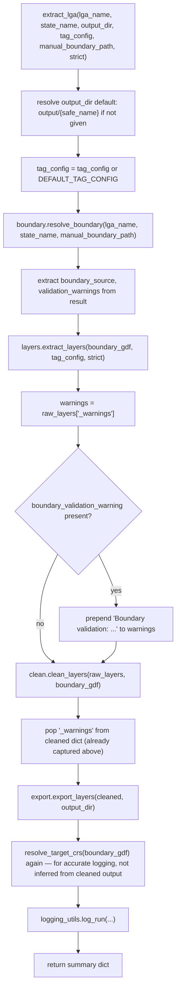

# pipeline.py

!!! info "Source"
    `lga_extractor/pipeline.py` (116 lines)

## Purpose

The single high-level entry point that runs the full extraction pipeline
for one Nigerian LGA end to end: boundary resolution → layer extraction →
cleaning → export → run logging. This is a thin orchestrator — it contains
almost no logic of its own; its job is purely to call the other five
modules in the right order and thread state (the boundary, the resolved
CRS, accumulated warnings) between them correctly.

Both [`app.py`](../app.md) (the Streamlit UI) and [`cli.py`](../cli.md)
call this same function rather than reimplementing pipeline logic — this
module is the reason those two very different interfaces stay in sync with
each other automatically.

## Dependencies

- **Imports:** `resolve_boundary` from `boundary.py`; `extract_layers`,
  `DEFAULT_TAG_CONFIG`, `LayerExtractionError` from `layers.py`;
  `clean_layers`, `resolve_target_crs` from `clean.py`; `export_layers`
  from `export.py`; `log_run` from `logging_utils.py`. This is the *only*
  module in the repository that imports from all five other core modules.
- **Imported by:** `app.py`, `cli.py`.

## Functions & Classes

### `extract_lga(lga_name, state_name=None, output_dir=None, tag_config=None, manual_boundary_path=None, strict=False)`

| | |
|---|---|
| **What it does** | Runs the complete pipeline for one LGA and returns a summary dict of everything that happened: where the boundary came from, what CRS was used, what was exported, what warnings occurred, and where the run log was written. |
| **Why written this way** | Every parameter here is a direct pass-through to the corresponding parameter on the underlying stage function (`lga_name`/`state_name`/`manual_boundary_path` → `resolve_boundary()`; `tag_config`/`strict` → `extract_layers()`), rather than this function inventing its own parallel parameter set — this keeps the orchestration layer thin and means the detailed behavior documentation for each parameter lives in exactly one place (the stage function's own docstring), not duplicated and potentially drifting out of sync here. |
| **Inputs** | `lga_name: str` (required); `state_name: str`, optional; `output_dir: str`, optional (defaults to `"output/{lga_name}"` with spaces replaced by underscores and lowercased, if not given); `tag_config: dict`, optional (defaults to `layers.DEFAULT_TAG_CONFIG`); `manual_boundary_path: str`, optional; `strict: bool`, default `False` (see `layers.extract_layers()`'s docstring for the full failure-handling explanation this defers to). |
| **Outputs** | `dict` with keys: `lga_name`, `state_name`, `output_dir`, `boundary_source`, `target_crs`, `exported` (the full dict from `export_layers()`), `warnings` (combined boundary + layer warnings), `run_log` (path to the written JSON log). |
| **Internal workflow** | 1. Default `output_dir` if not given, via a simple slugify (`strip().replace(" ", "_").lower()`). 2. Default `tag_config` if not given. 3. Call `resolve_boundary()` — raises `BoundaryResolutionError` here if resolution fails, which propagates straight up out of `extract_lga()` uncaught (no try/except around this call). 4. Extract `boundary_source` and `validation_warnings` from the resolved boundary's columns. 5. Call `extract_layers(boundary_gdf, tag_config=tag_config, strict=strict)` — in strict mode, a genuine layer failure raises `LayerExtractionError` here, which likewise propagates up uncaught. 6. Pull the `"_warnings"` list out of the raw layers dict. If the boundary had its own soft validation warning, prepend a `"Boundary validation: ..."`-prefixed version of it to the front of the warnings list — folding both warning sources into one combined list for anyone reviewing the run. 7. Call `clean_layers(raw_layers, boundary_gdf=boundary_gdf)`, then pop `"_warnings"` off the cleaned dict (it isn't a real layer, and `export_layers()` doesn't need it — `export_layers()` already knows to skip a `"_warnings"` key on its own, so this pop is technically redundant, but harmless and arguably clearer here). 8. Call `export_layers(cleaned, output_dir)`. 9. Call `resolve_target_crs(boundary_gdf)` **again** — see Gotchas below — purely to have the resolved CRS string available to pass into `log_run()`. 10. Call `log_run()` with everything gathered so far, get back the log file path. 11. Assemble and return the summary dict. |
| **Assumptions** | Assumes callers want boundary-resolution and layer-extraction failures to propagate as exceptions rather than being caught and folded into the returned summary dict — this is a real design choice: `warnings` in the return value only ever contains *non-fatal* concerns (soft boundary checks, empty layers), never the fatal errors that would have stopped execution before reaching the `return` statement at all. A caller (like `app.py`) that wants to show a friendly error message rather than crash must wrap its own call to `extract_lga()` in a try/except. |
| **Complexity** | O(1) in its own logic — all real complexity lives in the five stage functions it calls; this function is pure sequencing. |
| **Concurrency / race conditions** | None introduced by this function itself. `extract_layers()` (called from here) is the one stage with internal threading — see [`layers.md`](layers.md). `extract_lga()` does not run multiple LGAs concurrently; calling it for two different LGAs from separate threads/processes simultaneously would be safe as long as their `output_dir` values don't collide (each writes independently to its own directory tree). |
| **Covered by test(s)** | See [tests.md](../tests.md) — `test_extract_lga_end_to_end_live_osm`. |

## Internal Workflow

## Gotchas

- **`resolve_target_crs()` is called twice per run, not once.** It's called
  once internally by `clean_layers()` (to actually reproject the layers),
  and called *again*, independently, at the end of `extract_lga()` (step 9
  above) purely to obtain the CRS string for the run log. This is a
  deliberate choice, not an oversight — the code comment explains that
  inferring the CRS from the *cleaned layer output* instead (e.g. reading
  `cleaned["buildings"].crs`) would risk getting a wrong or `None` answer if
  the first-checked layer happens to be empty, since `_clean_single_layer()`
  returns an empty `GeoDataFrame` early, before reprojection, for empty
  inputs. Calling `resolve_target_crs(boundary_gdf)` directly guarantees a
  correct answer regardless of which individual layers are empty — at the
  minor cost of resolving the same boundary-based CRS lookup twice per run.
  Since `resolve_target_crs()` is O(1) and cheap, this redundancy has no
  meaningful performance impact — it's a correctness-over-elegance trade
  worth knowing about if refactoring this function.
- **No exception handling around the pipeline stages.** As noted in
  "Assumptions" above, this function does not catch
  `BoundaryResolutionError` or `LayerExtractionError` — both propagate
  directly to the caller. Anyone building a new interface on top of
  `extract_lga()` (beyond the existing `app.py`/`cli.py`) needs to handle
  these explicitly.
- **The `_warnings` pop after `clean_layers()` is functionally redundant.**
  `export_layers()` already explicitly skips a `"_warnings"` key if present
  (see [`export.md`](export.md)) — so `cleaned.pop("_warnings", None)` at
  step 7 doesn't change behavior, it's just tidiness/defensiveness rather
  than a required step.
