# pipeline.py

!!! info "Source"
    `lga_extractor/pipeline.py` (191 lines — grew from 116 with the
    addition of progress events, boundary export, and manifest building,
    see below)

## Purpose

The single high-level entry point that runs the full extraction pipeline
for one Nigerian LGA end to end: boundary resolution → layer extraction →
cleaning → export → **boundary export (new)** → **manifest building (new)**
→ run logging. This is a thin orchestrator — it contains almost no logic of
its own; its job is purely to call the other modules in the right order and
thread state between them correctly.

**This revision adds three things to that orchestration**, all covered in
detail below: (1) an `on_event` callback threaded through every stage, so a
caller can observe live progress (see [`events.py`](events.md) and
[`app.py`](../app.md)'s new progress UI); (2) writing the boundary polygon
itself to disk as `boundary.geojson`, closing a gap where the boundary was
the one input a downstream consumer couldn't get from cached files alone;
and (3) building and writing the formal [extraction manifest](manifest.md).

Both [`app.py`](../app.md) (the Streamlit UI) and [`cli.py`](../cli.md)
call this same function rather than reimplementing pipeline logic — this
module is the reason those two very different interfaces stay in sync with
each other automatically.

## Dependencies

- **Imports:** `os` (new — for `boundary.geojson`'s path); `resolve_boundary`
  from `boundary.py`; `extract_layers`, `DEFAULT_TAG_CONFIG`,
  `LayerExtractionError` from `layers.py`; `clean_layers`,
  `resolve_target_crs` from `clean.py`; `export_layers` from `export.py`;
  `log_run` from `logging_utils.py`; `build_manifest`, `write_manifest`
  from [`manifest.py`](manifest.md) (new); `_emit` from
  [`events.py`](events.md) (new). This is the *only* module in the
  repository that imports from every other core module.
- **Imported by:** `app.py`, `cli.py`.

## Functions & Classes

### `extract_lga(lga_name, state_name=None, output_dir=None, tag_config=None, manual_boundary_path=None, strict=False, on_event=None)`

| | |
|---|---|
| **What it does** | Runs the complete pipeline for one LGA and returns a summary dict of everything that happened: where the boundary came from and where it was exported to, what CRS was used, what was exported, what warnings occurred, the full structured manifest, and where the run log and manifest files were written. |
| **Why written this way** | Every stage parameter is a direct pass-through to the corresponding underlying stage function, keeping the orchestration layer thin. **New:** `on_event` is threaded through to every stage that can meaningfully report progress (`resolve_boundary()` currently does not accept `on_event` itself, so boundary-stage events are emitted directly by `extract_lga()` around that call, while `extract_layers()` and its worker threads emit their own events internally, passed straight through). |
| **New: why `on_event` exists at the orchestration level, not just inside `layers.py`.** | A UI observing only `layers.py`'s events would see nothing happen during boundary resolution, cleaning, or export — three stages that, especially boundary resolution (a live Nominatim geocode call) and export (writing several files to disk), can take a non-trivial amount of wall-clock time on their own. `extract_lga()` emits its own `stage_started`/`stage_completed` events around each of these stages directly (`"boundary"`, `"cleaning"`, `"export"`), so a UI's progress checklist (see [`events.build_stage_order()`](events.md)) has a row for every stage a user might otherwise wonder about, not just the per-layer ones. |
| **New: the `boundary.geojson` export.** | Immediately after `export_layers()` writes the layer files, `extract_lga()` writes the boundary polygon itself — `boundary_gdf.to_file(os.path.join(output_dir, "boundary.geojson"), driver="GeoJSON")`. No reprojection is needed since `boundary_gdf` is already EPSG:4326 (`resolve_boundary()`'s own standardized output CRS). This closes a real, previously-unaddressed gap: a downstream consumer needing the boundary polygon itself — not just layer data — for example `akure_access.accessibility.scoring.add_access_times()`'s `boundary_polygon_wgs84` parameter, used for consistent centroid reprojection — had no choice but to call `boundary.resolve_boundary()` again, live, even when every other input was already cached on disk. Written as part of the conceptual "export" stage (not its own separate progress-UI row) since, from an observer's perspective, it's the same kind of step as writing every other file this pipeline produces. |
| **New: manifest construction.** | After computing `resolved_crs` (see the pre-existing double-resolution gotcha below, unchanged by this revision), `extract_lga()` calls `build_manifest()` with `lga_name`, `state_name`, `resolved_crs`, `boundary_source`, `layer_status` (pulled from `raw_layers["_status"]`, new), `exported`, and `boundary_path`, then `write_manifest()` to persist it. Not treated as its own progress-UI stage — the module's own comment notes this is near-instant bookkeeping, not a user-visible step worth a checklist row of its own. |
| **Inputs** | `lga_name: str`; `state_name: str`, optional; `output_dir: str`, optional; `tag_config: dict`, optional; `manual_boundary_path: str`, optional; `strict: bool`, default `False`; `on_event: callable, optional` (**new** — default `None`, see [`events.py`](events.md) for the schema and thread-safety notes). |
| **Outputs** | `dict` with keys: `lga_name`, `state_name`, `output_dir`, `boundary_source`, **`boundary_path`** (new — path to `boundary.geojson`), `target_crs`, `exported`, `warnings`, **`layer_status`** (new — the structured per-layer dict), **`manifest`** (new — the full manifest dict), **`manifest_path`** (new — path to `manifest.json`), `run_log`. |
| **Internal workflow** | 1. Default `output_dir`/`tag_config` if not given. 2. Emit `stage_started` for `"boundary"`; call `resolve_boundary()`; extract `boundary_source`/`validation_warnings`; emit `stage_completed` for `"boundary"`. 3. Call `extract_layers(boundary_gdf, tag_config, strict, on_event)` — events for each layer flow directly from its worker threads. 4. Pull `"_warnings"` and (**new**) `"_status"` from the raw layers dict. Fold the boundary's own soft warning into the front of `warnings`, emitting a `"warning"` event (**new**) if present. 5. Emit `stage_started` for `"cleaning"`; call `clean_layers()`; pop `"_warnings"` **and** `"_status"` (**new**) off the cleaned dict; emit `stage_completed`. 6. Emit `stage_started` for `"export"`; call `export_layers()`; **write `boundary.geojson` (new)**; emit `stage_completed` for `"export"` (covering both steps). 7. Call `resolve_target_crs(boundary_gdf)` again (unchanged pre-existing behavior — see Gotchas). 8. **New:** `build_manifest()` + `write_manifest()`. 9. Call `log_run()`, now also passing `layer_status` (new). 10. Assemble the summary dict (with the new fields above), emit `pipeline_completed` carrying the summary itself (**new**), return it. |
| **Assumptions** | Assumes callers want boundary-resolution and layer-extraction failures to propagate as exceptions rather than being caught and folded into the returned summary dict — unchanged from before. **New:** assumes writing `boundary.geojson` won't itself fail in a way that needs separate handling from `export_layers()`'s own potential failures — there's no dedicated try/except around this specific write; a failure here propagates as an uncaught exception exactly like any other unhandled I/O error in this function. |
| **Complexity** | O(1) in its own logic — all real complexity lives in the stage functions it calls. The new `boundary.geojson` write and manifest construction are both O(1)/cheap relative to the rest of the pipeline. |
| **Concurrency / race conditions** | None introduced by this function itself beyond what already existed. `extract_layers()` remains the one stage with internal threading. **New consideration:** `on_event`, when supplied, is now called both directly by `extract_lga()` (single-threaded, from this function's own call site) *and* indirectly from `layers.py`'s worker threads — a callback must be safe for both calling patterns simultaneously, which is exactly what `events.ThreadSafeEventQueue` provides. |
| **Covered by test(s)** | See [tests.md](../tests.md) — `test_extract_lga_end_to_end_live_osm`, plus new: `test_extract_lga_emits_full_stage_sequence`, `test_extract_lga_writes_boundary_geojson_and_records_it_in_manifest`. |

## Internal Workflow

```mermaid
flowchart TD
    A["extract_lga(lga_name, state_name, output_dir, tag_config,<br/>manual_boundary_path, strict, on_event)"] --> B["resolve output_dir default: output/{safe_name} if not given"]
    B --> C["tag_config = tag_config or DEFAULT_TAG_CONFIG"]
    C --> C0["emit stage_started('boundary')"]
    C0 --> D["boundary.resolve_boundary(lga_name, state_name, manual_boundary_path)"]
    D --> E["extract boundary_source, validation_warnings from result"]
    E --> E0["emit stage_completed('boundary')"]
    E0 --> F["layers.extract_layers(boundary_gdf, tag_config, strict, on_event)<br/>— per-layer events flow from worker threads"]
    F --> G["warnings = raw_layers['_warnings']<br/>layer_status = raw_layers['_status'] (new)"]
    G --> H{boundary_validation_warning present?}
    H -- yes --> I["prepend 'Boundary validation: ...' to warnings<br/>emit warning event (new)"]
    H -- no --> J0
    I --> J0["emit stage_started('cleaning')"]
    J0 --> J["clean.clean_layers(raw_layers, boundary_gdf)"]
    J --> K["pop '_warnings' AND '_status' from cleaned dict (new)"]
    K --> K0["emit stage_completed('cleaning')<br/>emit stage_started('export')"]
    K0 --> L["export.export_layers(cleaned, output_dir)"]
    L --> L2["write boundary.geojson (new)"]
    L2 --> L3["emit stage_completed('export')"]
    L3 --> M["resolve_target_crs(boundary_gdf) again — for accurate logging"]
    M --> M2["build_manifest() + write_manifest() (new)"]
    M2 --> N["logging_utils.log_run(..., layer_status)"]
    N --> O["assemble summary dict (+ boundary_path, layer_status, manifest, manifest_path)"]
    O --> O2["emit pipeline_completed(summary) (new)"]
    O2 --> P["return summary dict"]
```

## Gotchas

- **`resolve_target_crs()` is still called twice per run.** Unchanged from
  before this revision — it's called once internally by `clean_layers()`,
  and again independently at the end of `extract_lga()` purely to obtain
  the CRS string for the run log and (**new**) the manifest. This remains a
  deliberate correctness-over-elegance trade, not an oversight — see the
  original reasoning: inferring the CRS from cleaned layer output risks a
  wrong/`None` answer if the first-checked layer happens to be empty.
- **No exception handling around the pipeline stages, including the new
  ones.** This function does not catch `BoundaryResolutionError` or
  `LayerExtractionError`, and — new — does not specifically catch a failure
  writing `boundary.geojson` or building/writing the manifest either; all
  of these propagate directly to the caller. Anyone building a new interface
  on top of `extract_lga()` needs to handle these explicitly.
- **New: the manifest is built *after* `boundary.geojson` is written, so
  `boundary_path` in the manifest always points at a file that (assuming no
  exception was raised) genuinely exists by the time the manifest is
  constructed** — there's no window where `manifest.json` could reference a
  `boundary_path` that doesn't actually exist on disk, since a failure
  writing the boundary file would raise before manifest construction is
  ever reached.
- **New: `pipeline_completed`'s event payload is the entire summary dict**,
  including the full `manifest` dict nested inside it — a consumer draining
  events (e.g. via `ThreadSafeEventQueue.drain()`) receives the complete
  final result as the last event, not just a "done" signal; no separate
  polling of `extract_lga()`'s return value is needed if a caller is already
  consuming events.
- **The `_warnings`/`_status` pop after `clean_layers()` remains functionally
  redundant** for `_warnings` (as before), and the same is now true of
  `_status` — `export_layers()` already explicitly skips both keys if
  present (see [`export.md`](export.md)).
