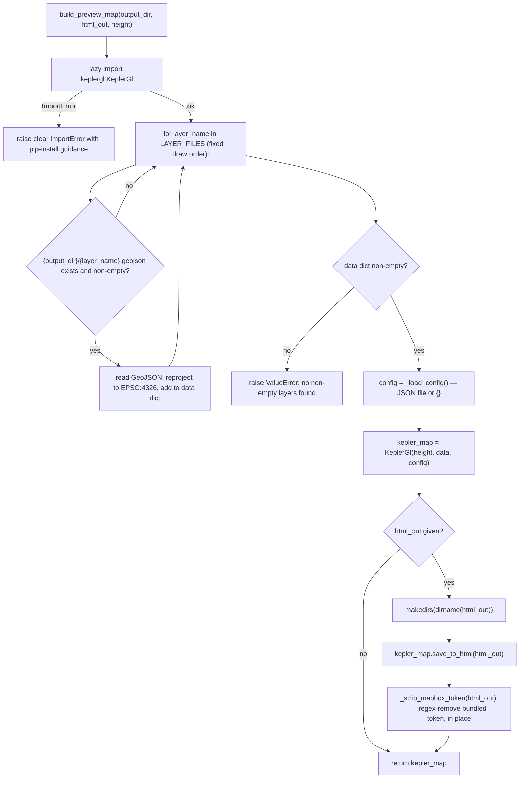

# visualize.py

!!! info "Source"
    `lga_extractor/visualize.py` (187 lines)

## Purpose

Builds a standalone, self-contained Kepler.gl HTML preview map from a
single LGA's already-exported GeoJSON layers (from
[`export.py`](export.md)). This module is explicitly a **visual
convenience layer only** — per its own module docstring, it performs no
analysis of its own. It exists to give a quick, shareable, GIS-software-free
look at what was extracted for a given LGA.

Two things make this module worth reading closely despite its narrow scope:
a deliberate lazy-import pattern that protects the rest of the package from
an optional dependency's fragility, and a security-relevant post-processing
step that strips an embedded third-party credential from every export.

## Dependencies

- **Imports at module level:** `os`, `re`, `json`, `geopandas`. Notably
  does **not** import `keplergl` at module level — see `build_preview_map()`
  below for why.
- **Imported by:** `pipeline.py` (fifth/final stage, optional — building a
  preview map is not required for the pipeline's core output).

## Functions & Classes

### Module-level constants

| Constant | Purpose |
|---|---|
| `_CONFIG_PATH` | Path to `kepler_config_lga_preview.json`, resolved relative to this file's own location (one directory up from `lga_extractor/`), so it works regardless of the caller's working directory. |
| `_LAYER_FILES` | Ordered list of layer names to attempt loading: `landuse`, `waterways`, `roads`, `buildings`, `health_facilities`, `schools` — deliberately ordered so polygon fills (landuse, waterways) draw *underneath* buildings and point facilities, keeping points visible rather than hidden beneath area fills. |
| `_MAPBOX_TOKEN_PATTERN` | A compiled regex (`pk\.eyJ[A-Za-z0-9_\-]+\.[A-Za-z0-9_\-]+`) matching the Mapbox public-token format, used by `_strip_mapbox_token()`. |

### Why `keplergl` is imported lazily, not at module level

This is worth documenting as its own point, since it's an unusually
well-justified piece of defensive engineering, explained at length in the
module's own comments: the installed `keplergl` package's own packaging
still depends on the deprecated `pkg_resources` API (from `setuptools`),
which isn't guaranteed to be present in every environment — notably, some
fresh Python 3.12 virtualenvs no longer auto-install `setuptools`. If
`keplergl` were imported at the top of this file, simply *importing this
module* — even just to use `_strip_mapbox_token()` or reference
`_MAPBOX_TOKEN_PATTERN`, neither of which touch `keplergl` at all — would
fail in any environment where `keplergl`'s own import chain is broken,
taking down every caller of this module (including unrelated tests) rather
than just actual preview-map usage. Deferring the import to inside
`build_preview_map()` means the module stays importable regardless, and a
clear, actionable `ImportError` (with a suggested fix: install `setuptools`
alongside `keplergl`) only surfaces when someone actually tries to build a
preview map.

### `build_preview_map(output_dir, html_out=None, height=600)`

| | |
|---|---|
| **What it does** | Loads whichever of the six standard layers exist as non-empty GeoJSON files in `output_dir`, builds a `KeplerGl` map object from them using the project's saved Kepler config, and optionally saves it as a standalone HTML file (with the embedded Mapbox token stripped). |
| **Why written this way** | The function is designed to work with a *partial* set of layers gracefully — a layer file that's missing (extraction wasn't run for it) or empty (extraction ran but found nothing) is silently skipped rather than raising, since a preview map with 4 of 6 layers is still useful; the function only raises if *every* layer is missing/empty, since a map with nothing on it at all isn't a useful preview and more likely indicates the wrong `output_dir` was passed. |
| **Inputs** | `output_dir: str` (directory containing the extracted GeoJSON layers for one LGA, as produced by `pipeline.extract_lga()`); `html_out: str`, optional (path to save a standalone self-contained HTML file — data and viewer bundled in one file, if provided); `height: int`, default `600` (map height in pixels, relevant only for inline notebook display). |
| **Outputs** | A `keplergl.KeplerGl` object. In a Jupyter notebook, returning it as a cell's last expression renders the interactive map inline. If `html_out` was given, also writes a standalone HTML file to that path as a side effect. |
| **Internal workflow** | 1. Lazily `from keplergl import KeplerGl`; catch `ImportError` and re-raise with a clearer, actionable message (see above). 2. For each layer name in `_LAYER_FILES` (in the deliberate draw order): build the expected path (`{output_dir}/{layer_name}.geojson`); skip if the file doesn't exist; read it with `gpd.read_file()`; skip if it's empty; otherwise add it to the `data` dict, reprojected to EPSG:4326 (Kepler.gl requires WGS84 for its web-map rendering, regardless of what CRS the exported file is actually in — recall `export.py`'s output is in the pipeline's resolved UTM CRS, not WGS84, so this reprojection step is not a no-op). 3. If `data` ended up empty (no layer had any usable file), raise `ValueError` with a message pointing at running extraction first. 4. Load the saved Kepler config via `_load_config()`. 5. Construct `KeplerGl(height=height, data=data, config=config)`. 6. If `html_out` was given: ensure its parent directory exists, call `kepler_map.save_to_html(file_name=html_out)`, then immediately call `_strip_mapbox_token(html_out)` on the just-written file — this step is not optional or conditional, it always runs whenever an HTML file is saved. 7. Return the `kepler_map` object regardless. |
| **Assumptions** | Assumes the exported GeoJSON files at `{output_dir}/{layer_name}.geojson` follow exactly the naming convention `export_layers()` produces — this function has no awareness of `export.py`'s actual return value (it doesn't receive it as an argument), it independently reconstructs the expected paths from `output_dir` and its own hardcoded `_LAYER_FILES` list. If `export_layers()`'s naming convention ever changed, this function would need a matching update; there is no shared single source of truth for the file-naming contract between the two modules. |
| **Complexity** | O(L × N) where L = number of layers (fixed at 6), N = features per layer, dominated by file reads and the reprojection step. |
| **Concurrency / race conditions** | None — sequential loop, no threading. |
| **Covered by test(s)** | No dedicated test — the two `test_strip_mapbox_token_*` tests cover the token-stripping step this function calls, but don't exercise `build_preview_map()` itself, since doing so would require either live OSM data or a fully-populated fake export directory neither test currently constructs. |

### `_strip_mapbox_token(html_path)`

| | |
|---|---|
| **What it does** | Removes any embedded Mapbox access token from an already-exported Kepler.gl HTML file, in place, by regex substitution. |
| **Why written this way — this is a real security/credential-hygiene fix, not cosmetic.** | The installed `keplergl` package bundles a real (if publicly-scoped) Mapbox access token directly into every HTML export via `save_to_html()`, **regardless of which basemap style is actually configured** — this was confirmed by the module's authors: the token is still present even when `kepler_config_lga_preview.json`'s `mapStyle` points at a free, non-Mapbox CARTO Positron basemap instead of a Mapbox-hosted one. The token appears to be baked into `keplergl`'s bundled JavaScript itself, likely for an unrelated internal feature (such as an in-app style switcher) rather than the actual displayed basemap. This project's own Kepler configs (both this repo's and the companion `akure-accessibility-dashboard` repo's) deliberately use a free CARTO basemap specifically *so that* the displayed map never actually depends on this token to render — meaning stripping it has no visual cost. But the token is embedded regardless of style choice, and it belongs to a third party (`keplergl`'s maintainers), not this project — GitHub's push-protection secret scanning correctly flags it as a credential regardless of its public/secret scoping. So it must be stripped explicitly before any HTML export can safely be committed to a public repository. |
| **Inputs** | `html_path: str` (path to an HTML file produced by `KeplerGl.save_to_html()`). |
| **Outputs** | `bool` — `True` if a token was found and removed, `False` if none was present (e.g. a future `keplergl` version that stops bundling one, or a file that's already been stripped). The file at `html_path` is modified in place as a side effect when a token is found; left untouched if not. |
| **Internal workflow** | 1. Read the full file content as text. 2. Run `_MAPBOX_TOKEN_PATTERN.subn("", content)` — substitutes all regex matches with empty string, returning both the modified string and the count of replacements made. 3. If `n_replaced > 0`, write the modified content back to the same path; otherwise leave the file untouched (avoids an unnecessary disk write when there's nothing to strip). 4. Return whether anything was replaced. |
| **Assumptions** | Assumes the token always matches the `pk.eyJ...` JWT-like public-token format (`pk.` prefix followed by base64url-ish characters, a dot, then more base64url-ish characters) — this is Mapbox's actual public-token format, so the assumption is sound for as long as `keplergl` keeps using a standard-format Mapbox public token. Assumes it's safe to remove *every* regex match in the file, not just one — if `keplergl`'s bundled JS ever legitimately needed more than one occurrence of a matching pattern for unrelated reasons, this would over-strip; no evidence this is currently a problem. |
| **Complexity** | O(S) where S = file size in characters — one regex pass over the whole HTML file. |
| **Concurrency / race conditions** | None on its own, but note the read-then-write pattern is not atomic — if this function is somehow interrupted between its read and its write (e.g. process killed), the file is left in its pre-strip state (the original, un-rewritten content), not partially written or corrupted, since the write only happens after the full modified string is computed in memory. Not a practical concern given this always runs synchronously right after `save_to_html()` in the same function call. |
| **Covered by test(s)** | See [tests.md](../tests.md) — verifying this actually strips a token is important test coverage, given the security implications. |

### `_load_config()`

| | |
|---|---|
| **What it does** | Loads and returns the Kepler.gl JSON config from `_CONFIG_PATH` (`kepler_config_lga_preview.json`), or an empty dict if the file doesn't exist. |
| **Why written this way** | The empty-dict fallback (rather than raising `FileNotFoundError`) means `build_preview_map()` still works, just with Kepler.gl's own default styling, if the config file is ever missing — e.g. if this module is copied/reused outside its original repo layout without bringing the config file along. |
| **Inputs** | None (path is a module-level constant). |
| **Outputs** | `dict` — the parsed JSON config, or `{}`. |
| **Complexity** | O(1) relative to pipeline scale — proportional to config file size, which is small and fixed. |
| **Concurrency / race conditions** | None. |
| **Covered by test(s)** | No dedicated test — a small, low-risk file-existence check with no current test coverage. |

## Internal Workflow

## Gotchas

- **Reprojection to EPSG:4326 happens here, not in `export.py`.** The
  GeoJSON files on disk are in whatever CRS `clean.py` resolved for the run
  (typically a UTM zone, a projected/metric CRS) — `build_preview_map()`
  reprojects to WGS84 in memory when loading them, specifically because
  Kepler.gl's web-based rendering requires geographic coordinates. This is
  easy to miss if reading `export.py` in isolation and assuming its output
  is already web-map-ready.
- **The layer-file naming contract between `export.py` and `visualize.py` is
  implicit, not enforced.** As noted above, `_LAYER_FILES` is a hardcoded
  list this module maintains independently — there's no shared constant or
  contract check between the two modules confirming they agree on file
  naming.
- **Token-stripping only runs on the `html_out` save path, never on the
  in-memory `KeplerGl` object itself.** If a caller uses the returned
  `kepler_map` object directly in a notebook (never calling
  `save_to_html()` themselves through this function), no token-stripping
  occurs — this is fine for notebook display (no file is written, nothing
  to leak), but worth knowing if the object is later exported through some
  other path than `build_preview_map()`'s own `html_out` parameter.
