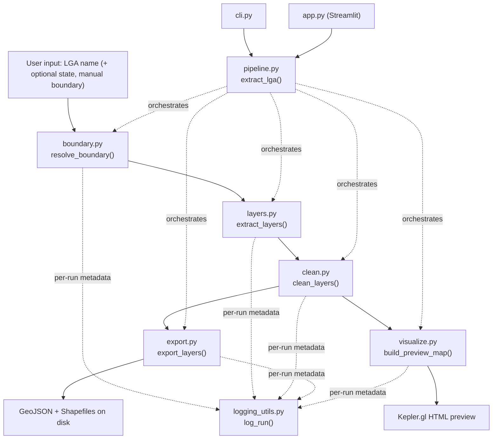

# Overview — lga-osm-extractor

## Purpose

`lga-osm-extractor` turns a Nigerian LGA (Local Government Area) name into a
clean, analysis-ready geospatial dataset. Given a name like `"Akure North"`,
it resolves the administrative boundary, pulls every relevant OpenStreetMap
(OSM) feature layer inside that boundary — roads, buildings, waterways,
land use, health facilities, schools — cleans and standardizes the geometry
and attributes, and exports the result as GeoJSON and Shapefile, along with an
interactive Kepler.gl preview map.

It is the **upstream** half of the two-repo system: everything it produces
is consumed downstream by `akure-accessibility-dashboard` for network
routing, isochrone computation, and accessibility scoring. See
[Cross-Repo Integration](../cross-repo/integration.md) for the exact
handoff contract.

## Problem Statement

OSM is free and detailed, but two things make it unreliable to use directly
in an analysis pipeline:

1. **Boundary resolution is fragile.** Geocoding an LGA name against OSM can
   silently return the wrong place — a name collision with a similarly-named
   location elsewhere, a single point instead of a polygon, or (in the worst
   case) an entire state or country. A pipeline that blindly trusts a geocode
   result can produce a boundary that looks plausible but is simply wrong,
   and every layer extracted "within" it downstream would be wrong too.
2. **Feature tagging is inconsistent.** The same real-world facility — say, a
   hospital — might be mapped in OSM as a single point node, or as a full
   building-outline polygon, depending on who mapped it and how. Both are
   valid OSM practice. But a naive pipeline that assumes one geometry type
   will silently drop or mishandle the other, with no error raised — it just
   produces quietly wrong results. (This is exactly what happened with all 14
   health facilities in Akure North; see
   [Known Issues](../reference/known-issues.md).)

This repository's design is a direct response to both problems: it builds in
explicit validation for boundary resolution, and explicit geometry
normalization for extracted features, rather than trusting OSM's raw output
as-is.

## System Architecture

Two things are worth calling out about this architecture:

- **`pipeline.py` is a thin orchestrator, not where the logic lives.** Each
  stage (`boundary`, `layers`, `clean`, `export`, `visualize`) is an
  independently usable, independently testable module. `extract_lga()` just
  calls them in order and threads state between them. This means the CLI and
  the Streamlit app both call the *same* orchestration function rather than
  duplicating pipeline logic — see [`app.md`](app.md) and [`cli.md`](cli.md).
- **`clean.py` sits at the center.** Both `boundary.py` (for its area sanity
  check) and `export.py`/`visualize.py` (for consistent geometry/attributes)
  depend on logic defined in `clean.py` — specifically its UTM zone
  auto-selection (`resolve_target_crs()`) and its point-collapse logic. It's
  reused rather than duplicated, which is why `boundary.py` imports from
  `clean.py` internally.

## Design Philosophy

A few deliberate decisions run through the whole codebase:

**Fail loud on ambiguity, fail soft on absence.** A boundary that's clearly
the wrong place raises `BoundaryResolutionError` immediately — there's no
value in extracting layers "within" a wrong boundary. But a layer that
queries successfully and genuinely finds zero features (e.g. an LGA with no
mapped waterways) is *not* an error, it's valid data, and is only ever
recorded as a warning. The codebase is careful, throughout, to distinguish
"this failed" from "this is empty" — see `LayerExtractionError`'s docstring
in [`layers.md`](modules/layers.md) for the clearest statement of this
principle.

**Two-tier validation (hard vs. soft checks).** `_validate_and_standardize()`
in `boundary.py` separates checks that block execution (geometry invalid,
centroid outside Nigeria, implausible area) from checks that only warn
(display name doesn't obviously mention the requested LGA/state). This
reflects a judgment about *confidence*: some signals are reliable enough to
block on, others are just worth a human glance.

**Don't trust a single geocode blindly — but allow overriding it.** Every
resolution path (`resolve_boundary()`) accepts a `manual_boundary_path` as an
explicit escape hatch, for LGAs where OSM's boundary data is missing,
mistagged, or fails validation.

**Respect the server you're querying.** `layers.py`'s concurrency model
(2 requests in flight at once, staggered starts, exponential backoff on
retry) exists because fully-parallel querying was tried first and made
things *worse* — the public Overpass mirror refused every connection
outright under burst load. The current approach is empirically tuned, not a
default choice. See [`layers.md`](modules/layers.md) for the full
reasoning.

**Geographic correctness over convenience.** Rather than hardcoding a single
UTM zone (which would be correct for Ondo State but silently wrong for LGAs
elsewhere in Nigeria), `clean.py` auto-selects the correct UTM zone from
each boundary's actual longitude. This is a few extra lines of code in
exchange for the tool being correct anywhere in the country, not just the
original Akure study area.

**Every run is auditable after the fact.** `logging_utils.log_run()` writes
a `run_log.json` alongside every extraction's output, capturing not just
what was requested but *which package versions were installed at the time*
— `osmnx`, `geopandas`, `shapely`, `fiona`, `pandas`. This matters because
none of this pipeline's inputs are frozen: OSM's underlying map data
changes continuously, and a library upgrade can change how a query is
interpreted or how a geometry is repaired. Without this record, a
discrepancy between two extractions of the same LGA run months apart would
be nearly impossible to diagnose — was the underlying map data different,
or did a dependency change behavior? The run log doesn't answer that
question by itself, but it narrows the search considerably.

## Module Map

| File | Responsibility |
|---|---|
| `lga_extractor/boundary.py` | Resolve and validate an LGA's administrative boundary polygon |
| `lga_extractor/layers.py` | Query OSM for each feature layer (roads, buildings, health, schools, etc.) within the boundary |
| `lga_extractor/clean.py` | Reproject, repair, deduplicate, standardize schema; collapse polygon facilities to points |
| `lga_extractor/export.py` | Write cleaned layers to GeoJSON and Shapefile, splitting Shapefile output by geometry category when a layer mixes point/line/polygon types |
| `lga_extractor/visualize.py` | Build a Kepler.gl HTML preview map of exported layers |
| `lga_extractor/logging_utils.py` | Capture run metadata (environment, parameters, warnings) per extraction |
| `lga_extractor/pipeline.py` | Orchestrate the full boundary → layers → clean → export → visualize sequence |
| `app.py` | Streamlit UI wrapping the pipeline |
| `cli.py` | Command-line entry point wrapping the pipeline |
| `tests/test_extraction.py` | Test coverage across the above |

## Dependencies Between Components

- `pipeline.py` depends on all of `boundary`, `layers`, `clean`, `export`,
  `visualize`, `logging_utils` — it is the only module that imports all of
  them.
- `boundary.py` has one internal dependency: it imports `resolve_target_crs()`
  from `clean.py` (locally, inside `_validate_and_standardize()`) to measure
  a candidate boundary's area in an appropriate metric projection rather than
  naively in WGS84 degrees.
- `layers.py` has no dependency on `boundary.py` or `clean.py` — it only
  needs a boundary *polygon* (not the full validated GeoDataFrame) as input,
  making it independently testable/reusable.
- `export.py` and `visualize.py` both operate on the *output* of `clean.py`
  (a dict of cleaned GeoDataFrames), not on raw extracted layers.
- `app.py` and `cli.py` are both thin — they call `pipeline.extract_lga()`
  and handle presentation (Streamlit widgets vs. argv/stdout) around it, they
  contain no extraction/cleaning logic themselves.
